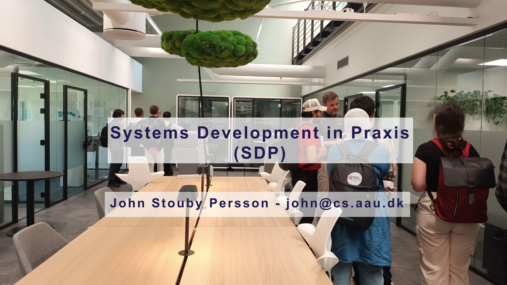
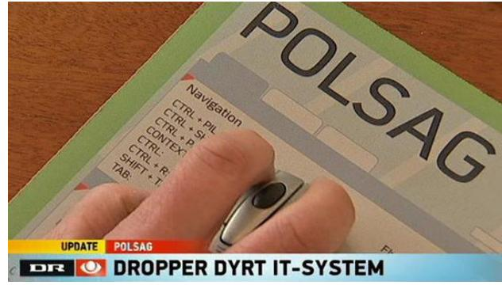
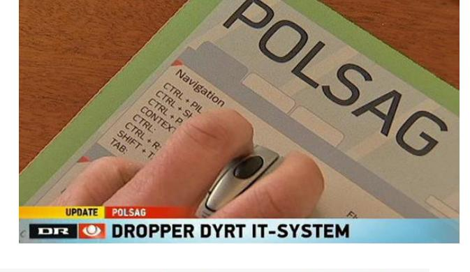
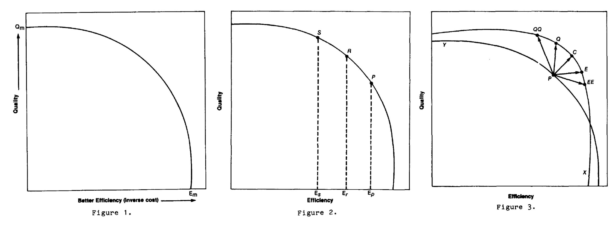
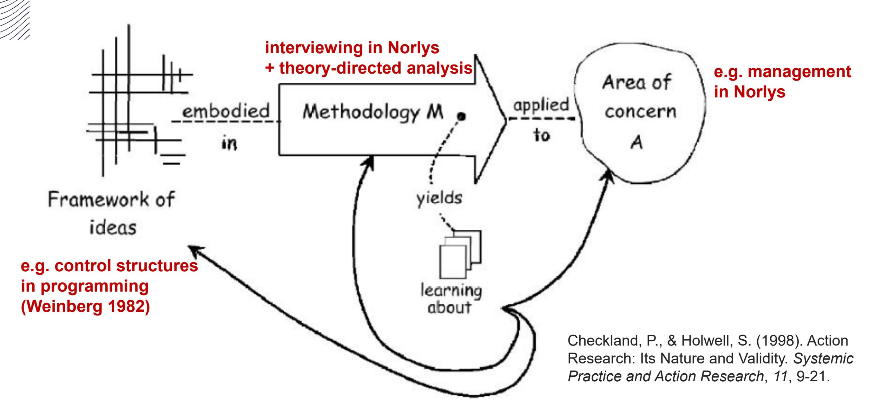
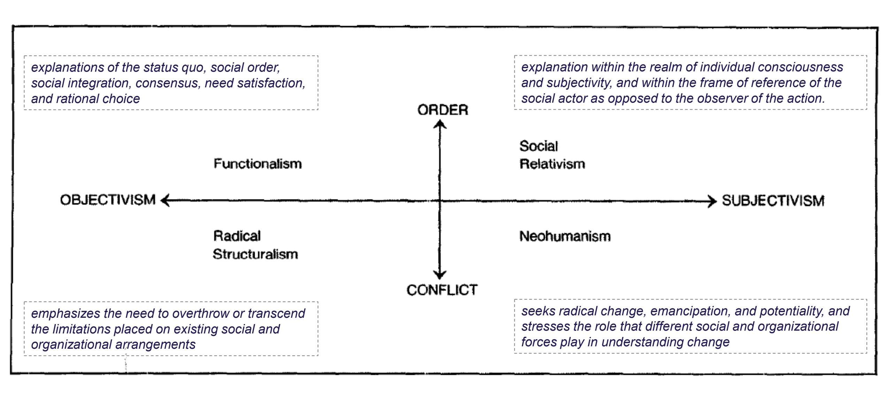
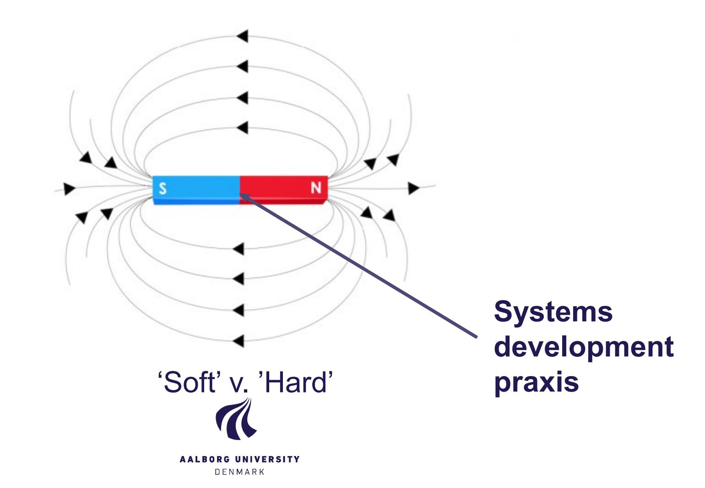

### **Course format**

**Reading before the lecture is critical!**

**Sessions:** Thursdays 12:30 – 14:15, where we discuss research papers and cases of praxis

**Activities:** Guest lectures from industry and a company visit to interview software practitioners

**Exam:** You will individually write a short paper reporting a theory-directed analysis of the interviews

**Time requirements** (5 ECTS ~ 150 hours): Reading 75h / exam assignment 50h / sessions 25h

### **Knowledge**

The student should gain knowledge of advanced topics within systems development in theory and praxis. The topics may include but are not limited to:

- analysis of systems development praxis
- systems development methods, processes, and competencies
- organization and management of systems development
- development of systems for complex settings such as supporting organizational cooperation, knowledge intensive systems, and information infrastructures.

## **Skills**

- understand and present the course topics, which includes its terms, problems, theories, methods, results, and conclusions.
- apply theories and methods to analyze and describe a problem in systems development praxis
- criticize theories and methods within systems development.

## **Competencies**

The capability to describe, analyze, and assess a defined praxis in a systems development organization, including:

- relate to the course theories and empirical methods
- and contrast with related topics such as requirements management, quality control, outsourcing, distributed development, agile processes, and model-driven processes.

## **Individual written exam**

A short paper (4-5 pages) that reports a theory-directed analysis of a systems development praxis (Norlys). The student is expected to:

- select, explain, and use one of the theories presented in the course
- report an analysis that addresses a problem statement of relevance to both the theory and practice of systems development
- discuss the results from the analysis in relation to one or more theories presented in the course.

You can see an example in the 2nd lecture: "Brandborg (2017) Hyper-learning in Netcompany"

## **Problems in systems development**

**Oprindelig pris: 96 m. i 2014**

<https://www.version2.dk/emne/it-projekter>

### **IT projects are riskier than handling nuclear waste!**

- Study of 11.011 projects' cost overruns comparing 5.360 IT projects with 22 other project types.
- The average IT project cost overrun is 73%.
- IT projects have a "fat tale" of extreme cost overruns, with a mean overrun of **553%**

| <b>Table 2.</b> Frequency of Cost Overruns per Project Type, | Ranked by Mean in Tail, $N = 11,011$ |
|--------------------------------------------------------------|--------------------------------------|
|--------------------------------------------------------------|--------------------------------------|

| Project Type    | N     | Percentage of Projects with Cost Overrun | Percentage of Projects with a Cost Overrun Greater Than 1.5 | Mean Overrun for Projects with a Cost Overrun Greater Than 1.5 |
|-----------------|-------|------------------------------------------|-------------------------------------------------------------|----------------------------------------------------------------|
| IT              | 5,360 | 40.86                                    | 18.26                                                       | 5.53                                                           |
| Nuclear storage | 25    | 92                                       | 52                                                          | 5.27                                                           |
| Defense         | 115   | 52.17                                    | 20                                                          | 3.6                                                            |
| Nuclear power   | 196   | 96.94                                    | 54.59                                                       | 3.04                                                           |
| Dams (other)    | 21    | 71.43                                    | 33.33                                                       | 3.02                                                           |
| Olympics        | 21    | 100                                      | 76.19                                                       | 3                                                              |

Flyvbjerg, B., Budzier, A., Aaen, J., Keil, M., & Zottoli, M. (2025). The Uniqueness of IT Cost Risk: A Cross-Group Comparison of 23 Project Types. *Project Management Journal*. <https://doi.org/10.1177/87569728251340590>

## **Problems in systems development**

### **What do you see as the biggest challenge to successful systems development?**

**Oprindelig pris: 96 m. i 2014**

<https://www.version2.dk/emne/it-projekter>

# **Explaining the (management) problem**

**Weinberg (1982) overstructured management of software engineering**

DEAL model explanation, page 3:

D - Difficulty of the task

E – Effort put into doing the task

A – Ability relevant to the task

L – Luck

Focus of unsuccessful managers (D & L) / successful managers (E & A)

**What are typical examples of difficulties or bad luck for software project managers (or students)?**

**Gerald Weinberg** (1933 – 2018) <http://geraldmweinberg.com/>

## **Overstructured management of software engineering (Weinberg 1982)**

| Control structure      | Explanation                                                                                                                                        | Question to present day praxis                                                                   |
|---------------------------|----------------------------------------------------------------------------------------------------------------------------------------------------|-----------------------------------------------------------------------------------------------------|
| Sequence (p.3-4)       | structure software projects so that important events take place in fixed, pre-determined sequences.                                          | Is this problem (e.g. killing projects or features) outdated with agile methods?           |
| Choice (p.4-5)         | The selection of one of two alternatives … a simple choice structure often fails in the fuzzier situations more typical of human activities. | How should software developers balance efficiency and quality when using generative AI? |
| Modularization (p.5-6) | one module, one function… allows the substitution of labelling for thinking.                                                                 | Do interdisciplinary agile teams without specialized roles solve this problem?                |
| Iteration (p.6)        | … repeats the same cliché over and over, as if it is a magical incantation that will solve problems.                                         | Is agile (or generative AI) becoming a cliché or magical incantation?                      |
| Recursion (p.6-7)      | … the technique of a system containing itself.                                                                                                     | Are software failures simply because of buyers, managers, politicians, or users?                 |

## **Choice (Weinberg 1982, p. 4-5)**

### **A simple model of the research process**

Starts with two examples of systems development projects:

- Automating Typesetting or Enhancing Craftsmanship?
- Developing an Expert System or a System for Experts?

What is pursued in today's praxis (e.g., with Generative AI)?

Hirschheim, R., & Klein, H. K. (1989). Four paradigms of information systems development. *Communications of the ACM*, *32*(10), 1199-1216.

(Hirschheim & Klein, 1989, p. 1201-1202)

| Paradigm                 | Developer archetype                           | Systems development proceeds                                                                                                                                                                  | Elements used in defining IS                                                                                                                                                                                    | Examples                                                             |
|--------------------------|--------------------------------------------------|-----------------------------------------------------------------------------------------------------------------------------------------------------------------------------------------------|-----------------------------------------------------------------------------------------------------------------------------------------------------------------------------------------------------------------|----------------------------------------------------------------------|
| Functionalism            | Expert or Platonic Philosopher King     | From without, by application of formal concepts through planned intervention with rationalistic tools and methods                                                                             | People, hardware, software, rules (organizational procedures) as physical or formal, objective entities                                                                                                   | Structured analysis, information engineering                         |
| Social Relativism     | Catalyst or Facilitator                          | From within, by improving subjective understanding and cultural sensitivity through adapting to internal forces of evolutionary social change                                                 | Subjectivity of meanings, symbolic structures affecting evolution of sense, making and sharing of meanings, metaphors                                                                                           | Ethnographic approaches, FLORENCE project                            |
| Radical Structuralism | Warrior for Social Progress or Partisan | From without, by raising ideological conscience and consciousness through organized political action and adaptation of tools and methods to different social class interests                  | People, hardware, software, rules (organizational procedures) as physical or formal, objective entities put in the service of economic class interests                                                          | Trade-union led approaches, UTOPIA and DEMOS projects |
| Neohumanism              | Emancipator or Social Therapist            | From within, by improving human understanding and the rationality of human action through emancipation of suppressed interests and liberation from unwarranted natural and social constraints | People, hardware, software, rules (organizational procedures) as physical or formal objective entities for the TKI; subjectivity of meanings and intersubjectivity of language use in other knowledge interests | Critical social theory, SAMPO project                       |

## **How should we investigate praxis?**

Fitzgerald, B., & Howcroft, D. (1998). Towards dissolution of the IS [Information Systems] research debate: From polarization to polarity. *Journal of Information Technology*, *13*(4), 313-326.

<https://link.springer.com/content/pdf/10.1057/jit.1998.9.pdf>

(P. O'Sitivist) (Ethna O´Graphy)

- positivist v. interpretivist
- realist v. relativist
- objectivist v. subjectivist
- emic/insider/subjective v. etic/outsider/objective
- quantitative v. qualitative
- exploratory v. confirmatory
- induction v. deduction
- field v. laboratory
- idiographic v. nomothetic
- relevance v. rigour

(Fitzgeral & Howcroft 1998, p. 318)

### 'Soft' v. 'Hard' dichotomy

### ONTOLOGICAL LEVEL (what is out there to know about)

#### Relativist

Belief that multiple realities exist as subjective constructions of the mind. Socially-transmitted terms direct how reality is perceived and this will vary across different languages and cultures

#### Realist

Belief that external world consists of pre-existing hard, tangible structures which exist independently of an individual's cognition

### EPISTEMOLOGICAL LEVEL (what and how can we know about it)

### Interpretivist

No universal truth. Understand and interpret from research's own frame of reference. Uncommitted neutrality impossible. Realism of context important

#### Subjectivist

Distinction between the researcher and research situation is collapsed. Research findings emerge from the interaction between researcher and research situation, and the values and beliefs of the researcher are central mediators

#### Emic/Insider/Subjective

Origins in anthropology. Research orientation centres on native/insider's view, with the latter viewed as an appropriate judge of adequacy of research

#### **Positivist**

Belief that world conforms to fixed laws of causation Complexity can be tackled by reductionism. Emphasis on objectivity, measurement and repeatability

#### Objectivist

Both possible and essential that the researcher remain detached from the research situation. Neutral observation of reality must take place in the absence of any contaminating values or biases on the part of the researcher

### Etic/Outsider/Objective

Origins in anthropology. Research orientation of outside researcher who is seen as objective and the appropriate analyst of research

### 'Soft' v. 'Hard' dichotomy

#### METHODOLOGICAL LEVEL

### Qualitative

Determining what things exist rather than how many there are. Thick description. Less structured and more responsive to needs and nature of research situation

#### Exploratory

Concerned with discovering patterns in research data and to explain/understand them. Lays basic descriptive foundation. May lead to *generation* of hypotheses

#### Induction

Begins with specific instances which are used to arrive at overall generalizations which can be expected on the balance of probability. New evidence may cause conclusions to be revised. Criticized by many philosophers of science, but plays an important role in theory/hypothesis conception

#### Field

Emphasis on realism of context in natural situation, but precision in control of variables and behaviour measurement cannot be achieved

#### Idiographic

Individual-centred perspective which uses naturalistic contexts and qualitative methods to recognize unique experience of the subject

#### Quantitative

Use of mathematical and statistical techniques to identify facts and causal relationships. Samples can be larger and more representative. Results can be generalized to larger populations within known limits of error

### Confirmatory

Concerned with hypothesis testing and theory verification. Tends to follow positivist, quantitative modes of research

#### Deduction

Uses general results to ascribe properties to specific instances. An argument is valid if it is impossible for the conclusions to be false if the premises are true. Associated with theory verification/falsifaction and hypothesis testing

### Laboratory

Precise measurement and control of variables, but at expense of naturalness of situation, since real-world intensity and variation may not be achievable

#### Nomothetic

Group-centred perspective using controlled environments and quantitative methods to establish general laws

(Fitzgeral & Howcroft 1998, p. 319)

## **'Soft' v. 'Hard' dichotomy**

(what is of value)

### **Positioning strategies**

|                | Strategy                                                                                                                             | Problem                                                                                                                                                         |
|----------------|--------------------------------------------------------------------------------------------------------------------------------------|-----------------------------------------------------------------------------------------------------------------------------------------------------------------|
| Supremacism    | one research paradigm as universally applicable and 'best' in all situations                                                   | there is no single research question that has been answered unequivocally to date in the field (information systems)                                   |
| Isolationism   | treat each paradigm as incommensurable and operate strictly according to a particular paradigm, ignoring other alternatives | complementary insights are provided by the application of different research paradigms                                                                       |
| Integrationism | integrate alternative approaches into a single coherent mode of analysis                                                          | presumes the existence of some Archimedean point of vantage from which the coherence and suitability of any proposed integrated approach may be judged |
| Pluralism      | allow for a contingent toolbox approach where different methods with complementary strengths could be used a appropriate    | there is little to prevent a pluralist strategy from descending into anarchy                                                                                 |

### **"Towards dissolution of the IS research debate: from polarization to polarity"**

