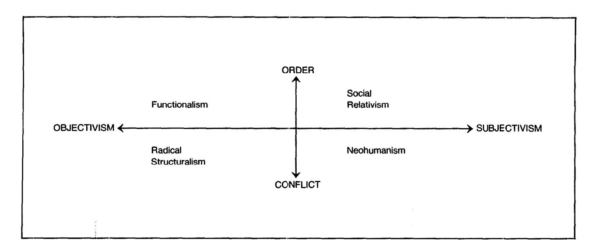

Social Aspects of Computing Rob Kling Editor

## Four Paradigms of Information Systems Development

Developing computer-based information systems necessarily in volves making a number of implicit and explicit assumptions. The authors examine four diffeen t approaches to information systems development.

#### Rudy Hirschheim and Heinz K. Klein

with a number of explicit and implicit assumptions tions has also been noted more generally in [3,4, 76, about the nature of human organizations, the nature of 80, 891). We agree with the previous research that a the design task, and what is expected of them. These better understanding of developer assumptions is imassumptions play a central role in guiding the informa- portant and we wish to extend the line of inquiry. In tion systems development (ISD) process. They also dra- particular, we feel there is a need to explore the most amine the kinds of implicit assumptions made during arise, and this is done by applying a philosophical line systems development. of analysis.

Depending on the assumptions adopted, different systems development approaches are identifiable and each of these leads to different system outcomes. Based on a detailed analysis of the literature, we will examine the fundamental assumptions of four major kinds of systems development approaches and discuss how they lead to different outcomes.

More specifically, we wish to show (1) that although there is a strong, orthodox approach to systems development, there are recently developed alternatives that are based on fundamentally different sets of assumptions; (2) that these assumptions primarily deal with the attitudes adopted toward reality and how to obtain knowledge about it; (3) that these assumptions are either explicitly or implicitly made in adopting a particular development approach: (4) that the ways in which system objectives are legitimized are directly related to the development approach adopted; and (5) that important social consequences result from applying a particular systems development approach.

Other researchers have also noted the importance of systems developer assumptions, but their work has focused on more specific aspects, e.g., analyst models of the users [25, 421, analyst hypotheses about the nature of requirements and behavior related to structuring problems [96], and analyst and user values [57]. Whereas these studies employ empirical means to document these assumptions, Bostrom and Heinen [14] have relied on an analysis of the literature to document seven implicit theories and views of designers as causes

All systems developers approach the development task of systems failures. (The importance of implicit assumpmatically affect the system itself. This article will ex- fundamental foundations from where such assumptions

> The article is organized as follows. We begin by introducing two case examples that illustrate how different systems development assumptions become manifest in practice. These assumptions are then grouped into four paradigms of information systems development and explained in detail. The rhetorical vehicle used for explicating the paradigms are generic story types. The paradigms are analyzed using the story types, dividing the discussion into three parts: story line, interpretation, and analysis. We return to the case examples to show how the manifest differences in the development process and outcomes can be explained by the four paradigms. We conclude by noting a number of benefits associated with the identification and analysis of the paradigms. The article provides a new vehicle for theorizing about the nature, purpose, and practice of information systems development.

#### TWO EXAMPLES

Consider how the approaches taken in the following two systems development projects differ.

Automating Typesetting or Enhancing Craftsmanship?

Traditional newspaper production involves four major processes: writing, editing, typesetting, and printing. Reporters and columnists write copy which is then edited. Typesetters take the edited copy and relevant pictorial material, and lay out pages. Printers take the results and print the newspapers. Typical systems designs focus on rationalizing newspaper production by combining tasks that can logically be done on the same

@1989ACM0001-0782/89/1000-1199 \$1.50

electronic device, such as editing and formatting. Page layout is conceived as a natural extension of formatting. A requirements analysis along these lines suggests tha.t editors can perform the typesetting function because computers already aid the editors with editing and page layout. Editors can embed typesetting commands directly in the final copy. Page layout is done on screen and sent to phototypesetting equipment. The editors become responsible not only for editing but also for page make-up. Migh resolution screens; electronic cut, paste, and scaling facilities; and previewing apparatus permit the typesetting function to be assigned to the editors.

In the UTOPIA project [Zg, 471, an alternative approach was tried at one newspaper company. The systems development team consisted of union representativles and typesetters. Their goal was to establish an electronic typesetting support system that would enhance the position of the typesetting craft in the newspaper industry. The newspaper's management was excluded from the design team so that typesetters' interests were given primacy in all design decisions. Ex:isting turnkey systems were considered inappropriate because of built-in design constraints and management biases that did not take into account the unique requirements of the typesetting craft. These management biases emphasized cost savings, efficiency, and control leading to de-skilling, job losses, and an aesthetically inferior product. Data processing specialists assumed an advisory role serving the typesetters' interest. In the requirements analysis, the design team viewed typesetting as an essential task requiring specia.list skills that would be lost by its integration with editing. Two types of requirements were established: (1) transformation of edited texts into made-up pages; and (2) creation of an aesthetically pleasing product. Typesetting skills differ from editorial skills; editors are in charge of content, and typesetters are in charge of form.\* The typesetters were interested in retaining the quality of typesetting and possibly enhancing their own productivity. To retain quality, systems design options focused on providing the flexibility and diversity of the tratditional tools of the typesetting trade by electronic means. To meet this objective, the team found it necessary to use hardware mock-ups to overcome the limitations of the then-available technology. While similar to prdotyping, the hardware mock-ups overcame the bias inherent in the technology used for prototyping. The available prototyping tools were unable to accommodate the craft skills that were used to meet the aesthetic requirements of newpaper page layout. To enhance the quality of typesetting output, additional system capabilities, such as scaling and finetuning the contrast of pictures, were added. The UTOPIA approach resulted in an electronic typesetting support

system that enhanced the typesetters' skills and productivity.

The UTOPIA model also required the establishment of a new work organization [28]. While reporters have access to display terminals to write their articles, they do not code the text with typesetting commands. A central production unit, where journalists and graphic workers cooperate closely, is responsible for page editing and make-up, typing manuscripts, proofreading, incorporating major revisions, editing standard features such as TV listings, and coding individual articles. The editorial staff comprises editors and subeditors, whose responsibilities are also changed. Subeditors work most closely with the typesetters to make up the pages. Editors are primarily responsible for maintaining a consistent overall viewpoint among different articles and serve as discussion partners for subeditors [28].

Developing an Expert System or a System for Experts? Deregulation has forced airlines to become increasingly cost conscious, yet airline safety depends on costly, high quality engine maintenance. In order to rationalize engine maintenance, one airline com:pany developed an expert system consisting of the rules for engine maintenance and repair. During the knowledge acquisition phase, rules were extracted from engineering specifications and maintenance handbooks.

When engines arrived at the maintenance plant, mechanics disassembled them and placed the parts on work tables. Robots diagnosed possible faults through automated measuring and sensing. The facts gleaned about the state of the engine parts were fed to the expert system which then applied its rule base to determine necessary repairs. It printed out a work schedule for making the repairs which was then followed by the mechanics.

When the system was implemented, the promised cost decrease in engine maintenance did not materialize; on the contrary, maintenance costs increased by 13 percent. A redesigned system based on an alternative design strategy was sought. A new dlesign team that included union representatives and mechanics was formed. Their cooperation was motivateld by a coalition with management which they saw as necessary to secure the viability of the company, and with it, their jobs. The design team first analyzed the reasons for the decrease in maintenance productivity and found that under the old system, mechanics relied too heavily on computer-based fault diagnosis. They did not check nor challenge the computer diagnosis for possible errors. These errors were the product of difficulties in formalizing the knowledge base. Apparently, the mechanics' knowledge acquired through education and experience could not easily be formalized and put i:nto the rule base of the expert system. There may also have been an error margin in the automatic sensing which created ambiguities. The new design team shifted the focus of requirements analysis from the acquisition of an expert rule base to the support of the mechanics' judgment in diagnosing maintenance needs. The requirements study

&#x27; The results of editorial work (planning content, planning pages. and text editinel mav be called a iournalistic model of the news~amx owe. The iour- II \_ . ..I I nalistic competence involved lies in improving the readability of the product. The make-up person refines the product by giving the journalistic model a graphic design. The graphic competence involved lies in improving the legibility of the product ['La].

focused on the subtleties that come into play in deciding which maintenance is actually required for each engine part. The new design left the mechanics in charge of the fault diagnosis, because their experience and judgment was now considered indispensible. After the mechanics had decided on the necessary repairs they would then consult the computer system for available repair options, availability of needed parts, etc. For this purpose the computer system turned out to be very useful. This design approach resulted in a system for experts rather than an expert system.

These two examples pose an interesting and important question: Do they point to subtle yet fundamental differences that originate from conflicting systems development philosophies, or are they merely variations of a single theme, namely one where a family of development approaches shares the same underlying philosophy? The answer to this question is important because different underlying philosophies may lead to radically different options in terms of design features, implementation strategies, user satisfaction, and system use.

We seek to show that these differences are the product of fundamentally different underlying systems development assumptions. We identify dominant patterns resulting from differing sets of core assumptions that can be used to characterize the array of current system development approaches. We do not claim that this is the only way to organize them, nor that the assumptions necessarily correspond to actual beliefs to which practitioners are committed.' Rather, the core assumptions have been derived from studying the descriptions of various systems development approaches that appear in the literature.3

#### FOUR PARADIGMS

The most fundamental set of assumptions adopted by a professional community that allows its members to share similar perceptions and engage in commonly shared practices is called a "paradigm." Typically, a paradigm consists of assumptions about knowledge and how to acquire it, and about the physical and social world.4 As ethnomethodological studies have shown [x] such assumptions are shared by all scientific and professional communities. As developers must conduct inquiry as part of systems design and have to intervene into the social world as part of systems implementation, it is natural to distinguish between two types of related

Two types of assumptions about knowledge (epistemological) and the world (ontological) are given by Burrell and Morgan [18] to yield two dimensions: a subjectivist-objectivist dimension and an order-conflict dimension. In the former, the essence of the objectivist position "is to apply models and methods derived from the natural sciences to the study of human affairs. The objectivist treats the social world as if it were the natural world" [18, p. 71. In contrast, the subjectivist position denies the appropriateness of natural science methods for studying the social world and seeks to understand the basis of human life by delving into the depths of subjective experience of individuals. "The principal concern is with an understanding of the way in which the individual creates, modifies, and interprets the world in which he or she finds himself [or herself]" (p. 3). In the order-conflict dimension, the order or integrationist view emphasizes a social world characterized by order, stability, integration, consensus, and functional coordination. The conflict or coercion view stresses change, conflict, disintegration, and coercion. The dimensions when mapped onto one another yield four paradigms (see Figure 1): functionalism (objective-order); social relativism (subjective-order); radical structuralism (objective-conflict); and neohumanism (subjective-conflict). This particular framework has been chosen because it allows us to capture the distinguishing assumptions of alternative approaches to information systems development in a simplified yet philosophically grounded way.

The functionalist paradigm is concerned with providing explanations of the status quo, social order, social integration, consensus, need satisfaction, and rational choice. It seeks to explain how the individual elements of a social system interact to form an integrated whole. The social relativist paradigm seeks explanation within the realm of individual consciousness and subjectivity, and within the frame of reference of the social actor as opposed to the observer of the action. From such a perspective "social roles and institutions exist as an expression of the meanings which men attach to their world" [93, p. 1341. The radical structuralist paradigm emphasizes the need to overthrow or transcend the limitations placed on existing social and organizational arrangements. It focuses primarily on the structure and analysis of economic power relationships. The neohumanist paradigm seeks radical change, emancipation, and potentiality, and stresses the role that different social and organizational forces play in understanding change. It focuses on all forms of barriers to emancipation-in particular, ideology (distorted communication), power, and psychological compulsions and social constraints-and seeks ways to overcome them.

These paradigms, initially identified by Burrell and Morgan [18] in the context of organizational and social

assumptions: those associated with the way in which system developers acquire knowledge needed to design the system (epistemological assumptions), and those that relate to their view of the social and technical world (ontological assumptions).

&#x27;To establish this would need a representative empirical follow-up study of the belief systems held by practitioners. A first step in this direction is the study undertaken by Vitalari and Dickson [96]. It showed that the processes used by analysts in determining information requirements were more comprehensive than the literature on structured systems development approaches had suppested.

&#x27; Only insofar as the literature influences ISD practice would the assumptions derived from the descriptions of systems development approaches also be representative of the actual beliefs held by practitioners.

&#x27;Paradigms are defined by Eiurrell and Morgan [IS] as "meta-theoretical assunmtions about the nature of the sub&t of studv." This differs somewhat from Kuhn's classic conception of paradigms which were defined as "universally recognized scientific achievements that for a time provide model problems and solutions to a community of practitioners" [56].

FIGURE 1. Information Systems Development Paradigms (adapted from [18])

research, also manifest themselves in the domain of information systerns development.5 Yet to show how the paradigms are actually reflected in ISD is complicated. The paradigms are largely implicit and deeply rooted in the web of common-sense beliefs and background knowledge [go] which serve as implicit "theories of action" [4]. A simplifying vehicle was sought to help develop and articulate the paradigms, in particular, the types of behaviors and attitudes that follow from them. Such a vehicle was found in the notion of "generic stories" or, more precisely, generalized story types (genres). Each story type consists of typical classes of behavior that follow from the assumptions of a particular paradigm. For example, different types of behavior in requirements determination arise depending on whether one believes in an objective organizational reality or not. These types of behavior were identified and grouped into story types. Each of these was derived by interpreting pools of systems development literature that share the assumptions of a particular paradigm. These pools have been identified by analyzing the specific core assumptions and beliefs that are revealed in the concepts and examples they employ. This allows us to explicitly compare sets of assumptions that typically have not been widely articulated or systematically compared.

After each story type has been articulated in some detail, we provide a theoretical interpretation and discuss some of its potential consequences. (For stylistic reasons, we shall now drop the qualifier type and simply speak of story. The theoretic interpretation will take the form of discussing the (1) key actors of the storythe "who" part of the story; (2) narrative-the "what" of the story, what are the key features and activities; (3) plot-the "why" of the story, why did the action of the story take place the way it did; and [4) assumptions-the fundamental beliefs held by the actors of the story, discussed in terms of epistemologi.cal and ontological assumptions.

The four stories are neither equally well-developed nor known. The same is true of their consequences. For the first story, there is a large experiential base from which to draw. It is the orthodox approach to systems development and has been used to develop information systems for decades. Its consequences, therefore, are reasonably clear cut. The other three stories are more recent and have not been widely applied. Thus practical knowledge about them is sparse and their consequences largely conjectural. They are presented in the rough chronological order in which they emerged.

The four paradigms, as depicted through the stories, are not as clear cut nor as animated as they are made out to seem. There is overlap and their differences are overstated for the purpose of effect. They are, in fact, archetypes-highly simplified but powerful conceptions of an ideal or character type [80]. 'These ideal types do not exist as real entities; rather their properties which are exhibited (to a greater or lesser degree) in existing entities give the archetype meaning. The archetypes reflected in the stories play #an important role in conveying the essential differences that exist in alternative conceptions of, and approaches to, systems development.

&#x27;The view that these four paradigms capture the whole of sociological and organizational research is not without its critics. Numerous writers have criticized the Burrell and Morgan framework for being oversimplified [cf. 21, 46). For example, many are unhappy with the way functionalism is portrayed. e.g., that it denies conflict and that functionalists always adopt positivism. Coser's [23] treatment of functionalism does take into account conflict; and certain functionalists did not necessarily adopt positivism (cf. Talcott Parsons]. Others argue that the dichotomies projected by Burrell and Morgan are artificd. Although there iwe other frameworks for categorizing social science research [37, 911, none is xs representative of the IS development domain. We see the framework proposed by Burrell and Morgan--with some modification-as best depicting the different classes of systems development approaches, relatively speaking. This is not meant, however, to rule out the need to explore other alternatives.

#### STORY I: THE ANALYST AS SYSTEMS EXPERT Interpretation

### Systems Development as Instrumental Reasoning This story has progressed considerably over the years [24, 87, 88, 941, and has been the source of many successful systems. The story suggests that all information systems are designed to contribute to specific ends. The role of management is that of the leadership group in the organization that knows or develops the ends which are then translated and specified in terms of systems objectives. The usual assumption is that the specification is as objective as possible. The resolution of polemical issues associated with objectives is seen as the prerogative of management and not normally within the domain of the systems developer. As a result, the ends can be viewed as being articulated, shared, and objective. Of course, there are many kinds of conflicts with which the system developer does deal, but the tools and methods used typically concern only the choice of means to prespecified ends, not the substance of the ultimate ends of a system.

The primary role of the analyst is to be the expert in technology, tools and methods of system design, and project management. Their application helps to make systems development more formal and rational, placing less reliance on human intuition, judgment, and politics. Politics is seen irrational as it interferes with maximal efficiency or effectiveness. As noted by DeMarco, [27, p. 131 "Political problems aren't going to go away and they won't be 'solved.' The most we can hope for is to limit the effect of disruption due to politics. Structured analysis approaches this objective by making analysis procedures more formal."

In this story there is one reality that is measurable and essentially the same for everyone. Otherwise it would not be possible to have what McMenamin and Palmer [77] call the "true requirements of the system." The role of the developer is to design systems that model this reality [36] in a way that will turn the system into a useful tool for management to achieve their ends [7]. In principle, these ends coincide with organizational goals.

Through the concept of economic requirements, economic reality becomes measurable, taking on a naturelike, given quality. The economic reality (translated into quantitative, financial goals, and systems performance characteristics) allows system objectives to be derived in an objective, verifiable, and rational way. Systems design becomes primarily a technical process6

Key Actors: Management, the system developer and users. Managers are responsible for providing the system objectives. The systems developer is the expert who takes the objectives and turns them into a constructed product, the system. Management dictates the ends; the developers use specific means to achieve the ends. Users operate or interact with the system to achieve organizational objectives.

Nnrrutive: Information systems are developed to support rational organizational operation and effective and efficient project management. The effectiveness and efficiency of IS can be tested by objective means tests which are similar to the empirical tests used in engineering. Requirements specification builds on the notion of a manifest and rational organizational reality. Information systems development proceeds through the application of "naive realism"-the notion that the validity of system specifications, data models, decision models, and system output can be established by checking if they correspond to reality. Reality consists of objects, properties, and processes that are directly observable.

PIot: The ideal of profit maximization. As an organization's primary goal is to maximize its shareholders' wealth, the developed information systems must contribute to its profitability. Management is the most appropriate group to decide how profitability is to be attained and thus, is empowered to specify what the system objectives should be.

Assumptions: The epistemology is that of positivism in that the developer gains knowledge about the organization by searching for measurable cause-effect relationships. The ontology is that of realism since an empirical organizational reality that is independent of its perceiver or observer is believed to exist. The paradigm is that of functionalism, which is defined by Burrell and Morgan as an overall approach which: "seeks to provide essentially rational explanations of social affairs" [18, p. 261.

#### Analysis and Discussion

The developer-as-systems-expert story, through its emphasis on various forms of modeling, focuses on grasping the underlying order of the domains in which organizational actors operate. In the process, it assumes that there are general laws or regular patterns that help to explain and predict reality. It seeks to capture these by identifying key organizational relationships and aspects in IS that help the actors to orient themselves and achieve their objectives. This simplifies a complex reality, making organizational life more rational. Rationality, in this case, relates to choosing the best means for achieving given ends (i.e., maximize efficiency and effectiveness). The systems development approach suggested by this story attempts to follow the scientific

&#x27;This is in part due to the reification of economic requirements which hides the human authorship of systems objectives, presenting them more as technical objectives. Such a view has a rich historical backing. The belief that the economic laws are not of human authorship is very clearly portrayed by Adam Smith in The Wealth of Nations who writes of an "invisible hand" that directs management de&i& to realize the economic interests of individual companies for the common good. From a social and economic policy perspective. it is therefore unwise to question the legitimacy of management in deciding system objectives. This could only reduce the general welfare by leading to suboptimal allocation of economic resources. Furthermore this stow adouts manv features of the "bureaucraw ideal tvoe" of Weher 1971 such . . \_ ~1 . 1 as instrumental rationality, formalization, and depersonalization.

method. This aids its clarity and comprehensibility, and makes it widely acceptable to the community at large. Moreover, it helps operationalize fuzzy issues and directs efforts to finding productive technical solutions.

The features of this story support a number of apparently appealing beliefs. First, it allows the developer to play a neutral and objective role during systems development which helps in clarifying the implications of alternative system design options. Second, many would claim it makes the issues of power, conflicting interests, and system goals appear to be largely outside the domain of the systems developer. Moreover, a large number of systems have been successfully completed by foll.owing the tenets of this story.

However, as Bostrom and Heinen [14] have pointed out, the systems designer's assumptions associated with this story can lead to a number of conditions that contribute to system failure. The story, therefore, has a number of potential dysfunctional consequences. For one, the primary emphasis is on investigating means rather than discussing ends. There is an implicit assumption that the ends are agreed. But in reality, ends are controversial and the subject of considerable disagreement and debate. By assuming the ends and thus sys,tem objectives are agreed, legitimation can become little more than a hollow force or thinly concealed use of power. The prespecified ends meet the needs of certain system stakeholders at the expense of others. There are also more fundamental problems with legitimacy. It is now widely doubted that economic laws govern social affairs in a similar way as natural laws govern the physical universe. Instead, it is believed that economic affairs are governed by social conventions and the decisions of a powerful socio-political elite. There are no rational, deterministic laws that emerge from an objective reality.

A reaction to the erosion of these legitimating beliefs is end user resistance to change. To overcome resistance to change, systems developers have relied on a series of approaches, games, and strategies. These have taken the form of planned change models (e.g., the Lewin-Schein and Kolb-Frohman models), implementation strategies [2, 631, counterimplementation and counter-counterimplementation strategies [6, 491, and the like. These approaches, however, simply perpetuate the notion that systems development and implementation is a type of game. They continue to concentrate on means not ends. The assumption that the system objectives are legitimate and agreed remains. Failure to focus on the legitimation of the ends has led to an inappropriate conception about why users resist change.

The adoption of functionalism as the preferred paradigm for organizational knowledge acquisition also poses problems. As Burrell and Morgan [18] point out, the assumptions intrinsic to functionalism have proved to be at odds with much of recent social science thinkin,g. Functionalism's two essential assumptions. (1) that there exists an objective empirical reality and positivistic: methods are the best way to make sense of it, and

(2) that the nature of the social world is best conceived in terms of an integrated order rather than conflict, are widely felt to be problematic. Many now argue that functionalism has not been a particularly successful paradigm for understanding organizational and societal life, as the subject of study-people-does not lend itself to study through positivistic means (cf. [12, 32, 43, 53, 62, 951). People have free will and observation is not neutral. This latter point reflects the fact .that people as objects of study always "observe back." Tlhey can perceive the observer's plan of study and counteract it. Note, however, that the more recent forms of functionalism (cf. [l, 311) have recognized these p:roblems and have proposed ways to overcome them.

In some of the more advanced thinking in ISD, there is an awareness of the changing nature of organizational reality facing the developer. It is explicitly recognized that at any point in time a system can, at best, approximate the changing requirements emerging from the constantly shifting trends and policies of organizational life which can never fully be known to developers.7 Such insight transcends the mental "cage" of functionalist tenets in ISD and insofar as practitioners realize the consequences, they will see value in the following stories.

#### STORY II: THE ANALYST AS FACILITATOR

#### Systems Development as Sense Making

The second story has emerged relatively recently (cf. [5, 9, 13, 20, 54, 731). It is partly a reaction to the shortcomings of the first and in many ways its opposite. It recognizes that knowledge about human means and ends is not easily obtained because reality is exceedingly complex and elusive. There is no single reality, only different perceptions about it. Business does not deal with an objective economic reality, but one that evolves through changing traditions-social laws, conventions, cultural norms, and attitudes. Trying to discern economic laws is one way in which people try to make sense of confusing experiences by imposing a possible order. No one has a privileged source of knowledge, all see different parts. Furthermore, the role of people in shaping reality is very unclear. What they subjectively experience as a willful choice of action may simply be a reaction induced by enculturated habits or by circumstances.

Management, too, tries to make sense of the confusion and instill others with a commitment to the organizational mission that is constantly evolving. IS are part of the continually changing social environment and somehow should help to identify which ends are desir-

&#x27; In particular. consider the case when users and management are identical, such as in executive support systems. In such cases, the goals of systems development cannot be treated as if they were predetermined by higher authoritv. Rather. the coals are derived from an analvsis of the shifting forces f&n the envir&nent that affect the continueh vzability of the &ganization. This is the responsibility of senior management. On the other hand, in the classical data processing era, it was easy to set the gc& for systems development because the systems dealt with well-understood and structured tasks.

able and feasible. The distinction between ends and means is fluid and reversible. System objectives emerge as part of the organizational construction of reality, the "sense-making process" [8]. The role of the system developer is to interact with management to find out what type of system makes sense, but there is no objective criterion that distinguishes between good and bad systems. It all depends on what the parties come to believe to be true. The developer should work from within the users' perspective and help them to find their preferred views. He or she should ease the transition from one viewpoint to another, thereby alleviating possible resistance to change. Ideally the developer-by virtue of prior experiences, wisdom or special insights-is able to reduce the pains of change. But, the purpose and direction of change is hidden from him or her just as much as it is from everyone else. The developer's expertise is similar to that of the midwife who can ease the process of birth and make sure that the baby emerges safe and sound, but has no part in designing its genetic characteristics.

Any system that meets with the approval of the affected parties is legitimate. To achieve consensus or acceptance, continuous interaction among all parties is critical. Through interaction, objectives emerge and become legitimized through continuous modification. Systems cannot be designed in the usual sense, but emerge through social interaction. The mechanism of prototyping or evolutionary learning from interaction with partial implementations is the way technology becomes embedded into the social perception and sense-making process.

#### Interpretation

Key Actors: Users and the systems developer. Users are the organizational agents who interpret and make sense of their surroundings. The systems developer is the change agent who helps users make sense of the new system and its environment.

Nurrafive: Information systems development creates new meaning. The effectiveness of the information system rests on its ability to help users better understand the currently accepted conventions and meanings. Information systems development proceeds through the application of symbolic interactionism, which suggests that organizational actors interpret system objectives and specifications and act according to the meaning their interpretation provides for them. Mead [78, p. 781 captures the essence of symbolic interactionism when he writes "Language does not simply symbolize a situation or object which is already there in advance; it makes possible the existence or appearance of that situation or object, for it is part of the mechanism whereby that situation or object is created."

Plot: None manifest. As the social environment is under continuous evolution, no particular rational explanations can be provided to 'explain' organizational reality.

Assumptions: The epistemology is that of anti-positivism reflecting the belief that the search for causal, empirical explanations for social phenomena is misguided and should be replaced by sense-making. The ontology is that of nominalism in that reality is not a given, immutable "out there," but is socially constructed. It is the product of the human mind. Social relativism is the paradigm adopted for understanding social phenomena and is primarily involved in explaining the social world from the viewpoint of the organizational agents who directly take part in the social process of reality construction.

#### Analysis and Discussion

The developer-as-facilitator story focuses on the complexity of reality which is by its very nature, confusing. It does not try to conceal this complexity by pretending that there is an underlying order that can be captured in simplifying models. Reality is socially constructed and the product of continual social interaction. The involvement in the social interaction produces unique experiential knowledge. The emerging meanings are a function of experience which is always changing and never quite the same for two people. The uniqueness and idiosyncratic nature of each situation does not allow it to be handled only by applying universal laws and principles. There is a shift from the rigorous scientific paradigm of prediction by expanatory laws to interpretative accounts of experiences. The concept of rationality does not play any significant role here. Developers act rationally if they simply accept prevailing attitudes and values, remain consistent with general opinion, and implement changes in a way that does not threaten social harmony.

As this story emphasizes the complexity of systems development, it doubts the efficacy of objective and rigorous methods and tools. Instead, it favors an approach to systems development that facilitates the learning of all who are concerned and affected. This implies a switch in the role of the developer from one of system expert to facilitator who helps to stimulate reflection, cooperation, and experiential learning. In practice, the social relativist approach seeks to provide specific tools that facilitator at his or her discretion may use to support the project group interaction. Examples are diary keeping, various forms of mappings (historical, diagnostic, ecological, and virtual [XI]), special group pedagogy, use of metaphors to stimulate mental shifts (breakthrough by breakdown [70], etc. These tools can be used by the organizational actors for exploring, learning, increasing awareness, inventing solutions to problems, and undertaking action [%I. This is accompanied by the belief that it is not so much the result of systems development that is important, but the way it is achieved. Hence it intrinsically favors strong participation. The kind of systems that this story produces stimulate creativity and sense making. The use of creativity is not seen as a means to achieve any specific or wider benefits. The local or global effects of ISD, good or bad, are not a conscious concern. This story does not

support the notion of a political center that attempts to strike a balance between individual and collective interests. Consequently, consensus is not viewed as a social means to maintain interest-based coalitions or for achieving an overall global optimum to which individuals interests are subordinate.

The story suggests that all is relative; acceptance is the only thing that matters. Social interaction is crucial for acceptance but there is no way to distinguish between valid and fallacious (inauthentic, manipulative) consensus (what Habermas [39], terms "naive consensus"). Because of its relativist stance, it is completely uncritical of the potential dysfunctional side effects of using particular tools and techniques for ISD. Different products of systems development are simply viewed as the result of different socially constructed realities. Note how this differs from the next two stories.

#### STORY III: THE ANALYST AS LABOR PARTISAN

#### Systems Development as Dialectic Materialism

The third story is also a fairly recent reaction to the first (cf. [16, 30, 47, 58, 921). It differs from the second by postulating that a fundamental social conflict is endemic: to society; yet it agrees with the first in that there is an objective economic reality. The conflict allegedly exists between the interests of those who own the sources of production (shareholders of the organization) and labor (cf. [IS]). Economic reality is explained in ter:ms of the interdependent unfolding of the conflict between these two social classes. The conflict results from the objective condition of private ownership and contends that the invention of economic laws is a ploy by the owners of the sources of production to make the working class believe that there is no alternative way to arrange working conditions. Management has sided with the owners and are mere agents of their interests [34].

In this story, the developer is faced with a choice: to side with management and become their agent, or join the interests of labor. In the first case, the systems would rationalize the interests of management and the owners. In this case, the developer will direct systems rationalization against the workers' interests by affecting the intensity of work, changing the instruments of work, or replacing the object of work altogether. Systems development in the interest of management increases intensity of work by using computers to direct the work flow or supervise workers, for instance by issuing detailed, optimally sequenced work schedules [30], monitoring machine operations (keystroke counting, measuring idle time), etc. An example of changing the instruments or tools of work is the replacement of typevvriters by word processors. An example of where the object of work has been replaced is in the watch industry where integrated circuits replaced mechanical watch movements. In all these cases worker interests are jeopardized because of loss of jobs, decreased depend'ence of management on labor, deskilling of jobs by increased specialization or standardization, and so forth.

Systems developers can choose, however, io side with the workers, designing systems which help their interests. In this case, they should use technology to enhance labor's traditional skills and craftmanship, attempting to make work both more rewarding-economically and psychologically-and deliver a better product. There may also be productivity gains, but these must benefit the worker: by shorter work weeks, more time spent on planning and organizing the creative part of their work, time for continuing education, more autonomy, and better wages. The systems developer needs to avoid replacing labor by capital through automation. Technology could also help workers to manage their own productive concerns-the interest of those who manage and those who do the productive work would then coincide.

Trade union-led projects in Scandinavia such as DEMOS [30] and UTOPIA [47] are instances where systems development was placed in the hands of the workers.' No matter which role the systems developer chooses, the source of system objectives is the collective interest of the conflicting classes: profits for the owners or improvement of working conditions for labor. From a radical structuralist perspective, choosing the former leads to the exploitation of the common man. Thus, legitimate system objectives enhance the lot of the workers who must earn a living through their labor.

#### Interpretation

Key Actors: Two classes [owners and labor), management, and the systems developer. The two antagonistic classes, the owners of the productive resources and labor, are engaged in a classic struggle. The owners become the beneficiaries of information systems while labor becomes the victim of system rationalization. Management acts as the agent of the owners. The systems developer chooses between being an agent for management or labor.

Narrative: Information systems are developed to support managerial control. System objectives reflect the desire to support the interests of the owners at the expense of the interests of labor. Information systems development is embedded in the historical unfolding of class struggle-it either strengthens the side of the owners (ruling class) or their opponents, labor. The underlying hypothesis, that of dialectic materialism, suggests that the material economic conditions are fundamental for the shaping of class interests. The social conflict between the two classes follows the pattern of the dialectical triad: exploitation of one class by the other, revolt, and synthesis. The synthesis takes the form of a new political order and ideology. Information systems development is part of the rationalizing forces by which the owner class exploits labor.

&#x27; Currently the approach does not make it clear how system development could help those who are not employed at all or those who live in countries that have not developed along the lines of the Scandinavian democracies. (This point also applies to the other paradigms.)

Plot: The ideal of evolution from slavery through feudalism and capitalist market economy to a collectively planned and managed economy. The purpose of systems development should be to help labor overcome the constraints of capitalism by supporting labor activism.

Assumptions: The epistemology is that of positivism in the specific form of a materialist view of history and society. The ontology is that of realism reflecting the belief in a preexisting empirical reality. The paradigm is that of radical structuralism reflecting a critique of the status quo with the aim of providing the rationale for radical change.

#### Analysis and Discussion

The developer-as-labor-partisan story focuses on the claim that systems development intervenes in the conflict between social classes for prestige, power, and resources. Conflict is seen as endemic to society and generally follows a predictable pattern that can be discerned by analyzing vested social interests and the structures and relationship supporting them. An example of this is the effects of rationalization on workers. The story deliberately exhorts the developer to become an advocate of labor to redress the balance of power between management and labor as the only morally acceptable course of action. The story promotes the insight that all knowledge relates to human interests and thus a neutral science is impossible (cf. [32]). Culture, knowledge, and human interests are seen as intimately related. Cultural norms and values are revealed to be subtle, but nevertheless effective mechanisms of behavior control. They are a ploy to legitimize managerial goals and turn workers into faithful servants of the ruling elite.

As a consequence, user resistance is seen as positive because it is a sign of labor becoming aware of its collective interest which in turn is a prerequisite for social progress. The story motivates the developer to seek cooperation with labor and their representatives. It advocates a participative approach but only with one party-labor. Only system objectives that evolve from the cooperation between labor and the developer are considered legitimate. This is thought to lead to systems that emphasize enhancement of craftmanship and working conditions, and a higher quality of products for the consumer (although possibly at a higher price). Rationality is tied to the interests of labor. Only system objectives, tools, and methods that enhance the position of labor and thereby lead to social progress are considered rational.

The story leads to a number of potentially dysfunctional consequences. It embraces the notion of activism (in which it is more important to change the world than to interpret it) which reduces the possibility of a justified consensus where cooperation instead of conflict is sought. It is uncritical of the effects of social differentiation introduced by organizing class interests into unions or other forms of worker organization (political

parties and the like); such effects are the manipulation of the constituency by their leaders, and the effects of "co-optation" and relative isolation of the leaders who often become involved in different social spheres than their constituency. Ehn [28, p. 3581 also notes the demarcation disputes that new technology creates between different professional groups and trade union jurisdictions: ". . , the lack of trade union cooperation, not the technology, not the newspaper owners, suppliers, may ironically become the decisive factor frustrating the dream of UTOPIA." That the UTOPIA team first contacted the graphics worker union "made the other unions, [whether] on good grounds or not, critical towards UTOPIA, and thus frustrated the dream of a joint design."

Moreover, this story has a tendency to oversimplify: for example, there are only two parties, there is no conflict between workers and their representatives, there is a homogeneous management/owner class, and so on. It also sees the lack of conflict as undesirable in that it reinforces the status quo, except when the classless society is reached as the end product of the struggle. It assumes there are immutable nature-like laws that determine the future of society. This leads to the so-called fallacy of historicism where all events are seen in terms of an inevitable, evolutionary conflict.

#### STORY IV: THE ANALYST AS EMANCIPATOR OR SOCIAL THERAPIST

### Systems Development as Emancipation through Rational Discourse

The last story is a reaction to the previous three. Whereas the others can be observed in actual systems development cases, this story is hypothetical to a large degree in that it has been constructed from theory [65, 67, 68, 851. Yet a number of individuals have noted its attractiveness and claim to have incorporated some of its principles in their systems development approaches [20, 731. Through information systems development, organizational life is changed, but the rationality of this change is heavily constrained by social influences which channel the values, norms, and perceptions of all participants. Through many forms of communication, shared meanings evolve into a complex culture that cannot be reduced to a bipolar conflict among two principal ideologies. There are two societal arenas of human action. One is the realm of work where people extract their sources of livelihood. The second is connected to the medium of language use for the purpose of establishing mutual understanding (as in the second story) and engaging in emancipatory discourse. The concepts of work, mutual understanding, and emancipation are the three fundamental domains around which society and other forms of social organization are arranged. They are also the domains where knowledge needs to be acquired, and each domain is related to different types of knowledge. Habermas [38] terms these types "knowledge interests."

Work is the first domain and it is related to the

knowXedge interest of technical control of natural objects, forces (weather, gravity, temperature, etc.), and people (as in coordinating the movements of a work force). It is a unique characteristic of the human being to seek knowledge to exercise better control over nature and people and thereby rationalize work [%, 971. Habermas refers to this as the technical knowledge interest (TKI), and it :is aimed at overcoming natural and social obstacles to obtaining products and services for the continued maintenance and reproduction of the human species. The principal means by which the TKI is realiz'ed is through the applied physical sciences. They are characterized by the dominance of instrumental reasoning, or adopting positivism as the basis for checking the validity of knowledge claims. Information systems {are an important resource for achieving the TKI. The first story suggests how this can be done. However, information systems play an equally important role in the realization of two other knowledge interests, mutual understanding and emancipation.

The knowledge interest in mutual understanding is aimed at improving the understanding of one's culture, one's own psyche, and the psyches of those with whom we interact (i.e., kin, friends, enemies). As opposed to the engineering sciences which serve primarily the TKI, the cultural sciences (history, literature, philosophy, psychoanalysis, etc.) serve the interest in mutual understanding. As mutual understanding in the social world is problematic, hermeneutics has evolved to help with the difficulties of interpretation. Hermeneutics comprises the study of principles that can be applied to make sense of situations and texts that are difficult to interpret because no established meanings apply. An example of a hermeneutic process is the way in which a court interprets the law to deal with a new case in a way which is consistent with prior rulings. In this story, the developer is faced with a hermeneutic issue when interpreting system requirements because the existing system is like an alien text that needs to be read [12]. Further, ED poses a hermeneutic issue to the user in that it intervenes in the established modes of sense making and communication.

The knowledge interest in mutual understanding on its own lacks a critical perspective for two reasons: (1) It does not guard against distorted interpretations. Such distortions can arise from biases such as ideology and the limits of language use because "our implicit belie:6 and assumptions cannot all be made explicit" [99, pQ 321; (2) It does not necessarily lead to action against unjustifiable situations. Hermeneutics in this case helps in understanding the limitations and barriers to the improvement of the quality of the human condition in the direction of maximal freedom from physiological needs and social domination, The removal of these barriers is achieved through the historical process of emancipation. This leads to the third knowledge interest whose purpose is the establishment of truth and justice as the norm to regulate all human affairs-from the family to organizations, government and international relations. The emancipatory knowledge interest

is concerned with social criticism and applications of the TKI and shared understandings to remove all unwarranted contraints to social freedom and personal growth.

In pursuing the knowledge interest in emancipation, the system developer elicits (through interaction) a shared understanding of the many obstacles to human communication. The developer needs to acquire an appreciation (insider knowledge) of the different viewpoints and existential situations of the different stakeholder groupings. But this cannot be done by external objective observation, genuine participation is crucial, Obstacles, however, abound. The developer needs to consider the following typical obstacles to human communication throughout systems development:

- Authority and illegitimate power-they create anxieties and cause people to distort or withhold information in order to protect themselves.
- Peer opinion pressure ("group think")-it creates tunnel vision for the sake of loyalty, reducing the validity of judgments by suppressing possible validity checks through criticism.
- Time, space, and resource limitations they prevent universal access to knowledge even though in principle it is available. This includes the common situation that knowledgeable people remain silent due to lack of motivation to participate because of work overload or the socially created need to withhold important information unless it is to one's advantage to engage in a debate.
- 4. Social differentiation-differences in the level of education, specialization and personal values and beliefs increase the risk of misunderstanding.
- 5. The bias and limitation of language use--distort perceptions and lead to narrow problem definitions through jargon and cognitive anchoring.

All of these create difficulties of understanding the relevance and implications of design issues across social and organizational boundaries. Legitimate system objectives emerge from a free and open discussion that leads to a shared understanding and does not suffer from the harmful effects of these barriers.

In order to illustrate the tenets of this story more clearly, it is helpful to envisage some key aspects of how systems might appear if their development follows this story. All systems development would proceed with the three knowledge interests in mind. Systems would have features to support the technical knowledge interest and these would be similar to those developed under the functionalist influence. Other features would support the creation of shared meanings and reflect the knowledge interest in mutual understanding. This is similar to systems inspired by social relativism. Finally, there would be a comprehensive set of features to support emancipatory discourse. This means that information systems are developed that facili-tate the widest possible debate of organizational problems such that truly shared objectives could be agreed upon as well as policies for achieving them. Such a debate, free

of all social pressure, which has the best chance to correct psychological distortions due to individual bias, is called a rational discourse or an ideal speech situation. The goal of information systems is to help with the institutionalization of an ideal speech situation which in turn validates a consensus about system objectives and modes of design and implementation. The ideal speech situation would legitimate a moving balance between the fundamental three objectives of information systems development, namely improved technical control, better mutual understanding and continued emancipation from unwarranted social constraints and psychological compulsions.

#### Interpretation

Key Actors: Stakeholders and the systems developer. The stakeholders are a diverse group of individuals including customers, labor, and their representatives, heterogeneous levels of management, and the owners of the productive resources. They exist within a complex, intertwined set of social relationships and interactions. The stakeholders take part in communicative action. The systems developer acts as a social therapist and emancipator in an attempt to draw together, in open discussion, the various stakeholders.

Narrative: Information systems are developed to remove distorting influences and other barriers to rational discourse. Systems development is governed by the three knowledge interests. The technical knowledge interest directs the developer to be sensitive to issues associated with effective and efficient management of the system project. The interest in mutual understanding directs the developer to apply the principles of hermeneutics, which examine the rules of language use and other practices by which we improve comprehensibility and mutual understanding, remove misunderstandings, and disagreement or other obstacles to human communication [7g]. The knowledge interest in emancipation directs the developer to structure systems development to reflect the principles of rational discourse.

Plot: The ideal of emancipation. Information systems should lead to an emancipation from all unwarranted constraints and compulsions (e.g., psychological, physical, and social) toward a state of justice, freedom, and material well-being for all.

Assumptions: The epistemology adopted in this story is of two types: positivism for knowledge interests in technical control (which includes both nature and man); and anti-positivism for knowledge interests in mutual understanding and emancipation. The ontology adopted is also of two types: realism for technical interests and nominalism or social constructivism for mutual understanding and emancipation of interests. The adopted paradigm is that of neohumanism which reflects the desire to improve the existence of organizational actors (through their emancipation) by developing information

systems that support a rational discourse.

#### Analysis and Discussion

The story of developer-as-emancipator focuses on human potential and how it is threatened by ideology, power, and other distorting and unwarranted constraints. In distinction to the first story, it emphasizes what could be rather than what is. This story adds to the notion of instrumental rationality (in affairs associated with the TKI) and communicative rationality (in affairs governed by the knowledge interest in mutual understanding) the notion of discoursive or emancipatory rationality. It emphasizes the use of human reason to both recognize deficiencies in the conditions of human existence and to suggest improvements. Such emancipation is nurtured in the arena of a rational discourse where the intelligibility, veracity, truthfulness, and appropriateness of all arguments are checked through maximal criticism. Checks and balances on individual opinions are needed to guard against unwarranted constraints and biases to allow undistorted communication to occur, which means that both the physical and social barriers to a rational discourse need to be identified and removed for maximal criticism to occur. The concept of rational discourse applies both to the development and use of information systems [67].

Rational discourse is an ideal that cannot be fully implemented. By the use or development of information systems some, but not all, of the barriers to a rational discourse could be mitigated. For example: (1) data modeling could correct some of the bias and distortion by semantic integrity checks; (2) proper organization of the system development process could provide rational motivations to participate, share and elicit missing information; (3) networks could help to overcome the limitations of time and space; (4) conferencing systems could motivate people to contribute their expertise by advertising agendas and making it easy to append comments and suggestions; (5) highly interactive, object oriented designs could help to overcome educational differences; and (6) proper security controls could protect individual rights through anonymity and motivate people to communicate criticisms and radical change proposals by shielding them from the threats of the powerful.

This story seems appealing because it captures many positive features of the previous stories and adds the important notion of emancipation. However, while theoretically strong, it is difficult to see how the story actually works in practice. The story is normative without providing clear details on how it could be implemented. For example, it is not clear how notions like the systems development life cycle should be modified to accommodate the three knowledge interests; what tools and techniques should be developed to apply the concept of rational discourse to systems development; how to broaden the methods for integrity checking to guard against the numerous forms of fallacious reasoning; and so forth. A more fundamental issue is whether people would be willing and able to radically change

their behavior to fit the ideal of rational discourse. Nor is it clear that people would be motivated to participate in the debate or wish to take part if given the option. More'over, one must question the implicit assumption in the story that there are no natural limits to human potential, that through emancipation we can overcome the psychological and social constraints on human capabihties which have been inherited from the distorting influences of the past. It is difficult to see how the goal of a society free of ideology and domination can be realized. One must also question the assumption that technological progress will be sufficiently powerful to overc,ome the significant physical constraints confronting the emancipation of all.

Table I summarizes and highlights the salient details of the paradigms.

#### THE TWO EXAMPLES REVISITED

The stories provide a relatively simple and straightforward way of outlining the possibility of alternative conceptions about IS development. We have suggested four stories, but there could be more. The importance, however, lies not so much in the fact that there are four (or more) stories, but rather that alternative conceptions of ISD which differ in very fundamental and striking ways exist. It is specifically because of these fundamental differences (largely based on differences in adopted assumptions), that the systems produced will also differ. This can be noted in the two introductory examples presented earlier. The systems development approach taken in each case builds on a set of core assumptions which differ from those of the functionalist approach. Differences can be observed in both the development process, and in the developed system.

#### Development Process Differences

Process differences relate to the decisions made during systems development. In the typesetting example, the UTOPIA project team made a conscious decision to retain and enhance the craft, not to include management representatives, and not to be bound by the thenavailable page layout technology. The rationale for these decisions can be traced back to the paradigmatic assumptions that guided the development team. For example, the assumption that conflict is endemic to society in the radical structuralist paradigm, motivated the project team to focus on the conflict between typesetters and management. The denial of the possibility of the system developer being a neutral expert committed them to bolstering the position of the worker in the perceived social struggle and to enhancing the craft of the typesetters. This led to an emphasis on union leadership that put control of systems developmlent in the hands of a homogeneous group. It also heightened the sensitivity to the effects of ideological, managerial bias in that the existing typesetting systems would make the craft largely redundant thereby enhancing management control over workers. Moreover, the UTOPIA project team believed the ideological bias was manifest in the components of the technology itself: the social neutrality of technology was denied. As Kubicek notes: "This approach is based on the assumption that ElDP-knowledge is not impartial to the interests of capit.al and labor but rather biased by the perspective of capital and management" [55, p. 91. If available technology had limitations that would not allow the enhancement of the craft's future, then it would not be in the interest of the workers to accept existing technology as a design constraint. In the words of Ehn et al.: "The trad.e unions'

TABLE 1. Summary of the Four Paradigms

|                          |                                                  | Systemidwebpment pro&ds                                                                                                                                                                                                   | Elements used fn defining IS                                                                                                                                                                                                                           | Examples                                                                                  |
|--------------------------|--------------------------------------------------|---------------------------------------------------------------------------------------------------------------------------------------------------------------------------------------------------------------------------|--------------------------------------------------------------------------------------------------------------------------------------------------------------------------------------------------------------------------------------------------------|-------------------------------------------------------------------------------------------|
| Functionalism            | Expert or Platonic Philosopher King     | From without, by application of formal concepts through planned intervention with rationalistic tools and methods                                                                                          | People, hardware, software, rules (organizational procedures) as physical or formal, objective entities                                                                                                                           | !3ructured analysis, infonation engineering                                      |
| Social Relativism     | Catalyst or Facilitator                       | From within, by improving subjective understanding and cultural sensitivity through adapting to internal forces of evolutionary social change                                                              | Subjectivity of meanings, symbolic structures affecting evolution of sense, making and sharing of meanings, metaphors                                                                                                                | Ethnographic approaches, FLORENCE project                                        |
| Radical Structuralism | Warrior far Social Progress or Partisan | From without, by raising ideological conscience and consciousness through organized political ac:tion and adaptation of tools and methods to different social class interests                     | People, hardware, software, rules (organizational procedures) as physical or formal, objective entities put in the service of economic class interests                                                                         | Trade-union led <approaches, 'UTOPIA and DEMOS projects</approaches,  |
| Neohumanism              | Emancipator or Social Therapist            | From within, by improving human understanding and the rationality of human action through emanc:ipation of suppressed interests and liberation from unwarranted natural and social constraints | People, hardware, software, rules (organizational procedures) as physical or formal objective entities for the TKI; subjectivity of meanings and intersubjectivity of language use in other knowledge interests | Critical social theory, SAMPO project                                            |

ability . . . is limited in an increasing number of situations to a choice between yes or no to the purchase of 'turn-key packages' of technology and organization" [39, p. 4391.

In the engine maintenance case, influence from the social relativist paradigm was evident in the belief that mechanics' subjective skills (involving experience and judgment) were key in interpreting the symptoms of wear and tear in maintenance diagnosis. Knowledge was recognized as being subjective; there was no single 'reality.' Social relativist notions can also be seen in the way the system was designed. It emerged through the interaction of the design team which comprised a coalition of union representatives, mechanics and system developers. Hence control of systems development lay in the hands of a heterogeneous group. Members of the design team shared insights and concentrated on the acceptance of the system by the mechanics. Neohumanist influence in the development process was visible in the recognition that there might be communication barriers within the coalition which needed to be addressed by standards of fairness. Note the difference here regarding the nature of conflict which is assumed to be negotiable in neohumanism but ineradicable in radical structuralism.g

#### Developed System Differences

Differences in developed systems relate to the output of systems development and include the following eight features:"

- 1. Technology architecture refers to the way in which specific hardware and software components are configured and matched with the structural units of the organization. As is evident from both the typesetting and engine maintenance example, the structural differentiation supported by alternative technology architectures has a considerable impact on the opportunities and privileges afforded various user groups. Different types of technology architecture in typesetting for example, can abolish, maintain or enhance typesetters' responsibilities.
- 2. Kind of information flows refers to the intended meanings of the information dealt with by the IS. For example, the meaning of the information of the first engine maintenance system was to formalize the mechanics' diagnostic skills so as to leave them out of the diagnostic loop. This differs from information intended to improve the diagnostic capabilities of the mechanics.
- 3. Control of users refers to how the information system would contribute to or diminish opportunities for one group exercising power, authority or other forms of social influence over another.
- 4. Control of systems development refers to the locus of influence over the systems development process. In principle this can lie with the people affected by the system or some external group or a mixture. (This has been dealt with more fully in the section entitled Development Process Differences.)
- 5. Access to information refers to who would have access to the information provided by the IS and with it, who stands to benefit from improved information.
- 6. Error handling refers to the arrangement for detecting errors and who would deal with them. Depending on how errors are looked upon, they can be used as a basis for external sanctions and rewards, as a means of subjugation, or, more positively, as a challenge to creativity, source of learning and creation of new meanings.
- 7. Training refers to the role that education plays as part of system change, who will be selected for training, whether it is seen as a means to enhance the individual and his or her social position, or whether it is confined to mechanical skills for operating the system.
- 8. Raison d'etre refers to the primary reason for the existence of the information system. For example, is it seen as a means for overcoming social barriers, for improving policy formation and competitive advantage, for enhancing management control over workers, for achieving cost-savings by replacing labor, etc.?

Tables II and III provide a comparison of the systems developed in the typesetting and engine maintenance examples. The tables are structured in such a way that they can be related to the description of the two examples given earlier. The tables compare the features of the systems which would likely have been developed if a functionalist approach had been adopted. The com-

&#x27;On the other hand, several characteristics in this case were consistent with more than one paradigm. For example, the assumption that a coalition between management and unions may be productive, was consistent with functionalism, social relativism, and neohumanism. The emphasis on overcoming the computational limitations of the human mind is consistent with functionalism and neohumanism, but there are differences. The functionalist might see the increase of computational power (memory capacity, retrieval reliability, speed) as necessary for meeting objective requirements. The neohumanist system developer would first focus on the principal causes of distorted communication in rational discourse. If these causes are primarily due to lack of time and easy access to computational resources then the approach taken would be similar to functionalism. However, in most cases there are social asymmetries and psychological reasons that lead to distorted communication, such as power, mistrust, group egoism. bias, and prejudice. Therefore more computational power does not necessarily lead to a more rational social discourse; in fact, it could amplify the distortions. [The attitude of social relativism is not to focus so much on the computational limits, hut on the importance of sense making as a uniquely human endeavor.)

&quot;These eight features are derived from an analysis of the literature dealing with system differences. They are by no means exhaustive. as others could have been chosen. (1) Technology architecture was derived from Ciborra [ZZ] who notes the importance of technology architecture for lowering the costs of organizational transactions. (2) Kind of information flow was derived from the language action view of information systems [35] which focuses on the purposes of information flows. (3) Control of users was derived from Kling [54] who notes that it "is often assumed that when automated information systems become available, managers and line supervisors exploit them to enhance their own control over different resources, particularly the activities of their subordinates." (4) Control of systems development was derived from Briefs et al. [17] who note the importance of internal and external control of the actors who participate in systems development. (See also Mathiassen et al.'s critique of both traditional management strategies of ISD and trade union agreements "primarily aiming at controlling the development process from outside" either with the purpose of minimizing costs or predetermining fixed points for participative decisions [74].) (5) Access to information was derived from Markus [71] who vividly shows through her FIS case that the access to information could change the balance of power between different interest groups. A similar point is made in Newman 1831. (6) Error handling was derived from Markus' [Z] case where an error was treated as a feature. (7) The importance of training was derived from Kubicek's 1551 observation that workersponsored production and distribution of information technology-related knowledge should involve learning activities that are based on previous experience of the workers [cf. 291. (8) F&on d'etre was susested by studying the goals of information systems in the four paradigms.

#### TABLE II. The UTOPIA Project

#### Fmtionalism

#### Radical st~~~turalism

#### Technology Architecture

Link word processors of writers/editors with typesetting software to eliminate ma.nual processes of typesetting.

Link word processors of writers/editors with file servers of typesetting support system; provide extra workstations with specific hardware requirements to support typesettilng (electronic cropper, large area, high resolution screen to provide similar capabilities as backlit panels).

#### Kind of Information Flows

From editors/writers to machines; productivity controls to management.

Having typesetters process work of writers/editors before mechanical printing; feedback loop for quality control between writers/editors and typesetters. Productivity controts possible, but not the key issue.

#### Control of Users

Productivity controls for writers/editors; visual quality control of typesetting reduced or eliminated; no need for typesetters and control of their work.

Typesetters remain in control of the quality of their Iproduct and the details of task sequencing on how to achieve it.

#### Control of Systems Development

Technical experts.

Union officials and workers, against prevailing technology which was seen to reflect managerial bias.

#### Access to Information

Writers/editors only. Typesetters and writers/editors.

lower prices. possibly forced to buy at a higher price.

Editors and visual quality control partly eliminated. Customers Typesetters; quality control according to professional typesetforced to receive a bwer quality product but theoretically at ting standards. Customers receive a higher quality product but

#### Training

Basic computer skills and typesetting skills for writers/editors. New typesetting and computer skills for typesetters.

#### Raison d'Etre

demands from typesetters by making them redundant. ductive, and providing a more appealing product to customers.

Maximize cost savings, reduce production time, and eliminate Enhance traditional typesetting craft, making them more pro-

parison is hypothetical," but nevertheless expresses what we think would be the likely system differences in terms of the eight features introduced above. Table II summarizes the system differences arising from a typesetting system developed under a moderated radical structuralist approach. It was moderated because the archi.tects of the typesetting system, while denying cooperation with management and refusing to take funds from them, nevertheless did not seek to wrestle complete control from them. Moreover, they did not challenge the basic tenets of a free market economy, i.e., they wanted to develop a competitive system which could be sold to other newspaper companies. The idea

here is not only to make money, but to transfer the software to other locations so that the typesetter's craft as a social class is enhanced. Indeed, several UTOPIA reports "state that there is not incompatibility between making profits and demanding quality of training, work, and product," [28, p. 3531. Table III a,ddresses the differences between an engine maintenance system first developed under the functionalist tradition, and then redone with a development approach characterized by influences from the social relativist and neohumanist paradigms.

#### Mixing of Influences

In practice, information systems development approaches are influenced by assumptions from more than one paradigm. However, the influence from one paradigm is typically dominant. As an example consider the adaptation of the structured systems analysis and design approaches (e.g., [27, 33, 48, 98, 1011 to the complexities of practice. The dominant influence is clearly functionalist with the emphasis on identifying

&quot; Note that the ideal of conducting a controlled experiment involving the same people developing the same system under more than one approach is imposjihle. Constructing hypothetical cases was therefore chosen. To mitigate the inherent problems of using these hypothetical cases. we have relied, in the first case, on the extensive published information that exists on typesetting systems. These systems are well-understood and have been widely implemented using functionalist approaches. In the second case, we rely on the published literature on functionalist approaches to building expert systems, in particular [40, 411. A detailed analysis of the dominance of functionalist influence in the expert systems literature is provided in [ES]. We thus feel reasonably comfortable with suggesting how the differences might be manifest.

#### TABLE III. SAS Engine Maintenance System

#### Functionalism

#### social Relativism/Neehumanism

#### Technology Architecture

Automated measurement and sensing of engine components (disassembled manually) to detect faults.

Determination of maintenance needs by skilled mechanics relying on visual and tactile inspection and interpretation in light of their experience and tacit knowledge.

#### Kind of information Flows

Instructions from system to mechanics (users) regarding what User/mechanic describes the problem to the system, and maintenance needs to be done and how to most efficiently seeks advice regarding possible strategies on how to carry it out. correct it.

#### Control of Users

performed and how. end result (which is contended to improve quality).

Mechanic is controlled by system in terms of what is Mechanic is in control, and thereby feels responsible for the

#### Control of Systems Development

Technology experts. Mechanics and their union representatives in co-operation with management (union entered into a coalition with management to improve the front line service and retain their jobs).

#### Access to Information

Mechanics and management. Mechanics and management.

#### Error Handling

Detection of problems by statistical reports (e.g., productivity Setter quality control by the mechanics who feel responsible knowledge engineering and corrective maintenance. and group problem solving.

figures and mean average failure rates); correction by better for their work; correction of remaining errors by quality circles

#### Training

Limited to the operation of the maintenance system. Begins with the discussion of feelings and attitudes to computer-based systems in general, with the view to remove unwarranted objections. It also includes some key concepts to understand the underlying design and logic of the system; and then training on the operation of the systems.

#### Raison d'Etre

Expert systems to replace human judgments, which are seen to be unreliable and error-prone.

System for experts whose judgments are seen to be the key for success, and are relieved from the burden of remembering and keeping track of numerous routine details.

true requirements as is evident from McMenamin and Palmer [77, p. 31 who state: "the specification should contain all the true requirements and nothing but the true requirements," the assumption of a clearly definable system purpose, the belief that it is possible to objectively model the current system which can be tested through various structured techniques [33], the distinction between the logical and physical system exists and the suggestion that one can be derived from the other [Zi'], "that there are precisely defined ways to partition essential features in such a way that the principles of essential modeling are observed" [77, p. 471. Nevertheless, there is often a recognition of the subjectivity and evolutionary nature of requirements. Prototyping is the practical way of handling the subjective and emerging nature of requirements (cf. [26]). Prototyping, though originally conceived as an approach in its own right [82], is incorporated within the requirements specification stage of the structured approaches to mitigate the

rigidity of the functionalist assumption of modeling "true requirements." In prototyping, users and analysts interact to construct a working model of the system which is then "refined and modified in a continuous process, until the fit between user and system is acceptable" [19, p. 1631.

As is evident from the discussion of the typesetting and engine maintenance cases, the mixing of influences of various paradigms can and does occur in a number of creative solutions to systems development problems which advance the state of the art. The UTOPIA project is a good example. It shows systems development under a radical structuralist approach, but with moderating influences.

#### CONCLUSIONS

In practice, it can be seen that the mixing of paradigmatic influences leads to interesting and creative solutions; however, the development of these solutions has

had to rely solely on the inventiveness of creative practitioners who may or may not have been conscious of the philosophical assumptions belonging to alternative paradigms. Should the finding of such 'creative' solutions rely only on serendipity? We contend that advancement could come about from the explicit documentation of the assumptions underlying the various paradigms. It would permit the generation of creative solutions to practical problems to proceed in a more conscious and systematic way.

Moreover, a documentation of the assumptions underlying the paradigms allows systems developers to become better aware of the assumptions and beliefs that they employ in their day-to-day activities. A better understanding of the conceptual foundations of their beliefs including the recognition of other belief alternatives can lead developers to seek creative solutions using the strengths of each paradigm. However, each paradigm has weaknesses that will affect the quality of the solutions it inspires. Without a systematic documentation of alternative paradigmatic assumptions, some of these weaknesses may escape the attention of the practicing systems developer. A concise documentation of paradigmatic assumptions invites critical assessment.

For the researcher, these systems development paradigms pose a number of interesting but difficult challenges. First, each paradigm is capable of further development and refinement, It is the task of IS researchers to attend to such refinement. For example, the functionalist paradigm, as reflected in the current ISD literature, does not incorporate the latest thinking about functionalism as it exists in social theory [1, 311. The challenge facing researchers is to incorporate these advances into the various ISD paradigms. This appears to have been taken up by Winograd and Flores [99] in their absorption of essential insights from social relativism-namely a hermeneutic and phenomenological analysis of human understanding-into their treatment of the software design problem.

Second, although it was not possible to relate systems development methodologies to paradigms in this article, an exploration of their relationship would nevertheless appear to be a key research issue? Methodologies such as ISAC [64], Soft Systems Methodology [ZO], and Multiview [loo], which combine features of different paradigms need to be critically appraised. A criticism and grounding of existing methodologies by analyzing them from the vantage point of different paradigms would seem to be a useful vehicle for obtaining a detailed understanding of them [66]. Moreover, the identification of new ISD paradigms [65] could lead to the construction of new methodologies. An example in this direction is provided by the work of Goldkuhl and Lyytinen [%I, Lyytinen and Lehtinen [69], and Lehtinen and Lyytinen 1611.

Third, the identification of paradigms along with the

set of philosophical assumptions which each embraces provides a new vehicle for investigating new theories about the nature and purpose of information systems development. Currently, most research is focused only on the functionalist paradigm. This, we argue, is not enough. Functionalist systems development is grounded in a set of common assumptions that concomitantly enlighten and enslave. Alternative conceptions of ISD seem warranted (cf. [&I) and will hopefully emerge through further research.

*Acknowledgments.* This article has benefitted from the helpful comments of Kalle Lyytinen, Rob Kling, Niels Bjorn-Andersen, John Venable, and four anonymous referees. Kalle Lyytinen's help in constructing a preliminary version of Table I is gratefully acknowledged.

#### REFERENCES

- 1, Alexander, J., Ed. Neofunctionalism. Sage Publications, Beverly Hills, 1985.
- 2. Alter, *S. Decision Support Systems: Current Practice and Continuing Challenges.* Addison-Wesley, Reading, Mass., 1980.
- 3. Argyris, *C. Reasoning, Learning and Action: Individual and Organizational.* Jossey-Bass, San Francisco, 1982.
- 4. Argyris, C., and Schon, D. *Theory in Practice.* Jossey-Bass, San Francisco, 1974.
- 5. Banbury, J. Towards a framework for systems analysis practice. In *Critical issues* in Information Systems *Research,* R. Boland and R. Hirschheim, Eds. Wiley, Chichester, 1987, pp. 79-96.
- 6. Bardach, E. *The Implementation Game.* MIT Press, Cambridge, Mass., 1977.
- Bariff, M. and Ginzberg, M. MIS and the behavioural sciences. *Data Base. 23,* 1 (1982), *19-26.*
- 8. Berger, P. and Luckmann, T. *The Social Construction of Reality: A Treatise in the Sociology* of *Knowledge.* Doubleday, New York, 1967.
- 9. Bjerknes, G. and Bratteteig, T. The application perspective-another way of conceiving systems development and EDP-based systems. In *The Seventh Scandinavian Research Seminar on Systemeering,* M. Saaksjarvi, Ed. (Helsinki, Finland, Aug. 1984).
- 10, Bjerknes, G. and Bratteteig, T. FLORENCE in wonderland-systems development with nurses. Paper presented at the Conference on Development and Use of Computer-Based Systems and Tools (Aarhus, Denmark, Aug. 1985).
- 11. Bodker, S., Ehn, P., Romberger, S., and Sjogren, D. The UTOPIA Project: An alternative in text and images. *Graffiti* 7 (May 1985).
- 12. Boland, R. Phenomenology: A preferred approach to research in information systems. In *Research Methods in Information Systems.* E. Mumford, R. Hirschheim, G. Fitzgerald et al., Eds. North-Holland, Amsterdam, 1985, pp. 193-202.
- 13. Boland, R. and Day, W. The process of systems design: A phenomenological approach. In *Proceedings of the Third International Conference on information Systems* (Ann Arbor, Mich., Dec. 1982), 31-45.
- 14. Bostrom, R. and Heinen, S., MIS problems and failures: A sociotechnical perspective- Part I: The causes. *MIS Quart. 2, 3* (Sept. 1977), 17-32.
- 15. Braverman, H. *Labour and Monopoly Capital.* Monthly Review Press, New York, 1974.
- 16. Briefs, U. Participatory systems design as approach for a workers' production policy. In Systems Design For, With, *and By the* Users. U. Briefs, C. Ciborra, and L. Schneider, Eds. North-Holland, Amsterdam, 1983.
- 17. Briefs, U., Ciborra, C. and Schneider, L., Eds., *Systems Design For, With and By the Users.* North-Holland, Amsterdam, 1983.
- 18. Burrell, G. and Morgan, G. *Sociological Paradigms and Organizational Analysis.* Heinemann, London, 1979.
- 19. Capron, H. *Systems Analysis and Design.* Benjamin Cummings, Menlo Park, 1986.
- 20. Checkland, P. *Systems Thinking, Systems Practice.* Wiley, Chichester, 1981.
- 21. Chua, W. Radical developments in accounting thought. *Account. Rev. 62,* 4 (Oct. 1986), 601-632.
- 22. Ciborra, C. Information systems and transactions architecture. *Inter. Policy Anal. Info. Syst. 5,* 4 (1981), 305-323.
- 23. *Coser,* L. *The Functions* of *Social Conflict.* Free Press, New York, 1956.

I2 Relating systems development methodologies to paradigms is a complicated process, as methodologies often exhibit properties of more than one paradigm. Elsewhere [&I], we have attempted to document the relationship between the two by mapping various systems development methodologies onto the twodimensional space generated through viewing the paradigms in terms of continua.

- **24.** Couger, J. D., Colter, M., and Knapp, R. *Advanced Systems Development/Feasibility Techniques.* Wiley, New York, **1982.**
- **25.** Dagwell, R. and Weber, R. System designers' user models: A comparative study and methodological critique. Commun. *ACM 26,* **11** *(Nov.* **1983), 987-997.**
- **26.** Davis, G. and Olson, M. *Management Information Systems: Conceptual Foundations, Structure and Development.* McGraw-Hill, New York, **1985.**
- **27.** DeMarco, T. *Structured Analysis and System Specification.* Yourdon Press, New York, **1978.**
- **28.** Ehn, P. *Work-Oriented Design of Computer Artifacts.* Arbetslivscentrum, Stockholm, **1988.**
- 29. Ehn, P., Kyng, M., and Sundblad, Y. The UTOPIA Project: On training, technology, and products viewed from the quality of work perspective. In *Systems Design For, With and By the Users.* U. Briefs, C. Ciborra, and L. Schneider, Eds, North-Holland, Amsterdam, **1983,** pp. **439-449.**
- 30. Ehn, P. and Sandberg, A. Local union influence on technology and work organization: Some results from the DEMOS project. Systems *Design* **For, With** *and By the Users.* U. Briefs, C. Ciborra, and L. Schneider, Eds. North-Holland, Amsterdam, **1983,** pp. **427-437.**
- **31.** Faia, M. *Dynamic Functionalism: Strategy and Tactics.* Cambridge University Press, Cambridge, **1986.**
- **32.** Fay, B. *Social Theory and PoZificaZ Practice.* George Allen and Unwin, London, 1975.
- **33.** Gane, C. and Sarson, T. *Structured Sysfems Analysis: Tools and Techniques.* Prentice Hall, Englewood Cliffs, 1979.
- 34. Garfinkel, H. *Studies in Ethnomethodology.* Prentice-Hall, Englewood Cliffs, N.J., **1967.**
- 35. Goldkuhl, G., and Lyytinen, K. A language action view of information systems. In *Proceedings of the Third Znternational Conference on Information Systems.* M. Ginzberg and C. Ross, Eds., Ann Arbor, Mich. **1982,** pp. 13-30.
- **36.** Griethuysen, V., Ed. Concepts and Terminology of the Conceptual Schema and the Information Base. IS0 Report No. ISO/TC97/SCs/ **N695, 1982.**
- 37. Gutting, *G.,* Ed., *Paradigms and Revolutions.* University of Notre Dame Press, South Bend, Ind., **1980.**
- 38. Habermas, J. *Theory and Practice.* Heinemann, London, **1974.**
- 30. Habermas, J. *The Theory* of *Communicative Action: Volume One-Reason and the Rationalization* of *Society* Beacon Press, Boston, **1984.**
- 40 Harmon, P. and King, D. *Expert S&ems.* Wiley, New York, **1985.**
- 41 Hayes-Roth, F. Knowledge-based expert systems: A tutorial. **IEEE** *Comput. 17,* **10** (Oct. **1984), 263-273.**
- 4 2 Hedberg, B. and Mumford, E. The design of computer systems: Man's vision of man as an integral part of the system design pro*cess.* In *Human Choice and Computers.* E. Mumford and H. Sackman, Eds. North-Holland, Amsterdam, 1975, pp. 31-59.
- 4 % Hirschheim, R. Information systems epistemology: An historical perspective. In *Research Methods in Information Sysfems.* E. Mumford, R. Hirschheim, R. Fitzberald et al., Eds. North-Holland, Amsterdam, **1985,** pp. **13-38.**
- ti. Hirschheim, R. and Klein, H. Paradigms and methodologies: An analysis of their underlying philosophical assumptions. Templeton College, Oxford, working paper, **1988.**
- I'z, Hirschheim, R., Klein, H. and Newman, M. A social action perspective of information systems development. In *Proceedings of the Eighth Znternational Conference on Znformation Systems.* J. DeGross and C. Kriebel, Eds. (Pittsburgh, Pa., **1987)** pp. **45-56.**
- &. Hopper, T. and Powell, A. Making sense of research into the organizational and social aspects of management accounting: A review of **its** underlying assumptions. *J. Manage. Stud.* (Sept. **1985), 429-465.**
- 9:. t loward, R. UTOPIA: Where workers craft new technology. *Tech.* Kev. 88, **3** (Apr. **1985), 43-49.**
- *14.* Jackson, M. *System Development.* Prentice-Hall, Englewood Cliffs, **1983.**
- ti Keen, P. Information systems and organizational change. *Commun. ACM* 24, **1** (Jan. **1981), 24-33.**
- m Klein, H. and Hirschheim, R. Issues and approaches to appraising u!chnological change in the office: A consequentialist perspective. *Office: Tech. People 2,* **(1983), 15-42.**
- 4 1 hlein, H. and Hirschheim, R. Fundamental issues of decision support systems: A consequentialist perspective. *Decis. Supp. Syst. 2,* **1 (Iiln. 1985), 5-23.**
- & E;lein, H. and Hirschheim, R. Social change and the future of inforttlation systems development. In *Critical Zssues in Znformafion Sys*crams *Research.* R. Boland and R. Hirschheim, Eds. Wiley, Chiches**tcr, 1987, 275-305.**
- 48 hlcin, H. and Lyytinen, K. The poverty of scientism in information 5 Itystems. In *Research Methods in Information Systems.* E. Mumford, R. I t iirschheim, G. Fitzgerald et al., Eds. North-Holland, Amsterdam, **; IOH5,** pp. **131-161.**

- 54. Kling, R. Social analyses of computing: Theoretical perspectives in recent empirical research. *ACM Comput.* Surv. 22, **1** (Mar. **1980), 61-110.**
- 55. Kubicek, H. User participation in systems design: Some questions about structure and content arising from recent research from a trade union perspective. In *Systems Design For, With and By the* Users. U. Briefs, C. Ciborra, and L. Schneider, Eds. North-Holland, Amsterdam, **1983,** pp. **3-18.**
- **56.** Kuhn, T. *The Sfructure of Scientific Revolutions,* 2d ed. University of Chicago Press, Chicago, 1970.
- 57. Kumar, K. and Welke, R. Implementation failure and system developer values: Assumptions, truisms, and empirical evidence. In Pro*ceedings of the Fifth Znternational Conference on Information Systems.* (Tucson, Ariz., **1984), l-13.**
- **58.** Kyng, M. and Ehn, P. STARDUST memories: Scandinavian tradition and research on development and use of systems and tools. Paper presented at the Conference on Development and Use of Computer-Based Systems and Tools (Aarhus, Denmark, Aug. **1985).**
- 59. Lanzara, G. and Mathiassen, L. Mapping situations within a system development project -an intervention perspective on organizational change. DIAMI PB-179, University of Aarhus, Denmark, MARS Report No. **6,** November **1984.**
- **60.** Laudan, L. *Progress and Its Problems: Towards a Theory* of *Scientific Growth.* Routledge and Kegan Paul, London, 1977.
- **61.** Lehtinen, E. and Lyytinen, K. Action based model of information systems. *Info. Syst. II,* **3 (1986), 299-317.**
- **62.** Lessnoff, M. *The Strucfure* of *Social Science.* George Allen and Unwin, London, 1974.
- **63.** Lucas, H. *Implementation: The Key to Successful Information Systems.* Columbia University Press, New York, **1981.**
- 64. Lundberg, M., Goldkuhl, G. and Nissen, N. *Information Systems DeveZopment: A Systematic Approach.* Prentice-Hall, Englewood Cliffs, **1981.**
- **65.** Lyytinen, K. Critical Social Theory and Information Systems-A Social Action Perspective to Information Systems. Ph.D. dissertation University of Jyvaskyla, Finland, **1986.**
- **66.** Lyytinen, K. A taxonomic perspective of information systems development: Theoretical constructs and recommendations. *Critical Zssues in Znformation Systems Research.* R. Boland and R. Hirschheim, Eds. Wiley, Chichester, **1987, 3-41.**
- **67.** Lyytinen, K. and Hirschheim, R. Information systems as rational discourse: An application of Habermas' Theory of Communicative Rationality. *Scandinavian J. Manage. Stud. 4,* **l/2 (1988), 19-30.**
- **68.** Lyytinen, K. and Klein, H. The critical theory of Jurgen Habermas as a basis for a theory of information systems. In *Research Methods in Information Sysfems.* E. Mumford, R. Hirschheim, G. Fitzgerald, Eds. North-Holland, Amsterdam, **1985,** pp. **219-236.**
- **69.** Lyytinen, K. and Lehtinen, E. On information modeling through illocutionary logic. In *Proceedings* of *the Third Scandinavian Research Seminar on Information Modeling and Data Base Management* (Tampere, Finland, **1984), 35-l 15.**
- 70. Madsen, M. Breakthrough by breakdown. In *Znformation Systems Development* for *Human Progress in Organizations.* H. Klein and K. Kumar, Eds. North-Holland, Amsterdam, **1989,41-5X**
- 71. Markus, M.L. Power, politics and MIS implementation. *Commun.* **ACM 26,6 (June 1983).**
- **72.** Markus, M.L. *Systems in Organizations: Bugs and Features.* Pitman, Boston, **1984.**
- 73. Mathiassen, L., and Bogh-Anderson, P. Systems development and use: A science of the truth or a theory of lies. In *Computers and Democracy.* G. Bjerknes, P. Ehn, and M. Kyng, eds. Aveburg, Aldershot, **1987, 395-417.**
- 74. Mathiassen, L., Rolskov, B. and Vedel, E. Regulating the use of EDP by law and agreements. In *Systems Design For, With and By the* Users. V. Briefs, C. Ciborra, and L. Schneider Eds. North-Holland, Amsterdam, **1983, 251-264.**
- **75.** McCarthy, T. *The Critical Theory* **of** *Jurgen Habermas.* MIT Press, Cambridge, Mass., **1982.**
- **76.** McGregor, D. *The Human Side* of Enterprise. McGraw-Hill, New York, **1960.**
- 77. McMenamin, S. and Palmer, J. *Essential Systems Analysis.* Yourdon Press, New York, **1984.**
- **78.** Mead, *G. Mind, SeZf and Society.* University of Chicago Press, Chicago, **1934.**
- **79.** Misgeld, D., Discourse and conversation: The theory of communicative competence and hermeneutics in the light of the debate between Habermas and Gadamer. *Cultural Hermeneutics 4, (1977).*
- **80.** Mitroff, I. *Stakeholders of the Organizationa Mind.* Jossey-Bass, San Francisco, **1983.**
- **81.** Mumford, E. *Designing Human Systems For New Technology: The ETHICS Method.* Manchester Business School Press, Manchester, **1983.**

- 82. Naumann, J. and Jenkins, M., Prototyping: The new paradigm for systems development. MIS Quart. 6, 3 (Sept. 1982), 29-44.
- 83. Newman, M. Managerial access to information: Strategies for prevention and promotion. J. Manage. Stud. 22, 2 (Mar. 1985), 193-211.
- 84. Newman, M. and Rosenberg, D. Systems analysts and the politics of organizational control. Omega 13, 5 (1985), 393-406.
- 85. Ngwenyama, 0. Fundamental issues of knowledge acquisition: Toward a human action perspective of knowledge acquisition. Ph.D. dissertation, Watson School of Engineering, State University of New York, Binghamton, 1987.
- Olle, T. W., Sol, H., and Verrijn-Stuart, A. Eds. Information Systems Design Methodologies: A Comparative Review. North-Holland, Amsterdam, 1982.
- Olle, T. W., Sol, H. and Tully, C. Eds. Information Systems Design Methodologies: A Feature Analysis. North-Holland, Amsterdam, 1983.
- 88. Olle, T. W., Sol, H. and Verrijn-Stuart, A., Eds. Information Systems Design Methodologies: Improving the Practice. North-Holland, Amsterdam, 1986.
- 89. Pettigrew, A. The Politics of Organizational Decision Making.
- Tavistock, London, 1973.

  90. Quine, W. and Ullian, J. The Web of Belief. Random House, New York, 1970.
- 91. Reason, P. and Rowan, J., Eds. Human Inquiry: A Sourcebook of New Paradigm Research. Wiley, Chichester, 1981.
- 92. Sandberg, A. Socio-technical design, trade union strategies and action research. In Research Methods in Information Sysfems. E. Mumford, R. Hirschheim, G. Fitzgerald and A. T. Wood-Harper, Eds. North-Holland, Amsterdam, 1985, 79-92.
- 93. Silverman, D. The Theory of Organizations. Heinemann, London,
- 94. Teichroew, D. and David, G., Eds. System Description Methodologies. North-Holland, Amsterdam, 1985.
- 95. Van Maanen, J. Reclaiming qualitative methods for organizational research: A preface. Admin. Sci. Quart. 24, 4 (Dec. 1979), 520-526.
- 96. Vitalari, N. and Dickson, G. Problem solving for effective systems analysis: An experimental exploration. Commun. ACM, 26, 11 (Nov. 1983), 948-956.
- 97. Weber, M. The Protestant Ethic and the Spirit of Capitalism. Allen and Unwin, London, 1962
- 98. Weinberg, V. Structured Analysis. Prentice-Hall, Englewood Cliffs, N.J. 1980.
- Winograd, T. and Flores, F. Understanding Computers and Cognition. Ablex Publishers, Norwood, N. J., 1986
- 100. Wood-Harper, A.T., Antill, L., and Avison, D. Information Systems Definition-A Multiview Methodology. Basil Blackwell, London,
- 101. Yourdon, E. Managing fhe Systems Life Cycle: A Software Development Methodology Overview. Yourdon Press, New York, 1982.

CR Categories and Subject Descriptors: H.I.O [Models and Principles]: General; H.4.0 [Information Systems Applications]: General; K.4.3 [Computers and Society]: Organizational Impacts; K.6.1 [Management of Computing and Information Systems): Project and People Management-systems development

General Terms: Design, Human Factors

Additional Key Words and Phrases: Legitimatization of system objection tives, value conflicts, and knowledge interests in systems developmen I. paradigms; philosophy and epistemology of systems design; system development approaches, functionalist, radical structuralist, social relative ist, neohumanist approaches

ABOUT THE AUTHORS:

RUDY HIRSCHHEIM is an associate professor of information systems in the College of Business Administration at the University of Houston. His current research interests include the social impacts of computing, systems development methodologies, office automation, and the evolution and ma II agement of the information systems function. Author's Present Address: College of Business Administration, University of Houston, Houston, TX 772046282; disct6@uhupvm1.

HEINZ K. KLEIN is an associate professor of information systems at the School of Management of the State University of New York at Binghamton. His current work is concerned will I the socio-theoretic foundations of information systems, the plication of social action and systems theory, information engiand system development methodologies. Author's Present Address: School of Management, State University of New York, Binghamton, NY 13901; HKLEIN@BINGVAXA.

Permission to copy without fee all or part of this material is granted provided that the copies are not made or distributed for direct commen cial advantage, the ACM copyright notice and the title of the publica [100] and its date appear, and notice is given that copying is by permission of the Association for Computing Machinery. To copy otherwise, or to republish, requires a fee-and/or specific permission.

Even a single use of a CALGO algorithm will save many times the cost of the subscription...

# Collected Algorithms from acm

Editor-in-Chief Robert J. University of North Texas

1216

Collected Algorithms from ACM (CALGO) offers quarterly code listings in machine readable and microfiche form. Even a single use of a CALGO algorithm will save many times the cost of a subscription.

he code listings for an algorithm printed in any of the ACM journals is included in microfiche format in its entirety. Remarks and certifications are also given, often with driver code. Floppy and magnetic-tape versions are available rately through the ACM Algorithms Distribution

Service (address in box). Initial subscription 4 Initial subscription, 4 volumes includes casebound Vols I, II, III and loosekaf Vol. IV, with a **3-ring** binder, one year's quarterly Supplements of new and updated algorithms, complete listings on for those algorithms (from 1981) and a fiche holder. Order No. 120000 \$27000 - Mbrs. \$15000 Student Mbrs. \$145/year

Vol. I only, ISBN 0-89791-017-6 Algorithms I-220 (1960-1963) casebound. Order No. 120001 \$50.00 - Mbn. \$30.00 Vol. || cnly, ISBN 089791-0265 Algorithms 221-492 (1964-1974) casebound. Ordr No. 12002 \$80.00 — Mbrs. \$48.00

Vol. III only, ISBN 0-89791-108-2 Algorithms 493545 (1975-1979) casebound.

Order No. 120003 \$8000 - Mbrs. \$48.00 Vol. IV and Supplements Algorithms 546 and on from 1980, including 3-ring binder and one year's quarterly updating Supplements. Order No. 120004 \$120.00 → Mbrs. \$60,00 Student Mbn. \$55/year

Single Supplements: Order No. 120010 \$18.00 -Mbrs. \$12.00

Annual Subscription Supplements: \$50.00 Mbn. \$30.00 Student Mbrs. \$25.00/year

Please send all orders and inquiries to: PRESS P.O. Box 12115 Church Street Station New York, NY 10249

Circle #105 on Reader Service Card

Communications of the ACM October 1989 Volume 32 Number |