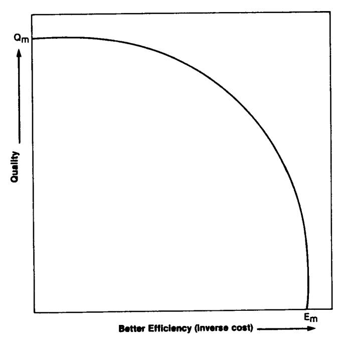
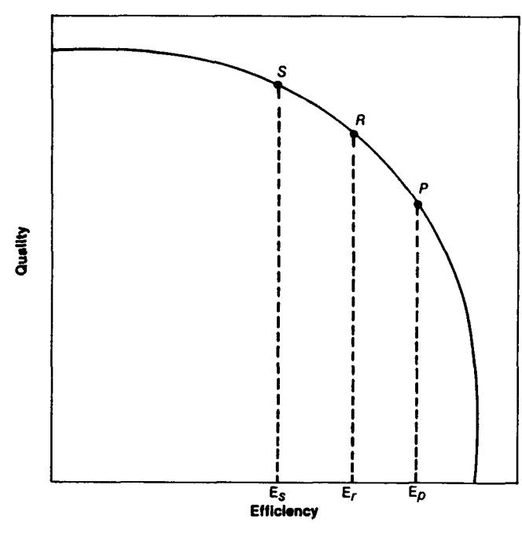
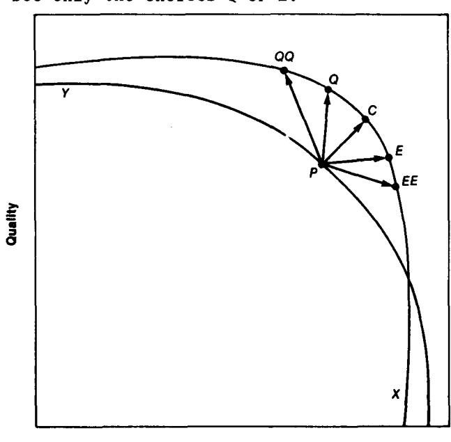

### OVERSTRUCTURED MANAGEMENT OF SOFTWARE ENGINEERING

copyright, 1982, Gerald M. Weinberg

# Weinberg and Weinberg

# Abstract

Poor management can increase software costs more rapidly than any other factor, yet few studies have been made of poor management. One model suggests that poor management may arise from overly structured thinking on the part of software engineers who become managers after achieving technical success.

### The Problem

In The Book of Five Rings, the samurai, Miyamoto Musashi, wrote:

"Large things are easy to observe. Small things are difficult to observe. That is to say, it is difficult to actuate one's will with speed with a large number of people; it is difficult to know what is going on with one individual since the spirit of that individual can change very quickly."

In Software Engineering Economics, the software researcher, Barry Boehm, wrote:

"Poor management can increase software costs more rapidly than any other factor."

Boehm's book is a milestone contribution to our field, but it does not pursue the question of poor management. It is a book about software engineering, not software engineers. Like almost all work in our young field, it is about projects, not people.

Some years ago, I decided to shift my attention from the technical problems of software engineering to the problems of people who lead software engineering projects. The shift has not been easy.

Projects are large things. Managers are small things. We observe projects, even though they will be difficult to change, because they are easy to observe. We neglect managers, because they are hard to observe, even though they might be changed very quickly.

In shifting my work from technical issues to leadership issues, I had to give up easy technical success for practically insoluble problems with people. When I became frustrated, I started treating people like machines. It didn't work.

Is it possible that some of our software engineering failures result from trying to manage people as if they were computers? After all, isn't that what we know best?

## The Approach

Where should one begin a study of software engineering managers? I would like to study bad management, but I'm afraid people will think me entirely negative. Therefore, let me rationalize that approach by appeal to some authorities.

One of the most remarkable books in my library is a volume published in England in 1975 by The Institution of Mechanical Engineers. It is called Engineering Progress Through Trouble.

Trouble, as I like to call it, begins by noticing that in 1856 (over 120 years ago) Robert Stephenson said:

"...he hoped that all the casualties and accidents, which had occurred during their progress, would be noticed in revising the Paper; for nothing was so instructive to the younger Members of the Profession, as records of accidents in large works..."

In our own field of software engineering, the mushroom growth of "structured programming" is generally traced back to Dijkstra's 1968 letter in the May 1968 Communications of the ACM. Let me paraphrase Dijkstra's short argument:

- I. We've developed quite a few programs, some successful, some not so successful.
- 2. We decided to look at the two kinds and see what were the differences between them.
- 3. In the unsuccessful programs, we found things that were out of our mental control, things such as the Go-To.

**Reprinted by permission of author from course notes for** *Problem Solving Leadership Workshop.* 

In The P§ycholosy of Computer Programming (Weinberg, 1971), I suggested several places we might look for the sources of our failures. Some of the places I suggested looking were:

- I. code, as Dijkstra had done
- 2. programmers
- 3. managers

A good deal of work has now been done about looking at code (see, for example, Freedman and Weinberg, 1982), and at programmers (Shneiderman, 1980). In this paper, I would like to concentrate here on the third area, in much the way Dijkstra did:

- I. I've watched the development of quite a few software systems, some successful, some not so successful.
- 2. I decided to look at the behavior of management in the two kinds of developments and see what were the differences between them.
- 3. In the unsuccessful systems, I found things that the managers couldn't keep under mental control. Most of these things had to do with the way people in a project behave, and these managers were trying to control by using overstructured models of human behavior.

Curiously, these overstructured models of human behavior turned out to be exactly those models of program control that had proved so successful in structuring computer programs. Could these managers have made the error of believing that people were like programs? Why else would they be so dedicated to structural fallacies based on sequence, choice, iteration, recursion, refinement, modularization, and data structures such as stacks?

# The DEAL Model

When interviewing managers about their role in software projects, I find the DEAL model of Fritz Heider (1958) particularly useful. DEAL is an acronym for four kinds of reasons people give for success or failure:

- D Difficulty of the task
- E Effort put into doing the task
- A Ability relevant to the task
- L Luck

Successful managers always talk about the effort they put in and the ability they possess. Unsuccessful managers always talk about how hard the task was and what bad luck they had. They also talk about their poorly trained and unmotivated staff. --\

I believe that unsuccessful managers make as much effort as successful managers. I believe their projects are no more difficult - unless they themselves have made them so. Sometimes there is such a thing as bad luck, but successful managers were able to deal with bad luck and overcome it.

When I asked managers to explain what they meant by "bad luck" or "difficulty," they usually told me about unexpected events. But unexpected events can also arise because our expectations are incorrect because our models of the world are too simple. And these managers did seem to have an overly structured view of system development. Perhaps they had spent too much time working with computers, where a highly structured view is quite appropriate.

I believe that these unsuccessful managers lack ability. Like me, they may have a record of great skill in manipulating computers, but they lack the ability to use more realistic models of human behavior. The simple control structures of structured programming may be adequate for writing code, but they fall rather short of what we need for successful project management.

#### Sequence

The most fundamental control structure in programming is, of course, sequence. A sequence of actions is conceptually simple, and managers are quite correct to try to structure software projects so that important events take place in fixed, pre-determined sequences.

But the development of new things is hardly that predictable. Idealized models of developmental sequences must be tempered with some hard realities. Consider, for instance, the "classical" sequence specification, design, code, test.

Most system development models have several alternatives to this sequence, such as,

- I. specification, kill
- 2. specification, design, kill
- 3. specification, design, code, kill

Yet the truly unsuccessful development projects I have observed never went through any of these alternatives. They were never killed by their own managers, but always went into prolonged and agonizing testing phases, regardless of any indications from early phases that the system was already a disaster.

The problem here is that the alternative sequences in the development model do not have sufficient reality to the managers who must implement them. As one manager said to me, "Those development models are too academic. It's not realistic to kill a

project after we have spent so much effort writing specifications. I would have to answer to my own management why I was so lax as to initiate a project if my people couldn't do it."

To make such alternatives realistic, upper management must be given an expectation that a certain number of projects will be killed in each stage of the life cycle. Natural systems - plants and animals - have evolved so that deaths of unfit individuals occur as early as possible. It's estimated that in human beings, one-third of all pregnancies end in spontaneous abortions within the first month, and are ordinarily not even recognized as pregnancies.

One image my clients have used successfully is that of measures of balanced risk. The concept is based on two types of errors (see Weinberg and Weinberg, 1979):

- I. attempting to build a system that should not be attempted
- II. failing to attempt a system that should be attempted

Managers tend to get punished for Type I errors because these errors are conspicuous, so they prefer to make Type II errors. To create a more balanced strategy, we have to make Type II errors equally conspicuous, but how can we measure what isn't attempted?

Physicians have a similar problem when deciding whether to operate for cancer. Every tumor that is removed is sent to the pathology lab to determine if it. was indeed cancerous.\_ The ratio of benign to malignant tumors is a measure of unnecessary surgery - if it gets too high, doctors are warned to be more careful in their diagnosis. But if it gets too low, they are also warned - because that means that they are probably allowing some cancers to remain!

To make development managers more balanced, we must measure the number of systems that are killed in the various stages of development. If the number killed in early stages is too small, that means either that they are not attempting enough risky projects or that they are being too rigidly sequential.If they were called to account for these ratios, they might alter their overly structured models. Choice

The second fundamental control structure in well-structured programs is choice - the selection of one of two alternatives. Although a simple choice structure is well suited to the binary nature of computers, it often fails in the fuzzier situations more typical of human activities.

~anagers with overly structured choice ~odels have difficulty making sensible ~radeoff decisions. For instance, one of the most common tradeoff possibilities in system development is quality versus efficiency (Weinberg, 1982a, p117ff). Figure I is a tradeoff chart relating quality and efficiency, with the curve representing the best we can do with a given technology. To be concrete, imagine that:

- I. Quality here means absence of bugs in a delivered system.
- 2. Cost here means the development cost to deliver that system.

Figure I.

The curve indicates that the tradeoffs available to the development manager are not of the "either-or" variety. Indeed, there is a whole range of ways of doing "the best we can do" - anywhere on the curve, in fact. Figure 2 shows three of these choices - the different operating points with different choices between quality and efficiency. The movement from P to R to S might represent increasing emphasis on error-detectlon and error-prevention activities such as testing or structured design.

Figure 2.

The tradeoff curve represents one particular style or level of development technology. A different development approach would be characterized by a different curve, as suggested in Figure 3. The existence of another approach gives the manager still more choices, such as moving from P to Q or E.

When a new technology comes along - the new curve - the overstructured manager tends to see only the choices Q or E:

**E~**  Figure 3.

- Q. Raising the quality, holding the cost constant.
- E. Lowering the cost, holding the quality constant.

Quite frequently, this perceived lack of choices leads to the decision to avoid the new technology altogether because "it doesn't address our problems."

Can managers learn to enrich their choice models? A few years ago, I would have said NO, because of my observations of managers on the job. But now I believe that pressures on the job are too great to allow the necessary experimenting. But in our workshops on problem-solving leadership, we've been able to create environments that encourage experimenting with new models. And many of our graduates have brought their new flexibility back to the office. Modularization

Another concept from structured programming is the idea of the functional module-one module, one function. This idea is particularly appealing to the overstructured manager because it allows the substitution of labellin5 for thinking.

I most frequently run into modular thinkers when trying to introduce a system of technical reviews. These managers seem unable to understand that a technical review is a unit of work that does several functions (Freedman and Weinberg, 3rd edition, 1982):

- I. testing of the reviewed material
- 2. technical training of the participants
- 3. communicating and enforcing standards
- 4. leadership training of the participants
- 5. developing a project's community spirit

Although one function per module certainly simplifies thought, it throws away one of the major advantages people have over machines - the ability to do several things at once, selecting what's most appropriate from the environment at the moment, without being programmed to do it. In a properly conducted technical review, everyone gains not one but several things, though we can't always predict in advance which things.

Modular thinkers tend to lack faith in people and their ability to find a way to get their jobs done. Modular thinkers place more faith in labels - if the chart says Jack is in training today, then Jack must be learning something today. Modular thinkers easily fall victim to the lure of the "magic box" - buy this package and things will get better.

When I suggested to one manager that productivity might be increased through increased use of software tools, he replied, "I bought \$40,000 worth of software tools last year, though I didn't see any increase in productivity." When I went down into his shop, I found what I expected - \$40,000 worth of software tools not being used by anybody. Modular thinkers seem to believe that buying the tool is the only step, rather than the first step, to usin 5 software tools.

What is the cure for modular thinking? Here there seems no substitute for experience with real human beings in all their lumpy glory. Sometimes this experience can be gained in workshops, though it may take many repetitions before the idea takes hold. I've noticed that volunteer community work, like working with handicapped children, seems to encourage remarkably fast erasure of modular thinking. Iteration

Iteration, the third of the "big three" control structures, is also heavily favored by overstructured managers. One form of iteration is related to labelling. A manager simply repeats the same cliche over and over, as if it is a magical incantation that will solve problems.

Take the statement:

"Programmer productivity has grown at only 3% per year."

Over the past 15 years, I have heard this statement repeated to me by managers at least fifty times. None of these managers has been able to supply a reference to the source of this figure, or tell how it was computed. There are studies that estimate this figure, but there are also studies that estimate 25% or more annual increase.

But worse than the omission of sources is the commission of a classical "Composition Fallacy." This simplistic statement substitutes the individual worker, "programmer productivity," for the system under which the work is done, "software development productivity."

The net effect of this kind of mechanical repetition of cliches is some form of endless loop, such as,

- **I.** The manager believes that programmer productivity has grown only 3% per year.
- 2. If the problem is programmers, then if we want to increase productivity, we must get rid of programmers.

. But much of the loss of productivity is precisely because experienced programmers are constantly being lost to theprofession, which tends to keep down average productivity, even though individual productivity is increasing each year.

I've explored this particular cycle elsewhere (Weinberg, 1982b), so let me relate another one that parallels it. I recently suggested to a manager that if he wanted more productivity from his experienced programmers, he should spend more time, attention, and money on training. He replied, "Why bother sending them to expensive classes? The experienced ones just leave here for other shops, so I'd just be training them for other people."

When I interviewed two of his top programmers, they confided that they were seriously considering leaving, which tended to confirm the manager's pessimistic view. But when I asked why they were leaving, they independently said that "management doesn't value our work." What evidence did they have? Both told me that they had repeatedly been turned down on requests to attend courses!

## Recursion

- I could go on relating examples of overstructured management, such as,
- I. refinement working out ever more precise details of the development process, when the overall approach is misguided.
- 2. data structures pushing problems into a stack, under the rigid belief that an organization can deal with only one problem at a time
- . top down design spending all the time and attention on the management levels, as if the people at the bottom were willing to wait passively for the management to get around to considering their level.

Instead, I'd like to confine myself to one more management control structure that may account in good measure for all of the others. I'm speaking of recursion - the technique of a system containing itself.

I often question development managers about their sources of information. Here are some things I've discovered:

**I.** Most managers attend seminars or conferences, but all were technical and all were within data processin~

2. All read books and magazines, but only a handful read anything significant outside of data processing - and these are mostly about hobbies.

They all seemed a bit apologetic about their reading tastes, but most explained that their work "didn't leave time for things outside their field." And so our leaders grind on endlessly taking their own output as input. Could that have anything to do with the way they endlessly repeat the same mistakes?

### What is To Be Done?

The structured programming strategies are designed to simplify the intellectual task of programming. Managers who come up through the ranks of programming have had many successes applying such strategies that's why they became managers. So these overstructured strategies are not bad strategies, they are 5ood stratesies misapplied.

What is to be done? Try harder? People under pressure tend to revert to problem-solving strategies that worked for them in the past. If we tell managers to "try harder", it will only make the problem worse. If we are to achieve better software engineering management, we must alleviate the pressure, not increase it. An overloaded manager is usually a bad manager.

If a manager has no time for "outside" interests, then the danger point is well past. If a manager says, "I can't afford the time to attend a seminar that isn't directly relevant to my work," then that manager's career is just about over.

If software engineering truly is engineering, then it ought to be able to learn from the evolution of other engineering disciplines. If mechanical engineers could increase the reliability of steam boilers by a factor of around 1,000,000,000,000 over a century, then perhaps software engineers would benefit from stepping back as they did and dispassionately examining their blunders.

Whenever I suggest stepping back, easing up, laughing a little at ourselves, and going outside our own field, somebody objects, saying, "But software is different. We have to work harder, concentrate more, because nothing is as complex as software." Well, of course software is different, and more complex than anything people have ever before attempted to engineer. But that's why we have to loosen our stuctures, not tighten them. That's why we must learn from any place we can, any way we can.

Perhaps this is only a prejudice of mine. Perhaps nobody else learns, as I do, from sticking my nose into other areas where people have struggled with complex systems. If that idea worries you, try a simple test of that notion by using this article. In the article, I've used insights I gained from:

- I. mechanical engineering
- 2. social psychology
- 3. biology
- 4. medicine
- 5. literature

Did you notice? Did you lose patience? Did it make it harder for you to understand? Do you think any of the insights were relevant to the problems that plague software engineering? That plague your own work?

Only you can answer for yourself. Only you can step back from yourself, ease up on yourself. Only if you can stop overmanaging yourself can you stop overmanaging others.

#### References

Boehm, Barry Software En~ineerin 5 Economics Englewood Cliffs: Prentice-Hall, 1981

Dijkstra, E. W. "Go-To Statement Considered Harmful" Letters to the Editor, Communications of the ACM, March 1968

Freedman, Daniel, and Gerald M. Weinberg Handbook of Walthrou~hs t Inspections and Technical Reviews t 3rd ed. Boston: Little, Brown, 1982

Heider, Fritz The Psycholosy of Interpersonal Relations New York: Wiley, 1958

Musashi, Miyamoto The Book of Five Rinss (Gorin No Sho) New York: Bantam Books, 1982

Shneiderman, Ben Software Psychology Boston: Little-Brown (Winthrop), 1980

Weinberg, Gerald M., and Daniela Weinberg On the Design of Stable Systems New York: W11ey, 1979

Weinberg, Gerald M. Rethinkin~ Systems Analysis and Desisn Boston: Little, Brown, 1982a

Weinberg, Gerald M. Understandin~ the Professional Prosrammer Boston: Little, Brown, 1982b

Weinberg, Gerald M. The Psychology of Computer Pro~rammin~ New York: Van Nostrand-Relnhold, 1971

Whyte, R. R., editor Engineer Prosress Throu6h Trouble London: The Institution of Mechanical Engineers, 1975