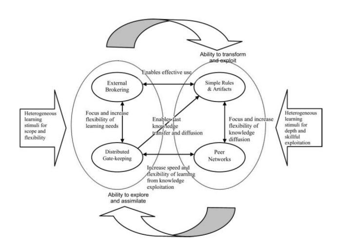

# **Hyper-learning in Netcompany**

Alexander Brandborg1\*

#### **Abstract**

During hyper-competition SDOs are forced to hyper-learn. Yet, with success they may grow in size. This article seeks to answer the question of how hyper-learning occurs when an SDO grows drastically. Through the theory of hyper-learning presented in *Learning Routines and Disruptive Technological Change* the case of Netcompany is analyzed. It is here found that Netcompany in some ways lives up to the theory by using experts to explore knowledge and share it with other employees for exploitation. Yet, there is also some signs of formalization and standardization such as the use of external courses and R&D projects. Discussing this against Mintzberg's organization configurations, it can be speculated that an SDO like Netcompany needs to formalize and standardize as it grows, even when there is some pull to hyper-learn. In the case of Netcompany, the surrounding environment is stable enough for this to be possible.

1*Department of Computer Science, Aalborg University, Aalborg, Denmark*

\***Contact**: abran13@student.aau.com

### **Introduction**

Within the IT industry, we frequently see the introduction of disruptive technologies such as the internet. Yet even to a smaller degree, new impactful technologies are continuously popping up. Because of this high rate of change, it can be difficult for a Software Development Organization(SDO) to keep an advantage in the market. This state of affairs is known as hyper-competition.

The knowledge base of an SDO defines what it knows. During hyper-competition, the value of what is known rapidly decreases as new technologies are introduced. This pushes an SDO to hyper-learn. It is forced to quickly identify new frame-breaking knowledge, assimilate it into the knowledge base and transform it to an exploitable form.

SDOs that master hyper-learning may not only be able to stay afloat, but may in fact flourish. In turn, they may begin to expand by hiring a large number of new employees. Yet, how does an SDO hyper-learn, when many of its employees are new to the company? This leads to the following problem statement, which will be answered in this article:

*How does an SDO hyper-learn, when its employee-base grows drastically?*

The rest of this article is structured as follows: Firstly a theory of hyper-learning will be described. Next will be a description of how data was acquired and handled. This is followed by an analysis of the data, proceeded by some discussion and final remarks.

# **Hyper-Learning**

In *Learning Routines and Disruptive Technological Change*[\[1\]](#page-2-0) Lyyting et al. presents a study of hyper-learning in the age of internet-adoption during the late 1990s. The study focuses on learning routines, which define how to acquire and exploit knowledge external to an SDO. Looking into 7 SDOs in total, the study identified 4 hyper-learning learning routines.

These are grouped as being used to either explore or exploit. Exploratory routines have an outward focus, where new knowledge is searched for and placed in the knowledge base. Exploitative routines have an inward focus, refining the current knowledge base. Through refinement, operational knowledge, which guides the design and implementation of systems, is created. Exploration is encouraged, when the scope and flexibility of the knowledge base needs to be increased. Exploitation is encouraged, when there is a push to be better than the competition. Both are relevant during hyper-learning. The 4 routines are listed in [1.](#page-1-0) In general, the routines keep learning rather informal, focusing on simple guidelines and peer-interaction, rather than rule books and training programs.

Lyyting et al. identified not only individual routines, but also how they interact. Traditionally the processes of exploration and exploitation are kept separate. Yet during hyperlearning, both exploration and exploitation are short lived, and they need to be switched between fast. This leads to the concept of parallel ambidexterity, where exploration and exploitation are done in parallel. This is depicted in [1.](#page-1-1) The big arrows indicate the push to explore and exploit, and the curved the fast switching between processes. The slim arrows indicate, how the routines impact each other. For instance, the arrow between *Distributed Gate Keeping* and *Simple Design Rules and Artifacts* shows how the knowledge of distributed experts can be used to create simple guidelines. As the routines directly support each other, they can be switched between fast in an informal manner. By adding redundant structures, such as multiple experts, the routines are executed in parallel.

| Exploration                                                  | Exploitation                                                |
|--------------------------------------------------------------|-------------------------------------------------------------|
| Distributed Gate Keeping                                     | Brokering External Knowledge                                |
| Instead of a central R&D department, some employees are      | Knowledge scope is reduced by outsourcing non-critical      |
| chosen to become experts. As they work in some part of       | knowledge areas. This is done by using either external work |
| the organization, they not only solve regular tasks, but get | ers or buying pre-packaged solutions.                       |
| a deeper knowledge of select technologies, which can be      |                                                             |
| drawn upon when needed.                                      |                                                             |
| Simple Design Rules and Artifacts                            | Building Peer Networks                                      |
| Abstract expert knowledge is transformed into simple patters | Experts act as mentors to other employees and help spread   |
| and guidelines, as to quickly travel across the SDO.         | knowledge to their peers. Often supported by some rapidly   |
|                                                              | updated Q&A or FAQ.                                         |

**Table 1.** Learning routines in hyper-learning.

**Figure 1.** Parallel Ambidexterity.

# **Research Approach**

To answer the problem statement a single case study approach is used. This is often done, when testing the boundaries of well-formed theory, as is the case here.

The case chosen is that of Netcompany, which is a danish SDO specializing in creating back-end business solutions. They are a leading IT-firm in Denmark and compete with other large companies for both private and governmental contracts. Being in a state of hyper-competition, they can not take any market-advantage for granted and need to hyper-learn. Netcompany have also seen a large growth in their employee-base, going from around 600 in 2015 to 1000 employees in 2017[\[2\]](#page-3-1).

Data was collected from 3 employees through semi-structured interviews. All interviewees were associated with the same project, which concerned the development of a web-based storefront for the Solar company. One employee was a consultant, the other a senior consultant and the third a specialist. The objective of the interviews was to gain insight into Netcompany in relation to several system development theories. This includes the one on hyper-learning. All interviews were about an hour long, conducted by different groups and transcribed after the fact.

| Learning Routine                  | Frequency |
|-----------------------------------|-----------|
| Distributed Gate Keeping          | 2         |
| Brokering External Knowledge      | 7         |
| Simple Design Rules and Artifacts | 4         |
| Building Peer Networks            | 9         |

**Table 2.** Learning routine statements identified in transcripts.

The same type of coding as used in [\[3\]](#page-3-2) is applied. Categories are set up and coherent statements relating to learning routines are identified within the transcripts. Each statement is then coded into one of the categories. This allows for a systematic way of coding the data up against the theory. The categories chosen are the 4 learning routines from [1.](#page-1-0) Results of coding can be seen in [2.](#page-1-2)

### **Analysis**

In this section the collected data will be analyzed, systematically looking into each learning routine.

#### **Distributed Gate Keeping**

In regards to Distributed Gate Keeping, not many statements appear. The consultant states:

"Now they [other team-members] have been in other projects, or other similar portal projects, where I can ask, ok I need to make an asynchronous load of these things, how do I approach this?"

This indicates that employees become experts by working in other projects. Yet, it seems that the main reason an employee gets assigned to a project is their ability to deal with the concrete development task. Exploration is not an explicit part of the task.

Employees may get expertise in a field by working in a special research and development project. While Netcompany has no real R&D department, employees may spend a few hours a week on these projects. Yet, this goes against the idea of parallel ambidexterity, as exploration and exploitation are formally switched between. While this concerns only a few hours, it does slow down the switching between the two processes.

#### **Brokering External Knowledge**

Netcompany limits the scope of their knowledge base by only focusing on back-end development. Thus in the case of the Solar project, another company was chosen to build the frontend. This can be classified as Brokering External Knowledge.

Instead of relying only on experts, external resources are often used to share knowledge with employees. The specialist states:

"If there are some big things, where you need some foundational knowledge, then you can be placed in a course or do some tutorials."

Thus, Netcompany partially pushes the task of sharing knowledge onto other companies. This further limits the scope of the knowledge base. In turn, they are allowed to focus on more critical tasks. Yet, switching between exploitation and exploration is slowed down further, as tutorials and courses are only for exploration.

#### **Simple Design Rules and Artifacts**

Even though work is often done in an agile manner, documents are still required to be produced during projects. The consultant states how the abstract knowledge of writing a document is transformed to a more exploitative form:

"[If we] have had a document that has worked really well in an earlier project, then you can make a template from this in some way. Yet, this has been a process stretching across many years."

It does not seem to be the case that similar templates are used for the more technical parts of development. Yet, it is stated that if a software component is developed as part of a project, it may be made generic and placed in a componentcatalogue for later use.

This shows that knowledge is transformed for exploitation in Netcompany. Though it seems that templates and components are build up and formalized over the years. This differs from the rules and artifacts set up by the theory. Here they are described as being informal and quickly put together because of the volatility of the knowledge.

#### **Building Peer Networks**

Some employees have an explicit specialist role and jump between different projects to lend their technical abilities where needed. Consultants usually stick around for the lifetime of a project, while the specialist switches when needed elsewhere. When asked for their use in spreading knowledge the consultant stated:

"They [specialists] have more knowledge, but its not like you only go to the architects or specialists[for help]. It is the person with the knowledge who can help you."

This signifies that peer networks are not build up around some kind of mentor, who assists in project-wide learning. Instead, all employees with some expertise spread their own knowledge and make sure that it is exploited. A lot of the statements identified relate to peers helping each other in an informal manner.

In the case that a peer with the required knowledge is not nearby, employees ask questions in a company-wide forum. As employees are evaluated based on how active they are on the forum, answers are quickly given. It has the same role as the Q&A or FAQ as originally proposed to be part of the Building Peer Networks routine.

Some parallel ambidexterity can be witnessed here. Through their regular work-tasks employees will eventually have to explore new knowledge. This rather abstract knowledge is then made to be exploited by sharing it with peers, either face to face or over the forum. Here the switch between exploration and exploitation is fast and informal.

## **Discussion and Final Remarks**

Through the previous analysis, it can be seen that Netcompany does not entirely fit the mold of the theory presented in [\[1\]](#page-2-0). There seems to be an emphasis on standardization through the use of courses. In addition, formal behavior is supported by formal rules and artifacts. Yet, while specific employees are not explicitly appointed as experts, through their own exploration on the job some gain expert knowledge. The knowledge of these experts is shared and exploited across a peer network. As these employees explore and exploit at the same time, some parallel ambidexterity is occurring. Though the switching between exploration and exploitation is not always fast because of the use of courses and R&D projects.

Since Netcompany is expanding, this suggests that as a company grows, it begins to formalize and standardize, even when there is a pull to hyper-learn. This is supported by Mintzberg's theory of organization configuration as presented in *Mintzberg on Management* [\[4\]](#page-3-3). As an organization grows, it becomes more formal in its behavior. We see this in Netcompany as it builds more formal rules and artifacts. Yet, Mintzberg also states that when the environment around an organization is stable, then the organization starts to use standardization to coordinate work tasks rather than using mutual adjustment or direct supervision. An example is standardization of skills, which is done by training employees in the same manner. While not all Netcompany employees take the same courses, those that do should be able to more easily coordinate. This suggests that the environment around Netcompany is not as unstable as the cases presented in [\[1\]](#page-2-0). Yet, we still see some informal behavior and learning going on through the non-explicit experts and peer networks. This suggests that the environment around Netcompany is not totally stable either, creating some pull to hyper-learn.

### **References**

[1] Kalle Lyytinen, Gregory M. Rose, and Youngjin Yoo. Learning routines and disruptive technological change: Hyper-learning in seven software development organizations during internet adoption. *IT & People*, 23(2):165– 192, 2010.

- [2] Kim Stendal. Netcompany klar med rekord-regnskab: Omsætningen buldrer i vejret - sammen med antallet af medarbejdere, 2017.
- [3] John Stouby Persson, Lars Mathiassen, and Ivan Aaen. Agile distributed software development: enacting control through media and context. *Inf. Syst. J.*, 22(6):411–433, 2012.
- [4] H. Mintzberg. *Mintzberg on Management: Inside Our Strange World of Organizations*, pages 98–115. Free Press, 1989.