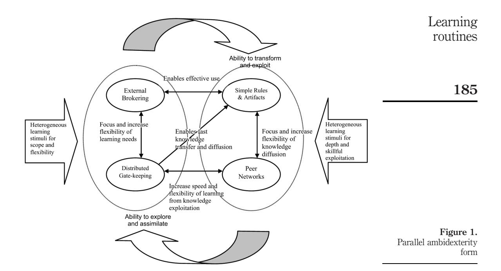

# Learning routines and disruptive technological change

Learning routines

# Hyper-learning in seven software development organizations during internet adoption

165

Received 3 December 2008 Revised 13 November 2009 Accepted 25 March 2010

Kalle Lyytinen

Case Western Reserve University, Cleveland, Ohio, USA

Gregory Rose

College of Business, Washington State University, Vancouver, Washington, USA, and

Youngjin Yoo

Temple University, Philadelphia, Pennsylvania, USA

# Abstract

Purpose – During hyper-competition, disruptive technological innovations germinate causing significant changes in software development organizations' (SDOs) knowledge. The scope and flexibility of the SDO's knowledge base increases; its volatility and the demand for efficiency grows. This creates germane needs to translate abstract knowledge into workable knowledge fast while delivering solutions. The aim of this article is to examine SDOs' responses to such learning challenges through an inductive, theory-generating study which addresses the question: how did some SDOs successfully learn under these circumstances?

Design/methodology/approach – The article takes the form of an exploratory, theory-building case study investigating seven SDOs' web-development activities and associated changes in their learning routines during the dot-com boom.

Findings – The SDOs increased their ability to learn broadly, deeply, and quickly – a learning contingency referred as "hyper-learning" – by inventing, selecting and configuring learning routines. Two sets of learning routines enabled broad and flexible exploratory-knowledge identification and exploratory-knowledge assimilation: distributed gate-keeping; and brokering of external knowledge. Likewise, two sets of learning routines enabled fast and efficient exploitative-knowledge transformation and exploitation: simple design rules; and peer networks. The authors further observed that SDOs created systemic connections between these routines allowing for fast switching and dynamic interlacing concurrently within the same organizational sub-units. The authors refer to this previously unidentified form of organizational learning as parallel ambidexterity.

Originality/value – The study contributes to organizational learning theories as applied to SDOs by recognizing a condition where knowledge scope, flexibility, efficiency and volatility increase. It also argues a new form of ambidexterity, parallel ambidexterity, was created and implemented in response to this set of requirements. Parallel ambidexterity differs from traditional exploitative forms where SDOs focus on improving and formalizing their operational knowledge and improving efficiency. It also differs from traditional explorative forms where SDOs focus on identifying and grafting and distributing external abstract knowledge by expanding knowledge scope, flexibility. Most importantly, parallel ambidexterity differs from the widely recognized forms of sequential and structural ambidexterity because exploration and exploitation take place at the same time within the same unit in holographic ways to address volatility. Here learning outcome are applied directly and fast to the tasks for which the learning was initiated.

Keywords Software engineering, Learning organizations, Internet, Change management, Knowledge management

Paper type Case study

Information Technology & People Vol. 23 No. 2, 2010 pp. 165-192 q Emerald Group Publishing Limited 0959-3845 DOI 10.1108/09593841011052156

# 166

# Introduction

Information technology (IT) applications have evolved with astonishing speed during the past four decades. Not only have types of applications grown increasingly varied and complex, but also the pace of change has accelerated (Kurzweil, 2001). Consequently, software development organizations (SDOs) – units that develop software applications for customers – have to continually adapt to constant change in technologies, markets and products. Occasionally, these changes are disruptive and create hyper-competitive conditions (D'Aveni, 1994) where the scale and speed of change are extraordinarily high. Among the greatest moments of hyper-competition for SDOs was the onslaught of internet-computing (Sambamurthy and Zmud, 2000; Straub and Watson, 2001; Pries-Heje et al., 2004; Lyytinen and Rose, 2003). It deeply challenged their learning as it fundamentally transformed framing, architecture, and organization of software development (Lyytinen and Rose, 2003).

Strategy research makes clear that organizing for learning is critical for survival (Cohen and Levinthal, 1990; Eisenhardt and Martin, 2000; Eisenhardt and Tabrizi, 1995) and such needs are heightened during hyper-competition. During the internet boom, SDOs had to build up, re-scope and expand their learning. A unique challenge was "internet-time" ticked faster than time in earlier eras, and SDOs had to dramatically increase their learning speed (Lyytinen and Rose, 2003; Pries-Heje et al., 2004). In short, they had to hyper-learn by:

- . quickly identifying broad, external, frame-breaking knowledge;
- . assimilate it into their knowledge base; and
- . quickly transform this knowledge into operational forms to efficiently exploit it.

Some firms thrived within these new constraints while others did not.

The question is: how did some SDOs successfully learn under these circumstances? To address this question, we inductively build up an exploratory analysis of what new learning routines successful SDOs invented in common and how they configured them to adjust to internet-induced hyper-competition. We contribute to organizational learning research by theorizing learning routines and their configurations under boundary conditions where learning scope, flexibility, speed, and efficiency must be addressed concurrently. To our knowledge, such learning conditions have not been addressed in prior research. Yet, rapid and fundamental changes in computing continue in areas like service-oriented architectures, cloud-, mobile-, and social-computing (Kurzweil, 2001). As a result, increased speed and the push towards engaging in hyper-learning is a reality that SDOs will continue to confront (Kurzweil, 2001).

In building the prospective theory, we examine two questions:

- (1) What learning routines did SDOs "mutate" and select during internet adoption?
- (2) How did SDOs configure these routines as a whole?

We address these questions through an explorative, multi-site case study (Eisenhardt, 1989; Eisenhardt and Graebner, 2007). Drawing upon organizational-learning research, we inductively generalize our case study data into a theory of learning routines for "hyper-competition" (Grant, 1996; Van Den Bosch et al., 1999; Girard and Stark, 2002). We deem such an inductive approach justified, since little is known about what routines organizations invent and implement to address simultaneous increases in knowledge scope, flexibility, and volatility, while maintaining adequate levels of efficiency (Girard and Stark, 2002; Kellogg et al., 2006; Thomke, 1998; MacCormack et al., 2001).

The remainder of the paper is organized as follows. First, theories related to organizational learning contingencies formulate the concept of hyper-learning and highlight the influence of learning routines. Next, the research design and analysis of how seven SDOs invented and re-configured their learning routines to address the aforementioned conditions is reviewed. Finally, we discuss implications and limitations, and provide results of longitudinal data in an epilogue that support our findings.

# Software development organizations and learning: a review Learning in SDOs

SDOs are defined herein either as independent profit-centers or separate organizational software development units that operate in vertical or horizontal customer markets (including internal customers). Typically, SDOs deliver tailored or configured software based on customer needs defined in contracts. Solutions are delivered and organized through projects, and carrying out project-based designs constitute SDOs' main task. Because of their one-of-a-kind nature, the delivered software involves both product development and production functions. The deliverables integrate and embed forms of knowledge about innovating, designing, configuring and implementing software. Knowledge underpinning successful software development is created and consumed simultaneously in projects that constitute the critical locale where SDOs acquire and integrate new knowledge. Consequently, our analysis will focus on how SDOs learn during and from projects and how they organize their learning routines around project-based learning.

At all times SDOs need to be highly concerned with how to identify, assimilate, transform, and exploit external knowledge, because a large part of their working knowledge originates extramurally (Cohen and Levinthal, 1990; Attewell, 1992). Because of the abundance and continuous changes to external knowledge, SDOs need to garner meta-learning capabilities (learning about how they learn) as to improve their learning processes and outcomes (Eisenhardt and Martin, 2000; Lewin and Volberda, 1999; Van Den Bosch et al., 1999). Extant research distinguishes three components that affect meta-learning:

- . the knowledge base what the SDO knows;
- . the organizational form how the SDO is structured and how its members interrelate; and
- . learning routines scripts through which SDOs acquire and exploit external knowledge (Grant, 1996; Van Den Bosch et al., 1999).

A change in any component influences the other two, demanding SDOs to change their learning and thus increasing the importance of meta-learning (Grant, 1996; Van Den Bosch et al., 1999). For example, a change in learning routines affects the knowledge base, while a new organizational structure will constrain the types of scripts enacted (Kogut and Zander, 1992; Lewin and Volberda, 1999; Van Den Bosch et al., 1999). As the majority of research in the past has focused on interactions between organizational form and other learning components (Kogut and Zander, 1992; Lewin and Volberda, 1999; Van Den Bosch et al., 1999), we focus on interactions between learning routines and the knowledge base, and the impact of these interactions on SDOs' learning outcomes.

# Knowledge base and learning routines within SDOs

SDO's main task – generating software that satisfies client's needs – requires constant sourcing, acquiring, and deploying external knowledge (Iivari et al. 2004). At the same time, the knowledge base of an SDO is heterogeneous, causally-ambiguous and highly interrelated. Accordingly, during software projects developers enact learning routines to identify and assimilate external knowledge, and transform it with operational knowledge into an exploitable form (Lyytinen and Robey, 1999). Operational knowledge is explicit, detailed, rule-based knowledge of how to organize for, design, and implement software (Lyytinen, 1987). In this regard, software development involves constant expansion, integration, or purging of both external and operational knowledge. SDOs must build up processes that identify, acquire, integrate, and adjust external knowledge with their operational knowledge. Subsequent new knowledge is then discovered through feedback-based learning often continuing onward in escalatory learning cycles (Lyytinen and Robey, 1999).

Learning routines are "repetitive and recognizable patterns of interdependent actions [related to knowledge acquisition and transfer] involving multiple actors" (Feldman and Pentland, 2003, p. 96). Examples include explicit ways of transferring knowledge across units or collecting it from the external environment. These routines form part of operational knowledge, and are integrated and interact with other routines. Routines can be formal and explicit (standardized methodologies), or informal (impromptu meetings in a hallway).

# Routines and learning needs

When technologies change disruptively, an SDO's knowledge base faces the danger of becoming obsolete. Its learning routines may also be inadequate to identify appropriate new knowledge (Cohen and Levinthal, 1990). SDOs may lack effective routines to inter-relate some newly acquired knowledge with its existing operational knowledge. To mitigate this threat, SDOs need to learn to juggle between two types learning routines: exploratory and exploitative learning (March, 1991). These routines echo SDOs' bifurcated learning needs, which stem from the SDO's constant need to address a variance in four properties of their knowledge base. The first three are noted by Grant (1996) as scope, flexibility, and efficiency:

- (1) Scope refers to the breadth of a knowledge that an SDO needs to draw upon to operate effectively.
- (2) Flexibility denotes the extent to which an SDO needs to integrate unforeseen knowledge into its knowledge base or forge new connections within it.
- (3) Efficiency denotes how an SDO can transform and exploit its knowledge from a cost perspective.

A fourth property of volatility extends Grant's (1996) list and comes out of our data analyses. Volatility denotes a rapid availability of novel, and original knowledge that must be evaluated to fast to provide new and novel solutions. In a period of volatile learning, the pool of newly available technologies is simultaneously: radically different; broad; and deep. And, it comes without a set of fixed standards from which to choose as identified by the marketplace. As a result of volatility, SDOs need to rapidly experiment with, and employ multiple, complex and untried technologies that are often functional substitutes for or overlaps with each other. Until the marketplace identifies a set of standard solutions, SDOs need to adopt multiple, redundant technologies and knowledge. Any software built with subsequently orphaned technologies need to be treated as prototypes to be rebuilt with the eventual market-selected solution standards.

When scope and flexibility of an SDO's knowledge base grows, they need to identify and assimilate new pools of external knowledge. This typically happens when an SDO responds to significant changes in technologies, products, or markets. These situations rely on exploratory learning routines and an SDO needs to explore and invent new routines that are: geared towards acquisition of external knowledge (Holmqvist, 2004; Thomke, 1998); and effective in identification, acquisition and assimilation of knowledge (Lewin and Volberda, 1999). Results include novel solutions, new competencies, and access to new markets (Eisenhardt and Tabrizi, 1995; March, 1991; Tushman and Anderson, 1986; Winter and Szulanski, 2001). Exploratory routines involve behaviors labeled as "search," "discovery" (free-form trials or free association), "experimentation," "risk-taking," and "innovation" (Holmqvist, 2004; March, 1991). With the exception of Holmqvist (2004), research to date has ignored how SDOs create and manage routines for exploration.

In order to efficiently deliver solutions to their clients, SDOs must also enact routines that efficiently exploit their knowledge base. When this happens, SDOs focus inwards and learning is focused on routinization, prediction, and precision (Holmqvist, 2004). SDO's operational knowledge is thereby transformed, and its use can be made cost efficient through standardization, feedback-based learning, and monitoring (Jansen et al., 2005). Such learning is made possible through exploitative-learning routines that formalize an SDO's knowledge base through repeated trial-and-error (Dierickx and Cool, 1989; Eisenhardt and Martin, 2000; Nelson and Winter, 1982). Ideally, these routines leverage old certainties through extension and refinement of competencies (March, 1991). Exploitative behaviors are usually referred to as "refinement," "implementation," "efficiency," "production" or "selection." The majority of studies about learning in SDOs investigate these inward-focused, efficiency-based kinds embedded in the form of rules, standards, and tools (e.g. Humphrey, 1989).

Unfortunately for SDOs in need of learning and applying knowledge at a rapid pace, exploratory and exploitative learning appeared to act like fire and water in that they cannot easily co-exist in the same place and time. Traditional mechanisms for exploration and exploitation call therefore for mutually exclusive structures, capabilities, and cultures (March, 1991; Brown and Eisenhardt, 1997; Tushman and O'Reilly, 1996). Routines for exploration orient organizations towards organic structures, loose couplings, improvisation, chaos and emergence. Routines for exploitation, on the other hand, orient organizations towards mechanistic structures, tight coupling, routinization, bureaucracy and standardization. Routines that could balance these antagonisms would need to allow SDOs to: flexibly organize for learning; discover and invest in different routines; and connect them in new flexible ways as to effectively respond to fast changes in externally-available knowledge (March, 1991).

Rapid change and balancing of learning routines – hyper-learning

A perpetually, radically and rapidly changing environment would create wide gaps between what an SDO currently knows, what it needs to know, and how it needs to effectively apply that knowledge. Change in both scope and flexibility would need to grow significantly as to apply this knowledge efficiently (Lewin and Volberda, 1999; Van Den Bosch et al., 1999). To absorb this knowledge, SDOs would need to simultaneously engage in competence destroying and competence building (Hedberg, 1981). In short, they would need to rapidly absorb, utilize, and integrate knowledge that is heterogeneous, conflicting, ambiguous and of uncertain value via radically new learning routines (Van Den Bosch et al., 1999). Thus during hyper-competition (D'Aveni, 1994), broad and quick sensing (exploration) and rapid competence creation (exploitation) are both necessary. In short, the SDO's meta-routines would need to accomplish rapid exploratory and exploitative learning in tandem using a form yet unidentified in the literature.

We can now accordingly define hyper-learning as a learning contingency where an SDO simultaneously engages in broad explorative-learning and deep exploitative-learning in order to function within a hyper-competitive environment (D'Aveni, 1994). In such an environment:

- . the pool of external, conceptual knowledge is expanding and is ambiguous (knowledge scope and flexibility increase);
- . the volatility in this new knowledge is high (the necessary pace of exploration increases); and
- . the rate of converting the knowledge into exploitable forms increases to respond to market demands (the rate of exploitative learning must remain high).

The remainder of the study discusses the mechanisms by which SDOs were capable of such hyper-learning. These SDOs simultaneously increased their ability to both explore and exploit by doing so quickly within the same unit – a condition that we call parallel ambidexterity. In classical forms of ambidexterity, organizations overcome the antagonistic tensions between exploration and exploitation by either: moving between them via sequential ambidexterity (applying related learning routines sequentially); or establishing separate units using structural ambidexterity (allocating distinct learning routines to different units) (Gupta et al., 2006). Both traditional "ambidextrous organization designs are composed of highly differentiated, but weakly integrated subunits" (Benner and Tushman, 2003, p. 252). Neither design can function effectively with highly-constrained time and space. Therefore structural and sequential ambidexterities face inertia and delays when shifting from exploration to exploitation, and vice versa. In contrast, parallel ambidexterity represents a new learning configuration that emerged independently across multiple SDOs in a hyper-competitive environment of dot-com boom spanning over five years.

# Research context and methodology

Research context: internet-computing as a hyper-competitive environment The invention of the worldwide web (WWW) launched an unforeseen excitement and a rapid wake of innovation in computing technologies, solutions, software tools, and design methods (Lyytinen and Rose, 2003; Slaughter et al., 2006). The pace of innovation in these technologies was in part fueled by vast business opportunities and a deluge of venture capital. These conditions created a hyper-competitive environment where technologies, markets, customer needs, and the means of competition were in continuous, rapid, volatile change that affected knowledge scope, flexibility, and efficiency (Basu and Kumar, 2002; Sambamurthy and Zmud, 2000; Straub and Watson, 2001).

The key new knowledge elements for SDOs' knowledge bases included:

- (1) New design platforms (e.g. n-tier architectures) languages and implementation tools (e.g. HTML, CGI, etc.) – (significant change in technological knowledge).
- (2) New applications in new domains (significant change in application knowledge).
- (3) New composition of design teams, new processes involving halving of development times, and a movement to agile development and prototyping – (radical change in operational knowledge).
- (4) New customers (radical change in business knowledge).

Collectively, both demand-side and supply-side knowledge (and their dependencies) became increasingly complex, diffused, and fast-changing. The scope and scale of knowledge-change was unprecedented in the SDO industry (Lyytinen and Rose, 2003). A significant portion of these changes were dissimilar to existing knowledge (Pries-Heje et al., 2004; Kellogg et al., 2006), frame-breaking, and required assimilation of novel design frames (Lyytinen and Rose, 2003). This created volatility in development tasks epitomized by fast changes in technologies and applications. Further, it intensified competition between incumbent software providers and new entrants, and set up expectations of unprecedentedly fast time-to-market software delivery. Finally, change was abrupt and in constant flux for a period of approximately five years (1995-2000 based on our data), creating enormous pressure to rapidly and perpetually learn, adapt, integrate, and apply new knowledge.

# Research goals, design and sampling

We conducted a multi-site, theory-building case study (Yin, 2003) in seven SDOs to discern how the sampled firms changed their learning routines related to software development during the adoption of internet-computing. The research design aimed at generating and testing theoretical insights across replicated cases (Eisenhardt, 1989; Strauss and Corbin, 1990). Specifically, we probed ways SDOs changed learning routines in order to deliver internet-based solutions. Data were used to derive constructs and theory that could account for observed changes.

The unit of analysis for our study was at the level of SDOs. The SDO-level was chosen because similar routines were found to be taking place across multiple projects within each SDO. Interviewees and researchers agreed all significant projects within each SDO during the period of study were: radically novel; web-based; and in need of new learning techniques we later identified as "hyper-learning." The new learning practices were found pervasively across each SDO. Interview data came exclusively from upper-tier employees (CTO, VP, etc.). Each made clear changes in learning mechanisms were implemented: SDO-wide; systematically and intentionally; and with top management knowledge and approval.

ITP 23,2

172

The SDOs included met the following criteria. During the period from 1995-2000 they:

- . focused primarily on what is referred to herein as "web-development" or internet-development across multiple domains;
- . were early, fast, and continuous adopters of advanced technologies;
- . were external organizations from their customers; and
- . had adopted significant amounts of extramural knowledge throughout the five years of study.

Ten firms were initially deemed to meet these criteria. A round of preliminary interviews subsequently reduced the set to seven (see Table I).

"Web-development" denotes a development environment that relies on browsers, open standard protocols (XML, HTML, http, URL, TCP/IP), and n-tier architectures (Slaughter et al., 2006). Their projects at that time required: trials of multiple, experimental, emerging programming platforms; adoption of modular software components; inventing new application designs; and transferring older solution patterns into new business domains with new technologies. To increase external and internal validity, we controlled for industry, size, culture, or experience (Yin, 2003). Three of the firms were the largest and most successful software organizations in their markets with extensive knowledge and established development methodologies and tools that marked them at high capability maturity levels (CMM). Two were startups. One was spun off from a large IT firm to give them freedom to innovate with minimal constraints around resources, organization, and time. The remaining firm avoided any new sales outside of Web-development and replaced any employees unwilling to adapt.

The primary data collection spanned a seven-month period between June and December, 2000. Two sets of follow-up interviews were conducted to validate our findings. These took place in 2004-2005 and 2009-2010. Fewer firms were available for longitudinal data collection due to issues of turnover, ownership change, etc. Data collected during the 2004-2005 interviews included only firms 1, 2, 5, 6, and 7. In 2009-2010, only firms 2 and 6 were available. Analyses from those follow-up data highlight the importance of building a capacity for hyper-learning as discussed in the epilogue.

# Data collection

Semi-structured, tape-recorded interviews were conducted and transcribed. Additional data were gathered from various forms of corporate documents. The data set created nearly 300 pages of transcribed text and formed the primary basis for our analysis. It covered:

- . the companies' application portfolios and markets;
- . their application distribution methods;
- . changes in their business and technology domains;
- . the extent, scope, depth and speed of change in their software development knowledge, and related mechanisms (such as methodologies, guidelines, tools);
- . how they identified, assimilated, transformed and exploited this knowledge especially within and between projects;

|                                                                  | 1                                                                                                                                                                     | 2                                                                                                                                                                                            | 3                                                                                                                                                                                                 | Firm 4                                                                                                                                                                                                                            | 5                                                                                                                                                                                                 | 6                                                                                                                                                                                                                                | 7                                                                                                                                                                                                                            |
|------------------------------------------------------------------|-----------------------------------------------------------------------------------------------------------------------------------------------------------------------|----------------------------------------------------------------------------------------------------------------------------------------------------------------------------------------------|---------------------------------------------------------------------------------------------------------------------------------------------------------------------------------------------------|--------------------------------------------------------------------------------------------------------------------------------------------------------------------------------------------------------------------------------------|---------------------------------------------------------------------------------------------------------------------------------------------------------------------------------------------------|----------------------------------------------------------------------------------------------------------------------------------------------------------------------------------------------------------------------------------|------------------------------------------------------------------------------------------------------------------------------------------------------------------------------------------------------------------------------|
| Division focus                                                   | Custom software development. applications e-business Primarily                                                                                            | B2B e-business consulting solutions                                                                                                                                                    | parent company's Small spin-off of parent. Is web based ASP for customers                                                                                                             | mobile computing specializes in E-Business consulting                                                                                                                                                                       | systems to include web and mobile upgrade legacy integrators to solutions Systems                                                                                                  | mobile computing components and assembling of Specializes in Need-based E-Business solutions                                                                                                                   | hosting services development, IS networking and Management consulting, products,                                                                                                                              |
| Interviewee details                                           | managers, and including an employees Six senior executive, architects software                                                                      | his key developers A senior manager group and one of development of an IS                                                                                                        | for the creation of technologists who The CIO, and the were responsible five key senior the spin-off                                                                               | project managers, developers, and including ISD Five senior technology employees the senior architect                                                                                                           | for development of was responsible executives who One of the processes founding business                                                                                        | systems architect, software engineer manager, and applications Four senior including a employees                                                                                                               | manager of IT development One senior services                                                                                                                                                                       |
| Age, development previous learning experience, routines | client server shop 500 employees in 15 year old firm Mainframe and four locations methodology development CMM level 1 Established software | multiple platforms and application Part of a large, multinational methodology CMM level 3 software for consulting Developed company business Rigid areas | financial company mainly mainframe Followed in-house Part of a large methodology CMM level 1 with several software for applications Developed employees thousand | Several thousand standardizing its formulating and founded in 1995 Developed only consulting firm Multinational methodology CMM level 1 applications web based employees e-business Currently | development firm developing a web starting with six founded in 1996 Developed only methodology CMM level 2 E-commerce applications web based employees Currently | multiple platforms development firm and application consulting and Extensive and multinational methodology CMM level 3 software for Developed e-business software flexible Large areas | multiple platforms development and and application IT service firm methodological Mature, large, multinational CMM level 3 software for knowledge Developed Rigid and extensive areas |
|                                                                  |                                                                                                                                                                       |                                                                                                                                                                                              |                                                                                                                                                                                                   |                                                                                                                                                                                                                                      |                                                                                                                                                                                                   |                                                                                                                                                                                                                                  | (continued)                                                                                                                                                                                                                  |

Table I. Firm characteristics

ITP 23,2

174

| Branch manager Several hundred Project manager Field manager President 40 hours 18-30 1                                           | Traditionally had Several hundred a separate R&D Project and managers technical 50 hours Director Partner 15-30 unit 2 | CIO, then flat 50 hours ,10 70 3                                                       | Project manager Client manager Firm 60 hours þ 100 4 3                                                                                                                    | except for salary Entirely flat 37.5 hours þ issues 200 5 3                                                           | methodologies for Traditionally had a separate R&D hierarchy with Rigid vertical all aspects of formalized Uncertain business Varies þ 700 6 | autonomous units Traditionally had based on market Several hundred a separate R&D sector of client divided into Company is 37.5 hours Uncertain unit 7 |
|--------------------------------------------------------------------------------------------------------------------------------------------------------|---------------------------------------------------------------------------------------------------------------------------------------------------------|----------------------------------------------------------------------------------------------------|------------------------------------------------------------------------------------------------------------------------------------------------------------------------------------------------|--------------------------------------------------------------------------------------------------------------------------------------------|----------------------------------------------------------------------------------------------------------------------------------------------------------------------------------|-----------------------------------------------------------------------------------------------------------------------------------------------------------------------------------------|
| Created a separate business analysts, parent company developer, other architects, lead ambidexterity) units within a 15-20 people | Created a separate unit for e-business developers, rookie analysts, expert Architects, developers                                        | ambidexterity) Informal, few separate unit Creation of a specific roles (structural | project assistant, involved in web following roles: Specialized by technical lead, Flat with the industry and development organization designer, Whole client | involved in web Specialized by Informal, few industry and specific roles development organization technology Whole | functional teams to support web Created cross Rigid vertical development hierarchy unit                                                                        | Created a separate 50/customer) and Broken down by subsequently by (approximately unit for web development customers                                               |
| developers, QA                                                                                                                                         |                                                                                                                                                         |                                                                                                    | information architect                                                                                                                                                                       |                                                                                                                                            |                                                                                                                                                                                  | teams (of 10 each)                                                                                                                                                                      |

Table I.

- . coordination capabilities (informal and lateral coordination, employee training, etc.); and
- . socialization (branding, identity formation, hiring policies, organizational change, etc.).

Interviews involved senior managers and developers in charge of: technology investments; the firms' business strategy; and their development operations. A range of one to six individuals participated in the interviews. Some managers had invited subordinates who were knowledgeable about key technology strategies, markets, or development practices. Each transcribed interview, finalized data summary, and an integrated white paper was sent to the participants for validation.

# Data analysis

Data analysis was conducted in three stages (Strauss and Corbin, 1990). First, open coding was used (Strauss and Corbin, 1990) where each transcript was subjected to a within-case analysis for identifying emerging categories. Second, axial coding identified relationships among discovered categories and their sub-dimensions, and selective coding linked sub-categories to core categories (consisting of conditions, context, and consequences). Several rounds of axial coding followed around keywords including "speed", "rapid", "fast", and "quick" for their connections to such codes as "learning", "training", "knowledge", "grafting", "forgetting", "methods", "methodologies", "re-use", "communication", "sharing", and "environmental scanning" (Strauss and Corbin, 1990). As a result, several higher abstractions of the original data were derived for each case. The third stage involved between-case comparisons covering similarities and differences among the firms' learning. In particular, we examined what learning routines were used, how they evolved, and how routines were organized. Based on this, we derived higher-level constructs describing common learning routines and their organization. Interestingly, we detected consistent patterns across all firms independent of size or of their previous learning structures. These final between-case analyses provide a systematic account of convergent evolution of a set of new learning routines across seven SDOs.

# Hyper-learning for web-development

Increased learning scope, flexibility and speed through new learning routines Our data reveal that SDOs were facing widely- and rapidly-forming gaps between what they knew and what they needed to know. These gaps were driven by: technological discontinuity, increased client pressure, and solution variance. Specifically, the SDOs characterized web-development as having compressed technology life-cycles that resulted from intense, radical, and diverse innovation (Lyytinen and Rose, 2003). Fast advances in technologies placed pressure on SDOs to accelerate their capabilities for identification and assimilation of appropriate technologies. Volatility in the market was judged unprecedented and took the form of multiple, redundant, and emergent technologies with short life-expectancies across the entire spectrum of IT development (e.g. platforms, languages, protocols, infrastructure, hardware, GUIs). SDOs had to know more total information, across more areas, with less predictability and fewer external experts or codified knowledge sources (e.g. books, training seminars, university courses, etc.) than ever. As a result, the development team members were clear that they knew a smaller percentage of what was of potential value at the same time as they were learning more in total than ever before. In addition, because vast numbers of technologies were becoming obsolete soon after they were adopted, many deliverables became "legacy" software as quickly as they were finished. Many of those projects had to be rebuilt soon thereafter with a different platform and/or architecture. In most cases, only the design requirements of the original product were salvageable. This uncertainty added to their knowledge burden as it pushed SDOs to also meta-learn more effectively in order to enable rapid transfer of new knowledge depth into operational knowledge. A large portion of their existing operational knowledge in technologies, software products, and methods was found unusable for this new environment (Lyytinen and Rose, 2003). For example, web-applications needed to be architected differently and involved entirely new expertise in areas like multimedia design (Lyytinen and Rose, 2003).

In addition to technological discontinuity, SDOs quickly found themselves facing knowledge gaps as a result of client demands for speed. Customers were experiencing increased competitive pressures that required unprecedented speed of software delivery. Projects had to be completed at "internet-speed" (Lyytinen and Rose, 2003). This greatly reduced the time SDOs had to identify, assimilate, transform, and exploit the knowledge in projects. Time constraints combined with technological volatility created a need for members of SDOs to effectively sift through, identify, assimilate, and use a wide assortment of new candidate technologies from a seemingly infinite set of alternatives as quickly as possible in order to remain competitive.

Next, we will characterize the learning routines invented and their organization in response to these new challenges and knowledge volatility. We first examine routines that increased the SDOs' ability to identify and assimilate external, conceptual knowledge. Second, we discuss routines used to transform and exploit this knowledge quickly by generating applicable operational knowledge.

# Broad and flexible exploration and knowledge assimilation

Each SDO adopted two types of exploratory learning routines to address the new challenges associated with knowledge flexibility, scope, and volatility. The first routine we refer to as distributed gate-keeping. We define gate-keeping as the act of acquiring technological knowledge at a deep and broad enough level to subsequently exploit it in flexible and efficient ways. Gate-keeping is "distributed" when it is location independent (e.g. in contrast with traditional methods of being centralized in a separate R&D unit). The second exploratory learning routine is external knowledge brokering. External knowledge brokering occurs when the SDO makes decisions to acquire only "ossified" end products of the unknown, but necessary technical knowledge. As brokers SDOs acquire just the necessary artifacts from external environments without actual operational knowledge transfer about the workings of the underlying technology.

Distributed gate-keeping. When SDOs had to respond to fast, frame-breaking change, they had to allocate a larger proportion of their resources to knowledge identification and assimilation, and increase their boundary spanning and environmental monitoring. Consequently, they moved away from centralized R&D activities, demolishing their existing R&D units (firms 2, 6, and 7), while distributing their knowledge discovery and intertwining it with exploitation (Girard and Stark, 2002). For older firms, centralized R&D with sequential ambidexterity operated successfully (Gupta et al., 2006; Tushman and Anderson, 1986) with a small number of experts performing explorative searches in closed networks (Cohen and Levinthal, 1990). They performed centralized and isolated exploration and standardization. The knowledge was later disseminated across the firm into individual projects in the form of newly documented methods, integrated with tools.

In contrast, SDOs now performed distributed gate-keeping. They distributed R&D exploration directly and organically at the web-development project-level. New routines were established to mobilize cadres of frontline software developers for identification, acquisition, and assimilation of critical external knowledge. We call these new routines for knowledge identification and assimilation distributed gate-keeping. As persons located at the "boundaries" of the organization, these distributed gate-keepers were all engaged in providing the unit with new external knowledge elements (Leifer and Delbecq, 1978) "just-in-time." Because gate-keepers provided access to the fast-moving and expanding knowledge frontier in the environment, they became the nexus of speeding up knowledge identification, acquisition and assimilation. The gate-keepers would scan their environment constantly for technical and business knowledge and translate it into formats that were comprehensible for transfer and assimilation (Cohen and Levinthal, 1990). This led them to use different tools and methods for knowledge identification, distribution and assessment (e.g. e-mail, collaboration tools, and knowledge repositories) than they had in the past.

Though the gate-keeping took several forms (see Table II), each SDO moved their knowledge acquisition into decentralized, networked forms. For example, Firms 4 and 5 (both start-ups) designed their gate-keeping upon inception. Interestingly, both adopted quite similar gate-keeping practices. The gate-keeping tasks were dynamically adjusted and distributed based on specific learning needs and localized to the projects taking place at that time. Both firms identified a network of "experts" in specified key technology areas and relied on them to acquire and assimilate knowledge. For each key technology deployed, the firms expected to have at least one to three experts. These experts served as assimilators by sharing the new knowledge with the rest of the company in a useful format. Most others knew who those experts were, and actively sought their help in addressing technical or application problems. Such connections promoted fast assimilation and refinement of knowledge, and built tighter knowledge coordination across ongoing projects. Both firms also put methods into place specifically to develop a portion of their remaining workforce into future experts. For example, firm 5's human resource department kept track of the 25-30 percent of employees deemed most interested in and capable of independent learning about new, experimental technologies. Their current and "future" experts were then given additional financial resources and dedicated time for learning and deploying new knowledge.

Another form of distributed gate-keeping was seen in firm 7 (a large Finnish IT service firm). They established a separate technical group of "wizards" to support its frontline consultants. Wizards comprised about 1 percent of all employees. They were seen as true experts in both their current foundation knowledge and in learning new, complex knowledge within a given technical domain. Unlike a traditional R&D researcher in an exploration cycle and not facing compressed timelines, wizards moved

|      | Broad and flexible exploration and assimilation of knowledge                                                                                                             |                                                                                                                                                                                                                            | Efficient transformation and exploitation of knowledge Simple design rules and artifacts |                                                                                                                                     |
|------|--------------------------------------------------------------------------------------------------------------------------------------------------------------------------|----------------------------------------------------------------------------------------------------------------------------------------------------------------------------------------------------------------------------|---------------------------------------------------------------------------------------------|-------------------------------------------------------------------------------------------------------------------------------------|
| Firm | Distributed gate-keeping                                                                                                                                                 | Brokering external knowledge                                                                                                                                                                                               | use                                                                                         | Building peer networks                                                                                                              |
| 1    | The firm invests heavily in off-site that the lead developers want to The firm only develops systems training of lead developers Lead developers: develop | component libraries from external outdated technology to open up Active purchasing of software funds for people capable and Firing of technologists with willing to learn newest technologies sources | Web page templates are reused                                                               | skills to spread knowledge around Mentors review code written by Place people with appropriate through mentoring others |
| 2    | Technology geeks who are deeply The firm piggybacks on them for plugged into external technology Technology gurus: new technologies communities           | Outsource contractors for specific Import external software code library from open-source community areas                                                                                                      | Design and analysis patterns are Loosened up rigid development methodology reused  | The firm increasingly relies on Gate-keepers provide about 75 informal on-the-job mentoring percent of technical inquiries |
| 3    | He was brought in because of his substantial experiences in web based systems development New CIO:                                                              | Outsourcing programmers Hiring a new CIO                                                                                                                                                                                | A simple informal three-step methodology is used                                         | The firm is planning to implement a mentoring program                                                                            |
| 4    | There are skill leaders in eight key They are responsible for environmental scanning technology areas Skill leaders:                                         | Outsourcing web hosting and ASP Purchasing components and platforms                                                                                                                                                  | A simple three-step methodology consisting of the envision, shape, and realize phases | Each new employee is assigned to a mentor and a regional training program                                                     |

(continued)

Table II.

| Learning |  |
|----------|--|
| routines |  |

179

|      | Broad and flexible exploration and assimilation of knowledge                                                                                                                                                                |                                                                                                  | Efficient transformation and exploitation of knowledge                                                                                           |                                                                                                                                                                                   |
|------|-----------------------------------------------------------------------------------------------------------------------------------------------------------------------------------------------------------------------------|--------------------------------------------------------------------------------------------------|--------------------------------------------------------------------------------------------------------------------------------------------------|-----------------------------------------------------------------------------------------------------------------------------------------------------------------------------------|
| Firm | Distributed gate-keeping                                                                                                                                                                                                    | Brokering external knowledge                                                                     | Simple design rules and artifacts use                                                                                                         | Building peer networks                                                                                                                                                            |
| 5    | They are 5-10 percent of employees For each key area, the firm had 1-3 knowledge with the rest of firm who are expected to learn new technology and share their Experts: experts                          | Limited contracting for the newest Minimum purchase of software technologies components | The development methods for web based systems are much simpler than the traditional methods                                                | Projects maintain nearly "flat" structures in order to leverage others through mentoring and Experts are expected to teach informal workshops individual expertise |
| 6    | technology areas to keep up with They work closely with selected They specialized in particular business partners in order to experiment with emerging changes in technology Boundary scanners:           | Extensive use of components Outsourcing for custom code developments                       | design patterns are heavily reused Analysis and overall solution                                                                              | mentoring period, a local mentor Each new hire is mentored for three months. After the initial will be assigned for 2-4 years                                            |
| 7    | support group who assist frontline The mentors were assigned to key consultants is expected to become The top 1 percent of technical experts in certain areas strategic projects technologies Mentors: | Outsourcing certain special areas Acquire companies instead of outsourcing, if necessary   | Most aggressively pursuing code essentials" of the methodology reuse and formal development However, it focuses on "bare methodology | The firm rotates "mentors" around different projects to transfer their expertise                                                                                            |

Table II.

to "pilot" projects when a new technology was being identified, developed and deployed for the first time. They even had a nickname for this: "expert pilots." Typically, an expert stayed with the project no longer than three months before moving to the next one. They stayed long enough to identify, learn, implement, and transfer the new knowledge to a redundant resource in the project group. In that way, the knowledge was accessible from more than one resource in the SDO and not lost if the individual wizard left the firm.

The broad enactment of these routines also increased the awareness of the criticality of knowledge acquisition within the SDOs and promoted its value. This was partially achieved by organizing the gate-keepers into multiple, heterogeneous and overlapping social networks. Such distributed and decentralized use of gate-keepers enabled faster searching, increased redundancy, and expanded search scope. The new routines guaranteed the identified knowledge could be assimilated faster because connections of the discovered knowledge to the problems faced were explicitly visible, concrete and intimate. This was especially true for highly-visible, experimental pilot projects.

Brokering external knowledge. The second set of learning routines also sought to rapidly acquire new knowledge in a way that it could be both explored and exploited simultaneously. However, external knowledge brokering was designed to decrease the scope of learning by externalizing non-critical learning activities and only focused on the acquisition of end products built from outside experts. These learning routines were enacted, in particular, when:

- . firms did not have adequate resources to internally develop the knowledge in a rapidly changing domain;
- . the knowledge did not fit with their current knowledge base and building such a knowledge base would take too long; and
- . brokering from external sources would not expose them to an increased resource dependency.

In this way, SDOs could externalize learning costs where little value was seen in developing expertise internally. This allowed the SDOs to strategically allocate their limited "expert" resources for identification and assimilation of only critical knowledge. This also mitigated risk associated with knowledge volatility. To this end, firms generated routines whereby they could quickly broker codified knowledge from external sources, or search for alternative forms.

The learning routines overall increased the speed of identification, assimilation, and later on, knowledge-exploitation (as the external knowledge was less ambiguous). Accordingly, software development tasks were rendered more modular whereby a larger number of developers could integrate their knowledge laterally (Baldwin and Clark, 2000). The resulting increase in brokering also allowed for the search of larger quantities of extramural knowledge.

With the exception of firm 5, all firms adopted some form of external brokering within the limits of their modular architectures: they increasingly acquired software components; out-sourced or pooled pieces of external knowledge through partnerships; used alliances to carry out dedicated tasks (e.g. graphical design); relied on free-lance or software contractors; or used external networks to source required pools of knowledge. All these routines decreased the time and effort to explore and assimilate knowledge associated with non-strategic tasks.

Perhaps because software development was the core competency of these firms, the brokering of software development knowledge was specifically viewed as a radical change adopted out of necessity. External brokering was accepted as unavoidable in order to increase their learning rate. As one manager indicated, "moving towards assembly, it just happened overnight." Because of these changes, firm 1 observed that they now purchased software components whenever they were available and they no longer actively built and maintained internal libraries. Although improved capabilities within component-based software contributed to this change, the compressed development time was a driving factor. An executive of the firm stated:

We always take the fast way out. We have often been able to buy and plug in a component faster than we would have been able to just spec out the requirements alone, let alone build quality assurance.

Firm 4 also actively utilized both outsourcing and components. One executive said:

Customers often have many parts of the project that we don't give to them. We outsource [website] hosting and ASP [application service providing]. We purchase the platform and buy components. We purchase components because we don't have enough resources. We don't "do websites" and we will act as project manager for the existing clients to find a small company to do it.

These six SDOs incorporated brokering of external knowledge as a way of speeding up development and decreasing learning costs and risk. At the same time, firms also invested less in internally accumulated operational knowledge in these areas. Operationalization was now reserved only for the most valuable assets. In the past, these firms prided themselves on having codified expertise in all technical aspects of any solutions they delivered.

Efficient transformation and exploitation of knowledge

The SDOs in our study increased their ability to transform and exploit new assimilated knowledge efficiently by two mechanisms. These were: the use of simple design rules and artifacts; and the building of peer networks. They are described here.

Use of simple design rules and artifacts. As firms increasingly relied on external knowledge, they had to find the means to package this knowledge in forms that could travel easily and be applied efficiently. Such forms had to recognize the modular organization of diverse and rapidly-changing pools of knowledge and artifacts, and allow for efficient sharing. To this end, organizations enacted routines we call the use of "simple design rules and artifacts."

In the new environment, traditional systemic capabilities to transfer product knowledge efficiently (Van Den Bosch et al., 1999) became increasingly ineffective. It was instead seen as risky, wasteful, and counterproductive to embed detailed operational knowledge in system models and documentation standards. SDOs had to find arrangements where uncertain, fast-changing and ambiguous knowledge could be used efficiently. To this end, SDOs invented artifacts expressed in the form of simple generic rules and patterns. Such artifacts guided design processes, but leveraged "quick and dirty" strategies that efficiently addressed families of reoccurring design problems. Some of these artifacts involved the capture and reuse of high-level, abstract domain- and system-oriented knowledge schemes. In this way, design patterns fostered efficiency through the re-use of architectural and design knowledge across projects (Zhang and Lyytinen, 2001). Overall, these artifact-based forms allowed for ease-of-learning, modification, sharing and exploitation.

For example, firm 2 started to use design patterns and simple software process templates. Design patterns were made available in what they called "hacked manuals" that were shared over their network. Many of these patterns were developed at the headquarters, where heavy emphasis was placed on high-level reuse. This amounted to a significant departure from the firm's past design practice that focused dedicated resources and rewards for low-level code reuse and associated detailed technical documentation. An executive of the firm explicitly noted that accelerated changes in technology forced them to loosen up their once-prized, rigid and detailed methodology. Previously, the firm took great pride in having a well-established, rigorous methodology that was enforced vigorously. Similarly, firm 3 radically simplified its detailed and rigid methodology. The firm's designers argued that its traditional methodology would not fit with the new environment. As a result the firm adopted a simple, informal three-step method. At the same time, developers started to reuse functional business logics as design patterns. According to one executive:

These products [web-based systems] were developed without a formalized set of methodologies ... [traditionally, system development] took 18 to 24 months, which we don't consider acceptable [for web-development]. We have been "winging it" using some very basic methodology rules and tools to make a quality product.

Similarly, firm 4 formulated a simple methodology that consisted of three generic steps named: "envision;" "shape;" and "realize." This simple methodology enabled the firm to reuse its design patterns and coordinate design knowledge over a variety of technological platforms and business environments.

In summary, our sampled firms (most clearly demonstrated in firms 1, 2, 4 and 6) previously had extensively used formalized methodologies and tools to support and automate their processes, and had reached relatively high CMM levels as a result. In the past, these capabilities had been regarded as their key competitive assets. Not surprisingly, these organizations had to go through painful and politically-ridden abandonment processes of their costly, detailed, widely-distributed, and long-trusted hallmark methodologies. However, the unbundling from systemic capabilities towards informal, artifact-based knowledge integration was viewed as a necessity to be successful in this period of hyper-competition. The traditional rate of methodology maintenance and knowledge distribution no longer matched the volatility in the knowledge base. Technical experts and executives attributed this shift to radically-shortened timelines and rapidly expanding technological uncertainty. The artifacts were also flexible in that they could be easily filled with varying and fast-changing technical detail through peer mentoring (see below). They could also be recorded and organized into repositories, indexed for efficient search, and augmented with electronic traces of conversations of how to exploit this knowledge.

Building peer networks. To increase the efficiency of knowledge exploitation, SDOs mobilized their gate-keepers in a dual role as critical nodes in peer-mentoring activities. The gate-keepers in this role had to transform knowledge into forms that could be comprehended and exploited by others in the firm. In consequence, peer mentoring became the critical nexus in transforming abstract knowledge into detailed operational knowledge. But this day-to-day problem-solving also triggered new explorations and discovery. Through internal and external peer networks, SDO employees could quickly locate and exploit low-level, detailed technical knowledge necessary to implement software, while simultaneously expanding their exploratory searches. As noted, peer networks were flexibly enabled internally via rapidly-built Q&A or FAQ databases.

For example, in firm 1, top management tried to "spread the knowledge around by placing the people with appropriate skills sets to mentor ... people who were assigned to a project." These leaders would recognize when the team was deficient in knowledge. Leaders would assign subordinates to learn particulars of knowledge, and then assign them to exploit the knowledge in tandem by building prototypes. The mentors often also reviewed subordinates' code literally as it was being written as to identify, share and transfer technical knowledge and assign customized research assignments specific to the task in progress. This was noted by an executive of the firm 1:

Well I mean, it's more of a mentor thing, where [my subordinates say], "well you know I'm getting blown up on this," and I'll go and look at what they're doing and [say] you really need to go read up on this and here's a book ... [and these reading assignments are the equivalent of] tutoring on demand.

Firm 2 had historically required all new employees to be formally trained to use Firm 2's elaborate design methodology before an employee could work on their first project. The methodology was supported by systemic capabilities including CDs, technical manuals, technical design databases, CASE tools and even satellite video training. However, these rigid knowledge-transfer routines were abruptly found to be incompatible for internet-computing development and were quickly abandoned. In response, firm 2 started informal, on-the-job mentoring and relied on selected gate-keepers who would provide semi-structured technical expertise, which earlier would have been first codified in methodologies and tools. Instead of relying on a formal knowledge base, it was estimated that approximately 75 percent of designers now would instead informally check with a gate-keeper (usually via e-mail) to seek out applicable solutions to novel problems.

Likewise, firm 7 used mentoring routines for transforming and exploiting knowledge. Once the knowledge was understood by the gate-keepers, the firm would package the knowledge into the repository. This packaging followed a three-stage process where a group of mentors (there were approximately ten in a development group of 1,000) first gathered knowledge by working on a project that required the new technology. Mentors were put in projects for just long enough to transfer their expertise to at least one person. The involved people could later become mentors after obtaining adequate technical depth. Finally, mentors would transfer the knowledge to a group of support personnel (approximately twenty people) and move on to the next project. The support personnel entered new knowledge into the repository and acted as the centralized source of expertise for the development group at large (the remaining 970 people):

Mentors guide the support groups, and the support group, which can provide the FAQ [frequently asked questions] acts as an answering service and [provides] help for the [subsequent] projects.

Although the knowledge was eventually codified into a knowledge base, it was a tertiary step which only took place after the knowledge was first shared informally and made widely available as quickly as possible through peer networks.

Peer networks offered several advantages for efficient exploitation. First, broad and uncertain knowledge could be rapidly shared with small, select groups, who could exploit the knowledge without the delay of formalization. Unlike traditional training programs, mentors could easily share what they knew with people in the actual design context and learn quickly how useful the knowledge was. Second, peer and mentor networks increased flexibility and efficiency in distributing the knowledge. Peer networks differ from systematic, knowledge-transfer mechanisms that aim to guarantee completeness, consistency and predictability for stable development contexts. In contrast, peer networks provide flexibility to match the scope and flexibility demands of when, how, what extent, and what types of knowledge had to be transformed and exploited in a rapidly and radically changing environment.

# Parallel ambidexterity for hyper-learning

SDOs adapted to new hyper-competitive environments by also re-configuring the four sets of learning routines into a systematic configuration that we call parallel ambidexterity. Its unique features distinguish it from forms of punctuated ambidexterity assumed in prior equilibria models. In traditional, punctuated equilibrium logic, exploration is short-lived and exploitation takes place subsequently and over a prolonged period of time (March, 1991). In contrast, the studied SDOs each invented a form of parallel ambidexterity where both exploration and exploitation were simultaneous but short-lived, and therefore constantly occurring. Parallel ambidexterity was enacted in each SDO firm-wide to replace traditional learning forms. Each SDO maintained parallel ambidexterity as their primary configuration for the entire duration of hyper-competition later recognized to have lasted from 1995 through 2000. Each SDO conducted learning via parallel enactment of all four sets of routines, with fast and flexible switching between the routines, all situated in the same project unit. In this form, SDOs not only enact four types of routines in parallel, but also establish tighter and new types of couplings between these routines that are different from loose couplings usually seen in structural or temporal ambidexterity. In this parallel ambidexterity, the entire organization is recursively organized towards hyper-learning and the structural and temporal separation between the two modes of learning has practically disappeared.

The new configuration can be illustrated as an organizational learning model in Figure 1. The form connects the four sets of routines that permit their parallel, rapidly-switching execution. Structurally, the model differentiates routines that focus learning externally (Zahra and George, 2002) (left side ovals) with routines to learn from within (right side ovals), and integrate them as indicated by the internal arrows. The left side delineates routines that increase an SDO's ability to identify and assimilate necessary yet volatile external knowledge. The right side – separated only analytically from the left – shows routines that increase the SDO's ability to exploit its internal knowledge efficiently. The large circular arrows around the two different sets of routines depict the fast cyclical movements between the two types of learning enabled by parallel execution and fast switching. Therefore, for flexible integration purposes, all routines are loosely coupled from actors and structures. The result is that learning tasks can be flexibly allocated both structurally and temporally, and located and mobilized in parallel and distributed across different parts of the organization.

Because different routines engender tensions, they need to be connected in complementary and mutually implicating ways. In this regard, distributed gate-keeping adds redundancy, flexibility and scale into explorations, while external brokering increases their focus and effectiveness. Likewise, external brokering is made possible by distributed gate-keeping and modularization (simple rules). Simple rules and artifacts need to be augmented by the detailed operational knowledge harvested from peer mentoring. At the same time, detailed knowledge is rendered meaningful only in the context of architectural plans conveyed by simple design artifacts. Use of simple rules and artifacts makes it possible to modularize knowledge for external brokering, while the use of mentoring networks helps localize and effectively combine detailed technical knowledge into software artifacts. Finally, distributed gate-keeping helps assimilate external knowledge by contextualizing it with simple design artifacts.

Fast switching in this form allows the dynamic interlacing of diverse routines in local design contexts. In particular, it is enabled by:

- . using several elements for both exploration and exploitation (gate-keepers, artifacts);
- . having sufficient redundancy (using many gate-keepers and artifact forms) so that exploration and exploitation can move in parallel;
- . using simple artifacts and rules to reduce friction while switching between routines; and
- . using simple artifacts as boundary objects to integrate diverse and ambiguous knowledge across routines (Bergman et al., 2007).

ITP 23,2

186

Finally, fast learning outcomes cannot be shared through traditional knowledge discovery and sharing mechanisms (R&D memos; training; documentation of procedures, etc.). Instead, flexible, semi-formal tools are used to locate skills, share knowledge, negotiate meanings, and perform dynamically task allocation. Overall, these elements accelerate local shifts between exploration and exploitation and help reduce their tensions. The interlacing also generates a situation where all forms of learning are holographically organized throughout the social fabric.

# Discussion

In this study we examined two questions:

- (1) What learning routines did SDOs "mutate" and select during internet adoption?
- (2) How did SDOs configure these routines as a whole?

Below, we discuss how we addressed these questions by advancing the theory of hyper-learning organizations exhibiting parallel ambidexterity.

Question 1: what learning routines did SDOs "mutate" and select during internet adoption?

Our analysis shows that our sampled SDOs enacted routines involving: distributed gate-keeping and external brokering for broad, flexible, fast exploration; and simple rules, simple design artifacts, and peer and mentoring networks for fast and efficient exploitation. Though all these individual approaches have been recognized in some streams of research in the past, our main contribution is to recognize their simultaneous configuration in response to a hyper-competitive environment. No earlier study has shown that all these learning routines are present simultaneously and that they are mutually complementary over multiple years. In contrast, prior organizational learning research in SDOs has focused on learning outcomes (Pries-Heje et al., 2004; Slaughter et al., 2006); learning processes in exploitative environments (Humphrey, 1989), or changes in organizational structures and learning focus (Holmqvist, 2004).

Overall, our findings indicate the significant impact of increased environmental uncertainty and volatility on SDOs' learning. Galbraith (1973) proposed that organizations facing high uncertainty need to select designs that increase either their information processing capability, or reduce information processing needs. In a similar vein, during hyper-competition SDOs' selection of learning routines can be interpreted as germane responses to either increase their knowledge processing capability, or to decrease their processing needs. Distributed gate-keeping and peer/mentoring networks can be viewed as attempts to increase knowledge processing capacity similar to Galbraith's idea of using lateral relationships in increasing coordinative capabilities (Grant, 1996). At the same time, external brokering and the use of simple rules and design artifacts can be interpreted as a means to reduce knowledge processing and increase slack that allows frame-breaking knowledge to be acquired and assimilated (Galbraith, 1973).

Question 2: how did SDOs configure these routines as a whole?

Generating new routines for exploration and exploitation was by itself insufficient for hyper-learning. Instead, SDOs also needed to configure new capabilities to enact these learning routines in parallel, co-locate them, and to rapidly switch between them. SDOs accordingly removed structural or temporal constraints separating learning routines, and in lieu created distributed forms for knowledge discovery and exploitation where parallel and dynamic exploration and exploitation is possible. To this end, they connected learning routines into more tightly coupled forms by adjusting their inputs, outputs, and executors through minimizing their temporal separation. This is indicated in Figure 1 by arrows that connect the two sets of routines. Again, this finding of the systemic connections between exploration and exploitation behaviors is new. Girard and Stark (2002) hint to the presence of such capability when they call Internet-development organizations heterarchies involving minimal hierarchies with knowledge boundaries (Grant, 1996), and maximal knowledge heterogeneity permitting new knowledge combinations. But he never empirically analyzes what mechanisms such organizational forms use for boundary crossing and rapid combining of knowledge.

The concept of parallel ambidexterity supplements prior analyses of organizational learning that have focused chiefly on how organizations balance learning flexibility and efficiency sequentially, or how they structurally organize for these learning needs through separate units (Cohen and Levinthal, 1990; Jansen et al., 2005; Van Den Bosch et al., 1999). We showed that SDOs balanced exploration and exploitation in a radically different way during a prolonged period of hyper-competition (1995-2001) by organizing for them simultaneously, directly, and holographically within their locales. As prolonged wave of hyper-competition challenged SDOs to hyper-learn, they could not any more separate exploration and exploitation in time, space or structure (Jansen et al., 2005).

The resource-based view suggests that firms need to follow exploitative sequential-based learning forms to gain sustainable, competitive advantage (Zahra and George, 2002). Under these traditionally-recognized conditions, whenever it is appropriate, learning outcomes need to be standardized for low-cost replication in scale (Nelson and Winter, 1982; Winter and Szulanski, 2001) by continuing to exploit and refine knowledge acquired in the past (Cohen and Levinthal, 1990). At the same time firms need to garner and retain limited, centralized, and isolated resources to explore in order to remain unique and prevent easy imitation (Dierickx and Cool, 1989). In contrast, each SDO in our sample demonstrated that these conditions were not in place and a different configuration of routines was deemed necessary during disruptive, hyper-competitive conditions. By abandoning once-valuable, rigid, systematic capabilities, SDOs unbundled exploitative sequential-knowledge utilization for a flexible and generative dance between fast exploration and fast exploitation. By simplifying rules and artifacts, they enabled richer combinations of knowledge and rapid movements from abstract to operational knowledge on the "fly". In sum, parallel ambidexterity allowed SDOs to cope with the growth in their knowledge scope, flexibility, and volatility while maintaining adequate efficiency.

# Conclusion

Our study contributes to theories of learning in software development units that remain an under-explored topic. Past studies on SDO learning have primarily investigated the impacts of learning on project organizations and processes (Pries-Heje et al., 2004; Slaughter et al., 2006; Lyytinen and Rose, 2003; MacCormack et al., 2001). The exception is Holmqvist's (2004) study that examined longitudinally how a single SDO changed its learning directions, structure and pace as its environment and capabilities changed. He did not, however, address how the organization learned differently as a result of re-organizing it learning routines, and how technological discontinuities impacted its learning strategies. By addressing these questions, we supplement his study by showing in what ways SDOs learn differently as they need to re-configure their routines due to a change in learning needs.

The study has several limitations. First, it does not account for the events and processes that led SDOs to change their routines. Second, it is a revelatory case study in need of further analytic generalizability. Our findings can thus only be generalized with caution to other contract-based SDOs that operate under similar conditions. In addition, the studied organizations were highly-advanced and competent in adopting fast, new and ambiguous technologies and their behaviors do not likely represent typical responses to hyper-competition. Quite the contrary, the lack of any literature discussing the existence of hyper-learning during hyper-competition indicates it is likely atypical. Further, since only two firms retained the form after the widely-recognized period of hyper-competition, it seems that even within the SDOs that built competencies in parallel ambidexterity, the value of such a structure is still unclear. That said, the results may provide a prescriptive method that would recommend vigilant scanning for any onslaught of a hyper-competitive environments, and provides a template for a learning configuration to adopt in response. Analytically, the proposed model offers a fruitful lens to understand how SDOs can change their learning when knowledge scope, flexibility, and volatility increase. Likewise, though one could argue that studied behaviors were only specific to the internet era (Girard and Stark, 2002), the conditions that defined learning in this era can also be detected in other settings. As the studied period of time was non-trivial (five years) it also offers a baseline for systematic observation and theory building. As new disruptive cycles within the IT are taking place in limited domains like service-oriented architectures, cloud computing, RFID, or social computing (Kurzweil, 2001), other SDOs will need to find ways to quickly, broadly and efficiently learn and apply novel knowledge. Though such conditions are not present for all SDOs at all times, they are worthy of IS scholars' attention. Analogous to the study of illnesses in medicine, the abnormal, yet identifiable, conditions leading to hyper-learning warrants study, because they are exceptional circumstances that will likely re-occur and have profound negative consequences, if mismanaged.

Finally, the unique nature of contracted application software development needs to be recognized when considering generalization. Contract-based software development has unique features: the end product is abstract; its production is difficult to scale up; it is error prone; and it is learning-intensive (Attewell, 1992). These all promote the use of organic learning forms, and make it difficult to apply solely exploitative logics while developing software.

We propose several avenues for future research. First, to extend the theory we need to examine learning associated with other radical IT innovations. Second, there are possibly other learning routines for hyper-learning. Third, we do not know how other micro-level routines can improve or impede learning, how these routines are mediated by software capabilities, and how they interact with distributed structures and processes. Fourth, it remains to be seen, if prolonged periods of hyper-competition in the SDO industry will re-occur and if so, if parallel ambidexterity is the best mechanism to address it. Finally, we need to examine consequences of hyper-learning on organizational performance. Our study did not examine the impact of hyper-learning on organizational effectiveness in the studied SDOs, though our data offers glimpses of evidence that had the organizations not changed their routines they would not have remained competitive.

# Epilogue

Interviews conducted in 2004-2005 indicated that during 1995-2001 each SDO, indeed, operated under new learning conditions due to hyper-competition. Each confirmed that this resulted in the creation of new unit wide, hyper-learning routines. Likewise, each validated that parallel ambidexterity was a necessity to compete effectively. That said, each noted that learning requirements for SDOs changed drastically in the beginning of 2001 as the recession hit the Internet industry. Between 2001-2005 SDO's customers were constrained by small budgets and fixated on small-scope, low-cost solutions that could easily demonstrate returns on investment. Most contracted work focused on costs at the expense of seeking alternative tradeoffs between innovation, risk, or speed. Concurrently, widespread standardization was sought for in solution designs and platforms.

During 2001-2005, only firm 1 and firm 6 continued to engage in hyper-learning. Each continued to seek customers where novel solutions required the adoption of ambiguous and experimental tools. Competing in these niche areas were strategic choices by the firms, not an industry-wide necessity. Although overall they did not have a large percentage of projects of this kind, both firms maintained in its unit the structure of parallel ambidexterity and exploited it throughout whenever innovation, risk, and speed were mandated by the customer.

Finally, the interviews in 2009-2010 provide stark contrasts between firms that maintain competencies in parallel ambidexterity and those that do not. In firm 6, the patterns in 2005 continued into 2009. They continued to find work with innovative requirements and the need to maintain competency in parallel dexterity. In contrast, an interview with members of firm 2 found that they dismantled their hyper-learning capabilities as a cost saving mechanism in 2004 and shifted to sequential ambidexterity. By 2008, they had effectively reduced their costs by replacing highly skilled "hyper-learners" with lower-cost employees, who were capable in solving fixed and standardized solutions around internet-computing. These employees were poorly trained to respond to demands for radical innovation, or for rapid knowledge-acquisition and use. The one remaining employee trained in those skills had been promoted to partner. He commented succinctly that in 2010 there suddenly was a new widespread demand for novel solutions and an associated supply of volatile external technologies and knowledge due to SOA. He unequivocally believed that a new industry-wide phase of hyper-competition had begun. He also lamented that his current staff was incapable of organizing for parallel ambidexterity. As a result, he was frantically trying to act as the lone "expert" and to re-create these competencies. He was certain, however, that his attempts were insufficient, and that the firm could be bankrupt, before it could recreate the capacity to hyper-learn.

| ITP  |  |
|------|--|
| 23,2 |  |

#### References

- Attewell, P. (1992), "Technology diffusion and organizational learning: the case of business computing", Organization Science, Vol. 3 No. 1, pp. 1-19.
- Baldwin, C.Y. and Clark, K.B. (2000), Design Rules: The Power of Modularity, MIT Press, Cambridge, MA.
- Basu, A. and Kumar, A. (2002), "Research commentary: workflow management systems in e-business", Informatino Systems Research, Vol. 13 No. 1, March, pp. 1-14.
- Benner, M.J. and Tushman, M.L. (2003), "Exploitation, exploration, and process management: the productivity dilemma revisited", Academy of Management Review, Vol. 28 No. 2, pp. 238-56.
- Bergman, M., Lyytinen, K. and Mark, G. (2007), "Design boundary objects: an ecological view of design artifacts", Journal of the AIS, Vol. 8 No. 11, pp. 546-68.
- Brown, S.L. and Eisenhardt, K.M. (1997), "The art of continuous change: linking complexity theory and time-paced evolution in relentlessly shifting organizations", Administrative Science Quarterly, Vol. 42, pp. 1-34.
- Cohen, W.M. and Levinthal, D.A. (1990), "Absorptive capacity: a new perspective on learning and innovation", Administrative Science Quarterly, Vol. 35, pp. 128-52.
- D'Aveni, R.A. (1994), Hyper-competition: Managing the Dynamics of Strategic Maneuvering, The Free Press, New York, NY.
- Dierickx, I. and Cool, K. (1989), "Asset stock accumulation and sustainability of competitive advantage", Management Science, Vol. 35 No. 12, pp. 1504-11.
- Eisenhardt, K.M. (1989), "Building theories from case study research", Academy of Management Review, Vol. 14 No. 4, pp. 532-50.
- Eisenhardt, K.M. and Graebner, M. (2007), "Theory building from cases: opportunities and challenges", Academy of Management Journal, Vol. 50 No. 1, pp. 25-32.
- Eisenhardt, K.M. and Martin, J.A. (2000), "Dynamic capabilities: what are they?", Strategic Management Journal, Vol. 21, pp. 1105-21.
- Eisenhardt, K.M. and Tabrizi, B.N. (1995), "Accelerating adaptive processes: product innovation in the global computer industry", Administrative Science Quarterly, Vol. 40, pp. 84-110.
- Feldman, M. and Pentland, B. (2003), "Reconceptualizing organizational routines as a source of flexibility and change", Administrative Science Quarterly, Vol. 48, pp. 94-118.
- Galbraith, J. (1973), Designing Complex Organizations, Addison-Wesley, Reading, MA.
- Girard, M. and Stark, D. (2002), "Distributing intelligence and organizing diversity in new media projects", Environment and Planning A, Vol. 34 No. 11, pp. 1927-49.
- Grant, R.M. (1996), "Prospering in dynamically-competitive environments: organizational capability as knowledge integration", Organization Science, Vol. 7 No. 4, pp. 375-87.
- Gupta, A., Smith, K. and Shalley, C. (2006), "The interplay between exploration and exploitation", Academy of Management Journal, Vol. 49, pp. 693-706.
- Hedberg, B. (1981), "How organizations learn and unlearn", in Nystrom, P. and Starbuck, W. (Eds), Handbook of Organizational Design, Oxford University Press, New York, NY, pp. 1-27.
- Holmqvist, M. (2004), "Experiential learning processes of exploitation and exploration within and between organization: an empirical study of product development", Organization Science, Vol. 15 No. 1, pp. 70-81.
- Humphrey, W. (1989), Managing the Software Process, Addison-Wesley Professional, New York, NY.

190

- Iivari, J., Hirschheim, R. and Klein, H.K. (2004), "Towards a distinctive body of knowledge for information systems experts: coding ISD process knowledge in two IS journals", Information Systems Journal, Vol. 14 No. 4, pp. 313-42.
- Jansen, J., Van Den Boschand, F.A. and Volberda, H.W. (2005), "Managing potential and realized absorptive capacity: how do organizational antecedents matter?", Academy of Management Journal, Vol. 48 No. 6, pp. 999-1015.
- Kellogg, K.C., Orlikowski, W.J. and Yates, J. (2006), "Life in the trading zone: structuring coordination across boundaries in postbureaucratic organizations", Organization Science, Vol. 17 No. 1, pp. 22-44.
- Kogut, B. and Zander, U. (1992), "Knowledge of the firm, combinative capabilities and the replication of technology", Organization Science, Vol. 3 No. 3, pp. 383-97.
- Kurzweil, A. (2001), "The law of accelerating returns", available at: www.kurzweilai.net/articles (accessed 10 October 2007).
- Leifer, R. and Delbecq, A. (1978), "Organizational/environmental interchange: a model of boundary-spanning activity", Academy of Management Review, Vol. 3 No. 1, pp. 40-50.
- Lewin, A.Y. and Volberda, H.W. (1999), "Prolegomena on coevolution: a framework for research on strategy and new organizational forms", Organization Science, Vol. 10 No. 5, pp. 519-34.
- Lyytinen, K. (1987), "A taxonomic perspective of information systems development: theoretical constructs and recommendations", in Boland, R. and Hirschheim, R. (Eds), Critical Issues in Information Systems, John Wiley, Chichester, pp. 3-43.
- Lyytinen, K. and Rose, G.M. (2003), "The disruptive nature of information technology innovations: the case of internet-computing in systems development organizations", MIS Quarterly, Vol. 27 No. 4, pp. 557-96.
- Lyytinen, K. and Robey, D. (1999), "Learning failure in information system development", Information Systems Journal, Vol. 9 No. 2, pp. 85-101.
- MacCormack, A., Vergantiand, R. and Iansiti, M. (2001), "Developing products on 'internet time': anatomy of a flexible development process", Management Science, Vol. 471 No. 1, pp. 133-50.
- March, J.G. (1991), "Exploration and exploitation in organizational learning", Organization Science, Vol. 2 No. 1, pp. 71-87.
- Nelson, R.R. and Winter, S.G. (1982), An Evolutionary Theory of Economic Change, Belknap Press, Cambridge, MA.
- Pries-Heje, J., Baskerville, R.L., Levine, L. and Ramesh, B. (2004), "The high speed balancing game: how software companies cope with internet speed", Scandinavian Journal of Information Systems, Vol. 16 No. 1, pp. 11-54.
- Sambamurthy, V. and Zmud, R.W. (2000), "The organizing logic for an enterprise's IT activities in the digital era: a prognosis of practice and a call for research", Information Systems Research, Vol. 11 No. 2, pp. 105-14.
- Slaughter, S.A., Levine, L., Ramesh, B., Pries-Hejeand, J. and Baskerville, R.L. (2006), "Aligning software process with strategy", MIS Quarterly, Vol. 30 No. 4, pp. 891-918.
- Straub, D.W. and Watson, R.T. (2001), "Transformational issues in researching IS and net-enabled organizations", Information Systems Research, Vol. 12 No. 4, pp. 337-45.
- Strauss, A. and Corbin, J. (1990), Basics of Qualitative Research: Grounded Theory Procedure and Techniques, Sage, Newsbury Park, CA.
- Thomke, S. (1998), "Knowledge experimentation in the design of new products", Management Science, Vol. 44 No. 6, pp. 743-62.

ITP 23,2

# 192

- Tushman, M. and O'Reilly, C. (1996), "Ambidextrous organization: managing evolutionary and revolutionary change", California Management Review, Vol. 38, pp. 1-23.
- Tushman, M.L. and Anderson, P. (1986), "Technological discontinuties and organizational environments", Administrative Science Quarterly, Vol. 31, pp. 439-65.
- Van Den Bosch, F.A., Volberdaand, H.W. and de Boer, M. (1999), "Coevolution of firm absorptive capacity and knowledge environment: organizational forms and combinative capabilities", Organization Science, Vol. 10 No. 5, pp. 551-68.
- Winter, S.G. and Szulanski, G. (2001), "Replication as strategy", Organization Science, Vol. 12 No. 6, pp. 730-43.
- Yin, R.K. (2003), Case Study Research: Design and Methods, 2nd ed., Sage, Thousand Oaks, CA.
- Zahra, S.A. and George, G. (2002), "Absorptive capacity: a review, reconceptualization, and extension", Academy of Management Review, Vol. 27 No. 2, pp. 185-203.
- Zhang, A. and Lyytinen, K. (2001), "A framework for component reuse in a metamodelling based software development", Requirements Engineering Journal, Vol. 6, pp. 116-31.

#### Further reading

- Gupta, A.K. and Govindarajan, V. (2000), "Knowledge flows within multinational corporations", Strategic Management Journal, Vol. 21, pp. 473-96.
- Lambe, C.J. and Sperkman, R.E. (1997), "Alliances, exernal technology acquisition, and discontinuous technological change", Journal of Product Innovation Management, Vol. 14 No. 2, pp. 102-16.
- Lane, P., Salkand, J. and Lyles, A. (2001), "IJV learning and performance", Strategic Management Journal, Vol. 22, pp. 1139-61.
- Lawrence, P. and Lorch, J. (1967), Organizations and Environment, Harvard University Press, Cambridge, MA.
- Lewin, A.Y., Longand, C.D. and Caroll, N. (1999), "The coevolution of new organizational forms", Organization Science, Vol. 10 No. 5, pp. 570-81.
- Lyytinen, K. and Rose, G. (2006), "How agile is agile enough? Explaining agility in software development using organizational learning theory", European Journal of Information Systems, Vol. 15 No. 2, pp. 183-99.
- March, S., Hevnerand, A. and Ram, S. (2000), "An agenda for information technology research in heterogeneous and distributed environments", Infomation Systems Research, Vol. 11 No. 4, pp. 327-41.
- Mukherjee, A.S., Lapre, M.A. and Wassenhove, L. (1998), "Knowledge driven quality improvement", Management Science, Vol. 44 No. 11, pp. S35-S49.
- Tsai, W.P. (2001), "Knowledge transfer in intraorganizational networks: effects of network position and absorptive capacity on business unit innovation and performance", Academy of Management Journal, Vol. 44 No. 5, pp. 996-1004.

#### Corresponding author

Gregory Rose can be contacted at: grose@vancouver.wsu.edu

To purchase reprints of this article please e-mail: reprints@emeraldinsight.com Or visit our web site for further details: www.emeraldinsight.com/reprints