### THE PARTS AND PEOPLE OF AN ORGANIZATION

At the base of any organization can be found its operators, those people who perform the basic work of producing the products and rendering the services. They form the *operating core*. All but the simplest organizations also require at least one full-time manager who occupies what we shall call the *strategic apex*, where the whole system is overseen. And as the organization grows, more managers are needed—not only managers of operators but also managers of managers. A *middle line* is created, a hierarchy of authority between the operating core and the strategic apex.

As the organization becomes still more complex, it generally requires another group of people, whom we shall call the analysts. They, too, perform administrative duties—to plan and control formally the work of others—but of a different nature, often labeled "staff." These analysts form what we shall call the *technostructure*, outside the hierarchy of line authority. Most organizations also add staff units of a different kind, to provide various internal services, from a cafeteria or mailroom to a legal counsel or public relations office. We call these units and the part of the organization they form the *support staff*.

Finally, every active organization has a sixth part, which we call its *ideology* (an alternate popular term recently has been "culture"). Ideology encompasses the traditions and beliefs of an organization that distinguish it from other organizations and infuse a certain life into the skeleton of its structure.

This gives us six basic parts of an organization. As shown in Figure 6–1, our logo, we have a small strategic apex connected by a flaring middle line to a large, flat operating core at the base. These three parts of the organization are drawn in one uninterrupted sequence to indicate that they are typically connected through a single chain of formal authority. The technostructure and the support staff are shown off to either side to indicate that they are separate from this main line of authority, influencing the operating core only indirectly. The ideology is shown as a kind of halo that surrounds the entire system.

These people, all of whom work inside the organization to make its decisions and take its actions—full-time employees or, in some cases, committed volunteers—may be thought of as *influencers* who form a kind of *internal coalition*. By this term, we mean a system within which people vie among themselves to determine the distribution of power.

FIGURE 6–1
Six Basic Parts of the Organization

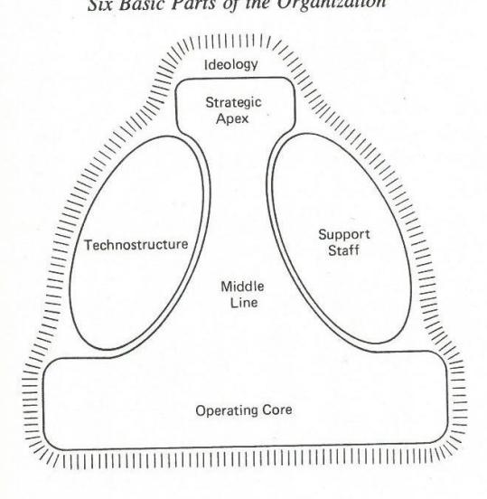

In addition, as shown in Figure 6–2, various outside people also try to exert influence on the organization, seeking to affect the decisions and actions taken inside. These external influencers, shown in Figure 6–2 as creating a field of forces around the organization, can include owners, unions and other employee associations, suppliers, clients, partners, competitors, and all kinds of publics, in the form of governments, special interest groups, and so forth. Together they can all be thought to form an external coalition.

Sometimes the external coalition is relatively *passive* (as in the typical behavior of the shareholders of a widely held corporation or the members of a large union). Other times it is *dominated* by one active influencer or some group of them acting in concert (such as an outside owner of a business firm or a community intent on imposing a certain philosophy on its school system). And in still other cases, the external coalition may be *divided*, as different groups seek to impose contradictory pressures on the organization (as in a prison buffeted between two community groups, one favoring custody, the other rehabilitation).

FIGURE 6–2
Internal and External Influencers of an Organization

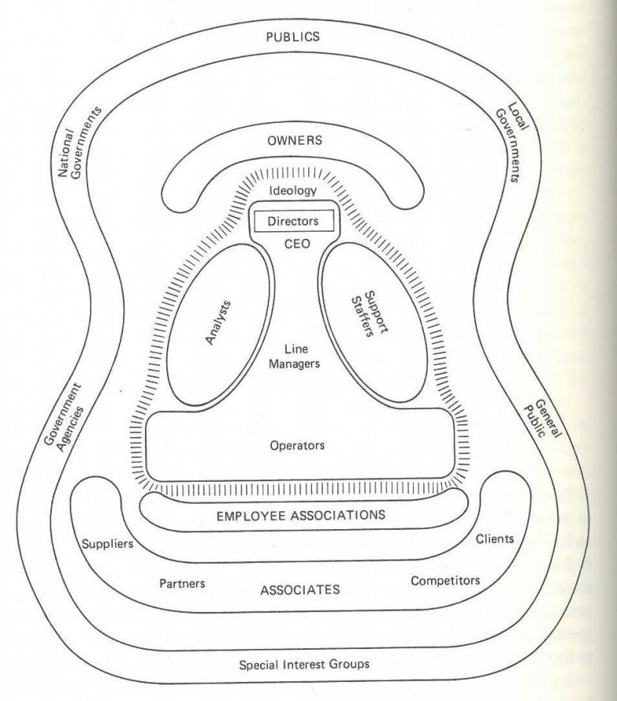

# THE ESSENCE OF ORGANIZATIONAL STRUCTURE

Every organized human activity—from the making of pottery to the placing of a man on the moon—gives rise to two fundamental and opposing requirements: the *division of labor* into various tasks to be performed and the *coordination* of those tasks to accomplish the activity. The structure of an organization can be defined simply as the total of the ways

in which its labor is divided into distinct tasks and then its coordination achieved among those tasks.

## COORDINATING MECHANISMS

A number of coordinating mechanisms seem to describe the fundamental ways in which organizations can coordinate their work, shown in Figure 6–3 and listed below.

- Mutual adjustment, which achieves coordination by the simple process of informal communication (as between two operating employees)
- 2. Direct supervision, in which coordination is achieved by having one person issue orders or instructions to several others whose work interrelates (as when a boss tells others what is to be done, one step at a time)
- 3. Standardization of work processes, which achieves coordination by specifying the work processes of people carrying out interrelated tasks (those standards usually being developed in the technostructure to be carried out in the operating core, as in the case of the work instructions that come out of time-and-motion studies)
- 4. Standardization of outputs, which achieves coordination by specifying the results of different work (again usually developed in the technostructure, as in a financial plan that specifies subunit performance targets or specifications that outline the dimensions of a product to be produced)
- 5. Standardization of skills (as well as knowledge), in which different work is coordinated by virtue of the related training the workers have received (as in medical specialists—say a surgeon and an anesthetist in an operating room—responding almost automatically to each other's standardized procedures)
- 6. Standardization of norms, in which it is the norms infusing the work that are controlled, usually for the entire organization, so that everyone functions according to the same set of beliefs (as in a religious order)

These coordinating mechanisms can be considered the most basic elements of structure, the glue that holds organizations together. They seem to fall into a rough order: As organizational work becomes more complicated, the favored means of coordination seems to shift from mutual adjustment (the simplest mechanism) to direct supervision, then

# FIGURE 6–3 The Coordinating Mechanisms

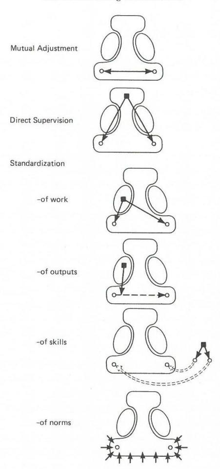

to standardization, preferably of work processes or norms, otherwise of outputs or of skills, finally reverting back to mutual adjustment (paradoxically also the mechanism best able to deal with the most complex forms of work).

No organization, of course, can rely on a single one of those mechanisms. The mechanisms may be somewhat substitutable for each other, but all will typically be found in every reasonably developed organization. In particular, mutual adjustment and direct supervision are almost always important, no matter what use is made of the various forms of standardization. Contemporary organizations simply cannot exist without leadership and informal communication, even if only to override the rigidities of standardization.

But the important point for us here is that many organizations do favor one mechanism over the others, at least at certain stages of their lives. In fact, organizations that favor none seem most prone to becoming politicized, simply because of the conflicts that naturally arise when people have to vie for influence in a relative vacuum of power (bearing in mind, for example, that little use of direct supervision means a weak system of authority, little use of standardization of norms means a weak ideology, and so on).

#### DESIGN PARAMETERS

The essence of organizational design is the manipulation of a series of parameters that determine the division of labor and the achievement of coordination. Some of these concern the design of individual positions, others the design of the superstructure (the overall network of subunits, reflected in the organizational chart), some the design of lateral linkages to flesh out that superstructure, and a final group concerns the design of the decision-making system of the organization. Listed below are the main parameters of structural design, with links to the coordinating mechanisms.

- Job specialization refers to the number of tasks in a given job and the worker's control over these tasks. A job is horizontally specialized to the extent that it encompasses a few narrowly defined tasks, vertically specialized to the extent that the worker lacks control of the tasks performed. Unskilled jobs are typically highly specialized in both dimensions; skilled or professional jobs are typically specialized horizontally but not vertically. "Job enrichment" refers to the enlargement of jobs in both the vertical and horizontal dimensions.
  - Behavior formalization refers to the standardization of work processes by the imposition of operating instructions, job descriptions,

rules, regulations, and the like. Structures that rely on any form of standardization for coordination may be defined as bureaucratic, those that do not as organic.

- Training refers to the use of formal instructional programs to establish and standardize in people the requisite skills and knowledge to do particular jobs in organizations. Training is a key design parameter in all work we call professional. Training and formalization are basically substitutes for achieving the standardization (in effect, the bureaucratization) of behavior. In one, the standards are learned as skills, in the other they are imposed on the job as rules.
- Indoctrination refers to programs and techniques by which the norms of the members of an organization are standardized, so that they become responsive to its ideological needs and can thereby be trusted to make its decisions and take its actions. Indoctrination too is a substitute for formalization, as well as for skill training, in this case the standards being internalized as deeply rooted beliefs.
- Unit grouping refers to the choice of the bases by which positions are grouped together into units, and those units into higher-order units. Grouping encourages coordination by putting different jobs under common supervision, by requiring them to share common resources and achieve common measures of performance, and by facilitating mutual adjustment among them. The various bases for grouping—by work process, product, client, area, and so on can be reduced to two fundamental ones—the function performed and the market served. The former refers to a single link in the chain of processes by which products or services are produced, the latter to the whole chain for specific end products.
- Unit size refers to the number of positions (or units) contained in a single unit. The equivalent term, span of control, is not used here, because sometimes units are kept small despite an absence of close supervisory control. For example, when experts coordinate extensively by mutual adjustment, as in an engineering team in a space agency, they will form into small teams. In this case, unit size is small and span of control is low despite a relative absence of direct supervision. In contrast, when work is highly standardized (because of either formalization or training), unit size can be very large, because there is little need for direct supervision. One foreman can supervise dozens of assemblers, because they work according to very tight instructions.

Planning and control systems are used to standardize outputs. They may be divided into two types: action planning systems, which specify the results of specific actions before they are taken (for example, that holes should be drilled with diameters of 3 centimeters); and performance control systems, which specify the desired results of whole ranges of actions after the fact (for example, that sales of a division should grow by 10 percent in a given year).

Liaison devices refer to a whole series of mechanisms used to encourage mutual adjustment within and between units. They range from liaison positions (such as the purchasing engineer who stands between purchasing and engineering), through task forces and integrating managers (such as brand managers), finally to fully devel-

oped matrix structures.

 Decentralization refers to the diffusion of decision-making power. When all the power rests at a single point in an organization, we call its structure centralized; to the extent that the power is dispersed among many individuals, we call it relatively decentralized. We can distinguish vertical decentralization—the delegation of formal power down the hierarchy to line managers—from horizontal decentralization—the extent to which formal or informal power is dispersed out of the line hierarchy to nonmanagers (operators, analysts, and support staffers). We can also distinguish selective decentralization—the dispersal of power over different decisions to different places in the organization—from parallel decentralization—where the power over various kinds of decisions is delegated to the same place. Six forms of decentralization may thus be described: (1) vertical and horizontal centralization, where all the power rests at the strategic apex; (2) limited horizontal decentralization (selective), where the strategic apex shares some power with the technostructure that standardized everybody else's work; (3) limited vertical decentralization (parallel), where managers of market-based units are delegated the power to control most of the decisions concerning their line units; (4) vertical and horizontal decentralization, where most of the power rests in the operating core, at the bottom of the structure; (5) selective vertical and horizontal decentralization, where the power over different decisions is dispersed to various places in the organization, among managers, staff experts, and operators who work in teams at various levels in the hierarchy; and (6) pure decentralization, where power is shared more or less equally by all members of the organization.

#### STRUCTURE IN CONTEXT

A number of "contingency" or "situational" factors influence the choice of these design parameters, and vice versa. They include the age and size of the organization; its technical system of production; various characteristics of its environment, such as stability and complexity; and its power system, for example, whether or not it is tightly controlled by outside influencers. Some of the effects of these factors, as found in an extensive body of research literature, are summarized below as hypotheses.

#### AGE AND SIZE

- The older an organization, the more formalized its behavior. What we have here is the "we've-seen-it-all-before" syndrome. As organizations age, they tend to repeat their behaviors: as a result, these become more predictable and so more amenable to formalization.
- The larger an organization, the more formalized its behavior. Just as the older organization formalizes what it has seen before, so the larger organization formalizes what it sees often. ("Listen mister, I've heard that story at least five times today. Just fill in the form like it says.")
- The larger an organization, the more elaborate its structure; that is, the more specialized its jobs and units and the more developed its administrative components. As organizations grow in size, they are able to specialize their jobs more finely. (The big barbershop can afford a specialist to cut children's hair; the small one cannot.) As a result, they can also specialize—or "differentiate"—the work of their units more extensively. This requires more effort at coordination. And so the larger organization tends also to enlarge its hierarchy to effect direct supervision and to make greater use of its technostructure to achieve coordination by standardization, or else to encourage more coordination by mutual adjustment.
- Structure reflects the age of the industry from its founding. This is a curious finding, but one that we shall see holds up remarkably well. An organization's structure seems to reflect the age of the industry in which it operates, no matter what its own age. Industries that predate the industrial revolution seem to favor one kind of structure,

those of the age of the early railroads another, and so on. We should obviously expect different structures in different periods; the surprising thing is that these structures seem to carry through to new periods, old industries remaining relatively true to earlier structures.

#### TECHNICAL SYSTEM

Technical system refers to the instruments used in the operating core to produce the outputs. (This should be distinguished from "technology," which refers to the knowledge base of an organization.)

- The more regulating the technical system—that is, the more it controls the work of the operators—the more formalized the operating work and the more bureaucratic the structure of the operating core. Technical systems that regulate the work of the operators—for example, mass production assembly lines—render that work highly routine and predictable, and so encourage its specialization and formalization, which in turn create the conditions for bureaucracy in the operating core.
- The more complex the technical system, the more elaborate and professional the support staff. Essentially, if an organization is to use complex machinery, it must hire staff experts who can understand that machinery—who have the capability to design, select, and modify it. And then it must give them considerable power to make decisions concerning that machinery, and encourage them to use the liaison devices to ensure mutual adjustment among them.
- The automation of the operating core transforms a bureaucratic administrative structure into an organic one. When unskilled work is coordinated by the standardization of work processes, we tend to get bureaucratic structure throughout the organization, because a control mentality pervades the whole system. But when the work of the operating core becomes automated, social relationships tend to change. Now it is machines, not people, that are regulated. So the obsession with control tends to disappear—machines do not need to be watched over—and with it go many of the managers and analysts who were needed to control the operators. In their place come the support specialists to look after the machinery, coordinating their own work by mutual adjustment. Thus, automation reduces line authority in favor of staff expertise and reduces the tendency to rely on standardization for coordination.

#### **ENVIRONMENT**

Environment refers to various characteristics of the organization's outside context, related to markets, political climate, economic conditions, and so on.

- · The more dynamic an organization's environment, the more organic its structure. It stands to reason that in a stable environment when nothing changes—an organization can predict its future conditions and so, all other things being equal, can easily rely on standardization for coordination. But when conditions become dynamic-when the need for product change is frequent, labor turnover is high, and political conditions are unstable—the organization cannot standardize but must instead remain flexible through the use of direct supervision or mutual adjustment for coordination, and so it must use a more organic structure. Thus, for example, armies, which tend to be highly bureaucratic institutions in peacetime, can become rather organic when engaged in highly dynamic, guerilla-type warfare.
- The more complex an organization's environment, the more decentralized its structure. The prime reason to decentralize a structure is that all the information needed to make decisions cannot be comprehended in one head. Thus, when the operations of an organization are based on a complex body of knowledge, there is usually a need to decentralize decision-making power. Note that a simple environment can be stable or dynamic (the manufacturer of dresses faces a simple environment vet cannot predict style from one season to another), as can a complex one (the specialist in perfected open heart surgery faces a complex task, yet knows what to expect).
- The more diversified an organization's markets, the greater the propensity to split it into market-based units, or divisions, given favorable economies of scale. When an organization can identify distinct markets-geographical regions, clients, but especially products and services—it will be predisposed to split itself into high-level units on that basis, and to give each a good deal of control over its own operations (that is, to use what we called "limited vertical decentralization"). In simple terms, diversification breeds divisionalization. Each unit can be given all the functions associated with its own markets. But this assumes favorable economies of scale: If the operating core cannot be divided, as in the case of an aluminum smelter, also if some critical function must be centrally coordinated, as in purchasing in a retail chain, then full divisionalization may not be possible.

· Extreme hostility in its environment drives any organization to centralize its structure temporarily. When threatened by extreme hostility in its environment, the tendency for an organization is to centralize power, in other words, to fall back on its tightest coordinating mechanism, direct supervision. Here a single leader can ensure fast and tightly coordinated response to the threat (at least temporarily).

#### POWER

- The greater the external control of an organization, the more centralized and formalized its structure. This important hypothesis claims that to the extent that an organization is controlled externally, for example by a parent firm or a government that dominates its external coalition—it tends to centralize power at the strategic apex and to formalize its behavior. The reason is that the two most effective ways to control an organization from the outside are to hold its chief executive officer responsible for its actions and to impose clearly defined standards on it. Moreover, external control forces the organization to be especially careful about its actions.
- A divided external coalition will tend to give rise to a politicized internal coalition, and vice versa. In effect, conflict in one of the coalitions tends to spill over to the other, as one set of influencers seeks to enlist the support of the others.
- Fashion favors the structure of the day (and of the culture), sometimes even when inappropriate. Ideally, the design parameters are chosen according to the dictates of age, size, technical system, and environment. In fact, however, fashion seems to play a role too, encouraging many organizations to adopt currently popular design parameters that are inappropriate for themselves. Paris has its salons of haute couture; likewise New York has its offices of "haute structure," the consulting firms that sometimes tend to oversell the latest in structural fashion.

# BASIC TYPES OF ORGANIZATIONS

We have now introduced various attributes of organizations—parts, coordinating mechanisms, design parameters, situational factors. How do they all combine?

For years, the literature of management promoted the "one best way"; it largely still does. A good structure was one with a rigid hierarchy of authority, spans of control no greater than six, heavy use of strategic planning, and so on. In the 1960s, organizational theory developed the contingency approach—"it all depends"—characterized by the situational hypotheses we have just presented. Organizations were to pick their attributes independently, but according to context, much as diners pick their food at a buffet table. As discussed earlier, we have come to favor a third approach, which we characterize as "getting it all together"—the configuration approach. The elements of structure, even those of situation, should be selected to achieve consistency.

Our basic premise here is that a limited number of configurations can help explain much of what can be observed in organizations. We have introduced in our discussion six basic parts of the organization, six basic mechanisms of coordination, as well as six basic types of decentralization. In fact, there seems to be a fundamental correspondence between all of these sixes, which can be explained by a set of pulls exerted on the organization by each of its six parts, as shown in Figure 6–4. When conditions favor one of these pulls, the organization is drawn to design itself as a particular configuration. We list below and then introduce briefly the six resulting configurations, together with a seventh that tends to appear when no one pull or part dominates.

| Configuration                | Prime Coordinating Mechanism | Key Part of Organization | Type of Decen- tralization          |
|------------------------------|------------------------------------|-----------------------------|-------------------------------------------|
| Entrepreneurial organization | Direct supervision                 | Strategic apex              | Vertical and horizontal centralization    |
| Machine organization         | Standardization of work processes  | Technostructure             | Limited horizontal decentralization |
| Professional organization    | Standardization of skills          | Operating core              | Horizontal decentralization               |
| Diversified organization     | Standardization of outputs         | Middle line                 | Limited vertical decentralization         |
| Innovative organization      | Mutual adjustment                  | Support staff               | Selected decentralization                 |
| Missionary organization      | Standardization of norms           | Ideology                    | Decentralization                          |
| Political organization       | None                               | None                        | Varies                                    |

FIGURE 6–4
Basic Pulls on the Organization

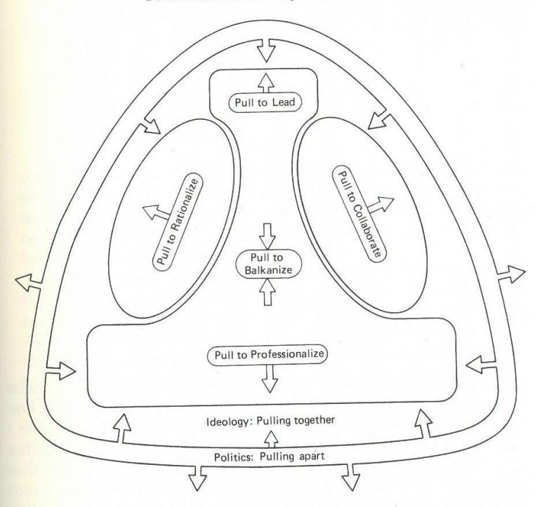

- The strategic apex exerts a pull to *lead*, by which it retains control over decision-making, with coordination achieved by direct supervision. When the organization cedes to this pull, often due to an overriding need for strategic vision, the centralized configuration called *entrepreneurial* results. As shown in Figure 6–5, the strategic apex sits over the operating core directly, with little else in the way of line managers or staff specialists.
- The technostructure exerts its pull to *rationalize*, ideally through the standardization of work processes, encouraging only limited horizontal decentralization (which empowers itself). Organizations that cede to this pull, usually due to an overriding need for routine efficiency, take on the *machine* configuration, shown in Figure 6–6 with a fully elaborated line and staff structure concentrated on controlling and

FIGURE 6–5
The Entrepreneurial Organization

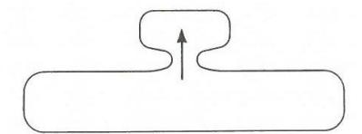

FIGURE 6–6
The Machine Organization

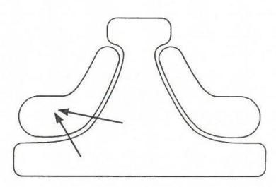

protecting the operating core. (Machine organizations that rationalize on behalf of a dominant external constituency may be called *instruments*; those on behalf of their own administrators, *closed systems*.)

- In their search for autonomy, the managers of the middle line exert a pull to *balkanize* the structure, to concentrate power in their own units through only limited (and parallel) vertical decentralization to themselves. When the organization cedes to this pull, generally by dividing itself into distinct units in order to serve different markets effectively, restricting itself to controlling the performance of those units largely through the standardization of outputs, the *diversified* configuration results. As indicated in Figure 6–7, a small strategic apex at "headquarters" supported by small staff units oversees a set of divisions usually structured as machine configurations (for reasons to be explained later).
- The members of the operating core exert a pull to *professionalize*, in order to minimize the influence that others, colleagues as well as line and technocratic administrators, have over their work. When the organization cedes to this pull, generally due to an overriding need to perfect expert programs, the *professional* configuration results, with full horizontal and vertical decentralization of power to the operating

FIGURE 6–7
The Diversified Organization

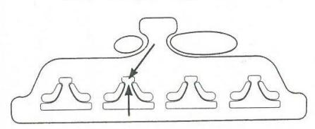

core, with coordinating achieved largely through the standardization of knowledge and skills. As shown in Figure 6–8, the organization has only a small technostructure and middle line, since there is little need for administrative control. But it has a large support staff to back up its high-priced professionals.

- The support staff exerts a pull to *collaborate* in order to involve itself in the central activity of the organization. The organization that has need for sophisticated innovation must usually cede to this pull, welding staff and line, and sometimes operating personnel as well, into multidisciplinary teams of experts that achieve coordination within and between themselves through mutual adjustment. The organization takes on the *innovative* configuration, shown in Figure 6–9, with many of the distinctions of conventional organizations falling away, as its various parts meld into a single system of vertical and horizontal decentralization on a selective basis.
- Ideology exists primarily as a force in organizations of other types, encouraging their members to *pull together*, as shown in Figure 6–10. But sometimes it too can dominate, as the standardization of norms becomes the prime coordinating mechanism. Then the organization takes on the *missionary* configuration, achieving the purest form of decentralization, as each member is trusted to decide and act for the overall good of the organization.

FIGURE 6–8
The Professional Organization

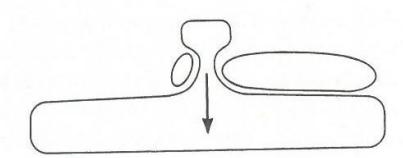

FIGURE 6–9
The Innovative Organization

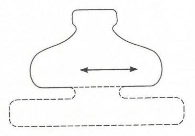

FIGURE 6–10
The Missionary Organization

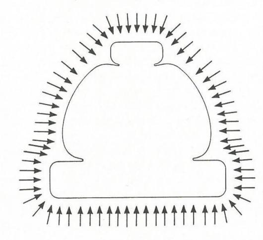

• Finally, politics also exists in organizations of other types, the force of conflict that causes people to *pull apart*, as shown in Figure 6–11. But it too can sometimes dominate, especially when no one part of the organization and no one mechanism of coordination is dominant. Then the organization takes on the *political* configuration, with no stable form of centralization or decentralization.

Together these configurations, as well as the pulls and needs represented by each, seem to encompass and integrate a good deal of what we

FIGURE 6–11
The Political Organization

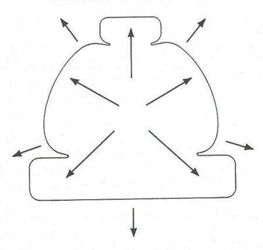

know about organizations. It should be emphasized that, as presented, each configuration is idealized—a simplification, really a caricature of reality. No real organization is ever exactly like any one of them. But some do come remarkably close, while others seem to reflect combinations of them, sometimes in transition from one to another.

Individually then, these configurations reflect leading tendencies in organizations, while collectively they seem to define the boundaries of a space within which real organizations may be considered to lie. In order to map a space, however, the boundaries must first be identified. Thus we begin by describing, in the seven chapters that follow, each of the configurations. Then, in a final chapter we can consider the whole space, by using the framework of the seven to describe the many and varied forms that real-world organizations seem to take.