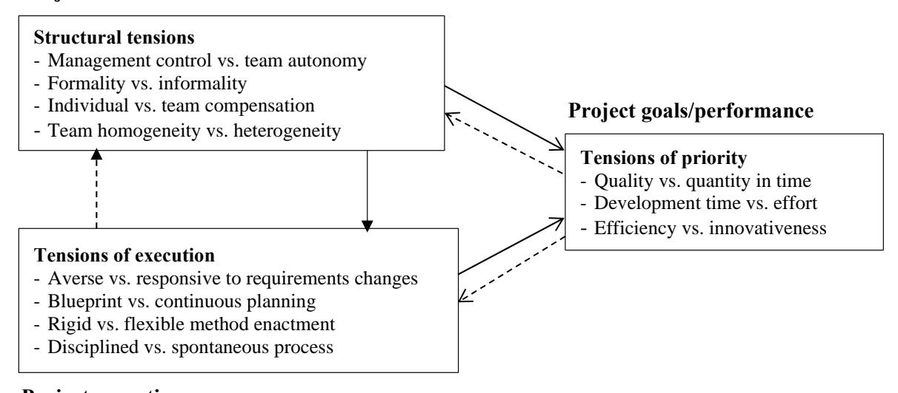
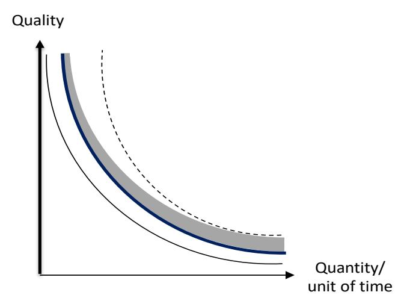
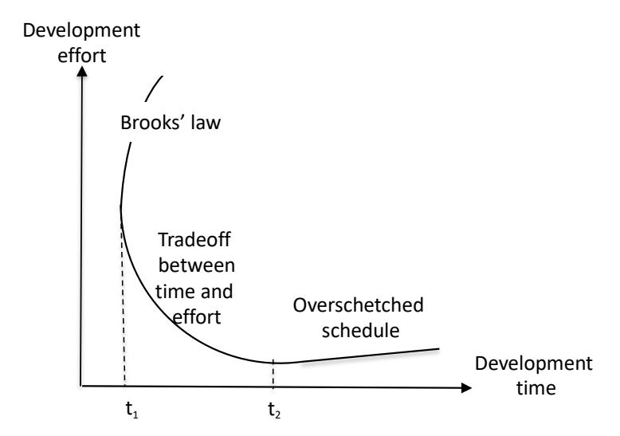
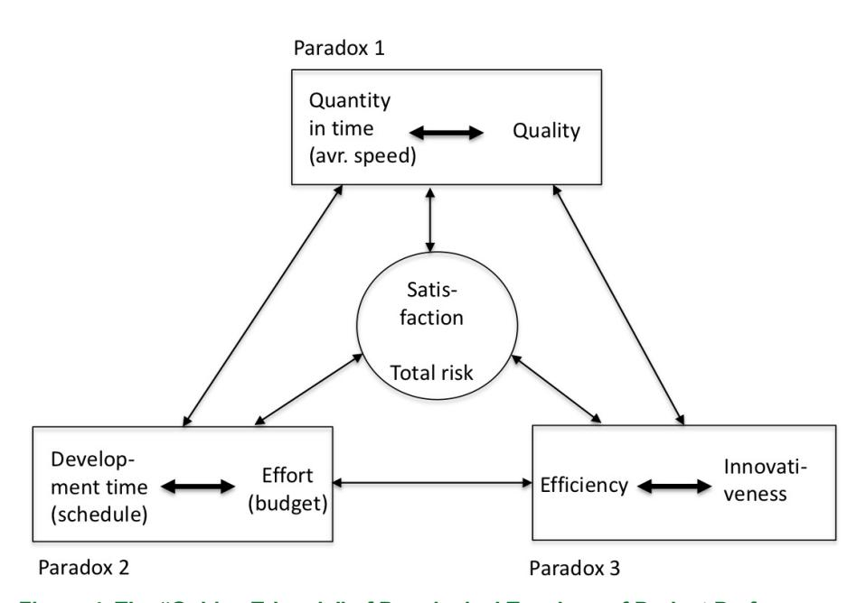
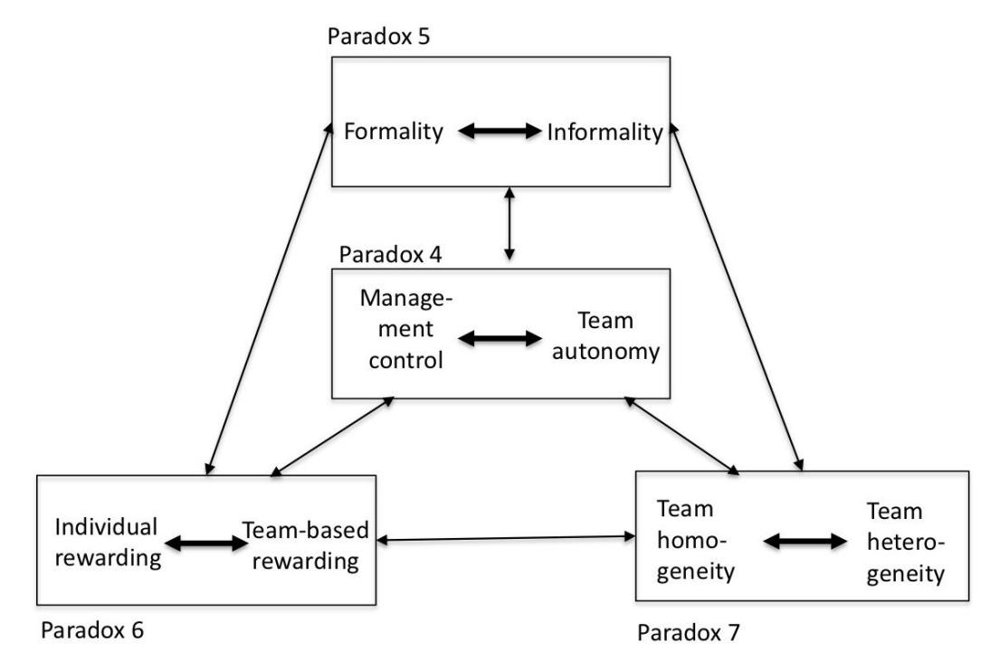
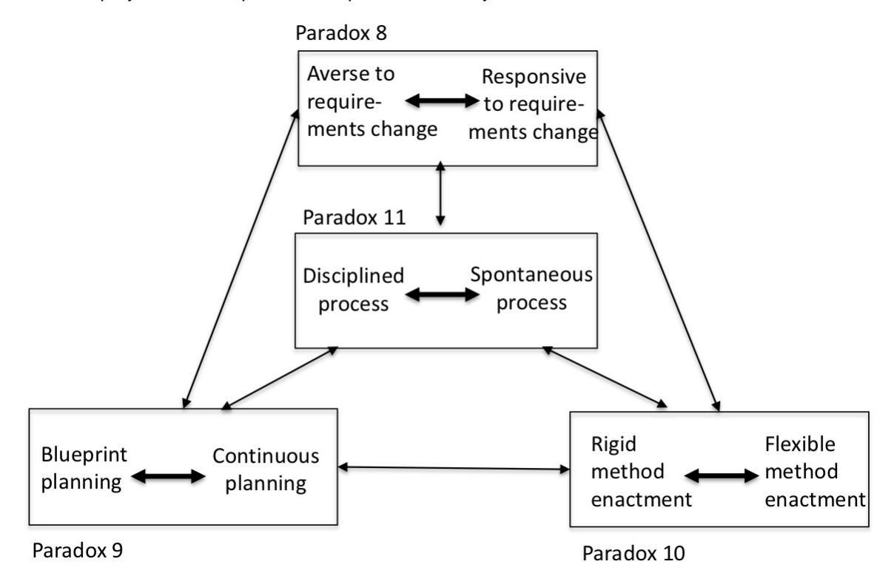

## [Communications of the Association for Information Systems](https://aisel.aisnet.org/cais)

[Volume 49](https://aisel.aisnet.org/cais/vol49) [Article 4](https://aisel.aisnet.org/cais/vol49/iss1/4) 

7-28-2021

# A Paradox Lens t x to Systems De o Systems Development Pr elopment Projects: The Case of ojects: The of the Agile Software Development

Juhani Iivari University of Oulu, juhani.iivari@oulu.fi

Follow this and additional works at: [https://aisel.aisnet.org/cais](https://aisel.aisnet.org/cais?utm_source=aisel.aisnet.org%2Fcais%2Fvol49%2Fiss1%2F4&utm_medium=PDF&utm_campaign=PDFCoverPages)

#### Recommended Citation

Iivari, J. (2021). A Paradox Lens to Systems Development Projects: The Case of the Agile Software Development. Communications of the Association for Information Systems, 49, pp-pp. [https://doi.org/](https://doi.org/10.17705/1CAIS.04901) [10.17705/1CAIS.04901](https://doi.org/10.17705/1CAIS.04901) 

This material is brought to you by the AIS Journals at AIS Electronic Library (AISeL). It has been accepted for inclusion in Communications of the Association for Information Systems by an authorized administrator of AIS Electronic Library (AISeL). For more information, please contact [elibrary@aisnet.org.](mailto:elibrary@aisnet.org%3E)

Research Article DOI: 10.17705/1CAIS.04901 ISSN: 1529-3181

# **A Paradox Lens to Systems Development Projects: The Case of the Agile Software Development**

#### **Juhani Iivari**

University of Oulu, Finland Juhani.iivari@oulu.fi

#### **Abstract:**

Research into organizations has concluded that organizational effectiveness is paradoxical (i.e., effective organizations must have simultaneously contradictory, even mutually exclusive, attributes). Although systems development projects constitute temporary organizations, researchers have largely omitted the paradox lens in their context. In this paper, I move toward rectifying the situation by focusing specifically on the agile software development (ASD) as a timely systems development approach in practice. I identify 11 interrelated and actable paradoxical tensions concerning the priority, structure, and execution of systems development projects. Each tension imposes competing demands on projects. To address them requires human ingenuity and judgement, though systems development methods and approaches can provide aid. I show that ASD comprises mechanisms for that purpose largely due to the reflective nature of the ASD process in which each retrospective assesses what went well in the previous sprint (iteration) and what could be improved in the next sprint. At the same time, ASD has built-in flexibility that makes it possible to adapt the method-in-use when deemed necessary or reasonable.

**Keywords:** Information Systems Development, Software Development, Agile Software Development, Paradox Lens, Ambidexterity.

This manuscript underwent editorial review. It was received 06/08/2020 and was with the authors for four months for two revisions. Andreas Drechsler served as Associate Editor.

## 1 **Introduction**

The paradox lens has aroused significant interest in organization studies (e.g., Cameron, 1986; Smith & Lewis, 2011; Fairhurst et al., 2016; Smith, Erez, Jarvenpaa. Lewis, & Tracey, 2017; Schad, Lewis, & Smith, 2018). Cameron (1986) argued that organizational effectiveness is inherently paradoxical: "To be effective, an organization must possess attributes that are simultaneously contradictory, even mutually exclusive" (pp. 544-545). Recognizing that information systems and software development (i.e., "systems development") projects constitute temporary organizations (Lundin & Söderholm, 1995; Packendorff, 1995), one could expect the paradox lens to be of interest in their contexts as well. Yet, as I discuss below, it has received scant attention in prior research on systems development.

In this paper, I adopt the paradox lens to understand systems development projects and specifically agile software development (ASD) projects. My focus lies in sets (n > 1) of co-existing paradoxical tensions rather than on a single tension. This focus separates this paper from the ambidexterity perspective that IS research has fairly extensively applied (Werder & Heckman, 2019). The literature on ambidexterity (which refers to the ability to both exploit and explore) typically focuses on a single tension between exploitation and exploration (or alternatively alignment and adaptability).

ASD refers to a class of software development methods that build on the idea of frequently, incrementally, and/or iteratively delivering working software while being responsive to changing customer requirements. I view ASD as a whole, as a systems development approach, rather than focusing on its specific methods (Iivari, Hirschheim, & Klein, 2004). As the dominant systems development approach in practice, ASD also provides a timely view of systems development in practice (Stavru, 2014). It has also received considerable attention in research.

I wrote this paper for three purposes. First, drawing on the paradox lens developed in organization theory, I make readers cognizant of the paradoxical nature of systems development projects. One needs cognizance for deliberate action to address paradoxical tensions in practice. Second, I identify 11 concrete paradoxical tensions in systems development projects, including ASD projects, and organize them into three groups: priority tensions, structure tensions, and execution tensions. Opposing and balancing "discipline" and "agility" exemplifies one such tension (Boehm & Turner, 2004). However, I contend that systems development projects entail many other paradoxical tensions that one should consider. Third and most concretely, I analyze how ASD helps practitioners to address the 11 tensions. With that said, I contend that all systems development (and not just ASD) inherently involves the suggested tensions1 . I examine ASD because it represents an interesting case due to its reflective nature (Beck et al., n.d.) and provide mechanisms to address central paradoxical systems development tensions2 .

With this paper, I make both theoretical and practical contributions. As for the theoretical contribution, the concrete paradoxical tensions provide new insight into systems development's complexity and difficulty (Brooks, 1987). Since research into systems development has largely omitted the paradox perspective, the proposed tensions may also provide avenues for future research. As for practical implications, I identify tensions with sufficient concreteness to allow practitioners to also recognize them, persistent so that practitioners face them constantly, and actable so that practitioners can address them. More concretely, the priority tensions lead to a "golden triangle" of paradoxical tensions in systems development for evaluating project performance, and the 11 tensions as whole provide a diagnostic framework for retrospectives to evaluate after each sprint what went well and worked well in the previous sprint and what could be improved in the next sprint.

This assumption implies that it is not so essential for the existence of the 11 paradoxical tensions how faithfully a systems development project follows ASD principles and practices or whether it applies a hybrid method that mixes ASD elements with other systems development approaches. The mechanisms to address the tensions may, however, differ depending on methods that a project uses.

2 Systems development's reflective nature as such does not represent a new idea. Iivari and Koskela (1987) introduced it as a contrast to unreflectively obeying a specific detailed systems development method. Fowler and Highsmith (2001) explain in a similar way the reflective nature of ASD in pointing out the ASD approach does not assume that projects will follow its methods slavishly. Mathiassen (1998) introduced a systems development approach named "reflective systems development" primarily based on Schön (1983). Later, researchers introduced Schön's ideas—independently of Mathiassen according to the citations—to the ASD context (e.g., Nerur & Balijepally, 2007; Babb, Hoda, & Nørbjerg, 2014). In their own ways, Iivari and Koskela's (1987) and Mathiassen's (1998) approaches represent deviant ones when compared with traditional waterfall-like methods.

In this paper, I examine ASD broadly in terms of the three paradoxical tension categories. Therefore, I cannot cover the entire ASD literature. In addition to the prescriptive literature on ASD, I consider the empirical literature on how ASD appears in practice3 . Due to my wide scope, I use recent systematic literature reviews as far as available. Keeping in mind that I focus on arguing systems development (including ASD) contains paradoxical tensions, I focus on literature that evidences their existence rather than on literature that shows the opposite.

## 2 **Theoretical Background and Prior Research**

### 2.1 **Paradox Lens as a Meta-perspective**

Due to the higher volatility, uncertainty, and ambiguity that contemporary business environments exhibit, organizations today face increasingly complexity that pulls them in multiple, competing directions (Jules & Good, 2014). Scholars have introduced the paradox lens to understand such competing tensions (Smith & Lewis, 2011).

The paradox lens is not a theory but a meta-perspective or meta-theory. Cameron (1986) interpreted a paradox as:

*An idea involving two opposing thoughts or propositions which, however contradictory, are equally necessary to convey a more imposing, illuminating, life-related or provocative insight into truth than either factor can muster in its own right*. (p. 545)

The Oxford English Dictionary provides several definitions for the word "paradox" ("Paradox", n.d.). Two definitions seem most relevant here: 1) "An apparently absurd or self-contradictory statement or proposition, or a strongly counter-intuitive one, which investigation, analysis, or explanation may nevertheless prove to be well-founded or true" and 2) "A proposition or statement that is (taken to be) actually self-contradictory, absurd, or intrinsically unreasonable".

Paradoxes closely relate to terms such as dilemmas, dualities, dialectics, contradictions, and tensions. Cameron (1986) noted that a paradox differs in nature from that a dilemma, which people often use synonymously. Smith and Lewis (2011) distinguished between paradoxes, dilemmas, and dialectics. They suggested that a paradox denotes "contradictory yet interrelated elements (dualities) that exist simultaneously and persist over time; such elements seem logical when considered in isolation, but irrational, inconsistent, and absurd when juxtaposed" (p. 387). On the other hand, they defined a dilemma as comprising "competing choices, each with advantages and disadvantages", and dialectics refers to "contradictory elements (thesis and antithesis) resolved through integration (synthesis), which, over time, will confront new opposition" (p. 387).

I do not consider terminological choices essential here. However, since the literature on the paradox meta-perspective interprets paradox in quite a stringent way, I prefer to speak about paradoxical tensions rather than paradoxes. The tensions that I introduce in this paper are not necessarily counter-intuitive, absurd, and intrinsically unreasonable enough for one to consider them genuine paradoxes. Contrary to Fairhurst et al. (2016), I also include tradeoffs among paradoxical tensions4 . However, the paradox lens implies that organizations treat the competing demands of dilemmas and tradeoffs not as either/or choices but as both/and choices (i.e., simultaneously) (Smith & Lewis, 2011).

The ambidexterity perspective (O'Reilly & Tushman, 2013; Turner, Swart, & Maylor, 2013) relates closely to the paradox perspective. The literature on ambidexterity typically focuses on a single tension between exploitation and exploration (March, 1991) or alternatively between alignment and adaptability. Here, ambidexterity refers to the ability to both exploit and explore. Researchers commonly distinguish between three forms of ambidexterity: structural or simultaneous ambidexterity, sequential or temporal ambidexterity, and contextual ambidexterity. In structural ambidexterity, an organizational establishes separate autonomous units to simultaneously pursuit exploration and exploitation. In sequential ambidexterity, an organization separates exploration and exploitation temporally. Finally, contextual

I do not attempt to assess to what extent papers on ASD in practice reflect "pure" ASD and to what extent hybrid thinking comprising ASD and ideas from other systems development approaches.

4 Note, however, that the literature that introduces the paradox meta-theory or applies it mentions some paradoxical tensions that I introduce in Section 3: for example, control versus autonomy (Maalouf & Gammelgaard, 2016), formal versus informal (Zheng , Venters, & Cornford, 2011). The efficiency versus flexibility paradox (Smith & Lewis, 2011) closely resembles the tension between efficiency and innovativeness.

ambidexterity relies on organizational members. Organizations achieve it by building an organizational context that supports and encourages the members to make their own decisions about how to use their time for exploration and exploitation (O'Reilly & Tushman, 2013; Turner et al., 2013).

Since each phenomenon analyzed through the paradox lens may have its own paradoxes, I do not take stock of all organizational and related paradoxes that the literature has identified but focus on the paradox lens in research into systems development.

#### 2.2 The Conceptual Framework for Paradoxical Tensions of Systems Development

Smith and Lewis (2011) have suggested a framework for organizational tensions that one can use to identify organizational paradoxes. The framework distinguishes paradoxes about belonging, learning, organizing, and performing. I do not directly apply their framework but I prefer to start with the "anatomy" of projects. The framework suggested below overlaps, however, with the last three categories of paradoxes in Smith and Lewis (2011).

The project management literature (either implicitly or explicitly) commonly distinguishes between project objectives/goals, project structure, and project execution. For example, the Guide to Project Management Body of Knowledge (PMBOK) (Project Management Institute 2017) explicitly identifies project objectives (cost, time, quality) and project execution ("directing, managing, performing, and accomplishing the project work; providing the deliverables, and providing the work performance information"). While the literature has not as commonly referred to the project structure concept, when considering projects as temporary organizations (Lundin & Söderholm, 1995; Packendorff 1995), one can naturally assume that they also have structures (van Donk & Molloy, 2008); that is, "formal and semiformal means...that organizations use to divide and coordinate their work to establish stable patterns of behaviour" (Mintzberg 1979, p. 66)5. One can identify such means even in fairly simple projects.

As a consequence, one can distinguish between three groups of paradoxical tensions: those concerning project goals and performance (priority tensions), those concerning project structure (structural tensions), and those concerning the project-execution process (execution tensions). Figure 1 depicts the framework.

#### **Project structure**

**Project execution process** 

Figure 1. The Conceptual Framework of Paradoxical Tensions in Systems Development

Volume 49 10.17705/1CAIS.04901 Paper 1

&lt;sup>5 I use this connection between organizations and projects as temporary organizations later in the paper without further explanation as a justification for applying various concepts that I adopted from organization studies to projects.

Priority tensions deal with the significance and attention imposed on alternative or complementary systems development goals. The tensions that I identify in Figure 1 extend the traditional project goals (cost, time, quality) in project management (e.g., Atkinson, 1999; Gardiner & Stewart, 2000). I explain these extensions in detail in Section 3.4. The first and third priority tensions come from Hage (1980) who suggested them as fundamental problems of organizational effectiveness. The literature on software project management clearly recognizes the tension between development time and development effort (e.g., Boehm, 1981).

The four structural tensions reflect organizations' classical structural characteristics: centralization of power, formalization of work, stratification of rewards, and organizational complexity (Hage, 1980). Centralization refers to the degree to which power is concentrated in the hands of relatively few individuals (i.e., to degree to which the elite versus the entire personnel make decisions (especially strategic ones)); formalization refers to the degree to which an organization codifies rules, procedures, and regulations; organizational complexity refers to the concentration and diversity of different specialists in an organization (according to specialization, differentiation, and professionalism (Damanpour, 1991)); and stratification describes the degree to which rewards and other benefits concentrate in specific groups relative to other groups (Hage, 1980; Rogers, 1995). The contrast between disciplined and agility in Boehm and Turner's (2004) inspired me to identify the four execution tensions.

Figure 1 suggests that the project goals/performance, structure, and execution form a mutually interacting system. The solid arrows depict the "real process" of how the project structure affects the execution process and how both affect project performance. The dotted arrows describe the reverse feedforward and feedback processes of how the project goals (and later project performance and related discrepancies) guide the project structure and project execution. In a similar way, the experience from the execution process may lead to deliberate structural changes. I discuss each tension in detail in Sections 3 to 5.

#### 2.3 **Prior Research on Paradoxical Tensions in Systems Development**

I conducted a preliminary literature search and found that few researchers have explicitly applied the paradox lens to understand systems development (for exceptions, see Iivari, 1996; Wang, O'Conchuir, & Vidgen, 2008). Therefore, I decided to conduct a broad literature search using Google Scholar (see Appendix A). I was interested in research that applied the paradox lens (or similar) rather than individual paradoxes/contradictions/tensions/dilemmas.

I identified 32 papers from the search. I organized them in five groups: 1) papers on control ambidexterity in systems development, 2) papers on tensions related to agility and agile methods, 3) papers on contradictions in systems development (in the sense of Marxist philosophy and psychology), 4) papers on professional and ethical dilemmas in systems development, and 5) miscellaneous papers. I list and discuss the groups in more detail in Appendix A. From analyzing the 32 papers, I found that they provide some points to discuss individual tensions but no systematic lens to view systems development in terms of paradoxical tensions.

#### 2.4 **Summary**

I summarize the above discussions on the principal literature that I used to justify the tensions (see Section 2.2) and prior research (Appendix A) in Table 1 below. I introduce the justificatory literature in Sections 3 to 5 in which I explain the paradoxical priority, structure, and execution tensions in turn. Note that I do not address all the tensions in equal detail. I pay more attention to tensions that, according to my experience, the research community does not easily accept. For example, some devoted ASD advocates have difficulty accepting the priority tension between quantity per time (speed) and quality since they claim ASD allows projects to quickly create high-quality code. As far as related to the 11 tensions, I will also pay attention to some complications, challenges, and limitations in the ASD practice that the extant literature has identified (e.g., about the tensions between management control and team autonomy and between team homogeneity and team heterogeneity). I will also discuss some relatively unexplored tensions such as tension between individual vs. team-based compensation more thoroughly.

**Table 1. Theoretical Justification of the Paradoxical Tensions and Prior Research**

| Paradoxical tensions                             | Principal literature used to justify the tension(s)                                                                                                              |  |  |
|--------------------------------------------------|------------------------------------------------------------------------------------------------------------------------------------------------------------------|--|--|
|                                                  | Prior research on paradoxical tensions in systems development                                                                                                    |  |  |
|                                                  | Hage (1980): quality vs. quantity, efficiency vs. innovativeness                                                                                                 |  |  |
| Priority tensions                                | Atkinson (1999), Gardiner and Stewart (2000): Golden/iron triangle (tradeoffs between                                                                            |  |  |
|                                                  | cost, time and quality)                                                                                                                                          |  |  |
| Quality vs. quantity                             | McGovern (2014): tension between quality and quantity in first-line service work                                                                                 |  |  |
| (average speed)                                  | Edwards and Roy (2017): tension between quality and quantity in scholarly research                                                                               |  |  |
|                                                  | Lyytinen and Rose (2006): tradeoff between quality and speed                                                                                                     |  |  |
| Development time vs.                             | Brooks (1975), Boehm (1981)                                                                                                                                      |  |  |
| development effort                               | Lyytinen and Rose (2006): tradeoff between speed and cost                                                                                                        |  |  |
|                                                  | Turner, Maylor, & Swart (2015): ambidexterity between exploitation and exploration in the                                                                        |  |  |
|                                                  | project context                                                                                                                                                  |  |  |
| Efficiency vs.                                   | Cooper (2000), Amin, Basri, Hassan, and Rehman (2018), Highsmith and Cockburn                                                                                    |  |  |
| innovativeness                                   | (2001), Sutherland and Schwaber (2012): Innovation in systems development, software                                                                              |  |  |
|                                                  | engineering, and in ASD projects                                                                                                                                 |  |  |
|                                                  | Lyytinen and Rose (2006): tradeoff between cost and innovation content                                                                                           |  |  |
| Structure tensions                               | Hage (1980): power, formalization, stratification, organizational complexity D'Innocenzo, Mathieu, and Kukenberger (2014), Wiener, Mähring, and Remus (2016), |  |  |
|                                                  | Magpili and Pazos (2018): control and autonomy in teams                                                                                                          |  |  |
|                                                  | Gregory and Keil (2006): bureaucratic control style vs. collaborative control style                                                                              |  |  |
| Control vs. autonomy                             | Kirsch, Sambamurthy, Ko, and Purvis (2002), Tiwana (2010), Ramesh, Mohan, and Cao                                                                                |  |  |
|                                                  | (2012): formal vs. informal control                                                                                                                              |  |  |
|                                                  | Syed, Blome, and Papadopoulos (2019): Directive decision-making style vs. participative                                                                          |  |  |
|                                                  | decision-making style                                                                                                                                            |  |  |
|                                                  | Kraut and Streeter (1995)                                                                                                                                        |  |  |
|                                                  | Ramesh et al. (2012): formal control vs. informal control, formal communication vs.                                                                              |  |  |
| Formality vs. informality                        | informal communication, formal contracts vs. informal contracts                                                                                                  |  |  |
|                                                  | Lee, DeLone, and Espinosa (2010), Lee, Espinosa, and DeLone (2013): process rigor and                                                                            |  |  |
|                                                  | process standardization                                                                                                                                          |  |  |
| Individual compensation                          | Pearsall, Christian, and Ellis (2010): team rewarding                                                                                                            |  |  |
| vs. team compensation                            |                                                                                                                                                                  |  |  |
|                                                  | Horwitz and Horwitz (2007), Hülsheger, Anderson, and Saldago (2009): team diversity                                                                              |  |  |
| Homogeneity vs.                                  | Carroll (2009): increase variety vs. reduce variety                                                                                                              |  |  |
| heterogeneity                                    | Ramesh et al. (2012): specialized expertise vs. integrated expertise                                                                                             |  |  |
|                                                  | Syed et al. (2019): team diversity vs. team's shared vision                                                                                                      |  |  |
| Execution tensions                               | Boehm and Turner (2004)                                                                                                                                          |  |  |
| Averse to requirements changes vs. responsive | Conboy (2009)                                                                                                                                                    |  |  |
| to requirements changes                          | Lee et al. (2010), Lee et al. (2013): process agility                                                                                                            |  |  |
|                                                  | Ramesh et al. (2012): upfront commitment vs. delayed commitment                                                                                                  |  |  |
| Blueprint planning vs.                           | Faludi (1976): Blueprint planning vs. process planning mode                                                                                                      |  |  |
| continuous planning                              | Iivari (1996)                                                                                                                                                    |  |  |
| Rigid method enactment                           | Kumar and Welke (1992), Tolvanen, Rossi, and Liu (1996), Henderson-Sellers and Ralyté                                                                            |  |  |
| vs. flexible method enactment                 | (2010): situational method engineering Lee et al (2013): process customizability and process standardization                                                  |  |  |
|                                                  | Bansler and Havn (2004), Suscheck and Ford (2010), Du et al. (2019); improvisation in                                                                            |  |  |
| Disciplined process vs.                          | systems development                                                                                                                                              |  |  |
| spontaneous process                              | Lee et al. (2010), Lee et al. (2013): process standardization                                                                                                    |  |  |
|                                                  |                                                                                                                                                                  |  |  |

## 3 **Paradoxical Tensions of Priority**

In Sections 3 to 5, I apply a pattern in which 1) I argue that a paradoxical tension between the opposite ideas in question exist, 2) discuss evidence for the tension in ASD, and 3) how ASD makes it possible to address them.

## 3.1 **Quality vs. Quantity in Time**

Hage (1980) suggested the dilemma between quality and quantity per unit of time (i.e., average speed) as a fundamental problem of organizational effectiveness. This tension appears particularly often in laborintensive work such as first-line service work (McGovern, 2014), scholarly research (Edwards & Roy, 2017), and systems development. Terho et al. (2016) identified a similar tension between quality and speed but refers to it as the "developers' dilemma".

One can illustrate the tension between quality and quantity in each project using tradeoff curves (Figure 2)6. Each curve is an isoquant that describes the combinations of quality and quantity in time—called an efficiency frontier—that a project team can maximally achieve. It builds on the ceteris paribus assumption that all other things are equal. Note that each work unit (individual, project team, department, organization) has its own efficiency frontier.

If one applies Figure 2 to the systems development context, the participants in a project; their skills, experience, and motivation, and the methods and tools at hand determine each frontier. A change in these determinants leads to a new isoquant. For example, one can imagine that the innermost isoquant in Figure 2 describes the efficiency frontier if a project team uses traditional systems development methods and the bold isoquant in the middle describes the frontier when a team applies ASD. According to these exemplary isoquants, ASD would equally improve both the quality of software and the quantity produced per unit of time. However, it does not remove the tension between quantity and quality—it just moves it to another efficiency frontier.

Figure 2. The Relationship between Quality and Quantity

As systems development team members normally learn about the application domain, the technology they will use, their teammates and involved clients, and the project context more generally during a project, the project's efficiency frontier typically gradually moves away from the origin as the grey curve in Figure 2 indicates. But, at each moment of time, a tradeoff curve between quality and quantity in time exists.

The exemplary grey area implies an improvement especially in software quality. The dotted isoquant describes the situation when the improvement favors the quantity in particular. For an example, an ASD team could add a new member so that it has a much higher capacity (in terms of quantity in time) to produce high-quality software. Even though this additional member may resolve the practical problem to improve both quantity (in unit of time) and quality at the same time, the addition does not delete the tension between quantity and quality. In conclusion, the tension between quantity and quality persists as Smith and Lewis (2011) presuppose.

&lt;sup>6 Swink et al. (2006) suggested that tradeoffs between each key new product development (NPD) performance objective (i.e., project timeliness, product performance, development expense, and product cost) exist and illustrates them using production possibility curves. Production possibility curves are normally concave when viewed from the origin. The tradeoff curve's shape between quantity and quality in the case of systems development projects constitutes an empirical question. I did not find any empirical studies that analyzed their shape. Boehm (1981), however, has provided some hints. If "organic", "semidetached", and "embedded" software (Boehm, 1981) reflect the (technical) quality requirements ("embedded" imposing the highest quality requirements and "organic" the lowest), the constructive cost model (COCOMO) suggests that the relationship between quantity (measured as thousands of delivered source instructions) per effort (measured as person months) is convex rather than concave (see Boehm, 1981, p. 75), which suggests that the tradeoff curve between quality and quantity per time may be convex in the case of software development. I use the convex version, but the argumentation by no means depends on the curve's shape.

Quantity in the ASD context refers to user stories and software functionalities implemented7 . As for quality, one can distinguish two aspects: customer requirement quality and technical implementation quality. The former describes how well the specified requirements imposed on the software system satisfy customers' needs. One can—at least in principle—assume the two ASD principles customer involvement and frequent feedback based on the working software product under development (https://www.agilealliance.org) to increase the quality of customer requirements. Yet, we should remember that one cannot easily identify the "right" customer requirements also in the ASD context due to different factors. For example, customers may not be available as assumed (Ramesh, Cao, & Baskerville, 2010; Inayat, Salim, Marczak, Daneva, & Shamshirband, 2015) or they may not know exactly what they want (Medeiros, Vasconcelos, Silva, & Goulão, 2018). Furthermore, customer participation and especially end user involvement in practice may be weak in ASD projects (Ramesh et al., 2010; Larusdottir, Gulliksen, & Cajander, 2017). I discuss this issue in more detail in Section 4.4. ASD also recommends several practices (or techniques) that should enhance the quality of technical implementation such as pair programming, test-driven development, various forms of testing, and refactoring. However, ADR projects vary in whether they actually use these techniques (Alahyari, Gorschek, & Svensson, 2019).

ASD explicitly or implicitly includes some mechanisms to balance quality and quantity: requirements prioritization helps one to focus on the most important (essential) requirements. One can expect adopting collective code ownership and coding standards (Beck, 2000) to increase software quality (Maruping, Zhang, & Venkatesh, 2009) and team performance through better teamwork quality (Lindsjørn, Sjøberg, Dingsøyr, Bergersen, & Dybå, 2016). Allowing technical debt makes it possible to trade quantity for quality (i.e., make quality concessions in order to keep a deadline) (Behutiye, Rodríguez, Oivo, & Tosun, 2017; Holvitie et al. 2018). Ramesh et al. (2010) found that ASD projects may neglect non-functional requirements, and Larusdottir et al. (2017) provides examples of ASD projects where tight sprint (iteration) schedules forced the project to downplay the system's usability8 .

### 3.2 **Development Time vs. Development Effort**

The software engineering literature generally agrees that compressing development time beyond some point will increase the development effort required (Boehm 1981). On the other hand, Brooks' (1975) paradoxical law "adding manpower to a late software project makes it later" (p. 25) implies that, beyond some point, additional effort (if it requires additional people) cannot substitute for time and actually increases the development time required. Finally, an unnecessarily extended schedule, when compared with the task at hand, will obviously increase a project's cost due to the fixed cost and capital cost and the increased time slack (Boehm, 1981).

The above reasoning leads to the isoquant between development effort and development time that Figure 3 shows. The bottom of the rotated parabola describes the range where there is a tradeoff between development effort and development time, the upper side depicts the range in which Brooks' law is operative, and the lower side depicts an overstretched project.

Overall, it seems that the ASD community does not see the tension between development time and development cost as problematic. As for why, one reason may be that the software development in ASD progresses in terms of time-boxed sprints rather than phases. Short sprints (that last two to eight weeks) make balancing easier due to frequent decision points: after each sprint, the team plans the next one while considering the schedule and effort. Working software as a primary way to measure progress and delivering relatively small software increments in each sprint make it easier to follow the progress and to plan the next sprint. ASD also favors small teams (under nine people in scrum), and one can estimate a small team's development capacity more easily than a large team's development capacity. One can also use team size to balance effort and development time9 . Despite that, choosing a sprint's length does not necessarily represent a trivial effort (Van Oorschot, Kishore Sengupta, & van Wassenhove, 2018). As a consequence, some ASD literature recommends reserving slack time in sprint/delivery planning to ensure that the sprint delivers what the team has planned (e.g., Logue & McDaid, 2008). If a team still needs

7 Quantity per unit of time resembles "velocity" in the ASD literature. "Velocity" is, however, quite a heuristic measure (story points implemented in an iteration or sprint) since it omits partially completed user stories and assumes that iterations have the same length. Therefore, I prefer to use a more general expression "quantity per time".

I prefer the term "sprint" to "iteration" since sprints do not necessarily only iterate but usually implement new (additional) functionalities.

9 Furthermore, research has reported software development teams with nine people and more to be less productive than smaller teams (Rodriguez, Sicilia, García, & Harrison, 2012).

more time, it may, for example, use overtime work. If nothing else helps, the only option involves narrowing the system's scope and functionality and/or making quality concessions for deadline and budget reasons (Behutiye et al., 2017; Holvitie et al., 2018).

**Figure 3. The Relationship between Development Time and Development Effort**

However, if a completion date and budget that an ASD project planned in the beginning governs the project (e.g., Lee & Xia, 2010), it will obviously encounter similar problems as traditional software projects: potential schedule and budget overruns. It seems that the ASD literature has not paid much attention to this tension possibly because a fixed completion date and fixed budget runs contrary to the ASD's continuous planning philosophy.

## 3.3 **Efficiency vs. Innovativeness**

The tension between efficiency and innovativeness resembles the tension between efficiency and flexibility that organization theory has discussed extensively (Adler et al., 1999). As a consequence, there is a huge body of related literature in the case of traditional "permanent" organizations but not so much in the case of temporary organization such as projects (e.g., Ramesh et al., 2012; Turner et al., 2013; Sun, hu, Sun, M ller, & Yu, 2020). Much of this latter research related to projects has drawn on the ambidexterity perspective focusing on the tension between exploitation/alignment (associated with efficiency) and exploration/adaptability (associated with innovation) (March, 1991). However, the above tension in the ambidexterity literature and the paradoxical tension between efficiency and innovation in this paper fundamentally differ. Ambidexterity refers to an organizational capability or competency that affects a permanent organization's performance after a considerable time lag (Turner et al., 2015). One cannot easily evaluate temporary projects based on such long-term performance indicators (e.g., Atkinson, 1999)10 . I introduce efficiency and innovativeness as two performance indicators to be applied during the project execution and soon after it. To take an example, slack resources—whether financial, time available or excess personnel—generally imply an efficiency loss but foster innovation (Richtnér et al. 2013). Therefore, when considering resource slack in a project there is a good reason to evaluate it in terms of its effects on the efficiency and innovativeness in the light of the project priorities at hand.

One can illustrate the situation between efficiency and innovativeness using a similar tradeoff curve as the tension between quantity and quality in Figure 2. Efficiency refers to the amount of production per unit of cost or effort. Researchers generally consider innovativeness in the sense of novelty or creativity essential in systems development (Cooper, 2000; Müller & Ulrich, 2013; Amin et al., 2018). Conboy, Wang, and Fitzgerald (2009) interpreted that ASD proponents see fostering creativity as the key motivation that differentiates ASD methods from their more traditional, bureaucratic counterparts. Despite that, in reviewing 43 ASD papers that addressed innovation published between 2001 and 2012, Juhola,

10 As an additional difference between permanent organizations and temporary projects, one cannot easily (if at all) structure projects so that separate units pursue efficiency and innovation in line with the structural ambidexterity. Temporal ambidexterity may also pose a challenge in systems development projects since exploration and exploitation may be highly intertwined.

Hyrynsalmi, Leppänen, and Mäkilä (2014) found that the papers paid scant attention to software product innovation. In extensively reviewing creativity in requirements elicitation in the ASD context, Aldave, Vara, Granada, and Marcos (2019) noted that ASD methods in their requirements elicitation tend to focus on "scoping and simplicity rather than on problem solving and discovery" (p. 1). I interpret their point as expressing the tension between efficiency and innovativeness just in different terms.

Aldave et al. (2019) identified 13 proposals to enhance the creativity of requirements elicitation in ASD projects. Without delving into them, in my opinion, ASD has (at least in principle) the potential to support innovative and creative software development.

First of all, the iterative and incremental software development in terms of sprints with related retrospectives supports learning and reflection and allows team members to be serendipitous and creative. The team autonomy, fairly low process formalization, and light software documentation that ASD affords also support innovativeness. Furthermore, one can expect ASD to increase innovativeness if combined with systems development approaches that emphasize wide end user and stakeholder participation (i.e., diversity) due to project teams' higher organizational complexity (see Section 4.4).

On the opposite side, continued emphasis on sprint deadlines may absorb slack time required for innovation11 . Excessive emphasis on waste may also harm innovativeness. For example, Alahyari et al. (2019) pointed out that some practitioners see developing wrong requirements or features as a waste, which easily contradicts with the second principle in the Agile Manifesto: "welcome changing requirements, even late in development". Change, improvement, and innovation require tolerance for mistakes and learning from failures (Petroski, 1982; Dahlin, Chuang, & Roulet, 2018).

#### 3.4 **Summary**

In Table 2, I summarize how I see ASD helps project teams address paradoxical priority tensions. The table indicates that ASD has features that emphasize the opposite sides of all three tensions. Furthermore, it has mechanisms to balance them when considered necessary or reasonable. However, participants in the ASD need to search for the appropriate balance.

The three tensions do not exist independently of one another. To illustrate, balancing development time and effort (second tension) relates to the efficiency frontier that the first tension implies. Quantity in time and quality (first tension) also relates to efficiency (cost/effort per unit) and innovativeness (third tension). Minimizing development time and effort (second tension), for example, implies that a project does not have any "slack resources", which constrain innovativeness (third tension).

The three priority tensions challenge the "iron or golden triangle" model (time (schedule), cost (budget), and quality) of project performance (e.g., Atkinson, 1999; Gardiner & Stewart, 2000; Drury-Grogan, 2014). This model omits quantity per time (i.e., average speed) likely because "quantity" in traditional projects usually does not constitute a "continuous" variable but a dichotomous one (whether the projects deliver the intended artifact or not). In the ASD context, the quantity (completed user stories or implemented functionality) is a step function of the implemented software increments.

Drury-Grogan (2014) found that ASD teams focus on functionality, schedule, quality, and team satisfaction when discussing sprint (iteration) objectives. At the same time, she suggested that ASD teams should also consider budget. Lyytinen and Rose (2006) included risk12 . As a consequence, one could extend the "golden triangle" of project performance in the ASD context to a diamond model (functionality, quality, budget (cost), and schedule), pentagon, hexagon, or heptagon depending on whether one includes innovativeness, risk, and team satisfaction. In Figure 4, I introduce it as modified "golden triangle" of project performance tensions. For completeness, it includes risk and satisfaction as additional criteria, and the related arrows underline that performance along the six dimensions affects the satisfaction with the project and the total risk associated with it.

11 Some ASD literature has recognized "slack time" (e.g., Logue & McDaid, 2008). This literature sees it mainly as a buffer to ensure that project teams complete sprint delivery in time. Logue & McDaid (2008) remark that, if the sprint completes the planned stories before the scheduled time, the remaining "slack time" is used to implement additional user stories. I failed to find evidence that the ASD literature has generally argued for slack time—when developers can do whatever they like to do related to their work—to support innovation and creativity.

12 Lyytinen and Rose (2008) did not specify "the risk of what" they have in mind. Systems development involves many different risks (e.g., related to quantity and quality delivered, cost and schedule, and so on). I guess that they have in mind the total risk that is a function of all risks associated with a project.

**Table 2. Paradoxical Tensions of Priority and ASD**

|                                                   | Quality                                                                                                                                                                                                                                                  | Balancing                                                                                                                                                                                                                                                                                                                          | Quantity                                                                                                                                                                                                     |
|---------------------------------------------------|----------------------------------------------------------------------------------------------------------------------------------------------------------------------------------------------------------------------------------------------------------|------------------------------------------------------------------------------------------------------------------------------------------------------------------------------------------------------------------------------------------------------------------------------------------------------------------------------------|--------------------------------------------------------------------------------------------------------------------------------------------------------------------------------------------------------------|
| 1) Quality vs. quantity                        | Quality of customer re quirements: customer involvement, frequent feedback based on working software. Quality of technical im plementation: pair pro gramming, test-driven development, various forms of testing, refactoring | Requirements prioritization, collective ownership and coding standards, technical debt.                                                                                                                                                                                                                                   | Sprints: functionality (features) to implement during the sprint.                                                                                                                                         |
|                                                   | Development time                                                                                                                                                                                                                                         | Balancing                                                                                                                                                                                                                                                                                                                          | Development effort                                                                                                                                                                                           |
| 2) Development time vs. develop ment effort | Emphasis on development time of sprints, possibility to narrow the scope, functionality and quality of the delivered system.                                                                                                                 | Short sprints: frequent increments to the working software aid following the progress. Delivering relatively small software increments in each sprint makes it easier to estimate the development time and development effort. Varying the team size (3-9). Collective ownership. Retrospectives. | Relatively small teams (≤ 9 members).                                                                                                                                                                     |
|                                                   | Efficiency                                                                                                                                                                                                                                               | Balancing                                                                                                                                                                                                                                                                                                                          | Innovativeness                                                                                                                                                                                               |
| 3) Efficiency vs. innovativeness               | Waste minimization.                                                                                                                                                                                                                                      | "Welcome changing require ments, even late in development". Tolerate mistakes and rely on learning during the ASD process.                                                                                                                                                                                          | Short sprints and related retrospectives support learning and reflection and allow serendipity. High autonomy, low formality, team-based rewards, high heterogeneity, high responsiveness. |

**Figure 4. The "Golden Triangle" of Paradoxical Tensions of Project Performance** 

Lyytinen and Rose (2006) discussed performance in terms of speed (S), cost (C), quality (Q), information content (IC), and risk (which I omit here) and identified various goal interactions. Generally, these interactions are compatible with Figure 4 either directly or indirectly 13 . IC --> Q represents the only puzzling assumption in Lyytinen and Rose (2006). As for why, Lyytinen and Rose (2006) may have interpreted product quality narrowly as technical software quality and omitted how well the system satisfies customers' needs.

## 4 **Paradoxical Tensions of Structure**

The next four tensions (i.e., management control vs. team autonomy, formality vs. informality, individual rewarding vs. team-based rewarding, and participant homogeneity vs. participant heterogeneity) constitute structural tensions that one can expect to affect the project performance/success variables that I discuss above (especially efficiency vs. innovativeness). The literature on organization studies (Hage, 1980) and innovation diffusion (Rogers 1995) agrees that low power centralization (team autonomy), low organizational work formalization, and high organizational complexity (member heterogeneity) support organizational innovativeness. In their recent review, Damanpour and Aravind (2012) confirmed the above findings. Hage (1980) also claimed that low reward stratification (e.g., team-based rewarding) fosters innovation. At the same time, researchers have found that more structure (such as higher centralization, formalization, and specialization) promotes efficiency under not only stable (Burns & Stalker, 1961) but also changing environmental conditions (Davis, Eisenhardt, & Bingham, 2009).

### 4.1 **Management Control vs. Team Autonomy**

The paradox between control and autonomy represents a classic one that pertains to all levels of human existence and action from individuals to organizations, societies, and markets (Christen, Bongard Pausits Stoop & Stoop, 2008). However, I focus on only the team level here. In reviewing prior research (see Appendix A), I indicate that many papers have discussed it from different angles.

In this section, I base my discussion on recent reviews and meta-analyses that authors such as D'Innocenzo et al. (2014), Wiener et al. (2016), and Magpili and Pazos (2018) have conducted.

In systematically reviewing the literature on factors that affect self-managing teams' performance and successful implementation, Magpili and Pazos (2018) identified how to balance a team's autonomy while providing some basic guidance and structure as a major challenge. D'Innocenzo et al. (2014) conducted a meta-analysis of shared leadership in teams in which they covered all kind of teams and not only project ones. They defined shared leadership as "an emergent and dynamic team phenomenon whereby leadership roles and influence are distributed among team members" (p. 5), which implies low power centralization. They found support for the positive relationship between shared leadership and team performance. However, the results show great variety14 .

Neither Magpili Smith and Pazos (2018) nor D'Innocenzo et al. (2014) discussed the team performance concept in such detail that one could draw any conclusions about the influence that the tension between management control and team autonomy has on the priority tensions. In this respect, Wiener et al. (2016) provided a richer literature review on control in IS projects. They focused on control that attempts "to ensure that individuals working on an IS project act in a manner consistent with organizational objectives" (p. 745) and, thus, distinguished between control portfolio configuration and control enactment. The control portfolio configuration refers to modes and amount of formal control (comprising input, behavioral, and output control) and informal control (including clan and self-control)15 .

13 Using the notation ++> indicates a positive association and --> a negative association. S (quantity in time) --> Q; S (as the inverse of development time) ++> C (effort); S --> IC = S (quantity in time) ++> efficiency --> IC; IC ++> C = IC --> efficiency --> C (effort); IC --> S = IC --> efficiency ++> S (quantity in time).

14 Teams' task complexity moderated the relationship between shared leadership and team performance: teams with high task complexity exhibited lower effects than teams with low task complexity. As for why, when tasks become complex, shared leadership possibly becomes hard to manage and having fewer leaders is advantageous. Task interdependence, on the other hand, did not have any moderating effect.

15 This suggests that one could discuss the tensions between management control and team autonomy in two parts: control modes and configurations as a tension of structure and control styles as tensions of execution. For simplicity, I discuss them together in this paper.

In particular, they focused on control enactment, and they distinguished between two styles of control: authoritative control and enabling control. The authoritative control style:

*Is designed to ensure and, if necessary, enforce compliant controllee behavior and goaldirected effort. It relies on bureaucratic values and represents a top-down control style…[, and it typically allows] the controllee little or no influence over how control is configured and enacted.* (p. 755)

In contrast, the enabling control style:

*Is designed to achieve compliant controllee behavior, while also allowing the controllee to deal more effectively with contingencies…. It is a collaborative control style that seeks frequent interaction between controller and controllee.* (p. 755)

Based on their systematic review, Wiener et al. (2016) made several conjectures. Most interestingly as it relates to this paper, they proposed that, "under the precondition that the controller possesses the appropriate knowledge, enacting controls in an authoritative control style is particularly beneficial for IS project efficiency" and "enacting controls in an enabling control style is particularly beneficial for IS project quality and adaptiveness" (p. 762). They pointed out, however, that the two styles form end points of a continuum and, in practice, one can identify only the dominant control style rather than pure types. Despite that, the distinction between authoritative control and enabling control possibly entail an additional tension to complement the list of tensions that I identify in this paper.

Although Wiener et al. (2016) cited some ASD literature, they did not specifically address control in ASD projects. However, Remus, Wiener, Saunders, and M hring (2020) included agile and waterfall methodologies as control variables when statistically testing the impact that control modes (formal control and informal control) and enabling control style had on controllees' task performance and job satisfaction in 171 IS development projects. Confirming their hypotheses, they found that enabling control style has significant positive relationships with both dependent variables. Contrary to their hypotheses, they discovered that formal control has a significant relationship with job satisfaction and the effect is positive rather negative, whereas informal control does not have a significant relationship with either dependent variable. Furthermore, they found neither the agile methodology nor the waterfall methodology to be significantly associated with task performance or job satisfaction.

As for ASD, we can understand the result since ASD allows latitude for control modes and styles, and how actors enact the control in an ASD project likely has more importance than how they apply ASD itself. In principle, ASD, relying on self-organizing teams, strongly emphasizes the autonomy side of the tension between management control and team autonomy. Relatively small agile teams can more easily assure that each member makes a fair contribution and does not adhere to social loafing (Lindsjørn et al., 2016) 16 . To underline the change from project management's authoritative culture to self-organizing teams' enabling/collaborative culture, ASD distributes the separate project manager role to roles such as product owner, scrum master, and the team (cf. informal control).

In practice, according to Shastri, Hoda, and Amor (2016), most ASD projects (especially larger ones) still have a project manager. Furthermore, Shastri et al. (2016) found that geographically distributed ASD projects have project managers more often than co-located projects. These findings do not necessarily pertain to terminology (projects manager vs. process owner), and deeper reasons may explain them in large-scale ADS projects (especially distributed ones). Researchers seem to provide partly contradictory messages about the role that management control plays in such projects. For instance, Paasivaara, Behm, Lassenius, and Hallikainen (2018) reported on a large-scale ASD in practice but did not include increased management control among their lessons. At the same time, the literature on large-scale ASD includes additional managerial roles such as chief scrum master and chief product owner (Sutherland, Viktorov, Blount, & Puntikov, 2007); projects with project managers and subproject managers in addition to product owners; and extra roles such as technical architect, functional architect, and test managers (Dingsøyr, Moe, Fægri, & Seim, 2018a; Dingsøyr et al., 2019). These roles suggest that large ASD projects need additional managerial control. However, the challenge involves introducing it so that it does not cause ASD team members to perceive that they lose autonomy.

16 On the other hand, in cross-functional teams, it may be difficult for other team members to understand how demanding some work assignment is.

Even though ASD emphasizes team autonomy, its management style (Nerur, Mahapatra, & Mangalaraj, 2005) closely resembles the enabling control style (Wiener et al., 2016). So, luckily, managers can exercise enabling managerial control in daily communication and interaction in the team. Sprint retrospectives also provide a forum to reflect the process and react to deficiencies observed in the managerial control and team autonomy.

#### 4.2 **Formality vs. Informality**

As I note above, researchers have widely used formality—the degree to which an organization codifies rules, procedures, and regulations—to characterize organizations. Automating work—either entire jobs or specific tasks—implies extreme formalization so that computers can execute the jobs or tasks. Standardization and formalization closely relate to each other (Damanpour, 1991) since organizations must normally document standards into rules and regulations. Research has found low formalization to promote innovativeness, whereas high formality supports efficiency.

In the systems development context, Kraut and Streeter (1995) discussed the choice between formal and informal communication/coordination "as a major and perhaps unsolvable tension in large software development projects". By formal, they meant communication through writing, structured meetings, and other relatively non-interactive and impersonal communication; by informal, they meant personal, peeroriented, and interactive communication. They argued that the interdependence of software components necessitates tight and formal coordination between different groups involved, whereas the high degree of uncertainty that software projects typically feature would require informal, interpersonal coordination.

Related to the tension between formality and informality, Lee et al. (2010) considered process rigor and process standardization as two distinct aspects of alignment and process agility as an aspect of adaptability. Process rigor focuses on clear, formal, and exact IS development processes, whereas process standardization mainly focuses on uniform and consistent IS development processes across development sites. Lee et al. 2010, 2013)) found that process rigor and process standardization had somewhat different roles in their theoretical model (see Appendix A). One explanation may be that process rigor in their model clearly describes the degree formality, whereas process standardization is more an execution aspect 17 . However, both process rigor and process standardization had positive indirect effects on software process success and software product success, and process rigor furthermore significant positive effects on both constructs of success (Lee et al., 2013).

Particularly when compared with the traditional systems development methods, ASD methods focus more on the informal side of the tension between formality and informality (Nerur & Balijepally, 2007). They are light as systems development methods and they value working software rather than comprehensive documentation. On the other hand, the 58 agile practices (www.agilealliance.org/agile101/subway-map-toagile-practices) provide potential for formality even though the Agile Manifesto does not mandate that ASD projects apply all of them.

When an ASD team feels that that it lacks a good balance between formality and informality, it can consider adapting or tailoring the method in use. Retrospectives after sprints provide a forum for such considerations. By method adaptation, I refer to quick and light changes to the ASD method in use. Taking additional agile practices into use in an ongoing project or ceasing to use some practices illustrate such method adaptation. By method tailoring, I mean heavier changes in the ASD method in use (e.g., resorting to method engineering) (Campanelli & Parreiras, 2015).

#### 4.3 **Individual Rewarding vs. Team-based Rewarding**

Motivating team members represents an important issue in all work-related teams and rewards have a significant role in it (Pearsall et al., 2010). Yet, little research has examined issue in the systems development context.

More generally, a burgeoning research stream examines alternative reward systems in teams. Most research in this stream seems to view individual rewards and shared (team-based) rewards as either/or choices. However, both reward types have shortcomings. Pearsall et al. (2010) explained them as follows:

17 As a consequence, execution uniformity versus execution variety could form an additional execution tension, especially in multisite projects.

*Shared, or cooperative, rewards cue prosocial motivation, focusing attention and effort toward interaction between team members… but lead to reduced member accountability and effort. Individual rewards, on the other hand, result in higher member satisfaction and a stronger connection between behavior and outcomes but do not encourage members to focus attention toward helping their teammates.* (p. 183)

As a consequence, they propose hybrid rewards based on both individual performance and team performance. They hypothesize that hybrid rewards benefit teams with high task interdependence and in situations that require both individual effort and high collective interaction. They also hypothesize that teams with hybrid rewards outperform teams with individual rewards due to increased information allocation (meaning that team members can develop deep, discrete areas of expertise and gain access to one another's knowledge when needed) and that teams with hybrid rewards outperform teams with shared rewards due to reduced social loafing (or free-riding).

As I note above, little research has examined team rewarding in the systems development context (for some exceptions, see Parolia, Jing, Klein, Fernandez, & Li, 2010; Pee, Kankanhalli, & Kim, 2010; Moura, Domingues, & Varaj o, 2019). Parolia et al. (2010) investigated the role that team-based rewards play in how well outsourced IS development projects perform. They found that that team-based had a significant positive path coefficient with task cohesion (team's shared commitment to the team's task) and was indirectly positively related to team performance. Pee et al. (2010) found that perceived reward dependency (i.e., "the degree to which a subgroup believes that its rewards depend on the performance of the other subgroup") had a significant positive path coefficient with knowledge sharing in IS development projects and was indirectly positively related to project phase performance. Based on a case study that they conducted in one company, Moura et al. (2019) identified reward systems as one factor that may improve IS development teams' performance and suggested that "motivating and good reward and recognition systems can lead…teams to high performance" (p. 81).

The ASD literature has paid some attention to examining monetary rewards for team members (Lappi, Karvonen, Lwakatare, Aaltonen, & Kuvaja, 2018). Balijepally, Mahapatra, and Nerur (2006) argued that "team-based responsibility naturally leads to team-based rewards" (p. 59). However, in a case study in which they examined two sites and seven ASD teams, Lohan, Lang, and Conboy (2013) found that neither site adopted a team-based reward system.

To sum up, the cited studies on team rewarding in the IS development context provide some evidence that reward systems and especially team-based forms may have a positive influence on IS development projects. Hybrid reward systems provide an interesting alternative to individual rewards and team-based reward systems also in the ASD context.

### 4.4 **Homogeneous Participants vs. Heterogeneous Participants**

Homogeneity and heterogeneity form opposite ends of the diversity dimension that researchers have widely examined in the team context (Horwitz & Horwitz, 2007; Hülsheger et al., 2009). When considering the influence that diversity has on team performance, one needs to distinguish between different types of diversity, most notably task-related diversity and bio-demographic diversity (Horowitz & Horowitz, 2007). Horowitz and Horowitz (2007) found that task-related diversity has a significant positive relationship with both quality and quantity of team output but discovered no significant relationships between biodemographic diversity and the two aspects of team performance. When focusing on team innovation in their meta-analysis, Hülsheger et al. (2009) found support for the positive relationship between jobrelevant (task-related) diversity and innovation but not any such relationship between (bio-demographic) background diversity and innovations.

Hülsheger et al. (2009) also asked: if job-relevant diversity predicts innovation, is the relationship linear or curvilinear? Li, Li, Lin, and Liu (2018) partially answered this question in finding a curvilinear relationship between functional background (job-relevant) diversity and team ambidexterity.

When considering team diversity in the ASD context, one can identify two sources: diversity in crossfunctional teams and diversity in customers. The ASD literature has unanimously assumed teams to be cross-functional and to include "all the expertise necessary to deliver the potentially shippable product each sprint"; that is, "people with skills in analysis, development, testing, interface design, database design, architecture, documentation, and so on" (Sutherland & Schwaber, 2012, p. 15). This list of people suggests that they all are experts in information technology despite their specialties. It naturally creates a common ground for the communication and, therefore, eases their collaboration even though it may also entail problems as Larusdottir et al. (2017) has identified in ASD teams between software engineers and experts in user-centered design (UCD).

The ASD approach focuses on customers in its emphasis on customer collaboration and customer satisfaction. However, the ASD literature rather loosely introduces the customer as a concept. Brhel, Meth, Maedche, and Werder (2015) noted that the ASD literature does not clearly distinguish between customers and end users. Larusdottir et al. (2017) pointed out that some studies refer to the product owner as the customer, some to the person paying for the software, and some to the actual end-users. Studies have also used the term "stakeholder" quite loosely without making clear how broadly one should interpret it in the context of "stakeholder involvement" (Brhel et al., 2015; Schön, Thomaschewski, & Escalona, 2017)18 .

In particular, large-scale ASD projects may have several customers and serve various application domains and end user groups (Alsaqaf, Daneva, & Wieringa, 2019) with potentially conflicting goals and priorities. As a result, one might ask how comprehensively and how closely they participate in the project (Iivari & Iivari, 2011): do genuine members of customers, end users, and other stakeholder groups represent the groups in question or do surrogates (i.e., by people who are not real customers and not real end users) represent them? Do the representatives have an opportunity to participate in the project or does the project team simply observe, interview them? If real customers and end users participate, they bring in additional heterogeneity into the project and likely increase its innovativeness. At the same time, it increases the need for communication, coordination, and conflict resolution (Shrivastava & Rathod, 2015); makes a project more difficult to manage; and easily decreases its efficiency.

Although Larusdottir et al. (2017) assessed that many agile methods do not seriously consider and involve actual end users, I do not interpret that they—at least in principle—exclude wide stakeholder involvement. ASD projects can balance the diversity of participants by adjusting the form of their involvement. As Shrivastava and Rathod (2015) have pointed out, if a project allows only one person (product owner) to represent the customer(s), it helps to avoid conflicting requirements and priorities. In large-scale ASD projects in particular, weak customer and end user involvement implies a risk of insufficient application domain knowledge and, therefore, may jeopardize the developed system's quality.

Brhel et al. (2008) claimed that ASD methods do not necessarily focus on developing usable software that specified end users can use to achieve specified goals effectively, efficiently, and satisfactorily in a specified use context. As a response, several researchers have made proposals for how to integrate ASD and user-centered development (USD) methods. Therefore, method adaptation or method tailoring provide options to strengthen ASD projects' user-centeredness. I guess that organizations find it easier to increase and intensify the user participation/involvement during an ASD project than to decrease it.

#### 4.5 **Summary**

As with the three priority tensions, the four structural tensions internally interrelate to one another (see Figure 5). In his meta-analysis, Walton (2005) provided empirical evidence that the three organizational complexity constituents (task specialization, vertical differentiation, horizontal differentiation), (de)centralization, standardization, and formalization highly correlate with one another.

I decided to position the tension between management control and team autonomy in the center of Figure 5 to underline power's centrality. The four structural tensions closely relate to the coordination, control, and governance mechanisms in IS development projects in general (for a review, see Wiener et al., 2016) and ASD projects more specifically (Dingsøyr, Moe, & Seim, 2018b; Dreesen & Schmid, 2018; Lappi et al., 2018; Bernzten, Moe, & Stray, 2019).

18 According to a broad interpretation, a stakeholder refers to: "any group or individual who can affect, or is affected, by the achievement of the organizations objectives" (Freeman, 1984, in Rahman, Moonira, & Zuhora, 2015, p. 510). Hujainah, Bakar, and Al-haimi, (2018) define it in the software engineering context as "any person or organizational group with interest in or ability to affect the system or its environment" (p. 85).

**Figure 5. Paradoxical Tensions of Structure** 

In Table 3, I summarize how I see ASD helps project teams address the paradoxical structure tensions. Overall, the ASD literature tends to advocate team autonomy, informality, team-based rewarding, and relatively homogenous participants in ASD teams. Retrospectives after each sprint provide a forum to reflect on the ASD process and to consider mechanisms to move towards opposite end of each tension if deemed appropriate.

**Table 3. Paradoxical Tensions of Structure and ASD**

| 4) Management control vs. team autonomy                      | Management control                                                                                                | Balancing                                                                                                                   | Team autonomy                                                                                           |
|--------------------------------------------------------------------|-------------------------------------------------------------------------------------------------------------------|-----------------------------------------------------------------------------------------------------------------------------|---------------------------------------------------------------------------------------------------------|
|                                                                    | Product owner, scrum master, chief project owner, project manager, scrum of scrums, product owner teams. | Enabling control: allowed by daily stand-up meetings and communication in general. Retrospectives.                 | Self-organized teams.                                                                                   |
| 5) Formality vs. informality                                    | Formality                                                                                                         | Balancing                                                                                                                   | Informality                                                                                             |
|                                                                    | Agile practices, documentation (of requirements) in practice.                                               | Retrospectives, method adaptation, method tailoring.                                                                     | Light methods, minimal documentation (in principle).                                                 |
| 6) Individual rewarding vs. team-based rewarding          | Individual rewarding                                                                                              | Balancing                                                                                                                   | Team-based rewarding                                                                                    |
|                                                                    | Often in practice?                                                                                                | Hybrid rewards.                                                                                                             | Recommended in the ASD literature.                                                                   |
| 7) Heterogeneous participants vs. homogenous participants | Heterogeneous participants                                                                                        | Balancing                                                                                                                   | Homogenous participants                                                                                 |
|                                                                    | Wide participation of all stakeholders affected.                                                               | Retrospectives, alternative forms of customer and end-user involvement, method adaptation, method tailoring (UCD). | Customer limited to as few customer representatives as possible and no end user participation. |

## 5 **Paradoxical Tensions of Execution**

Boehm and Turner (2004) distinguished between disciplined and agile on the one hand and plan-driven and agile on the other hand to contrast ASD with more traditional systems development approaches. These widely cited distinctions seem to comprise at least four dimensions: 1) averse to requirements change versus responsive to requirements change, 2) blueprint planning versus continuous planning, 3) rigid method enactment versus flexible method enactment, and 4) disciplined process versus spontaneous process. I discuss them mainly from the ASD viewpoint. However, I point out that they also pertain to the traditional systems development context.

#### 5.1 **Averse to Requirements Change vs. Responsive to Requirements Change**

According to Conboy (2009), readiness to change is a key characteristic of agility. Requirements prioritization in ASD is the gate that determines the extent proposed requirements are responded to. Some requirements may prioritized so low that they are effectively rejected.

However, prioritization does not constitute an objective process. Ramesh et al. (2010) noted that it may also be prone to conflicts between several customers, and Heikkilä, Paasivaara, Lassenius, Damian, and Engblom (2015) wrote that "gut-feeling, lobbying, politics, sell-in and strong individuals affect the requirements prioritization in practice" (p. 117). Rolland (2015) recounts some of his experiences of requirement engineering in large ASD projects caused by the sheer number of user stories (close to 2500 in one project). Several cases studies have also described requirements management in large-scale ASD projects (e.g., Daneva et al., 2013; Heikkilä et al., 2015; Heikkilä et al., 2017), but, to my knowledge, no study has systematically reviewed the lessons learned from the cases.

Traditional systems development methods have been averse to late requirements changes (e.g., sign-off practices). Despite that, projects that use traditional methods have had to deal with late requirements changes (Curtis, Krasner, & Iscoe, 1988; Kraut & Streeter, 1995). In studying 80 projects (45% of which followed the waterfall model), Lee et al. (2013) found process agility to have positive indirect effects on software process success and software product success by dampening the negative effect of user requirements changes. Thus, given that late requirements changes occur in all systems development projects, the question that arises in the context of such change requests concerns how aversely or responsively the projects address them.

#### 5.2 **Blueprint Planning vs. Continuous Planning**

The distinction between plan-driven and agile software development approaches (Boehm & Turner, 2004) gives a distorted view of the ASD approach as if plans did not drive it at all. Actually, plans do drive the ASD approach: it just builds on a different planning philosophy than the waterfall model.

I adapted the tension between blueprint planning and continuous planning from Faludi (1973). He distinguished between the blueprint planning mode ("the production of glossy plans and the unswerving execution of proposals they entail") and the process planning mode ("whereby programs are adapted during their implementation as and when incoming information requires such changes") (pp. 131-132). I prefer to refer to the process mode planning as "continuous planning". Although traditional systems development methodologies have emphasized blueprint planning, prototyping in particular implies continuous planning (Iivari & Koskela, 1987). In the ASD literature, people usually refer to blueprint planning as "upfront planning" and to continuous planning as "constant planning".

ASD primarily follows continuous planning (Ramesh et al. 2010). Ramesh et al. (2012), however, end up with a richer view and identify the tension between upfront commitment and delayed commitment to requirements. Yet, it remains unclear to what extent blueprint planning does or should govern ASD. Serrador and Pinto (2015) claimed that ASD does not totally abandon upfront planning but does attempt to minimize it. If an overall project budget and schedule will govern an ASD project, it implies upfront planning of the budget and schedule. Researchers have also recommended that organizations plan upfront when designing software architecture (Waterman, Noble, & Allan, 2015). Since non-functional requirements such as security, maintainability, and usability normally concern the whole system and one cannot localize them into any individual user story or its implementation, ASD team(s) should also have design standards and principles that guide them to consider these qualities in a consistent way in sprints. Such efforts require some upfront planning. Related to usability, Cockton, Lárusdóttir, Gregory, and Cajander (2016) mentioned several papers that argue for upfront planning to make ASD more user

centered. Finally, especially in the IS context, if an ASD project has not clearly established a business problem to be addressed and/or has not estimated system's effectiveness in addressing the problem, an upfront analysis may be needed to clarify the system's purpose and expected utility. IS research provides several methods for such an analysis.

#### 5.3 **Rigid Method Enactment vs. Flexible Method Enactment**

The tension between rigid and flexible describes whether a development team can easily adapt the ASD method or not. In reviewing method adaptation and tailoring in agile methods, Campanelli and Parreiras (2015) did not make any distinction between the two: "Tailoring in software process context can be defined as the adaptation of the method to the aspects, culture, objectives, environment and reality of the organization adopting it" (p. 87). As I note in Section 4.2, I separate the two: method adaptation refers to quick and light changes into the method in use, and method tailoring refers to heavier changes in the method in use that resort to, for example, method engineering.

Traditional systems development methods such as modern structured analysis (Yourdon, 1989) often adopt a rigid approach that organizations should follow quite literally (Baker, 2010). As a reaction to this rigidity, the idea to engineer or to tailor systems development methods to consider organization-specific and project-specific contingencies emerged 40 years ago and led to a considerable body of literature (Kumar & Welke, 1992; Tolvanen, 1996; Henderson-Sellers & Ralyté, 2010). In addition to tailoring systems development to organizational- and project-level contingencies, I have suggested that method tailoring and especially method adaptation may take place during a project's execution since relevant situations in a single project may change so that some method adaptation is justified. To enable it, methods should have built-in flexibility that allows team members to adapt a method in use on the fly in an ongoing project (Iivari, 1989). ASD as an approach constitutes a fairly loose selection of practices that a project can adopt, which makes it flexible. Furthermore, authors such as Fowler and Highsmith (2001) have pointed out that the ASD approach does not assume that projects will follow its methods slavishly.

#### 5.4 **Disciplined Process vs. Spontaneous Process**

When considering the opposite of discipline, I hesitated between "improvisation" and "spontaneity". Du, Wu, Liu, and Hackney (2019) discussed organizational improvisation in the IS development context and characterized it as "organizations' spontaneous and novel reactions to unexpected changes" (p. 614). Bansler and Havn (2004) and Zheng et al. (2011) adopted Cunha, Cunha, and Kamoche's (1999) definition for improvisation: "the conception of action as it unfolds, by an organization and/or its members, drawing on available material, cognitive, affective and social resources" (p. 302). Bansler and Havn (2004) highlighted that improvisation: 1) is deliberate, 2) is extemporaneous, 3) occurs during action, and 4) uses available resources.

When an organization uses available resources, especially when drawing on tacit knowledge, it cannot easily assure that it improvises in a novel way. Rather than "novelty", I see "spontaneity" as the key in improvisation (see Du et al., 2019). At the same time, I recognize that spontaneity requires improvisation as an essential behavior. Spontaneity implies extemporaneousness in which planning and execution converge (Du et al. 2019).

ASD contains several aspects that bring discipline to it. In addition to management control and formality, planning (both blueprint and continuous planning) make the process more disciplined. At the same time the ASD literature has emphasized improvisation. For instance, Highsmith (2002) referred to it while using jazz as a metaphor, and Suscheck and Ford (2010) discussed it in more detail in the scrum context. When one considers the systems development context, systems development approaches—even when complemented with pre-planning (planning before action)—obviously lack sufficient detail to completely determine the systems development action. Therefore, by necessity, ASD contains some space and also the need for improvisation. On the other hand, Lee et al. (2010, 2013) found that low standardization (i.e., low uniformity and consistency of the development processes across development sites) is dysfunctional (see Appendix A) in multi-site (global) development.

### 5.5 **Summary**

In Figure 6, I illustrate the four paradoxical tensions. The figure emphasizes that they interrelate with one another and form a totality. I place the tension between disciplined versus spontaneous in the center to emphasize that the way a project team addresses the other three tensions affects to what extent the team executes the project in a disciplined and spontaneous way.

**Figure 6. Paradoxical Tensions of Execution**

In Table 4, I summarize how I see ASD helps project teams address execution tensions. Overall, it emphasizes that agile does not represent the contrast to discipline since ASD has discipline in its own way. Actually, ASD involves everything that I summarize in Tables 2 to 4 and much more (for instance, these tables do not address ASD's core activity—programming).

| 8) Averse to requirements change vs. responsive to requirements change | Averse                                                                                                                                    | Balancing                                                                                                | Responsive                                                               |  |  |
|---------------------------------------------------------------------------------------|-------------------------------------------------------------------------------------------------------------------------------------------|----------------------------------------------------------------------------------------------------------|--------------------------------------------------------------------------|--|--|
|                                                                                       | Requirements with low priority.                                                                                                           | Requirements prioritization preceding each sprint.                                                    | New or changed requirements and possible even late in the project. |  |  |
| 9) Blueprint vs. continuous planning                                               | Blueprint mode                                                                                                                            | Balancing                                                                                                | Continuous                                                               |  |  |
|                                                                                       | Upfront planning minimized.                                                                                                               | Upfront plans changeable.                                                                                | Sprint planning.                                                         |  |  |
| 10) Rigid method enactment vs. flexible method enactment                     | Inflexible                                                                                                                                | Balancing                                                                                                | Flexible                                                                 |  |  |
|                                                                                       | Agile values and principles.                                                                                                              | Retrospectives, Method adaptation                                                                     | Fairly loose collection of agile practices                            |  |  |
| 11) Disciplined process vs. spontaneous process                              | Disciplined                                                                                                                               | Balancing                                                                                                | Spontaneous                                                              |  |  |
|                                                                                       | Management control (Table 3), formality (Table 3), planning (see above), inflexible elements of method enactment (see above). | Continuous learning, continuous planning (retrospectives), method adaptation, method tailoring. | Emphasis on improvisation.                                               |  |  |

**Table 4. Paradoxical Tensions of Execution and ASD**

## 6 **Discussion and Final Comments**

In this paper, I apply the paradox lens to systems development projects and identify 11 interrelated paradoxical tensions about priority, structure, and execution in systems development projects. I discuss the tensions in agile software development (ASD) projects. I illustrate the interdependencies at the highest level in Figure 1.

Overall, the analyses show that ASD has mechanisms to address and balance the tensions. Differing from many rigid systems development methods, ASD provides an explicit forum, retrospectives, to consider learning and plan the next sprint accordingly. At the same time, ASD has built-in-flexibility that makes it possible to adapt the method in use when necessary. To the best of my knowledge, the paradox lens advocated in this paper provides a new perspective to view ASD and IS development more generally in terms paradoxical tensions. Smith et al. (2017) wrote:

*Theories of paradox also offer much promise for current and future leaders, with the potential to help inform our messy, apparently unexplainable, and often seemingly irrational contemporary world—limited resources, accelerating change, and growing plurality surface mounting and dynamic contradictions in everyday decisions and activities in organizations and society.* (p. 304)

If so, one could expect that it could also inform researchers and practitioner alike involved and/or interested in systems development in the increasingly "agile" world.

### 6.1 **Research implications**

This paper has several research implications. First of all, researchers need to empirically investigate the existence of the paradoxical tensions that I propose in this paper. Empirical research informed by the paradox lens or meta-theory has mainly been qualitative as evidenced by the special issue on paradox, tensions, and dualities of innovation and change in *Organization Studies* (Smith et al., 2017). Following this path, researchers could attempt to validate the existence of the paradoxical tensions in various systems development projects while looking for additional possible tensions. Researchers could focus on whether they can identify such tensions and whether practitioners participating in the investigated projects can recognize them too.

To my knowledge, if one ignores empirical research based in the competing values model (Quinn & Rohrbaugh, 1983), no clear examples of quantitative studies informed by the paradox lens exist. Such quantitative research should, however, include the opposite ends of paradoxical tensions and keep them separate. Providing that the paradoxical tensions gain empirical support, they could stimulate several research avenues, such as to continue to analyze the frameworks for paradoxical tensions.

Figures 1 and 4 to 6 summarize the paradoxical tension frameworks that I introduce in this paper. They underline interdependencies between tensions without analyzing and discussing them in detail. As such, researchers have space to analyze each framework in detail—possibly arrow by arrow—in order to identify the most noteworthy and interesting interdependencies.

Without incorporating performance indicators that recognize possible priority tensions, well-conducted research may provide misleading insight. Kudaravalli, Faraj, and Johnson's (2017) work illustrates the point: the authors reported that team conflict has a negative effect on team coordination success. They did not use any project performance measures as dependent variables, but I interpret that they implicitly assumed team coordination success to increase project performance or success. Even though team conflict may have an indirect negative effect on project success (e.g., efficiency), it may simultaneously have a positive impact on project innovativeness (O'Neill, McLarnon, Hoffart, Woodley, & Allen, 2015) especially if conflicts concern a task rather than personal relationships. Thus, including a rich set of success variables might give a more complete view of the situation.

### 6.2 **Research on the Impact of Paradoxical Tensions or Ambidexterity on Team Performance**

In addition to the priority tensions, several additional tensions potentially relate to team performance. For example, one can generalize ambidexterity into a multidimensional capacity to address several concurrent paradoxical tensions (i.e., 11 in this paper) and not only tensions between exploitation/alignment and exploration/adaptation as usually assumed19 .

When researchers include paradoxical tensions in quantitative studies, they would also do well to distinguish their opposite ends. To take an example, researchers commonly measure ambidexterity as a multiplicative term of exploitation/alignment and exploration/adaptation. If researchers do not include the latter in a model separately, they lose the possibility to gain interesting findings related to the tensions between exploitation and exploration. Lee et al.'s (2010, 2013) work illustrates the point: these authors considered process rigor and process standardization as two distinct aspects of alignment and process agility as an aspect of adaptability (Lee 2010). If they had aggregated the three constructs into a single ambidexterity construct, they would likely have lost much richness in their findings (Lee et al., 2010, 2013).

### 6.3 **How to Address Paradoxical Tensions?**

Interpreting ambidexterity as a multi-dimensional concept, this paper supports contextual ambidexterity by providing knowledge for addressing persistent, co-existing paradoxical tensions in a "balanced way" by participants in systems development projects. Thus, participants themselves largely need to make decent decisions related to each tension. Future research could follow how seasoned practitioners in systems development projects deal with—or muddle through—the tensions and what implications that muddling may have.

Furthermore, based on reading the ASD literature, I have the impression that researchers have an opportunity to make more specific contributions related to ASD. For instance, they could examine:

- How teams' capability (efficiency frontier) evolves during the ASD project time
- How time pressure in ASD projects manifests and how team manages it
- How ASD fosters innovativeness and creativity
- The relationship between control and autonomy in ASD practice
- The role that upfront planning plays in ASD practice, and
- The way in which ASD team members are rewarded.

Younger researchers interested in ASD may consider examining this tentative list of research opportunities. Since this paper has already grown far too long to most readers, I do not discuss them in more detail.

### 6.4 **Practical Implications**

I hope that the 11 tensions I discuss in this paper provide new insight to practitioners but at the same time prove concrete enough that they can recognize them in their daily practice and actable so that practitioners can address the tensions.

More concretely, the priority tensions lead to a golden triangle of paradoxical tensions in systems development for evaluating project performance in the ASD context, and the 11 tensions provide a framework for retrospectives to evaluate after each sprint what went well in the previous sprint and what could be improved in the next sprint. In the case of each tension, the questions could be: "is it in balance", "do we need A more or B more?" (e.g., "Was quantity and quality in balance?", "Do we need better quality or more quantity?").

Volume 49 10.17705/1CAIS.04901 Paper 1

 19 Note that the priority tensions could have a dual role in research on the impact that paradoxical tensions have on team performance. Priority tension constructs can serve as performance indicators (see Section 3.4), and researchers can include them as explanatory variables in the sense to what extent each of the priority aspect was emphasized and attended in the project.

### 6.5 **Limitations**

This paper has at least two limitations. First, as I imply above, I in no way claim to exhaustively identify all possible tensions in this paper. As such, researchers could expand on the tensions I identify, such as exploitation versus exploration, execution uniformity versus execution diversity, incremental change versus radical change, and many others (Iivari, 1986). However, too many is obviously too many; thus, one should be able to identify the most "fundamental" tensions. Second, I base this paper solely on my armchair reasoning, which I support with a vast body of potentially relevant literature.

## **Acknowledgement**

I express my gratitude to the associate editor for excellent comments on the previous version of my paper and to Adam LeBrocq, AIS Copyeditor, for carefully editing my text.

## **References**

- Adler, P. S., Goldoftas, B., & Levine, D. I. (1999). Flexibility versus efficiency? A case study of model changeovers in the Toyota production system. *Organization Science*, *10*(1), 43-68.
- Alahyari, H., Gorschek, T., & Svensson, R. B. (2019). An exploratory study of waste in software development organizations using agile or lean approaches: A multiple case study at 14 organizations. *Information and Software Technology*, *105*, 78-94.
- Aldave, A., Vara, J. M., Granada, D., & Marcos, E. (2019). Leveraging creativity in requirements elicitation within agile software development: A systematic literature review. *The Journal of Systems and Software*, *157*, 1-25.
- Alsaqaf, A., Daneva, M., & Wieringa, R. (2019). Quality requirements challenges in the context of largescale distributed agile: An empirical study. *Information and Software Technology*, *110*, 39-55.
- Amin, A., Basri, S., Hassan, M. F., & Rehman, M. (2018) A snapshot of 26 years of research on creativity in software engineering—a systematic literature review. In K. Kim & N. Joukov (Eds.), Mobile and wireless technologies 2017 (LNEE vol. 425, pp. 430-438). Berlin: Springer.
- Atkinson, R. (1999). Project management: Cost, time and quality, two best guesses and a phenomenon, its time to accept other success criteria. *International Journal of Project Management*, *17*(6), pp. 337-342.
- Babb, J., Hoda, R., & Nørbjerg, J. (2014). Embedding reflection and learning in agile systems development, *IEEE Software*, *31*(4), 51-57.
- Baker, E. W. (2011). Why situational method engineering is useful to information systems development, *Information Systems Journal*, *21*(2), 155-174.
- Balijepally, V. G., Mahapatra, R. K., & Nerur, S. P. (2006). Assessing personality profiles of software developers in agile development teams. *Communications of the Association for Information* Systems, *18*, 55-75.
- Bansler, J. P., & Havn, E. C. (2004). Improvisation in information systems development. In B. Kaplan, D. P. Truex, D. Wastell, A. T. Wood-Harper, & J. I. DeGross (Eds.), *Information systems research: Relevant theory and informed practice* (pp. 631-646). Manchester, UK: Kluwer.
- Beck, K. (2000). *Extreme programming explained*. Boston, MA: Addison-Wesley.
- Beck, K., Beedle, M., van Bennekum, A., Cockburn, A., Cunningham, W., Fowler, M., Grenning, J., Highsmith, J., Hunt, A., Jeffries, R., Kern, J., Marick, B., Martin, R. C., Mellor, S., Schwaber, K., Sutherland, J., & Thomas, D. (n.d.). *Manifesto for agile software development.* Retrieved from https://agilemanifesto.org/iso/en/manifesto.html
- Behutiye, W. N., Rodríguez, P., Oivo, M., & Tosun, A. (2017). Analyzing the concept of technical debt in the context of agile software development: A systematic literature review. *Information and Software Technology*, *82*, 139-158.
- Bernzten, M., Moe, N. B., & Stray, V. (2019). The product owner in large-scale agile: An empirical study through the lens of relational coordination theory. In P. Kruchten, S. Fraser, & F. Coallier (Eds.), *Agile processes in software engineering and extreme programming* (LNBIP vol. 355, pp. 121-136). Berlin: Springer.
- Boehm, B. W. (1981). Software engineering economics. Englewood Cliffs, NJ: Prentice-Hall.
- Boehm, B., & Turner, R. (2004). Balancing agility and discipline: Evaluating and integrating agile and plandriven methods. In *Proceedings of the 26th International Conference on Software Engineering*.
- Brhel, M., Meth, H., Maedche, A., & Werder, K. (2015). Exploring principles of user-centered agile software development: A literature review. *Information and Software Technology*, *61*, 163-181.
- Brooks, F. P. Jr. (1975). *The mythical man*. Reading, MA: Addison-Wesley.
- Brooks, F. P. Jr. (1987). No silver bullet: Essence and accidents of software engineering. *IEEE Computer*, *20*(4), 10-19.
- Burns, T., & Stalker, G. M. (1961). The management of innovation. London, UK: Tavistock.

- Cameron, K. S. (1986). Effectiveness as paradox: Consensus and conflict in conceptions of organizational effectiveness, *Management Science*, *32*(5), 539-553.
- Campanelli, A. S., & Parreiras, F. S. (2015). Agile methods tailoring—A systematic literature review. *The Journal of Systems and Software*, *110*, 85-100.
- Carroll, J. (2009). Reconciling the tensions between innovation and the process focus in information systems project management. In *Proceedings of Australasian Conference on Information Systems.*
- Chita P., Cruickshank P., Smith C., & Richards K. (2020). Agile implementation and expansive learning: Identifying contradictions and their resolution using an activity theory perspective, In V. Stray, R. Hoda, M. Paasivaara, & P. Kruchten (Eds.), *Agile processes in software engineering and extreme programming* (LNBIP vol. 383). Berlin: Springer.
- Christen M., Bongard G., Pausits A., Stoop N., & Stoop R. (2008). Managing autonomy and control in economic systems. In D. Helbing (Eds.), *Managing complexity: Insights, concepts, applications* (pp. 37-56). Berlin: Springer.
- Cockton, G., Lárusdóttir, M., Gregory, P., & Cajander, Å. (Eds.). (2006). *Integrating user-centred design in agile development*. Berlin: Springer.
- Conboy, K. (2009). Agility from first principles: Reconstructing the concept of agility in information systems development. *Information Systems Research*, *20*(3), 329-354.
- Conboy, K., Wang, X., & Fitzgerald, B. (2009). Creativity in agile systems development: A literature review. In G. Dhillon, B. C. Stahl, & R. Baskerville (Eds*.), Information systems—creativity and innovation in small and medium-sized enterprises* (IFIP AICT vol. 301). Berlin: Springer.
- Cooper, R. B. (2000). Information technology development creativity: A case study of attempted radical change. *MIS Quarterly*, *24*(2), 245-276.
- Cunha, M. P., Cunha, J. V., & Kamoche, K. (1999). Organizational improvisation: What, when, how and why. *International Journal of Management Reviews*, *1*(3), 299-341.
- Curtis, B., Krasner, H., & Iscoe, N. (1988). A field study of the software design process for large systems. *Communications of the ACM*, *31*(11), 1268-1287.
- Dahlin, K. B., Chuang, Y.-T., & Roulet, T. J. (2018). Opportunity, motivation and ability to learn from failures and errors: Review, synthesis, and the way forward. *Academy of Management Annals*, *12*(1), 252-277.
- Damanpour, F. (1991). Organizational innovation: A meta-analysis of effects of determinants and moderators. *Academy of Management Journal*, *34*(3), 555-590.
- Damanpour, F., & Aravind, D. (2012). Organizational structure and innovation revisited: From organic to ambidextrous structure. In M. D. Mumford (Ed.), *Handbook of organizational creativity* (pp. 483- 513). Cambridge, MA: Academic Press.
- Daneva, M., van der Veen, E., Amrit, C., Ghaisas, S., Sikkel, K., Kumar, R., Ajmeri, N., Ramteerthkar, U., & Wieringa, R. (2013). Agile requirements prioritization in large-scale outsourced system projects: An empirical study. *The Journal of Systems and Software*, *86*(5), 1333-1353.
- Davis, J., Eisenhardt, K. M., & Bingham, C. B. (2009). Optimal structure, market dynamism, and the strategy of simple rules. *Administrative Science Quarterly*, *54*(3), 413-452.
- Dennehy, D., & Conboy, K. (2017). Going with the flow: An activity theory analysis of flow techniques in software development. *The Journal of Systems and Software*, *133*, 160-173.
- Dennehy, D., & Conboy, K. (2020). Breaking the flow: A study of contradictions in information systems development. *Information Technology and People*, *33*(2), 477-501.
- Dingsøyr, T., Dybå, T., Gjertsen, M., Odgaard Jacobsen, A., Mathisen, T.-E., Nordfjord, J. O., Røe, K., & Strand, K. (2019). Key lessons from tailoring agile methods for large-scale software development. *IT Professional*, *21*(1), 34-41
- Dingsøyr, T., Moe, N. B., Fægri, T. E., & Seim, E. A. (2018a). Exploring software development at the very large-scale: A revelatory case study and research agenda for agile method adaptation. *Empirical Software Engineering*, *23*(1), 490-520.

- Dingsøyr, T., Moe, N. B., & Seim, E. A. (2018b). Coordinating knowledge work in multiteam programs: Findings from a large-scale agile development program. *Project Management Journal*, *49*(6), 64-77.
- D'Innocenzo, L., Mathieu, J. E., & Kukenberger, M. R. (2014). A meta-analysis of different forms of shared leadership-team performance relations. Journal of Management, 42(7), 1964-1991.
- Dreesen, T., & Schmid, T. (2018). Do as you want or do as you are told? Control vs. autonomy in agile software development. In *Proceedings of the 51st Hawaii International Conference on System Sciences.*
- Drury-Grogan, M. (2014). Performance on agile teams: Relating iteration objectives and critical decisions to project management success factors. *Information and Software Technology*, *56*(5), 506-515.
- Du, W., Wu, J., Liu, S., & Hackney, R. A. (2019). Effective organizational improvisation in information systems development: Insights from the Tencent messaging system development. *Information and Management*, *56*(4), 614-624.
- Edwards, M. A., & Roy, S. (2017). Academic research in the 21st century: Maintaining scientific integrity in a climate of perverse incentives and hypercompetition. *Environmental Engineering Science*, *34*(1), 51-61.
- Engeström, Y. (1987). *Learning by expanding*. Helsinki: Orienta-Konsultit Oy.
- Faludi, A. (1973). *Planning theory*. Oxford, UK: Pergamon Press.
- Fairhurst, G. T., Smith, W. K., Banghart, S. G., Lewis, M. W., Putnam, L. L., Raisch, S., & Schad, J. (2016). Diverging and converging: Integrative insights on a paradox meta-perspective. *Academy of Management Annals*, *10*(1), 173-182.
- Fowler, M., & Highsmith, J. (2001). *The agile manifesto*. Retrieved from https://www.drdobbs.com/opensource/the-agile-manifesto/184414755
- Freeman, R. E. (1984). *Strategic management: A stakeholder approach*. Boston, MA: Pitman.
- Gardiner, P. D., & Stewart, K. (2000). Revisiting the golden triangle of cost, time and quality: The role of NPV in project control, success and failure. *International Journal of Project Management*, *18*(4), 251-256.
- Gregory, R. W., & Keil, M. (2014). Blending bureaucratic and collaborative management styles to achieve control ambidexterity in IS projects. *European Journal of Information Systems*, *23*(3), 343-356.
- Hage, J. (1980). *Theories of organizations*. New York, NY: John Wiley & Sons.
- Heikkilä, V. T., Paasivaara, M., Lassenius, C., Damian, D., & Engblom, C. (2017). Managing the requirements flow from strategy to release in large-scale agile development: A case study at Ericsson. *Empirical Software Engineering*, *22*, 2892-2936.
- Heikkilä, V. T., Paasivaara, M., Rautiainen, K., Lassenius, C., Toivola, T., & Järvinen, J. (2015). Operational release planning in large-scale scrum with multiple stakeholders—a longitudinal case study at F-Secure Corporation. *Information and Software Technology*, *57*, 116-140.
- Hendersson-Sellers, B., & Ralyté. J. (2010). Situational method engineering: State-of-the-art review. *Journal of Universal Computer Science*, *16*(3), 424-478.
- Highsmith, J. (2002). *Agile software development ecosystems*. Boston, MA: Addison-Wesley.
- Highsmith, J., & Cockburn, A. (2001). Agile software development: The business of innovation. *IEEE Computer*, *34*(9), 120-122.
- Holvitie, J., Licorish, S. A., Spínola, R. O., Hyrynsalmi, S., MacDonell, S. G., Mendes, T. S., Buchan, J., & Leppänen, V. (2018). Technical debt and agile software development practices and processes: An industry practitioner survey. *Information and Software Technology*, *96*, 141-160.
- Horwitz, S. K., & Horwitz, I. B. (2007). The effects of team diversity on team outcomes: A meta-analytic review of team demography. *Journal of Management*, *33*(6), 987-1015.
- Hujainah, F., Bakar, R. B. A., & Al-haimi, B. (2018). Stakeholder quantification and prioritisation research: A systematic literature review. *Information and Software Technology*, *102*, 85-99.

- Hülsheger, U. R., Anderson, N., & Saldago, J. F. (2009). Team-level predictors of innovation at work: A comprehensive meta-analysis spanning three decades of research. *Journal of Applied Psychology*, *94*(5), 1128-1145.
- Iivari, J. (1996). Dilemmas of IS development. In *Proceedings of the Fifth International Conference on Information Systems Development.*
- Iivari, J. (1989). A methodology for IS development as organizational change: A pragmatic contingency approach. In H. K. Klein & K. Kumar (Eds.), *Systems development for human progress*. Amsterdam: North-Holland.
- Iivari, J., Hirschheim, R., & Klein, H. K. (2004). Towards a distinctive body of knowledge for information systems experts: Coding ISD process knowledge in two IS journals. *Information Systems Journal*, *14*(4), 313-342.
- Iivari, J., & Iivari, N. (2011). Varieties of user-centeredness: Analysis of four systems development methods. *Information Systems Journal*, *21*(2), 125-153.
- Iivari, J., & Koskela, E. (1987). The PIOCO model for IS design. *MIS Quarterly*, *11*(3), 401-419.
- Inayat, I., Salim, S. S., Marczak, S., Daneva, M., & Shamshirband, S. (2015). A systematic literature review on agile requirements engineering practices and challenges. *Computers in Human Behavior*, *51*, 915-929.
- Juhola, T., Hyrynsalmi, S., Leppänen, V., & Mäkilä, T. (2013). Agile software development and innovation: A systematic literature review. In *Proceedings of The 6th ISPIM Innovation Symposium.*
- Jules, C., & Good, D. (2014). Introduction to special issue on paradox in context: Advances in theory and practice. *The Journal of Applied Behavioral Science*, *50*(2), 123-126.
- Kirsch, L. J., Sambamurthy, V., Ko, D.-G., & Purvis, R. L. (2002). Controlling information systems development projects: The view from the client. *Management Science*, *48*(4), 484-498.
- Ko, D.-G., & Kirsch, L. J. (2017). The hybrid IT project manager: One foot each in the IT and business domains. *International Journal of Project Management*, *35*(3), 307-319.
- Kraut, R. E., & Streeter, L. A. (11995). Coordination in software development. *Communications of the ACM*, *38*(3), 69-81.
- Kudaravalli, S., Faraj, S., & Johnson, S. L. (2017). A configural approach to coordinating expertise in software development teams. *MIS Quarterly*, *41*(1), 43-64.
- Kumar, K., & Welke, R. J. (1992). Methodology engineering: A proposal for situation specific methodology construction. In W. W. Cotterman & J. A. Senn, J. A. (Eds.), *Challenges and strategies for research in systems developmen*t (pp. 257-269). Chichester, UK: John Wiley & Sons.
- Lappi, T., Karvonen, T., Lwakatare, L. E., Aaltonen, K., & Kuvaja, P. (2018). Toward an improved understanding of agile project governance: A systematic literature review. *Project Management Journal*, *49*(6), 39-63.
- Larusdottir, M., Gulliksen, J., & Cajander, Å. (2017). A license to kill—improving UCSD in agile development. *The Journal of Systems and Software*, *123*, 214-222.
- Lee, G., DeLone, W. H., & Espinosa, J. A. (2010). The main and interaction effects of process rigor, process standardization, and process agility on system performance in distributed IS development: An ambidexterity perspective. In *Proceedings of the International Conference on Information Systems.*
- Lee, G., Espinosa, J. A., & DeLone, W. H. (2013). Task environment complexity, global team dispersion, process capabilities, and coordination in software development. *IEEE Transactions on Software Engineering*, *39*(12), 1753-1771.
- Lee, G., & Xia, W. (2010). Toward agile: An integrated analysis of quantitative and qualitative field data on software development agility. *MIS Quarterly*, *34*(1), 87-114.
- Leontiev, A. N. (1981). *Problems of the development of the mind*. Moscow: Progress.

- Li, C.-R., Li, C.-X., Lin, C.-J., & Liu, J. (2018). The influence of team reflexivity and shared metaknowledge on the curvilinear relationship between team diversity and team ambidexterity. *Management Decision*, *56*(5), 1033-1050.
- Lindsjørn, Y., Sjøberg, D. I. K., Dingsøyr, T., Bergersen, G. R., & Dybå, T. (2016). Teamwork quality and project success in software development: A survey of agile development teams. *The Journal of Systems and Software*, *122*, 274-286.
- Logue, K., & McDaid, K. (2008). Agile release planning: Dealing with uncertainty in development time and business value. In *Proceedings of the 15th Annual IEEE International Conference and Workshop on the Engineering of Computer Based Systems.*
- Lohan G., Lang M., & Conboy K. (2013). A performance management model for agile information systems development teams. In H. Linger, J. Fisher, A. Barnden, C. Barry, M. Lang, & C. Schneider (Eds.), *Building sustainable information systems* (pp. 298-308). Boston, MA: Springer.
- Lundin, R. A., & Söderholm, A. (1995). A theory of the temporary organization. *Scandinavian Journal of Management*, *11*(4), 437-455.
- Lyytinen, K., & Rose, G. M. (2006). Information system development agility as organizational learning. *European Journal of Information Systems*, *15*(2), 183-199.
- Maalouf, M. M., & Gammelgaard, B. (2016). Managing paradoxical tensions during the implementation of lean capabilities for improvement. *International Journal of Operations and Production Management*, *36*(6), 687-709.
- Magpili, N. C., & Pazos, P. (2018). Self-managing team performance: A systematic review of multilevel input factors. *Small Group Research*, *49*(1), 3-33.
- March, J. G. (1991). Exploration and exploitation in organizational learning. *Organization Science*, *2*(1), 71-87.
- Maruping, L. M., Zhang, X., & Venkatesh, V. (2009). Role of collective ownership and coding standards in coordinating expertise in software project teams. *European Journal of Information Systems*, *18*(4), 355-371.
- Mathiassen, L. (1998). Reflective systems development. *Scandinavian Journal of Information Systems*, *10*(1&2), 67-117.
- Mathiassen, L., & Nielsen, P. A. (1989). Soft systems and hard contradictions—approaching the reality of information systems in organizations. *Journal of Applied Systems Analysis*, *16*, 75-88.
- McGovern, P. (2004). Contradictions at work: A critical review. *Sociology*, *48*(1), 20-37.
- Medeiros, J., Vasconcelos, A., Silva, C., & Goulão, M. (2018). Quality of software requirements specification in agile projects: A cross-case analysis of six companies. *Journal of Systems and Software*, *142*, 171-194.
- Mintzberg, H. (1979). The structuring of organizations. Englewood Cliffs, NJ: Prentice-Hall.
- Moura, I., Domingues, C., & Varaj o, J. (2019). Information systems project teams: Factors for high performance. *Team Performance Management: An International Journal*, *25*(1/2), 69-83.
- Müller, S. D., & Ulrich, F. (2013). Creativity and information systems in a hypercompetitive environment: A literature review. *Communications of the Association for Information Systems*, *32*, 175-200.
- Napier, N. P., Mathiassen, L., & Robey, D. Building contextual ambidexterity in a software company to improve firm-level coordination. *European Journal of Information Systems*, *20*(6), 674-690.
- Nerur, S., & Balijepally, V. G. (2007). Theoretical reflections on agile development methodologies. *Communications of the ACM*, *50*(3), 79-83.
- Nerur, S., Mahapatra, R., & Mangalaraj, G. (2005). Challenges of migrating to agile methodologies. *Communications of the ACM*, *48*(5), 73-78.
- O'Neil, T. A., McLarnon, M. J. W., Hoffart, G. C., Woodley, H. J. R., & Allen, N. J. (2015). The structure and function of team conflict state profiles. *Journal of Management*, *20*(10), 1-26.

- O'Reilly, C. A., & Tushman, M. L. (2013). Organizational ambidexterity: Past, present, and future. *Academy of Management Perspectives*, *27*(4), 324-338.
- Paradox. (n.d.). In *Oxford English Dictionary*.
- Paasivaara, M., Behm, B., Lassenius, C., & Hallikainen, M. (2018). Large-scale agile transformation at Ericsson: A case study. *Empirical Software Engineering*, *23*, 2550-2596.
- Packendorff, J. (1995). Inquiring into the temporary organization: New directions for project management research. *Scandinavian Journal of Management*, *11*(4), 319-333.
- Parolia, N., Jing, J. J, Klein, G., Fernandez, W., & Li, Y. (2010). Exploring the role of team based reward in the performance of outsourced ISD projects: A social interdependence perspective. In *Proceedings of the International Research Workshop on IT Project Management.*
- Pearsall, M. J, Christian, M. S., & Ellis, A. P. J. (2010). Motivating interdependent teams: Individual rewards, shared rewards, or something in between? *Journal of Applied Psychology*, *95*(1), 183-191.
- Pee, L. G., Kankanhalli, A., & Kim, H.-W. (2010). Knowledge sharing in information systems development: A social interdependence perspective. *Journal of Association for Information Systems*, *11*(10), 550- 575.
- Petroski, H. (1982). *To engineer is human: The Role of failure in successful design*. New York, NY: Vintage Books.
- Project Management Institute. (2017). *A guide to the project management body of knowledge* (6th ed.). Newtown Square, PA.
- Quinn, R. E., & Rohrbaugh, J. (1983). A spatial model of effectiveness criteria: Towards a competing values approach to organizational analysis. *Management Science*, *29*(3), 363-377.
- Rahman, M. M., Moonira, M. M., & Zuhora, F. T. (2015). A systematic methodology and guidelines for software project manager to identify key stakeholders. *International Journal of Research in Computer and Communication Technology*, *4*(8), 509-517.
- Ramesh, B., Cao, L., & Baskerville, R. (2010). Agile requirements engineering practices and challenges: An empirical study. *Information Systems Journal*, *20*(5), 449-480.
- Ramesh, B., Mohan, K., & Cao, L. (2012). Ambidexterity in agile distributed development: An empirical investigation. *Information Systems Research*, *23*(2), 323-339.
- Remus, ., Wiener, M., Saunders, C., & M hring, M. (2020). The impact of control styles and control modes on individual-level outcomes: A first test of the integrated IS project control theory. *European Journal of Information Systems*, *29*(2), 134-152.
- Richtnér, A., Åström, P., & Goffin, K. (2014). "Squeezing R&D": A study of organizational slack and knowledge creation in NPD using the SECI model. *Journal of Product Innovation Management*, *31*(6), 1268-1290.
- Rodriguez, D., Sicilia, M. A., García, E., & Harrison, R. (2012). Empirical findings on team size and productivity in software development. *The Journal of Systems and Software*, *85*, 562-570.
- Rogers, E. M. (1995). *Diffusion of innovations* (4th ed.). New York, NY: The Free Press.
- Rolland, K. H. (2015). "Desperately" seeking research on agile requirements in the context of large-scale agile projects. In *Proceedings of the International Conference on Agile Software Development.*
- Schad, J., Lewis, M. W., & Smith, W. K. (2018). Quo vadis, paradox? Centripetal and centrifugal forces in theory development. *Strategic Organization*, *17*(1), 107-119.
- Schön, D. A. (1983). The reflective practitioner: How professionals think in action. New York, NY: Basic Books.
- Schön, E.-M., Thomaschewski, J., & Escalona, M. J. (2017). Agile requirements engineering: A systematic literature review. *Computer Standards & Interfaces*, *49*, 79-81.
- Serrador, P., & Pinto, J. K. (2015). Does agile work? A quantitative analysis of agile project success. *International Journal of Project Management*, *33*, 1040-1051.

- Syed, T. A., Blome, C., & Papadopoulos, T. (2019). Driving NPD performance in high-tech SMES through IT ambidexterity: Unveiling the influence of leadership decision-making styles. In *Proceedings of the 27th European Conference on Information Systems.*
- Shastri, Y., Hoda, R., & Amor, R. (2016). Does the "project manager" still exist in agile software development projects? In *Proceedings of the 23th Asia-Pacific Software Engineering Conference.*
- Shrivastava, S. V., & Rathod, U. (2015). Categorization of risk factors for distributed agile projects. *Information and Software Technology*, *58*, 373-387.
- Smith, W. K., Erez, M., Jarvenpaa. S., Lewis, M. W., & Tracey, P. (2017). Adding complexity to theories of paradox, tensions, and dualities of innovation and change: Introduction to Organization Studies special issue on paradox, tensions, and dualities of innovation and change. *Organization Studies*, *38*(3-4), 303–317.
- Smith, W. K., & Lewis, M. W. (2011). Toward a theory of paradox: A dynamic equilibrium model of organizing. *Academy of Management Review*, *36*(2), 381-403.
- Stavru, S. (2014). A critical examination of recent industrial surveys on agile method usage. *The Journal of Systems and Software*, *94*, 87-97.
- Sun, ., hu, F., Sun, M., M ller, R., & Yu, M. (2020). Facilitating efficiency and flexibility ambidexterity in project-based organizations: An exploratory study of organizational antecedents. *Project Management Journal, 51*(5), 556-572.
- Suscheck, C. A., & Ford, R. (2008). Jazz improvisation as a learning metaphor for the scrum software development methodology. *Software Process Improvement and Practice*, *13*, 439-450.
- Sutherland, J., & Schwaber, K. (2012). *The scrum papers: Nut, bolts, and origins of an agile framework.* Retrieved from https://kr.b-ok.global/book/3194577/72c389?dsource=recommend
- Sutherland, J., Viktorov, A., Blount, J., & Puntikov, N. (2007). Distributed scrum: Agile project management with outsourced development teams. In *Proceedings of the 40th Hawaii International Conference on Software Systems.*
- Swink, M., Talluri, S., & Pandejpong, T. (2006). Faster, better, cheaper: A study of NPD project efficiency and performance tradeoffs. *Journal of Operation Management*, *24*, 542-562. Syed, T. A., Blome, C., & Papadopoulos, T. (2019). Driving NPD performance in high-tech SMES through IT ambidexterity: Unveiling the influence of leadership decision-making styles. In *Proceedings of the 27th European Conference on Information Systems.*
- Terho, H., Suonsyrjä, S., & Systä, K. (2016). The developers dilemma: Perfect product development or fast business validation? In P. Abrahamsson, A. Jedlitschka, A. Nguyen Duc, M. Felderer, S. Amasaki, & T. Mikkonen (Eds.), *Product-focused software process improvement* (LNCS vol. 10027, pp. 571-579). Berlin: Springer.
- Tiwana, A. (2010). Systems development ambidexterity: Explaining the complementary and substitutive roles of formal and informal controls. *Journal of Management Information Systems*, *27*(2), 87-126.
- Tolvanen, J.-P., Rossi, M., & Liu, H. (1996). Method engineering: Current research directions and implications for future research. In S. Brinkkemper, K. Lyytinen, & R. J. Welke (Eds.), *Method engineering: Principles of method construction and tool support* (pp. 296-317). London, UK: Chapman & Hall.
- Turner, N., Maylor, H., & Swart, J. (2015). Ambidexterity in projects: An intellectual capital perspective. *International Journal of Project Management*, *33*(1), 177-188.
- Turner, N., Swart, J., & Maylor, H. (2013). Mechanisms for managing ambidexterity: A review and research agenda. *International Journal of Management Reviews*, *15*(3), 317-332.
- Van Donk, D. P., & Molloy, E. (2008). From organising as projects to projects as organisations. *International Journal of Project Management*, *26*, 129-137.
- Van Oorschot, K. E., Kishore Sengupta, K., & van Wassenhove, L. N. (2018). Under pressure: The effects of iteration lengths on agile software development performance. *Project Management Journal*, *49*(6), 78-102.

- Vygotsky, L. (1978). Mind in society: The psychology of higher mental functions. Cambridge, MA: Harvard University Press.
- Walton, E. J. (2005). The persistence of bureaucracy: A meta-analysis of Weber's model of bureaucratic control. *Organization Studies*, *26*(4), 569-600.
- Wang, ., O'Conchuir, E., & Vidgen, R. (2008). A paradoxical perspective on contradictions in agile software development. In *Proceedings of the 16th European Conference on Information Systems.*
- Waterman, M., Noble, J., & Allan, G. (2015). How much up-front? A grounded theory of agile architecture. In *Proceedings of the 37th International Conference on Software Engineering.*
- Werder, K., & Heckman, C. S. (2019). Ambidexterity in information systems research: Overview of conceptualizations, antecedents, and outcomes. *Journal of Information Technology Theory and* Application, *20*(1), 28-52.
- Wiener, M., Mähring, M., & Remus, U. (2016). Control configuration and control enactment in information systems projects: Review and expanded theoretical framework. *MIS Quarterly*, *40*(3), 741-774.
- Yourdon, E. (1989). *Modern structured analysis*. Englewood Cliffs, NJ: Prentice-Hall.
- Zheng, Y., Venters, W., & Cornford, T. (2011). Collective agility, paradox and organizational improvisation: The development of a particle physics grid. *Information Systems Journal*, *21*(4), 303-333.

## **Appendix A: Prior Research into Paradoxical Tensions of Systems Development**

Referring to the terminological ambiguity that I discuss in Section 2.1, in August, 2020, I conducted Google Scholar searches using the search strings: "paradoxes/contradictions/tensions/dilemmas/ambidexterity in/of '(agile) systems development'/'(agile) software development'/'(agile) information systems development'/'(agile) IS development'/'(agile) software engineering'/'(agile) systems design/'(agile) information systems design'/'(agile) IS design'/'(agile) software design'/(agile) IS projects'/(agile) software projects/'(agile projects)'/(ASD projects)'".

The first search focused on systems development in general and took place without the phrases in parentheses and the second search focused on ASD including them. I used the plural form in the keywords since I wanted to find research that has applied the paradox lens (or similar) rather than in individual paradoxes/contradictions/tensions/dilemmas.

Based on a recent review that Werder and Heckman (2019) conducted to examine ambidexterity in IS research up to 2016, I also considered the seven papers that they found to address tensions in the systems development context.

I did not include publications not published on scientific forums. If an identified paper used a keyword in a totally different meaning (e.g., "contradiction" to refer to inconsistencies in research results) or without opening the concept in any way, I excluded it. If a paper simply referred to another paper with one of the keywords in the title of reference, I did not include it. I also excluded papers that addressed paradoxes/contradictions/tensions/dilemmas of research into systems development (or design or engineering) or discussed them in the context of education.

This search identified 32 publications. In Table A1, I organize them in five groups: 1) papers on control ambidexterity in systems development, 2) papers on tensions related to agility and agile methods, 3) papers on contradictions in systems development (in the sense of Marxist philosophy and psychology), 4) papers on professional and ethical dilemmas in systems development, and 5) miscellaneous papers.

#### **Table A1. Groups of the 32 Publications of Prior Research**

#### **Ambidexterity of control in systems development**

- 1. Pan, G. (2006). The hidden dilemmas in software development project decision-making: Persist or desist? In *Proceedings of the Tenth Pacific Asia Conference on Information Systems.*
- 2. Carroll, J. (2009). Reconciling the tensions between innovation and the process focus in information systems project management. In *Proceedings of Australasian Conference on Information Systems.*
- 3. Tiwana, A. (2010). Systems development ambidexterity: Explaining the complementary and substitutive roles of formal and informal controls. *Journal of Management Information Systems*, *27*(2), 87-126.
- 4. Napier, N. P., Mathiassen, L., & Robey, D. (2011). Building contextual ambidexterity in a software company to improve firm-level coordination. *European Journal of Information Systems*, *20*(6), 674-690.
- 5. Gregory, R. W., & Keil, M. (2014). Blending bureaucratic and collaborative management styles to achieve control ambidexterity in IS projects. *European Journal of Information Systems*, *23*(3), 343-356.
- 6. Ko, D.-G., & Kirsch, L. J. (2017). The hybrid IT project manager: One foot each in the IT and business domains. *International Journal of Project Management*, *35*(3), 307-319.
- 7. Heckman, C. S., & Maedche, A. (2018). IT ambidexterity for business processes: The importance of balance. *Business Process Management Journal*, *24*(4), 862-881.
- 8. Syed, T. A., Blome, C., & Papadopoulos, T. (2019). Driving NPD performance in high-tech SMES through IT ambidexterity: Unveiling the influence of leadership decision-making styles. In *Proceedings of the 27th European Conference on Information Systems.*
- 9. Werder, K., Li, Y., Maedche, A., & Ramesh, B. (2021). Software development process ambidexterity and project performance: A coordination cost-effectiveness view. *IEEE Transactions on Software Engineering*, 47(4), 836-849

#### **Tensions related to agility and agile methods**

- 10. Lee, G., DeLone, W. H., & Espinosa, J. A. (2006). Flexibility and rigor: Ambidextrous coping categories in globally distributed software development projects. *Communication of the ACM*, *49*(10), 35-40.
- 11. Lyytinen, K., & Rose, G. M. (2006). Information system development agility as organizational learning. *European Journal of Information Systems*, *15*(2), 183-199.

#### **Table A1. Groups of the 32 Publications of Prior Research**

- 12. Wang, ., O'Conchuir, E., & Vidgen, R. (2008). A paradoxical perspective on contradictions in agile software development. In *Proceedings of the 16th European Conference on Information Systems.*
- 13. Lee, G., DeLone, W. H., & Espinosa, J. A. (2010). The main and interaction effects of process rigor, process standardization, and process agility on system performance in distributed IS development: An ambidexterity perspective. In *Proceedings of the International Conference on Information Systems.*
- 14. Zheng, Y., Venters, W., & Cornford, T. (2011). Collective agility, paradox and organizational improvisation: The development of a particle physics grid. *Information Systems Journal*, *21*(4), 303-333.
- 15. Ramesh, B., Mohan, K., & Cao, L. (2012). Ambidexterity in agile distributed development: An empirical investigation. *Information Systems Research*, *23*(2), 323-339.
- 16. Lee, G., Espinosa, J. A., & DeLone, W. H. (2013). Task environment complexity, global team dispersion, process capabilities, and coordination in software development. *IEEE Transactions on Software Engineering*, *39*(12), 1753- 1771.
- 17. Thompson, E., & Vidgen, R. (2013). Balancing the paradox of formal and social governance in distributed agile development projects. In R. Pooley, J. Coady, C. Schneider, H. Linger, C. Barry, & M. Lang (Eds.), *Information systems development: Reflections, challenges and new directions* (pp. 155-166). Berlin: Springer.
- 18. Taylor, K. J. (2016). Adopting agile software development: The project manager experience. *Information Technology & People*, *29*(4), 670-687.
- 19. Dreesen, T., & Hansen, S. (2018). Agility in the balance: Control, autonomy, and ambidexterity in agile software development. In *Proceedings of the 39th International Conference on Information Systems.*

Kiselev, C. (2019). Digital transformation programs—control in the context of agile and traditional approaches: A multiple-case study. In *Proceedings of the 13th Mediterranean Conference on Information Systems.*

#### **Contradictions in systems development**

- 21. Mathiassen, L., & Nielsen, P. A. (1989). Soft systems and hard contradictions—approaching the reality of information systems in organizations. *Journal of Applied Systems Analysis*, *16*, 75-88.
- 22. Dennehy, D., & Conboy, K. (2017). Going with the flow: An activity theory analysis of flow techniques in software development. *The Journal of Systems and Software*, *133*, 160-173.
- 23. Dennehy, D., & Conboy, K. (2020). Breaking the flow: A study of contradictions in information systems development. *Information Technology and People*, *33*(2), 477-501.
- 24. Chita P., Cruickshank P., Smith C., & Richards K. (2020). Agile implementation and expansive learning: Identifying contradictions and their resolution using an activity theory perspective. In V. Stray, R. Hoda, M. Paasivaara, & P. Kruchten (Eds.), *Agile processes in software engineering and extreme programming* (LNBIP vol. 383). Berlin: Springer.

#### **Professional and ethical dilemmas in systems development**

- 25. Rogerson, S., Weckert, J., & Simpson, C. (2000). An ethical review of information systems development: The Australian Computer Society's code of ethics and SSADM. *Information Technology and People*, *13*(2), 121-136.
- 26. Berenbach, B., & Broy, M. (2009). Professional and ethical dilemmas in software engineering. *IEEE Computer*, *42*(1), 74-80.
- 27. Von Krogh, G., Geilinger, N., & Rechsteiner, L. (2018). The moral dilemma of caring versus ruling: An examination of the ethical turn in practices. In K. J. Sund, R. J. Galavan, & S. Brusoni (Eds.), *Cognition and innovation* (pp. 175- 207). Bingley, UK: Emerald.

#### **Miscellaneous**

- 28. Iivari, J. (1996). Dilemmas of IS development. In *Proceedings of the Fifth International Conference on Information Systems Development.*
- 19. Chou, S.-W., Hung, I.-H., & Hsieh, P.-H. (2012). Understanding satisfaction with service providers from the resource-based view of a firm. In *Proceedings of the 16th Pacific Asia Conference on Information Systems.*
- 30. Temizkan, O., & Kumar, R. L. (2015). Exploitation and exploration networks in open source software development: An artifact-level analysis. *Journal of Management Information Systems*, *32*(1), 116-150.
- 31. Carroll, N., Morgan, L., & Conboy, K. (2018). Examining the impact of adopting inner source software practices. In *Proceedings of the 14th International Symposium on Open Collaboration.*
- 32. Geeling, S., Brown, I., & Weimann, P. (2020). Cultural levels and emergent cultural contradictions in IS development. In *Proceedings of the European Conference on Information Systems.*

#### **Papers on the Ambidexterity of Control in Systems Development**

Papers in this group addressed control in systems development primarily from the ambidexterity perspective. They tend to focus on singular manifestations of exploitation and exploration or alignment and adaptiveness (Tiwana, 2010; Napier, Mathiassen, & Robey, 2011; Ko & Kirsch, 2017).

Drawing on the ambidexterity between alignment and adaptability, Gregory and Keil (2014) distinguished between and conceptualizes two control types (bureaucratic and collaborative) and claimed that they combined achieve control ambidexterity. Furthermore, they identified three types of tensions when drawing on contrasting styles of management: 1) control-trust tensions, 2) efficiency-commitment tensions, and 3) stability-flexibility tensions. Carroll (2009) identified two tradeoff dimensions in the tension between process focus and innovation focus: 1) reduce variation for efficiency or to increase variation for innovation, and 2) attend to the future for new possibilities while capitalizing on knowledge built in the past. Seyd, Blome, and Papadopoulos (2019) empirically analyzed the impact that IT ambidexterity has on firm performance in small and medium-size new product development (NPD) companies. They used two (potentially) opposing dimensions to explain IT ambidexterity: 1) directive decision-making (DDM) style versus participative decision-making (PDM) style and 2) NPD team's diversity versus NPD team's shared vision. The former dimension relates to the tension between management control and team autonomy (see Section 4.1), and the latter to tension relates to the tension between team homogeneity and team heterogeneity (see Section 4.4)20 .

### **Papers on Tensions Related to Agility and Agile Methods**

Among the papers in this group, Lyytinen and Rose's (2006) and Lee et al.'s (2010, 2013) work pertains highly to this paper. Lyytinen and Rose (2006) used the tension between exploration and exploitation to distinguish different innovation regimes. Most pertinently to this paper, they analyzed the tradeoffs between different project goals: speed, quality, cost, innovation content, and risk. These tradeoffs are clearly related to the paradoxical priority tensions (see Section 3)21 .

Building on the ambidextrous distinction between alignment and adaptation, Lee et al. (2010) considered process rigor and process standardization as two distinct aspects of alignment and process agility as an aspect of adaptability. Process rigor focuses on clarity, formality, and exactness of IS development processes, whereas process standardization mainly focuses on uniformity and consistency of IS development processes across development sites. On the other hand, process agility describes the capability to sense and respond to changing user requirements. Lee et al. (2013) added process customizability, which refers to the ability to respond to user requirement changes by tailoring, reconfiguring, and improvising the process itself. Lee et al. (2010, 2013) empirically tested the significances of these constructs in two studies. They seem to have used the same data set for both studies even though the number of projects included slightly differed (85 vs. 80). Of the projects, about 45 percent followed the waterfall model, 25 to 26 percent the agile approach, and remaining ones something else (29% hybrid in Lee et al., 2013).

From this paper's perspective, Lee et al.'s (2010, 2013) most interesting finding concerns how they found process rigor, process agility, and process standardization to have somewhat different roles in their theoretical models. While Lee et al. (2010) found that both process rigor and process standardization significantly explained system performance (absence of defects, meeting technical requirements, and perceived system success), they also found that the interaction term of process rigor and process agility had a positive and significant effect on system performance and that the interaction term of process standardization and process agility had a significant but negative effect on system performance. In their subsequent and more sophisticated study, Lee et al. (2013) showed that both process rigor and process standardization had a significant positive relationship with coordination effectiveness (the extent to which task dependencies have been effectively managed as evidenced by reduced coordination problems). They found that coordination effectiveness positively and significantly affected both software process

20 Syed et al. (2019) found that both the DDM style and the PDM style had a significant positive association with IT ambidexterity. Furthermore, they found that team diversity significantly dampened the effect that the DDM style and strengthened the effect that the PDM style had on IT ambidexterity. The corresponding moderating effects of team's shared vision were insignificant.

21 Lyytinen and Rose (2006) partly built their work on Atkinson (1999) but preferred to use the term "speed" rather than "time" as used in the golden/iron triangle model of project success (Atkinson, 1999). Atkinson (1999) clearly used "time" in the sense of scheduled time. Lyytinen and Rose (2006) did not clearly explain the difference between "speed" and "time" but seem to have used "speed" as a result of compressing the scheduled time.

success (on-time and within budget completion) and software (product) success (software quality, functionality, the software impact and user satisfaction with the software). Furthermore, process rigor had significant positive effects on both software process success and software product success, whereas process standardization dampened the significant negative effect that global team dispersion had on coordination effectiveness. Process agility was positively associated with coordination effectiveness and dampened the negative effect that user requirements dynamism had on coordination effectiveness. But process customizability did not have any significant direct or moderating effects.

The remaining seven papers in this second group mostly focused on agile methods. Among them, Ramesh et al. (2012) drew on the ambidexterity perspective. They concretized alignment and adaptability using six dimensions: 1) formal communication versus informal communication, 2) formal control versus informal control, 3) formal contracts versus informal contracts, 4) upfront commitment versus delayed commitment, 5) specialized expertise versus integrated expertise, and 6) dispersed versus collocated teams. The first four dimensions clearly pertain to the paradoxical tension between formality and informality that I discuss in Section 4.2. Upfront commitment versus delayed commitment in Ramesh (2012) refers to commitment to requirements. Therefore, this dimension relates to the paradoxical tension between blueprint planning and continuous planning that I discuss in Section 5.2.

Wang et al. (2008) introduced the idea of analyzing ASD in terms of paradoxes. In particular, they focused on two paradoxes: change versus following a plan and people versus processes. Zheng et al. (2011) suggested six "improvisation paradoxes": learned improvisation, reflective spontaneity, planned agility, structured agility, collective individuality, and anxious confidence. They suggested the paradoxes as a theoretical lens to analyze and understand systems development in one empirical case in which the system development approach appeared similar to ASD.

### **Papers on Contradictions in Systems Development (in the Sense of Marxist Philosophy and Psychology)**

Marxist philosophy and psychology inspired papers in the third group. Mathiassen and Nielsen (1989) applied the concept "contradiction" in sense of the Marxist dialectics to understand systems development. They provided some examples, but, as for their most conspicuous contribution (from this paper's viewpoint), they advocated explicitly thinking about systems development in terms of contradictions. Based on Mao Tsetung's writings, they characterized a contradiction as "an emergent property at a level above the two aspects" (p. 290). When discussing contradictions and their application, they point out that that one should look at specific and concrete contradictions in a situation rather than general ones.

Dennehy and Conboy (2017, 2020) and Chita, Cruickshank Smith, and Richards (2020) applied the "contradiction" concept as researchers have used it in the activity theory context (e.g., Engeström, 1987) to understand software development. According to Dennehy and Conboy (2020), "contradictions cannot be observed directly; they can only be identified through their manifestations, which include, errors, problems, rupture of communication, breakdowns and clashes" (p. 484). Thus, in principle, one could apply activity theory to analyze these manifestations' underlying contradictions. The challenge, especially from the viewpoint of practitioners, is the abstract nature and complexity of activity theory based on Soviet psychology from the 1920s onwards (Vygotsky 1978, Leontiev 1981).

#### **Papers on Professional and Ethical Dilemmas in Systems Development**

The three papers in this group introduced and discussed professional and ethical dilemmas in systems development. Even though definitely important, I do not focus on system development ethics in this paper.

### **Miscellaneous Papers**

Finally, this final group contains papers that addressed systems development in more specific contexts. This category also includes my early paper (Iivari, 1996). In that paper, inspired by Cameron (1986), I tentatively listed 16 systems development paradoxical "dilemmas". In this present paper, I continue that work in a refined form including the six "dilemmas" in Iivari (1996): quantity vs. quality, development time vs. development effort, efficiency vs. innovativeness, control vs. autonomy, formality vs. informality, and discipline vs. spontaneity. The remaining five tensions in this paper—individual vs. team compensation, averse vs, responsive to requirements change, blueprint vs. continuous planning, and rigid vs. flexible method enactment—do not appear in Iivari (1996)22 .

 22I do not include ten dilemmas that Iivari (1996) tentatively suggested in this paper: enlightened dictatorship vs. participative democracy, problem-oriented development vs. ideal-oriented development, reactive development vs. preactive development, functional development vs. normative development, realism vs. optimism, design risky parts first vs. design non-risky parts first, preplanned evolution vs. free evolution, goals as criteria for choice vs. goals as after-the-fact arguments, incremental change versus radical change, and IS development success versus IS implementation success. After 25 years, I observe that the first one overlaps with control versus autonomy.

## **About the Authors**

**Juhani Iivari** is a professor emeritus in the Department of Information Processing Science, niversity of Oulu, Finland. During his career he has served as a professor at the niversity of Jyv skyl and at the University of Oulu. Before his retirement, he also worked for ten years as a part-time scientific head of INFWEST/INFORTE programs, which are joint efforts of a number of Finnish universities to support doctoral studies in IT. He has also served in various editorial positions for IS journals such as *Communications of the Association for Information Systems*, *European Journal of Information Systems*, *Information Systems Journal*, *Information Systems and e-Business Management*, *Information Technology and People*, *Journal of the Association for Information Systems*, *MIS Quarterly*, and *Scandinavian Journal of Information Systems*. His research has broadly focused on the theoretical foundations of information systems, IS development methods and approaches, organizational analysis, implementation and acceptance of information systems, and design science research in IS.

Copyright © 2021 by the Association for Information Systems. Permission to make digital or hard copies of all or part of this work for personal or classroom use is granted without fee provided that copies are not made or distributed for profit or commercial advantage and that copies bear this notice and full citation on the first page. Copyright for components of this work owned by others than the Association for Information Systems must be honored. Abstracting with credit is permitted. To copy otherwise, to republish, to post on servers, or to redistribute to lists requires prior specific permission and/or fee. Request permission to publish from: AIS Administrative Office, P.O. Box 2712 Atlanta, GA, 30301-2712 Attn: Reprints are via email from publications@aisnet.org.

Reproduced with permission of copyright owner. Further reproduction prohibited without permission.