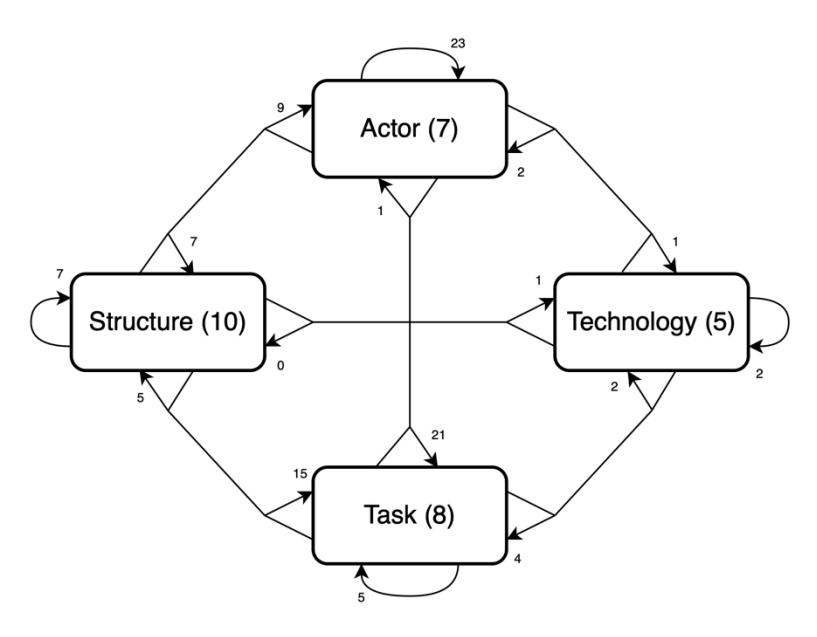
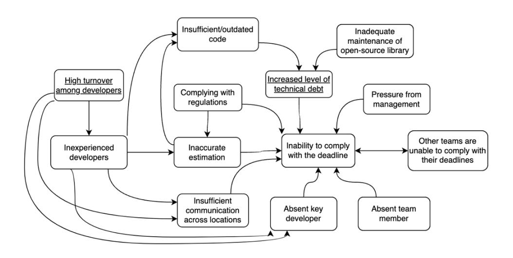
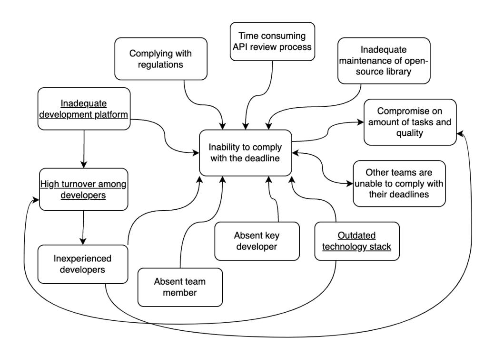
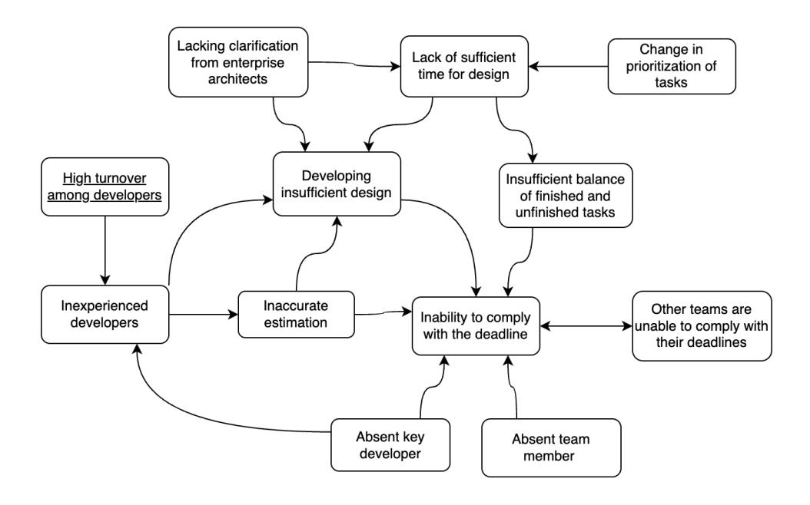
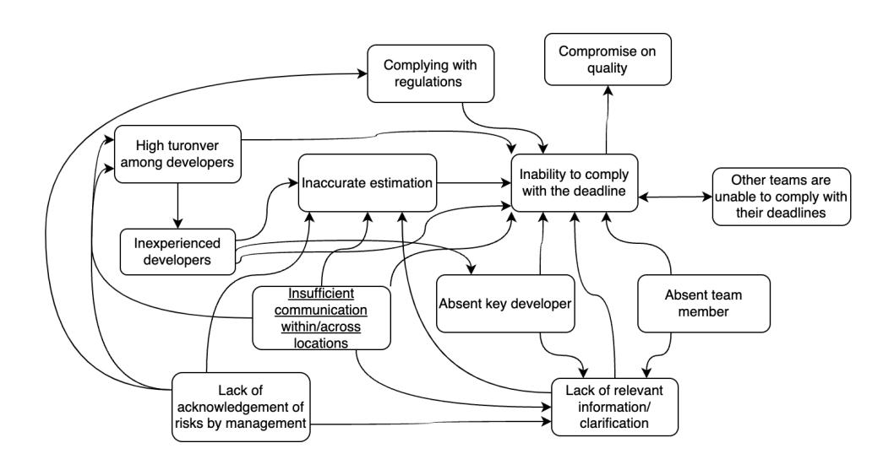
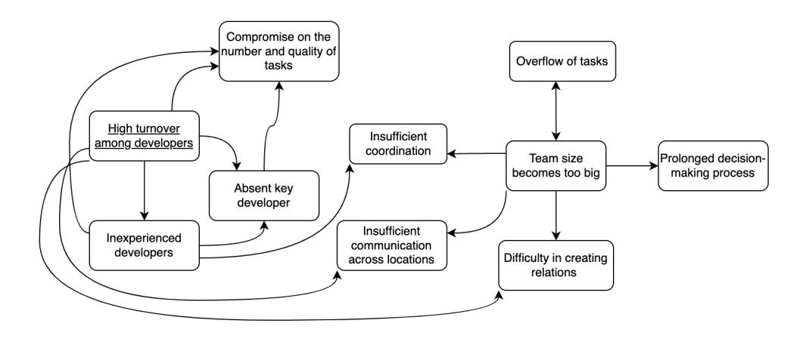
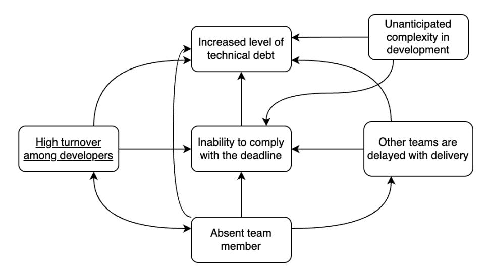
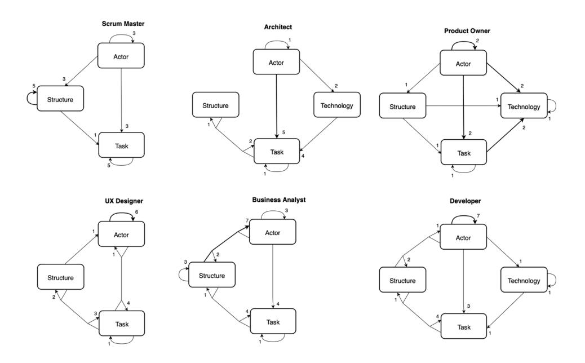

#### **Aalborg Universitet**

#### **Explaining Project Risks**

A Case Study of Causal Mapping in An Agile Software Team Hein, David Kinnberg; Persson, John Stouby; Nielsen, Peter Axel

Published in: Scandinavian Journal of Information Systems

DOI (link to publication from Publisher): [10.17705/3SJIS/037.07](https://doi.org/10.17705/3SJIS/037.07)

Publication date: 2025

Document Version Publisher's PDF, also known as Version of record

[Link to publication from Aalborg University](https://vbn.aau.dk/en/publications/2db5a82d-ec4e-4ad3-93be-4b7dc4f60480)

Citation for published version (APA):

Hein, D. K., Persson, J. S., & Nielsen, P. A. (2025). Explaining Project Risks: A Case Study of Causal Mapping in An Agile Software Team. Scandinavian Journal of Information Systems, 37(1), 243-280. Article 7. <https://doi.org/10.17705/3SJIS/037.07>

**General rights**

Copyright and moral rights for the publications made accessible in the public portal are retained by the authors and/or other copyright owners and it is a condition of accessing publications that users recognise and abide by the legal requirements associated with these rights.

- Users may download and print one copy of any publication from the public portal for the purpose of private study or research.
- You may not further distribute the material or use it for any profit-making activity or commercial gain

- You may freely distribute the URL identifying the publication in the public portal -

**Take down policy**

If you believe that this document breaches copyright please contact us at vbn@aub.aau.dk providing details, and we will remove access to the work immediately and investigate your claim.

Downloaded from vbn.aau.dk on: June 14, 2026

## [Scandinavian Journal of Information Systems](https://aisel.aisnet.org/sjis)

[Volume 37](https://aisel.aisnet.org/sjis/vol37) [Issue 1](https://aisel.aisnet.org/sjis/vol37/iss1) [Article 7](https://aisel.aisnet.org/sjis/vol37/iss1/7) 

6-30-2025

# Explaining Project Risks. A case study of causal mapping in an agile software team

David K. Hein Aalborg University, davidkh@cs.aau.dk

John S. Persson Aalborg University, john@cs.aau.dk

Peter A. Nielsen Aalborg University, pan@cs.aau.dk

Follow this and additional works at: [https://aisel.aisnet.org/sjis](https://aisel.aisnet.org/sjis?utm_source=aisel.aisnet.org%2Fsjis%2Fvol37%2Fiss1%2F7&utm_medium=PDF&utm_campaign=PDFCoverPages)

#### Recommended Citation

Hein, David K.; Persson, John S.; and Nielsen, Peter A. (2025) "Explaining Project Risks. A case study of causal mapping in an agile software team," Scandinavian Journal of Information Systems: Vol. 37: Iss. 1, Article 7.

DOI: 10.17705/3SJIS/037.07

Available at: [https://aisel.aisnet.org/sjis/vol37/iss1/7](https://aisel.aisnet.org/sjis/vol37/iss1/7?utm_source=aisel.aisnet.org%2Fsjis%2Fvol37%2Fiss1%2F7&utm_medium=PDF&utm_campaign=PDFCoverPages)

This material is brought to you by the AIS Journals at AIS Electronic Library (AISeL). It has been accepted for inclusion in Scandinavian Journal of Information Systems by an authorized administrator of AIS Electronic Library (AISeL). For more information, please contact [elibrary@aisnet.org](mailto:elibrary@aisnet.org%3E).

# **Explaining Project Risks**

### **A case study of causal mapping in an agile software team**

David Kinnberg Hein Aalborg University *davidkh@cs.aau.dk*

John Stouby Persson Aalborg University *john@cs.aau.dk*

Peter Axel Nielsen Aalborg University *pan@cs.aau.dk*

**Abstract.** Agile teams can face various risks to their software project's resources and schedule. Yet, the increasingly specialized team roles in a software project may emphasize different explanations of these risks. Against this backdrop, we report a case study of how an agile team can understand and manage different explanations of their project risks. We used the causal mapping technique to understand how a team's six different roles explain their software project risks and assessed these maps' usefulness with the team. Our study shows that software project risks have mutual implications and that causal mapping is useful for revealing and juxtaposing role-specific explanations of software project risks in agile teams. These causal explanations of project risks exhibit 1) a mechanistic ontology of causality as an actual process that connects inputs to outputs, 2) an indwelling trajectory where causality occurs within an undifferentiated entity—the project, and 3) a human-centered autonomy of causal effects moving from people to technology. We discuss how these findings suggest researchers and practitioners should attend to causal explanations of software project risks.

*Keywords*: Causal Mapping, Software Project Risks, Agile Team, Risk Assessment, Case Study.

Accepting editor: Elena Parmiggiani

## **1 Introduction**

Software teams face an inescapable need to reduce the chance of project failure by attending to its risks. Still, ignoring project risks remains a recurring cause of project failure (Tavares et al., 2021). Software project risks are the conditions influencing the project schedule, resources, and success (Hauck & Vieira, 2021). With proper assessment and management of these project risks, software teams increase the likelihood of overall project success (Buganová & Šimíčková, 2019).

The research literature includes many frameworks and models for assessing risks (Anes et al., 2020; Lunesu et al., 2021), the simplest of which are risk checklists (Boehm, 1991). While risk lists are easy to produce and use, they do not capture how risks can influence other risks. This means that the impact of two risks can exceed the sum of the consequences of two individual risks (Eden et al., 2005). Researchers who are concerned with dependencies among risks in software projects still tend to use traditional risk assessment methods, failing to acknowledge the implications of risks for other risks (Fang et al., 2012).

Managing risk dependencies remains a paramount concern in contemporary software development that often relies on teams following agile principles such as "individuals and interactions over processes and tools" (Beck et al., 2001). However, individuals may often not perceive the risks and their dependencies uniformly. Diverse perceptions among roles may especially be present in agile teams, where ascribing to agile principles can result in inconsistency issues (Pikkarainen et al., 2008; Sithambaram et al., 2021). These inconsistencies can be concerns related to software development processes, project success, project failure, and risk factors (Huisman & Iivari, 2006; Keil et al., 2002; Levesque et al., 2001; Linberg, 1999). Thus, having diverse perceptions among software roles may cause them to perceive the necessary actions to address project risks differently, leading to conflict among the roles. We propose that the roles in agile teams must examine their perceptual differences during risk assessment to increase teamwork coherency and effectiveness.

Despite the call for a broadened perspective of risks within software teams (Ackermann et al., 2007; Ackermann & Alexander, 2016), the perceptual differences among software roles in agile teams remain largely unexplored in the extant research. To address this research gap, we conducted a case study of risk explanations in an agile team in the financial sector to answer the research question:

*How can an agile team understand and manage different explanations of their software project risks?*

To study the different explanations in an agile team, we considered the roles of Scrum Master, Product Owner, Developer, Business Analyst, UX-Designer, and Architect, using causal mapping (Laukkanen, 1994). Causal mapping is a technique for visualizing patterns of concepts and causal beliefs that reside in statements by different actors and groups. This technique allowed us to map the role-specific causal explanations of project risks in an agile team and assess the usefulness of these maps for the team in understanding and managing risks.

We then draw on Rowe & Markus's (2018) dimensions of ontology, trajectory, and autonomy of causality to theorize the causal explanations in the causal maps. With this theory, we extend on a previous version of this paper presented at the Scandinavian Conference on Information Systems (Hein et al., 2023). Rowe & Markus (2018) proposed these dimensions to outline fundamental differences among IS researchers' perspectives on causal structures. However, we use the dimensions as a theoretical lens to unfold what a causal explanation can be in a software development practice and how different practitioners may construct and respond to such causal explanations.

In the following, we review existing research on software project risks and causality in the IS literature. Next, we outline the research approach, including our case study and how the data was collected and analyzed. We then present our findings from the six role-specific causal maps, the team's reflections, and the causal dimensions in the causal risk maps. Finally, we discuss how our findings contribute to previous research, their implications for practice, limitations, and the need for future research.

## **2 Theoretical background**

### **2.1 Software project risks**

In software development, a project risk implies some element of a task, process, or environment that, if left untreated, may amplify the likelihood of a project's failure (Lyytinen et al., 1998). Traditionally, risk assessment is one of the core activities in risk management for software development projects. Risk assessment consists of three activities: identification, analysis, and prioritization. Risk assessment is concerned with documenting potential risks, assessing their likelihood of occurrence, and their potential harm to a team or project (Boehm, 2002; Dingsøyr & Petit, 2021). The risk assessment literature increasingly recognizes that risk is not merely an objective fact but rather encompasses psychological, social, cultural, and political dimensions (Corvellec,

2010). Thus, to understand a software project risk, we need to attend to the particular practices in the organization (Persson & Schlichter, 2015).

The risk assessment literature is currently concerned with agile contexts (Odzaly et al., 2018), as agile methodologies deprioritize formal practices and activities related to assessing risks during projects (Tavares et al., 2019, 2021). In agile teams, risk assessment is performed informally with a low amount of documentation, and they typically address risks through transparency, inspection, and adaptation (Schön et al., 2020; Sommerville, 2016). This is achieved through activities such as sprint reviews and daily stand-up meetings, iterative and frequent deployment, involving stakeholders during the development process, and changing requirements in the product backlog (Beck & Andres, 2004; Schwaber & Beedle, 2001). Besides a difference in addressing risks, there is also an apparent difference in the key risks in traditional software projects compared to agile projects. Boehm (2002) highlights the top key risks in software projects as personnel shortfalls, unrealistic schedules and budgets, and developing the wrong functions and user interface. The key risks in agile projects have been identified as Technical debt, Lack of knowledge retention, and Separation of development and IT operations (Elbanna & Sarker, 2016). Extant research offers various frameworks to assess these risks (Persson et al., 2009; Suresh & Dillibabu, 2020), specifically for agile teams (Lopes et al., 2021; Odzaly et al., 2018). The existing assessment frameworks cover different types of risks, e.g., implementation risks (Lyytinen, 1987), requirements-related risks (Ramesh et al., 2010), distributed development risks (Persson & Schlichter, 2015), risks to effective knowledge sharing (Ghobadi and Mathiassen, 2016), and information security risks (Kuzminykh et al., 2021). Even though the previous frameworks are diverse in nature, they all have a team-level focus and ignore potentially different causal explanations of project risks by various roles in an agile team.

Lyytinen et al. (1998) developed an attention-shaping framework for software risks based on the socio-technical model from (Leavitt, 1964). They see software risks as existing in a system consisting of four interrelated components (actor, technology, task, and structure). In this system, a change in any component or relations can impose variations in the other components and the development process (Lyytinen et al., 1998). Thus, software risks during software development can be traced back to be caused by either of the four components. Similarly, the concept of systemic risk has been introduced by IS researchers to address challenges related to risk emergence on account of the relation between risk and complexity (Carlo et al., 2008; Hu et al., 2012). Systemic risks are mutually related risks that exist as parts of a system, where a failure in one part of the system can cause a failure in another. Similarly, Öbrand et al. (2019) identify three sources of software project risks: customer practices, internal practices, and exoge-

nous practices. Accordingly, software professionals should approach risks from different levels besides those of models and projects and transform knowledge from outside of their practice context (Öbrand et al., 2019). A step forward from their practice lens on risks is to theorize further how different risks are causally related from the perspective of different practitioners.

### **2.2 Causality and causal mapping**

The concept of causality is essential to comprehending the core aspects of interactions between disparate components in complex socio-technical systems and the product of these interactions (Sarker et al., 2019). To avoid adopting a linear and limited view of causality, scholars are encouraged to consider three central causality features (Benbya et al., 2020). Outcomes seldom have a single cause; various interdependent conditions cause them; an outcome can have several possible paths, and causal relationships related to one context may be unrelated to another (Meyer et al., 1993). Additionally, causality remains paramount to developing theories within the IS discipline. Despite this, the IS literature has not treated causality significantly, and no consensus exists on defining it (Markus & Rowe, 2018). Discussions on causality are mainly theoretical and methodological in nature (Jackson, 2016; Mingers, 2014). A selection of researchers focuses on interpretivism and critical realism (Avgerou, 2013; Smith, 2006), variance versus process and systems theories (Burton-Jones & Gallivan, 2007; Markus & Robey, 1988), and theoretical endeavors and methods (Gregor, 2006; Hovorka et al., 2008). Nevertheless, there is an apparent lack of research on how practitioners view causality in IS research.

We draw upon the work of Markus and Rowe (2018) as a theoretical foundation to investigate causal explanations as a practical phenomenon. Markus and Rowe (2018) propose a framework that assists researchers in arguing for their causal reasoning and assumptions. They categorize the theoretical causal structures with three dimensions: causal ontology, causal trajectory, and causal autonomy, each consisting of three basic positions.

Firstly, causal ontology is a researcher's or theorist's perceptions of the reality of causality. Such as perceiving causality as a practical metaphor for a logical or metaphysical association, as an actual mechanism or a process that links inputs and outputs, or as a misnomer rejecting the view of causality that insinuates linear and deterministic external forces. In the latter view, causality is merely a belief system that can help us understand how people create meaning (Markus & Rowe, 2018).

Secondly, causal trajectory concerns a researcher's perceptions of the causal movement of an afflicted organism through space and time. One position in this dimension holds that change occurs through influence across the threshold of a segregated entity. Change can be initiated either from a lower level to a higher level, from a higher level to a lower level, or as moving back and forth across the boundaries of the stratified entity. The basic position of internalization rejects the perception of an affected entity as being divided into different levels. Instead, change materializes through interactions inside of a uniform entity. The evolving interlinkage claims that causality emerges through the advancement and complexification of a differentiated entity. The affected entity changes composition by adopting new heterogeneous elements, such as resources and actors (Markus & Rowe, 2018).

Thirdly, causal autonomy involves perceptions of the movement of causal effects between human actors and technology. One position views technology as an instrument where causal effects pass from people to technology. Similarly, another standpoint perceives technology as an influencer, claiming that causal effects move from technology to people. The final basic position views technology as an interactant, where causal effects move back and forth between people and technology. In this instance, the output of technology use is seen as the product of interaction between people and technologies (Markus & Rowe, 2018). We have compiled the causal dimensions and their basic positions in Table 1.

To operationalize causality for software development practitioners, we turned to causal mapping. Causal mapping is a method directed at practitioners that is useful for visualizing causal relationships between concepts from actors' perceptions. In the existing research, causal mapping has been used to show the consistency in perceived causal relationships of barriers to effective knowledge sharing across roles in agile teams (Ghobadi and Mathiassen, 2014). Similarly, causal maps have been used to systematically evoke and represent users' perceptions of adopting a new system or technology (Ackermann et al., 2014; Kjærgaard & Jensen, 2014).

The causal maps can engage users to make their interpretations of a system palpable and identify consistent perceptions that may inhibit the adoption of a system (Ackermann and Alexander, 2016; Kjærgaard and Jensen, 2014). Extant literature on causal mapping of project risks and their implications (Ackermann et al., 2007; Ackermann & Eden, 2020) adopts a team-specific view of project risks, concatenating all the perceptions of project risks into one generic causal map of a software team. To our knowledge, no one has used causal mapping to show role-specific explanations of project risks in an agile team, thereby adopting a role-specific view of project risks.

| Causal Ontology, views about the reality of causality                                                             | 1. Metaphor, causality is a convenient metaphor for a logical or metaphysical association | 2. Mechanism, causality implies a real mechanism, that is, a process that connects inputs to outputs | 3. Misnomer, causality is a misnomer, because it incorrectly implies unidirectional, deterministic, external forces |
|-------------------------------------------------------------------------------------------------------------------------|-------------------------------------------------------------------------------------------------------|------------------------------------------------------------------------------------------------------------------|---------------------------------------------------------------------------------------------------------------------------------------|
| Causal Trajectory views about the causal movements of an affected entity in space and time                  | 1. Cross-boundary, causality occurs across the boundaries of a stratified entity             | 2. Indwelling, causality occurs within an undifferentiated entity                                       | 3. Evolving, causality occurs through the accretion over time of a heterogenous entity                                       |
| Causal Autonomy, views about move ment of causal effects between human (or social) actors and technology | 1. Human, causal effects move from people to technology— technology as instrument      | 2. Technology, causality effects move from technology to people—technology as influencer             | 3. Synergy, causal effects move back and forth between people and technology— technology as interactant                |

Table 1. Three critical dimensions of theoretical causal structure, derived from Markus & Rowe (2018)

## **3 Research approach**

We employed a case study approach, which is appropriate for investigating combined practical and theoretical knowledge interests (Eisenhardt & Graebner, 2007; Yin, 2018) and has also been applied by prior research using causal mapping (Ackermann and Alexander, 2016; Ghobadi and Mathiassen, 2014; Kjærgaard and Jensen, 2014). To meet our knowledge interest in how different roles explain the causes of their project risks, we elicited risk explanations in cooperation with an agile team. Thus, we were attentive to how the consideration of a risk is shaped by culturally ingrained values and beliefs (Boholm & Corvellec, 2011). The collaborative effort of the researchers and practitioners in creating causal maps of risks occurred in an agile software team referred to as *Alpha* in a large Danish bank called *Estate Bank*. The *Alpha* team is a paradigmatic case (Flyvbjerg, 2006) because the exploration of causal explanations of project risks in an

agile team is a novel endeavor without precedence in the agile development literature on risk management. Moreover, the *Alpha* team members shared our interest in better understanding the causes of project risks and were open to exploring the usefulness of causal mapping for this purpose. *Estate Bank* is the context of the *Alpha* case, while the different agile roles in *Alpha* are our units of analysis for understanding the differences in causal explanations of risks.

The causal mapping approach was selected as the analytical framework since it presents the researcher with a more practical and vigorous tool to analyze data and concepts than traditional text-based analysis (Laukkanen, 1998; Laukkanen and Eriksson, 2013). Causal mapping is a type of cognitive mapping in which the team members clarify their causal claims of specific concepts relating to a real-life situation. Causal mapping displays the patterns of concepts and causal beliefs in definite statements of different actors and groups. It is a tool for comparative analysis of different types of actors within an organization and to identify variations and similarities across the actors' perspectives (Laukkanen, 1994, 1998). The process of eliciting causal relationships is concerned with finding expressions that reveal concept A leads to concept B or B is an outcome of A. These causal assertions are visualized through models consisting of nodes and arrows linking the nodes. The nodes denote concepts as perceived in their context. The arrows symbolize the actors' beliefs about causal relationships among the concepts (Laukkanen, 1994, 1998). In conjunction with the causal mapping approach, we adopted the theoretical framework from Rowe & Markus (2018) to theorize the causal explanations in the causal maps according to ontology, trajectory, and autonomy (cf., Table 1). Using causal mapping and the three dimensions of causal structure allowed us to explain causal relationships among project risks within *Alpha's* context.

## **3.1 The case of a SAFe team in Estate Bank**

*Alpha* is a part of *Estate Bank,* which has 4000 employees and offers a wide range of products and services for banking and housing investments. Their main activities are mortgage credit and banking. A Danish association of homeowners and corporations owns *Estate Bank*. *Estate Bank* employs approximately 400 employees developing software used in the organization and by other banks that offer their mortgage products. One hundred of these people work on a mortgage platform in a multi-team development effort where *Alpha* is situated. *Alpha* comprises 12 team members and includes 1 Product Owner, 1 Scrum Master, 1 Business Analyst, 2 Architects, 4 Front-end Developers, 1 Back-end Developer, 2 UX designers (UX), and 1 Student Assistant. The team members in *Alpha* have worked together for a long time and are well acquainted,

as several of the team members have worked in the team for over two years. Thus, the roles in *Alpha* form a closely connected team. Four of the thirteen team members are in Poland, whereas the rest operate in Denmark. *Alpha* follows certain agile activities, such as daily scrum meetings, sprint reviews, and sprint retrospective meetings. The agile teams in *Estate Bank* are organized according to the Scaled Agile Framework (SAFe), where a cluster of teams work towards shared goals and solutions. This is accomplished through the agile release train, which aims to deliver a continuous flow of value. The process begins with a fixed and reliable schedule, which is determined by the chosen rhythm of the program increment. Within each program increment, teams embark on a new system increment (sprint) every two weeks, and all the teams are embedded in the same program increment, which lasts between 10-12 weeks. The program increments have standard start and end dates and duration. The teams working within a program increment must conduct the most important event in SAFe, the program-increment-planning event. This event lasts two full business days and is conducted before the program increment begins. The agenda of this planning event is to present the business context and vision, identify the most important elements to focus on and develop in the future, and identify risks to a program increment's success (*SAFe 5.0 Framework*, 2022). *Alpha* has experience with risk identification and assessment during the PI-planning event with the other teams and in the team from the sprint retrospective. Over the period of the sprint retrospective, *Alpha* evaluates the former sprint regarding people, relationships, processes, and tools, as well as identifying and managing issues and improvements for the next sprint.

## **3.2 Data collection and analysis**

This study relied primarily on interviews as the primary method of data collection. The first author conducted semi-structured interviews with 10 members from *Alpha* following an interview guide to ensure that the same questions were asked (Patton, 2015). The *Alpha* team members interviewed include 1 Product Owner, 1 Scrum Master, 1 Business Analyst, 2 UX-designers, 2 Architects, and 3 Developers (cf., Table 1). In addition, the first author observed one of *Alpha's* retrospective meetings (1½ hours) and PI-planning meetings (6 hours), where *Alpha* discussed risks related to the team and the overall project. Field notes were taken regarding risks and causal explanations, the mood, and the environment. These meeting observations supplement the interviews to achieve a higher level of data triangulation (Eisenhardt & Graebner, 2007). The same applies to historical data, consisting of documentation of *Alpha's* 10 latest retrospective meetings

and the team and program-related risks from the three latest PI-planning meetings to obtain an even deeper understanding of the case context.

The data analysis began with a review of the field notes and recordings generated from the interviews, including transcribing segments where risks were mentioned. The first author then coded statements from the transcripts and field notes to uncover the identified risks of the different roles, resulting in a risk list for each role. We understand a risk as a cognitive construct that, according to Boholm and Corvellec's (2011) relational theory of risk, comprises a relationship between a risk object and an object at risk. A risk represents a harmful possibility involving assigning value to some objects over others, where the risk object and the object at risk are two sides of the same coin. A risk object denotes an object of potential danger, while the object at risk refers to the value assigned to what is at stake, such as loss or vulnerability. There is no universal agreement on what is deemed valuable; instead, assigning value to the object at risk is based on culturally and socially situated beliefs. For example, we identified the risk: *Inability to comply with the deadline*. In this instance, the risk object is 'inability,' whereas the object at risk is complying with the 'deadline.' Thus, this risk signifies a culturally specific valuation of time and adherence to the plan within *Alpha's* SAFe practice.

Keeping Boholm and Corvellec's (2011) perspective on individual risk in mind, we propose that risk should not be viewed merely as an isolated possibility; multiple risks can be causally interconnected within a culturally situated system, such as an agile software team. We discerned a causal relationship between two risks when one risk was noted as contributing to the emergence of another. For instance, *Alpha's* risk of *Inability to comply with the deadline* was causally related to the risk of Absent *team members*. Here, the risk object is absence or sickness, while the object at risk is a team member, highlighting a cultural emphasis on their team members. A similar causally related risk identified by *Alpha* is *Absent key developer*, which shares the same risk object as the previous risk; however, in this case, the object at risk is more specific, namely, the key Developer. Consequently, *Alpha* ascribes varying values to its team members, with particular emphasis on one key Developer, who holds greater significance than others in the project we examined. To capture these insights about risks in *Alpha*, the first author constructed the causal maps when their causal explanations were analyzed. While the interviewees articulated all the risks included in the causal maps, the researchers initially inferred the causal links by inspecting the respondents' explanations of the risks and their perceptions of why a particular risk occurs.

The identified risks were further categorized into actor, structure, task, and technology (Lyytinen et al., 1998) to ensure comprehensive attention shaping, as suggested in previous risk management research (Persson and Schlichter, 2015), and to provide

an overview of the identified risks. An actor-related risk pertains to individuals and or groups of stakeholders, such as software roles or users. Structural risks relate to the structures within an organization, such as authority and workflow. Task risks relate to assignments or pieces of work, such as uncertainty or ambiguity. Technological risks are tools, methods, and infrastructure used to develop software (Lyytinen et al., 1998). In Figure 1, we summarize the identified number of risks and causal links in the four socio-technical categories. Figure 1 shows that *Alpha* is mainly concerned with the causal implications from actor*-*related risks to other actor-related risks (23) and second to task-related risks (21). *Alpha* is the least concerned with the causal implications of the technology-related risks (0, 2, 2, 4).

We validated the role-specific causal maps with representatives from each role in *Alpha* (cf., the validation interview column in Table 2). These causal maps were constructed through two iterations. First, the researchers constructed a causal map for each role based on the statements from the interviews, the participatory observations, and the

| Role                                                                                                                                             | Initial interview                      | Validation interview |
|--------------------------------------------------------------------------------------------------------------------------------------------------|----------------------------------------|-------------------------|
| Scrum Master, prioritizes tasks in the backlog and ensures that Alpha delivers the most critical tasks on time.                               | (46:37 min)                            | (29:33 min)             |
| Product Owner, facilitates Scrum events and shields the team from impediments to sustain the team's focus.                                    | (37:06 min)                            | (19:55 min)             |
| Business Analyst, defines the corporation's requirements and ensures that the software solution meets the required quality.                | (50:42 min)                            | (29:19 min)             |
| UX-Designer, analyzes the software requirements, defines requirements, and prepares tasks for the Developers supported by design examples. | (30:42 min) (50:05 min)             | (23:55 min)             |
| Architect, participates in front-end and back-end development tasks and is responsible for the overall development process.             | (01:04:04 min) (50:10 min)          | (35:55 min)             |
| Developers, are divided into front-end-related tasks, including testing the software, and back-end development and maintenance of APIs.    | (46:41 min) (32:09 min) (56:21 min) | (18:48 min)             |

Table 2. Overview of interviews

Figure 1. Total number of identified risks and causal links between each socio-technical category.

historical data. Second, the causal maps were adjusted based on the feedback from each role representative. Only minor adjustments were identified during validation, and the causal links solely identified by the researchers were either discarded or confirmed by the participants. A workshop followed the individual feedback sessions with *Alpha*, where the causal maps were presented to all the Alpha team members. The workshop provided feedback on the appropriateness of the causal maps, the roles' reflections on their diverging causal explanations of project risks, and their usefulness for *Alpha*. In brief, our unit of analysis is the role, and we generalize the team members' statements about risks to their roles in *Alpha* and present these role-specific maps to the agile team.

## **4 Findings**

Before presenting the findings, we will briefly summarize the main takeaways from *Alpha* to ensure adequate comprehensibility of the findings. The different roles were primarily concerned with the risk of *inability to comply with the deadline* but differed in their causal explanations. Concurrently, all the roles also identified the risk of *high turnover among Developers.* The Developer emphasized *increased technical debt* as a direct causal explanation for missing their deadlines, with two other technological risks as indirect causal explanations: *developing insufficient code* and *inadequate maintenance* 

*of open-source library*. The Architect also identified technological risks as contributing causal explanations to missing their deadlines, although these were more generic as the Architect is responsible for the overall development decisions. The Architect and Developer were the only ones to identify technological risks.

The UX-Designer mentioned the risk of *insufficient design* and *insufficient balance between tasks* as unique causal explanations for missing deadlines. At the same time, the Business Analyst and the Developer were the only roles to identify the risk of *insufficient communication* as a causal explanation for missing deadlines. The Business Analyst attributed communication difficulties across teams, where the Developer primarily experiences communicative issues across locations. Part of the Developers' work is communicating with the Developers stationed in Poland, and the Business Analyst is responsible for communicating with the other teams in the program. The Business Analyst, acting as a bridge between the *Estate bank* and *Alpha*, was also the only one to perceive insufficient communication as the primary explanation for missing their deadlines. Thus, the different causal explanations reflect the function and focus of the specific roles.

The Product Owner was the only role to identify the risk of *unanticipated complexity in development* and as a causal explanation for missing their deadlines. This unanticipated complexity could be the specific technology-related risks identified by the Developer and the Architect, which resonates with the Product Owner's general view of the team's development process. The Product Owner does not necessarily need to know the complexity, as it is not part of their role's responsibility. The Scrum Master did not perceive the *inability to comply with the deadline* as a risk worth focusing on and did not provide any causal explanations for the risk. Instead, the Scrum Master was mainly worried about the team becoming too large and the consequences of this risk.

Finally, during the workshop, *Alpha* gave feedback on the usefulness of the causal maps. One of the Developers mentioned: "How we see some risks differently because they impact one role and not necessarily another." The Business Analyst continued: "I think it's interesting to see the different levels of the same type of risks… this sort of abstraction." The statements from the workshop show that the causal maps can provide transparency between the roles. The causal maps also gave rise to further inspection of risks, as an Architect mentioned: "I think this root cause analysis of the impediments we have identified, where you can use this map to identify which are connected. We haven't been very skilled at doing this and stopped doing it for many PI-planning meetings." This implies that Alpha sees value in the causal maps for them and the other teams at *Estate Bank* by using them to further inspect project risks. In the following, we will present the causal maps and explanations for each of the six roles. Note that the

underlined nodes in the maps below indicate that the specific role perceived the risks as the most critical.

### **4.1 Developer**

To explain their concern about their *inability to comply with the deadline*, one of the Developers situated in Poland stated: "Management might pressure us to do the delivery faster, even though they know it is probably not possible." Hence, the risk of *inability to comply with the deadline* is caused by *pressure from management*.

The Developer also mentioned *complying with regulations* impacting their work and how long production will take, thus contributing to *inaccurate task estimation* and *Alpha missing a deadline*. The rationale was that it might require unexpected time from some of the team members. The *inaccurate estimation of tasks* "could have the consequence of having spillovers, where the tasks pass over to the next sprint." And was seen as causing *inability to comply with the deadline*. A Danish Developer explained the insufficient communication across locations' causal relationship with the risk as a difference in work schedule and culture: "If I, for example, have a task I find difficult, then I would much rather go to the team members sitting in this office." The Developer shows hesitation in communication or asking for help from a team member across locations. The Developer emphasized technical debt as an explanation for missing a deadline:" Technical debt significantly impacts meeting our deadlines because if you generate a lot of technical debt, it will take longer to finish a task. Then it is not likely you will meet your deadline."

The Developer continued highlighting *increased level of technical debt* as one of the most critical risks in the causal map, as shown in Figure 2. *Increased technical debt* was explained to be caused by technology-related risks, for instance: "We currently have some outdated code, and I know there are tasks in the next PFP (meeting), which are affected by this code, and I know, due to this technical debt from this outdated code that the task will take longer to finish in the future if we do not fix it.*"* And: "One of the examples of technical debt is actually having these open-source libraries or other dependencies that do not get maintained." Thus, the Developer sees *outdated* or *insufficient code*, *unexpected issues with open-source libraries*, and the inherent *accumulation of technical debt* impacting their *ability to comply with deadlines*. Finally, the Developer and Architect emphasize technological risks similarly but differ in the identified technological risks and some of the causal explanations.

Figure 2. Developer causal map

### **4.2 Architect**

The Architect explained the implications of *complying with regulations* in greater detail: "Then you just have to react immediately. They are so hard to see when they come. You must take care of it when it presents itself. It can delay other tasks, it really can". The sudden allocation of human resources to deal with regulations imposed by the Danish government may result in rescheduling other tasks currently in their backlog. *Complying with regulations* was explained to be of higher priority than many other tasks, which can ultimately lead to a *failure to comply with the deadline*. This clarifies the connection between the two risks in Figure 3. Like the Developer, the Architect was worried about inadequate maintenance of open-source libraries. Still, the Architect did not present a causal explanation that made it possible to deduce an apparent connection to any other identified risks. The Architect did not explain its implications for increasing technical debt, as the Developer but pointed to inadequate maintenance of libraries as causing problems for their project: "It took us a long time to figure out what we should do about it. Should we choose another one and then migrate all our applications over to this, or should we take the lead and help this library on the way?*".* The risk has implications for their *inability to comply with the deadline*, should they suddenly spend additional resources on resolving the issue of inadequate maintenance of libraries.

Figure 3. Architect causal *m*ap

The Architect highlighted the importance of two technological risks: *Inadequate maintenance of the development platform* and *outdated technology stack* and stated: "I want the tools that make me effective. Otherwise, I'll get very irritated. It just makes me happy, having proper tools that just work*".* The Architect clarified that they have implications for the high rotation: "Some of these things may be interrelated, e.g., this technology stack may constitute a higher rotation among Developers because they are working with something they really do not want to*."* This explains its connection with the risk of *high rotation among Developers* and adds another layer behind the explanation of the risk. It was also presented as being caused by technological issues, besides unsatisfactory salaries of Developers in Poland. The two former roles emphasize technological risks and explanations related to development, while the UX-Designer emphasizes structure-related explanations and risks essential for design.

### **4.3 UX-Designer**

Like the Developer, the UX-Designer perceived *inaccurate estimation* as an explanation for their *inability to meet their* deadlines. The UX-Designer explained the causal relationship after being asked about the causes of delays: "There are many, but the typical risks that we meet can, for instance, be that someone has misestimated a task. It has been estimated that something is easy, and it turns out to be difficult*".* Unlike the Developer, who viewed *inaccurate estimations* as unimportant due to their infrequent occurrence. The UX-Designer identified inaccurate estimations as a typical cause of delays and did not mention it as something that happens infrequently. This alludes to a slight inconsistency in the risk perception between the Developer and the UX-Designer. The UX-Designer was the only role to mention the risk of *lacking clarification from enterprise Architects*, *change in prioritization*, *the insufficient balance between tasks*, and the two design-related risks. In contrast to the Developer and the Architect, the UX-Designer mentioned no technological risks and separated themselves from the other roles by

Figure 4. UX-Designer causal map

identifying design and structure-related explanations. Although the UX-Designer did not identify *insufficient communication* as a significant risk or causal implication, the next role perceived it as the most important.

### **4.4 Business Analyst**

The Business Analyst identified *insufficient communication* as the most critical risk, and according to the Business Analyst: "For me in my position, then it is usually lacking communication or the lack of listening to communication that causes many of these problems*."* As shown in Figure 5, *insufficient communication* leads to three risks in the causal map, but according to the Business Analyst, it can cause many other risks. This signifies the Business Analyst's unique perception of *insufficient communication* compared to the other roles in *Alpha*, which can be explained aside from the fact that communication was a central part of the role's responsibility. Communication can be ingrained in the role itself: "I have a background in communication, and as far as I can see, that is usually why something goes wrong*."* The role referred to their educational background, contributing to their predisposition to perceive communication issues as the root of most of *Alpha's* concerns.

Figure 5. Business Analyst causal map

The Business Analyst perceived the communication issue to be primarily across the different teams in the program. The role did not share a similar emphasis on insufficient communication across locations within the team with the Developer. It was revealed: "I often have issues with communication with other teams; if I want a quick answer on something, then I'm told to send a pigeon*."* The Business Analyst clarified that he could wait a week for an answer that should have taken two minutes. *"*It has been communication problems that have caused things not to be delivered on time or to have a high enough quality*."* This showed that the Business Analyst perceives poor communication as a risk with significant consequences for delivering on time and further supports the connection with the risk of *lacking clarification/information*. The Business Analyst acts as the link between the organization and the team, which entails a lot of communication with the other teams within the SAFe program. Whereas the Developer works closely with the Polish Developers seated in Poland, the Business Analyst might not be as dependent on communicating with them. The Business Analyst did not experience the same issues with communication across locations when asked: "A little bit; I will say we are lucky in my team that we have been together for so many years, so I will say we are good at talking with each other in the team and be transparent.*"* This difference in who both roles mainly communicate with can explain the variation in their experience of insufficient communication. The next role differentiates from the former by presenting risks and causal explanations not mentioned by other roles.

## **4.5 Scrum Master**

The Scrum Master differentiates from the other roles by being the only one who did not identify the risk of inability to comply with the deadline. This was explained: "We just take less into the Program Increment. Then management may have set some deadlines, they must move, but it is not something we experience as a team." The Scrum Master differentiates from the other roles by not perceiving delays as a concern for the team. The Scrum Master was primarily concerned with their team becoming too big. The Scrum Master explained the cause of potentially becoming too big in the future: "In my opinion, it is caused by the fact that there are so many tasks on our table… we can see many tasks are coming our way". This emphasizes there is currently an overflow of tasks and: "Therefore, we need to take in more Developers into the team to solve it." The overflow of tasks entails Alpha to increase their number of Developers in the team, thereby potentially becoming too big. At the same time: "The more you put in, the more tasks you receive." Thus, the Scrum Master argues that an increase in the team's size can lead to a rise in the number of tasks. Alpha is the only front-end team in their

Figure 6. Scrum Master causal map

program, which means all the front-end tasks must be solved solely by Alpha, and the number of Developers in the team increases.

## **4.6 Product Owner**

The Product Owner has a reversed perception of the causal relationship between *technical debt* and *meeting deadlines* compared to the Developer. The Product Owner explained: "When we are under pressure, we must make cuts somewhere, and deadlines are typically the most important, so it is often just technical debt we build up. This is what we see now*.".* The Product Owner perceives *missing their deadlines* as a cause of *increasing their technical debt* instead of the causal relationship being the other way around. This perception contrasts with the Developer perceiving the generation of technical debt as one of the major causes of missing deadlines. The two roles agree fundamentally on the same connection between risks. Still, the Developer was arguably more concerned with the increase of technical debt causing delays on the project sometime in the future. The Product Owner focused on the nearest deadline; if they were to miss their deadline potentially, they must accept generating technical debt to meet their forthcoming deadline.

The Product Owner was the only role to identify the risk of *unanticipated complexity in development*. He stated: "There is always this risk of some tasks being more complex. It will cause us not to meet our deadlines, or the alternative is that we build up more

Figure 7. Product Owner causal map

technical debt*".* He sees this *unexpected complexity* causes *Alpha* to be *unable to comply with their deadlines* or *increased level of technical debt*. The Product Owner's causal map has similarities with the Developer's and the Architect's maps. The Developer explained that the generation of technical debt was caused by redundant or insufficient code and a lack of maintenance of open-source libraries. The Architect identified the inadequate development platform, outdated technology stack, lack of maintenance of libraries, and the time-consuming API review process as causing an *inability to comply with the deadlines*. These technological risks identified by the Developer and the Architect are thus unfolding the risk object of *complexity in development* identified by the Product Owner.

### **4.7 Causal Dimensions in the Causal Risk Maps**

We apply the causal dimensions of ontology, trajectory, and autonomy to interpret the reasoning reflected by the causal maps from the agile roles in Alpha (cf., Table 1 based on (Markus & Rowe, 2018)). The first dimension, causal ontology, refers to one's overall views of how causality relates to reality. This ontological dimension comprises three basic positions: metaphor, mechanism, and misnomer. Misnomer is the causal belief that causality is merely a human belief that mistakenly assumes unidirectional and invariable external forces and rejects the notion of causality as a part of reality. Considering the causal maps from the agile roles, *Alpha* found it convenient to use causality to explain dependencies between their project risks. Hence, at first glance at the causal

maps, the agile roles seem to align with the basic position of metaphor. Metaphor views causality as an expedient metaphor for a logical or metaphysical association. This basic position goes a step further than misnomer by accepting causality's usefulness for logical associations. Still, it does not fully accept the concept of causality as a phenomenon that exists in reality. On the contrary, the basic position of mechanism accepts the notion of causality as a real process or mechanism existing in reality that ties inputs and outputs together. *Alpha* does not only accept causality as convenient for explaining their project risks. In *Alpha's* causal maps, causality is treated as a real mechanism to explain risks as inputs and outputs to other risks. The Architect demonstrated this position in the workshop when he explained that they had previously conducted root cause analyses of risks as part of their PI-planning meetings, highlighting that the concept of causality of risks was something they had already adhered to before our investigation. As such, *Alpha* exemplifies how causal mapping is useful for revealing instances that relate to the basic positions of causal ontology in a practical context and the different actors' causal reasoning.

Second, we have the dimension of causal trajectory. This causal dimension relates to perceptions about the causal movements of an affected entity in space and time with three basic positions: stratification, internalization, and accretion. Accretion assumes that causality occurs through the growth and complexification of a heterogeneous entity. This accretion entails that change materializes by acquiring new diverse elements (e.g., ideas, actors, and resources) into an entity (or loss of elements preexisting in the entity) and by generating new connections among elements. The influenced entity is altered qualitatively in composition. *Alpha's* causal maps did not capture their perception of software risks longitudinally throughout multiple projects but as a single snapshot in time of one software project. This impaired our ability to inspect the importation of new (or loss of) risks and whether the connections among risks have changed over time. The case of *Alpha* can better explain the basic position of internalization, where causality is understood as changes occurring through interactions within a homogenous entity without external influences. All the agile roles' causal maps essentially identified risks internal to *Alpha,* implying no or very low external influence*.* The external influence from management or other roles outside of *Alpha* is also out of their control, emphasizing why it likely was not a great concern to *Alpha*. The final basic position in causal trajectory is stratification.

In contrast to the internalization position, change is viewed as highly dependent on external influence. This change can occur on three different levels. The first level, called upward initiative, change necessitates movement from internal (lower level) to external (higher level). *Alpha's* causal maps did not reflect upward initiatives, although it was

desired by the team, as stated by the Business Analyst during the workshop*:* "It would also be interesting to present these maps to management and see their reaction. Maybe they could help us persuade them of the seriousness of some of the risks"*.* The second level of stratification is downward influence, where change necessitates movement from external (higher level) to internal (lower level). The downward influence is represented through some of the roles' causal maps. For instance, the Developer identified the risk of management putting pressure on the team as a cause for the risk of missing their deadlines. In the same vein, all the agile roles except the Scrum Master identified the risk of other teams being unable to comply with their deadlines. The last level in the basic position of stratification is self-organization, where change implies movements back and forth between a higher and lower level. We previously presented how causality in *Alpha* can occur from either a lower or higher level but seems to be enacted from both levels. In view of the previous examples of upward and downward influence, *Alpha* is an example of self-organization. The basic positions of causal trajectory have added further depth into how the causal explanations in the causal maps function. We showed how *Alpha's* causal explanations could be theorized through the basic positions of stratification, especially internalization, although accretion was unsuitable.

Third, the dimension of causal autonomy relates to views about the direction of causal influences among human (or social) actors and technology. The dimension is comprised of three basic positions: technology as an instrument, technology as an influencer, and technology as an interactant. Technology as an instrument entails causal effects moving from people to technology. Technology is understood as an insentient product of deliberate human action; therefore, only people can be perceived as causal this perception of technology as an instrument is expressed through the socio-technical models in Figure 8.

Only the Developer, Architect, and Product Owner identified technology risks, which, in some instances, were causally linked to actor risks. The Developer illustrates an actor risk causing a technology risk, with an example of outdated code that can result in increased technical debt. Overall, technology risks are less of a concern in *Alpha*; the human actor risks are more prevalent in themselves and cause technology risks. Switching the causal autonomy perspective to technology as an influencer of human actors, the Architect and Developer's technology risks are only perceived to cause task-related risks. For instance, increased technical debt can occasionally result in missing the deadline for the following software delivery. However, technology risks have not been recognized as causing actor risks by any of the roles. Technology and its inherent risks are not perceived as autonomous or something that can influence the occurrence of actor risks. The final position is technology as an interactant, where causal effects move back and

Figure 8. Socio-technical models of roles

forth between people and technology. The result of technology use is the outcome of an interaction between people and technologies. Returning to the socio-technical models in Figure 8, we can observe that none of the roles in *Alpha* identify causal relationships between risks that move back and forth between actor and technology risks. Thus, the socio-technical models do not show technology as an interactant. However, the socio-technical models can reveal how the different roles in *Alpha* perceive the causal effects move from people to technology or vice versa.

## **5 Discussion**

Our case study of understanding and managing software project risks, as seen by different roles in the agile team *Alpha* at *Estate Bank*, shows how project risks have mutual implications. Here, causal mapping is useful for juxtaposing role-specific risk explanations. These explanations predominantly draw on a mechanistic ontology, an indwelling trajectory, and a human-centered autonomy for causality. The following section discusses how these three findings of project risks' mutual implications, juxtapositioning, and causal dimensions contribute to IS research.

Hein et al.: Explaining Project Risks in an Agile Team

## **5.1 Theoretical contributions**

First, our case study shows that *software project risks in agile teams have mutual implications.* Numerous risk assessment tools and frameworks for software project risks have been proposed recently, but many still fail to consider the mutual implications of risks (Lopes et al., 2021; Suresh & Dillibabu, 2020; Tavares et al., 2021). These frameworks imply producing risk lists (Elbanna & Sarker, 2016; Iversen et al., 2004) yet ignore the crucial question of why project risks occur and how they relate to each other. This study extends previous research that found causal mapping can unfold the mutual implications of risks (Ackermann et al., 2014; Ackermann & Eden, 2020; Williams, 2017). Agile methods do not promote the use of risk lists. Instead, they suggest risk assessment with little documentation focusing on transparency and inspection (Schön et al., 2020; Sommerville, 2016). The feedback from the workshop with *Alpha* at *Estate Bank* showed that using causal maps in an agile team can increase the transparency of each role's impediments during a project by showcasing the various perceptions of risks. The main takeaways from the workshops promote the value of reviewing the mutual implications of risks instead of considering risks in isolation, resulting in risk lists (Elbanna & Sarker, 2016; Iversen et al., 2004). We extend the literature on IS risk management, claiming that project risks have mutual relations and should be considered systemically (Carlo et al., 2008; Hu et al., 2012; Öbrand et al., 2019). We add to the existing literature that this also applies to agile teams and that causal mapping is appropriate for eliciting mutual implications of software project risks.

Second, our case study shows that *causal mapping is useful for juxtaposing role-specific explanations of software project risks in agile teams*. The extant research using causal mapping has typically adopted a team-level perspective when showcasing the perceived implications of project risks (Ackermann & Alexander, 2016; Kjærgaard & Jensen, 2014). However, team-level causal maps may hide disparate or competing explanations. Suppressing divergent reasoning or disregarding the fundamental differences in role-specific practices curtail the understanding of not only individual risks but also their adjacent mutual implications. We move beyond the team-level perspective by providing role-specific causal maps showcasing the implications of project risks for each role in an agile team. These maps allow a systematic juxtaposing of the role-specific explanations. Adopting a role-specific perspective preserves each role's nuances instead of aggregating them to a team-level perspective. The insights from each role provide distinctive perceptual differences of the project risks. All the roles have identified project risks and implications unique to their role, highlighting inconsistency in the team. For instance, Developers and Architects emphasize technological implications more than other roles not directly involved with coding. While previous research on agile

development has established how different roles explain barriers and risks (Ghobadi & Mathiassen, 2014, 2016), our study contributes by showing the usefulness of juxtaposing these explanations in an agile team.

Third, with Rowe & Markus' (2018) causal dimensions, this case study shows that practitioners in a software team predominantly theorize causal relationships between project risks with a mechanistic ontology, an indwelling trajectory, and a human-centered autonomy. Contemporary research on the causality of risks in IS takes a purely theoretic approach to risks situated in practice and ignores the causal reasoning of its practitioners (Ghobadi & Mathiassen, 2014, 2016; Öbrand et al., 2019). Our study shows that practitioners' explanations of project risks predominantly draw on a mechanistic ontology as in postpositivist and critical realist IS research. Thus, the IS researchers' drawing on a metaphor or misnomer ontology, as in the interpretive or phenomenological traditions, to describe the relationship between software risks need to be attentive to how this ontological difference may influence their initial collaboration with practitioners. The indwelling causal trajectory, as opposed to the cross-boundary or evolving trajectories, reflects how a software development team focuses on risks within a project organization and may overlook the contextual risks. This distinction between causal trajectories for software project risks has seen some attention in the extant IS research literature (Öbrand et al., 2019) but to a lesser extent on the team level. Finally, we found that practitioners predominantly ascribe autonomy to humans instead of technology or synergy explanations of the identified project risks. While much IS research has historically drawn on a socio-technical understanding of project risks (Lyytinen et al., 1998), our findings suggest a need to help practitioners appreciate socio-technical explanations of project risks. With these three dimensions, we extend the knowledge of how causal explanations of project risks are formulated with and not for practitioners through causal mapping. Our operationalization of the framework from Rowe & Markus (2018) is a new avenue for theorizing project risks and, more broadly, the concept of causality in IS research. In previous research, there has been limited attention to the potential gaps between practitioners' and researchers' causal explanations of project risks. If we as researchers are to understand causal explanations of project risks thoroughly, we must consider the dual causal reasoning of our practitioners and our own.

### **5.2 Implications, limitations, and future research**

Our findings have implications for practice, showing how causal mapping can be useful for agile teams. Should the technique be adopted by practitioners, it will be beneficial

to assign the responsibility of constructing the causal maps to the Scrum Master. The Scrum Master is responsible for facilitating the agile team's Scrum events, and this person could use the maps in retrospective meetings. However, as previous research on the technique pointed out, the Scrum Master should be mindful of the time-consuming process of using and constructing causal maps (Kjærgaard and Jensen, 2014). Moreover, the facilitator should be attentive to divergent perspectives on risk causes and the underlying concept of causality (Rowe & Markus, 2018).

As with all research, our study has its limitations. The single case study approach has often been criticized for lacking generalizability or external validity (Walsham, 2006). Our study is limited by its singular context (e.g., a single Danish bank). However, the value of a single case as an example is not to be overlooked (Flyvbjerg, 2006), especially as our interest is to showcase the discrepancies between agile roles' causal explanations of risks in an agile team. An obvious direction for future research could be to validate causal relationships of project risks quantitatively. However, this assumes that universal causal explanations of risks exist. Causal explanations are, in our view, culturally and socially situated and are liable to change. The strength of our single case study here is that the causal maps show causal explanations to be both a product of the culture in the team and the role they possess. Our intent with generalization was to generalize from description to theory (Lee and Baskerville, 2003), not to propose a universal truth.

This study also has limitations regarding the creation of causal maps. The different roles from *Alpha* constructed their subjective perception of risks and their causal implications. The constructed causal maps signified a socially contrived perspective of how different roles in a software team perceived project risk. They also represented a subjective explanation of risks created by the interaction between the role owners and the researchers. This limitation of causal mapping falling subject to the subjectivity of the individual constructing the map may undermine its trustworthiness, which aligns with prior research on causal mapping (Kjærgaard and Jensen, 2014). In this study, the credibility of the causal maps was ensured by conducting individual and collective validation with *Alpha*. We remained systematic in our data analysis and data collection. Nevertheless, the practitioners' causal explanations of project risks resulted from our descriptive analysis after introducing causal mapping and the causal maps to our participants. We lack firm empirical evidence on the extent to which causal mapping shapes the practitioners' causal understanding of project risks or if their causal reasoning is the same regardless of the elicitation approach. Our qualitative analysis (cf., section 4.8) indicates the latter, but more studies are needed.

Future research on causal mapping for software project risks may attend to longitudinal studies regarding agile teams' causal explanations of project risks. While the causal

maps in our study were static snapshots of *Alpha's* explanations of project risks, the state of some risks and their explanations will likely change over time. Other researchers could also investigate the practical usefulness of the causal maps for software teams of different sizes and the issues they encounter. Longitudinal action research studies could further investigate whether the resources spent on constructing the causal maps are proportional to the value they provide for an agile team. In addition, more research is needed on theorizing causal explanations of practitioners' project risks, especially in reconciling the causal reasoning of practitioners and researchers. This is apparent in IS research and other similar research fields, such as management and software engineering. Finally, as our focus was not on the large-scale agile properties of *Alpha*, we did not discuss the identified risks with respect to scaled agile development. For further research, researchers could benefit from examining project risks succinct for large-scale agile projects, preferably the perceptions of risks of different roles in multiple agile teams. This is additionally emancipated by the scarce treatment of risks of large-scale agile projects in the literature, and there is similarly a call for additional research on general topics, such as inter-team coordination, large project organization, and knowledge sharing and improvements (Dingsøyr & Moe, 2013).

## **6 Conclusion**

We report a case study of how an agile team can use the causal mapping technique to unfold role-specific explanations of software project risks. Our study presents three contributions to research on risk management in agile software development:

- 1. *Software project risks in agile teams have mutual implications*. Accordingly, causal mapping is appropriate for eliciting these implications to move beyond treating software project risks in isolation*.*
- 2. *Causal mapping is useful for juxtaposing role-specific explanations of software project risks in agile teams.* Instead of aggregating to a team-level explanation, gathering insights from different roles in an agile team can reveal distinctively different explanations of the project risks.
- 3. Using the causal dimensions from Rowe & Markus (2018) shows that practitioners theorize causal relationships between project risks with a mechanistic ontology, an indwelling trajectory, and a human-centered autonomy. An agile software development team predominantly ascribes the causal autonomy to humans instead of technology, which suggests a need to help practitioners appreciate more advanced socio-technical explanations of project risks.

## **Bibliography**

- Ackermann, F., & Alexander, J. (2016). Researching complex projects: Using causal mapping to take a systems perspective. *International Journal of Project Management*, *34*(6), 891-901.
- Ackermann, F., & Eden, C. (2020). Strategic Options Development and Analysis. In M. Reynolds & S. Holwell (Retired) (Eds.), *Systems Approaches to Making Change: A Practical Guide*, 139-199.
- Ackermann, F., Eden, C., Williams, T., & Howick, S. (2007). Systemic Risk Assessment: A Case Study. *The Journal of the Operational Research Society*, *58*(1), 39-51.
- Ackermann, F., Howick, S., Quigley, J., Walls, L., & Houghton, T. (2014). Systemic risk elicitation: Using causal maps to engage stakeholders and build a comprehensive view of risks. *European Journal of Operational Research*, *238*(1), 290-299.
- Anes, V., Abreu, A., & Santos, R. (2020). A New Risk Assessment Approach for Agile Projects. *2020 International Young Engineers Forum*, 67-72.
- Avgerou, C. (2013). Social Mechanisms for Causal Explanation in Social Theory Based IS Research: Journal of the Association for Information Systems. *Journal of the Association for Information Systems*, *14*(8), 399-419.
- Beck, K., & Andres, C. (2004). *Extreme Programming Explained: Embrace Change*. Addison-Wesley Professional.
- Beck, K., Beedle, M., van Bennekum, A., Cockburn, A., Cunningham, W., Fowler, M., Grenning, J., Highsmith, J., Hunt, A., Jeffries, R., Kern, J., Marick, B., Martin, R. C., Mellor, S., Schwaber, K., Sutherland, J., & Thomas, D. (2001). *Manifesto for Agile Software Development*.
- Benbya, H., Nan, N., Tanriverdi, H., & Yoo, Y. (2020). Complexity and Information Systems Research in the Emerging Digital World. *Management Information Systems Quarterly*, *44*(1), 1-17.

- Boehm, B. W. (1991). Software risk management: Principles and practices. *IEEE Software*, *8*(1), 32-41.
- Boholm, Å., & Corvellec, H. (2011). A relational theory of risk. *Journal of Risk Research*, *14*(2), 175-190.
- Buganová, K., & Šimíčková, J. (2019). Risk management in traditional and agile project management. *Transportation Research Procedia*, *40*, 986-993.
- Burton-Jones, A., & Gallivan, M. J. (2007). Toward a Deeper Understanding of System Usage in Organizations: A Multilevel Perspective. *MIS Quarterly*, *31*(4), 657- 679.
- Carlo, J. L., Lyytinen, K., & Boland, R. J. (2008). Systemic Risk, IT Artifacts, and High Reliability Organizations: A Case of Constructing a Radical Architecture. *Sprouts: Working Papers on Information Systems*, *4*(4), 57-73.
- Corvellec, H. (2010). Organizational Risk as it Derives from What Managers Value: A Practice-Based Approach to Risk Assessment. *Journal of Contingencies and Crisis Management*, *18*(3), 145-154.
- Dingsøyr, T., & Moe, N. B. (2013). Research challenges in large-scale agile software development. *ACM SIGSOFT Software Engineering Notes*, *38*(5), 38-39.
- Dingsøyr, T., & Petit, Y. (2021). Managing layers of risk: Uncertainty in large development programs combining agile software development and traditional project management. *De Gruyter*, *75-96*..
- Eden, C., Ackermann, F., & Williams, T. (2005). The Amoebic Growth of Project Costs. *Project Management Journal*, *36*(2), 15-27.
- Eisenhardt, K. M., & Graebner, M. E. (2007). Theory Building from Cases: Opportunities and Challenges. *The Academy of Management Journal*, *50*(1), 25- 32.
- Elbanna, A., & Sarker, S. (2016). The Risks of Agile Software Development: Learning from Adopters. *IEEE Software*, *33*(5), 72-79.

- Fang, C., Marle, F., Zio, E., & Bocquet, J.-C. (2012). Network theory-based analysis of risk interactions in large engineering projects. *Reliability Engineering & System Safety*, *106*, 1-10.
- Flyvbjerg, B. (2006). Five Misunderstandings About Case-Study Research. *Qualitative Inquiry*, *12*(2), 219-245.
- Ghobadi, S., & Mathiassen, L. (2014). Perceived barriers to effective knowledge sharing in agile software teams. *Information Systems Journal, 26*(2), 95-125.
- Ghobadi, S., & Mathiassen, L. (2016). Risks to Effective Knowledge Sharing in Agile Software Teams: A Model for Assessing and Mitigating Risks. *Information Systems Journal*, *27*(6), 699-731.
- Gregor, S. (2006). The Nature of Theory in Information Systems. *MIS Quarterly*, *30*(3), 611-642.
- Gregor, S., & Hovorka, D. (2011). Causality: The elephant in the room in information systems epistemology. In *19th European Conference on Information Systems, 19*(2), 1-12.
- Hauck, J. C. R., & Vieira, M. (2021). Towards a Guide for Risk Management Integration in Agile Software Projects. In M. Yilmaz, P. Clarke, R. Messnarz, & M. Reiner (Eds.), *Springer: Systems, Software and Services Process Improvement*, 73-87.
- Hein, D., Persson, J., & Nielsen, P. (2023). Explaining Software Project Risks in Agile Teams: An Action Case Using Causal Mapping. *14th Scandinavian Conference on Information Systems*.
- Hovorka, D., Germonprez, M., & Larsen, K. (2008). Explanation in Information Systems. *Information Systems Journal*, *18*(2), 23-43.
- Hu, D., Zhao, J. L., Hua, Z., & Wong, M. C. S. (2012). Network-Based Modeling and Analysis of Systemic Risk in Banking Systems. *MIS Quarterly*, *36*(4), 1269- 1291.

- Huisman, M., & Iivari, J. (2006). Deployment of systems development methodologies: Perceptual congruence between IS managers and systems developers. *Information & Management*, *43*(1), 29-49.
- Iversen, J. H., Mathiassen, L., & Nielsen, P. A. (2004). Managing Risk in Software Process Improvement: An Action Research Approach. *MIS Quarterly*, *28*(3), 395-433.
- Jackson, P. T. (2016). The Conduct of Inquiry in International Relations: Philosophy of Science and Its Implications for the Study of World Politics (2nd ed.). Routledge.
- Keil, M., Tiwana, A., & Bush, A. (2002). Reconciling user and project manager perceptions of IT project risk: A Delphi study1. *Information Systems Journal*, *12*(2), 103-119.
- Kjærgaard, A. L., & Jensen, T. B. (2014). Using Cognitive Mapping to Represent and Share Users' Interpretations of Technology. *Communications of the Association for Information Systems*, *34*(1), 1097-1114.
- Kuzminykh, I., Ghita, B., Sokolov, V., & Bakhshi, T. (2021). Information Security Risk Assessment. *Encyclopedia*, *1*(3), 602-617.
- Laukkanen, M. (1994). Comparative Cause Mapping of Organizational Cognitions. *Organization Science*, *5*(3), 322-343.
- Laukkanen, M. (1998). Conducting Causal Mapping Research: Opportunities and Challenges. *Managerial and Organizational Cognition*, 168-189.
- Laukkanen, M., & Eriksson, P. (2013). New designs and software for cognitive causal mapping. *Qualitative Research in Organizations and Management*, *8*(2), 122-147.
- Lee, A. S., & Baskerville, R. L. (2003). Generalizing Generalizability in Information Systems Research. *Information Systems Research*, *14*(3), 221-243.
- Levesque, L. L., Wilson, J. M., & Wholey, D. R. (2001). Cognitive divergence and shared mental models in software development project teams. *Journal of Organizational Behavior*, *22*(2), 135-144.

- Linberg, K. R. (1999). Software developer perceptions about software project failure: A case study. *Journal of Systems and Software*, *49*(2), 177-192.
- Lopes, S., Souza, R., Contessoto, A., & Oliveira, A. (2021). *A Risk Management Framework for Scrum Projects*. *2*, 30-40.
- Lunesu, M. I., Tonelli, R., Marchesi, L., & Marchesi, M. (2021). Assessing the Risk of Software Development in Agile Methodologies Using Simulation. *IEEE Access*, *9*, 134240-134258.
- Lyytinen, K. (1987). Different perspectives on information systems: Problems and solutions. *ACM Computing Surveys*, *19*(1), 5-46.
- Lyytinen, K., Mathiassen, L., & Ropponen, J. (1998). Attention Shaping and Software Risk—A Categorical Analysis of Four Classical Risk Management Approaches. *Information Systems Research*, *9*(3), 233-255.
- Markus, M. L., & Robey, D. (1988). Information Technology and Organizational Change: Causal Structure in Theory and Research. *Management Science*, *34*(5), 583-598.
- Markus, M., & Rowe, F. (2018). Is IT Changing the World? Conceptions of Causality for Information Systems Theorizing, *MIS Quarterly, 42*(4), 1255-1280.
- Meyer, A. D., Tsui, A. S., & Hinings, C. R. (1993). Configurational Approaches to Organizational Analysis. *The Academy of Management Journal*, *36*(6), 1175-1195.
- Mingers, J. (2014). Systems Thinking, Critical Realism and Philosophy: A Confluence of Ideas. Routledge.
- Öbrand, L., Augustsson, N.-P., Mathiassen, L., & Holmström, J. (2019). The interstitiality of IT risk: An inquiry into information systems development practices. *Information Systems Journal*, *29*(1), 97-118.
- Odzaly, E. E., Greer, D., & Stewart, D. (2018). Agile risk management using software agents. *Journal of Ambient Intelligence and Humanized Computing*, *9*(3), 823- 841.

- Patton, M. Q. (2015). Qualitative research & evaluation methods: Integrating theory and practice (Fourth edition). SAGE Publications, Inc.
- Persson, J. S., Mathiassen, L., Boeg, J., Madsen, T. S., & Steinson, F. (2009). Managing Risks in Distributed Software Projects: An Integrative Framework. *IEEE Transactions on Engineering Management*, *56*(3), 508-532.
- Persson, J., & Schlichter, B. (2015). Managing Risk Areas in Software Development Offshoring: A CMMI Level 5 Case. *Journal of Information Technology Theory and Application*, *16*(1), 5-24.
- Pikkarainen, M., Haikara, J., Salo, O., Abrahamsson, P., & Still, J. (2008). The impact of agile practices on communication in software development. *Empirical Software Engineering*, *13*(3), 303-337.
- Ramesh, B., Cao, L., & Baskerville, R. (2010). Agile requirements engineering practices and challenges: An empirical study. *Information Systems Journal*, *20*(5), 449-480.
- *SAFe 5.0 Framework*. (2022, March 30). Scaled Agile Framework. https://www. scaledagileframework.com/
- Sarker, S., Chatterjee, S., Xiao Xiao, & Elbanna, A. (2019). Says Who? The Effects of Presentation Format the Sociotechnical Axis of Cohesion for the Is Discipline: Its Historical Legacy and Its Continued Relevance: MIS Quarterly. *MIS Quarterly*, *43*(3), 695-A5.
- Schön, E.-M., Radtke, D., & Jordan, C. (2020). Improving Risk Management in a Scaled Agile Environment. In V. Stray, R. Hoda, M. Paasivaara, & P. Kruchten (Eds.), *Springer: Agile Processes in Software Engineering and Extreme Programming*, 383,132-141.
- Schwaber, K., & Beedle, M. (2001). *Agile Software Development with Scrum* (1st ed.). Prentice Hall PTR.
- Sithambaram, J., Nasir, M. H. N. B. M., & Ahmad, R. (2021). Issues and challenges impacting the successful management of agile-hybrid projects: A grounded theory approach. *International Journal of Project Management*, *39*(5), 474-495.

- Smith, M. L. (2006). Overcoming theory-practice inconsistencies: Critical realism and information systems research. *Information and Organization*, *16*(3), 191-211.
- Sommerville, I. (2016). *Software engineering* (10. ed., global ed). Pearson.
- Suresh, K., & Dillibabu, R. (2020). A novel fuzzy mechanism for risk assessment in software projects. *Soft Computing*, *24*(3), 1683-1705.
- Tavares, B. G., da Silva, C. E. S., & de Souza, A. D. (2019). Risk management analysis in Scrum software projects. *International Transactions in Operational Research*, *26*(5), 1885-1904.
- Tavares, B. G., Keil, M., Sanches da Silva, C. E., & de Souza, A. D. (2021). A Risk Management Tool for Agile Software Development. *Journal of Computer Information Systems*, *61*(6), 561-570.
- Walsham, G. (2006). Doing interpretive research. *European Journal of Information Systems*, *15*(3), 320-330.
- Williams, T. (2017). The Nature of Risk in Complex Projects. *Project Management Journal*, *48*(4), 55-66.
- Yin, R. K. (2018). Case study research and applications: Design and methods (Sixth edition). SAGE.

## **Appendix A. Sample interview guide**

- What is your role in your team?
  - What do you do in the team?
  - Which areas are you responsible for?
- Which risks do you currently focus on, considering your role in the team? A risk is to be understood as an undesired event that has a negative impact on your project.
  - Why do you focus on these risks?
- Which risks have occurred during your current project?
  - Why did they occur?
- Who experienced the consequences of the risks when they occurred during your current project?
  - Why did they experience it?
- How were the risks discovered in your team?
  - Why were they discovered?
- How did you analyze the risks?
  - Why did you analyze them in that way?
- How often have these risks occurred before in the past?
  - If it has occurred often in the past, ask why that risk occurred frequently
- Which consequences did the risks produce in your current project?
  - Why did the risks produce the consequences that they did?
- Which strategy did your team use to avoid or reduce the impact of the risks?
  - Why did you choose that strategy?
- How did you monitor the risks?
  - Why were they monitored in the way they were?
- Which difficulties did you experience in general when managing risks during your current project?
  - Why did you experience these difficulties? Why not?
- Are there any final remarks or something we did not cover?

## **Appendix B. Interview guide for causal map validation**

- Do you have any questions about the causal map?
- Do the risks in the map explain your concerns?
- Are there any risks missing in the causal map?
- Are there any risks that should not be in the map?
- Which are the most important risks for you?
- Do you think the arrows between the risks explain the cohesion among the risks in the map?
- Are there any arrows missing among any of the risks?
- Are there any arrows that you think should be added?