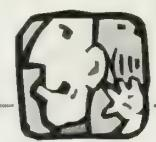
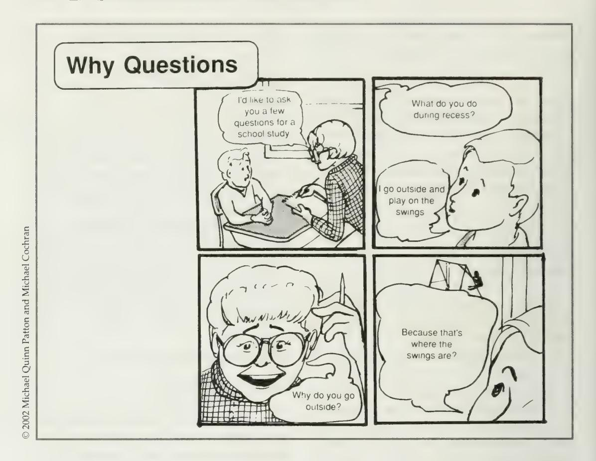
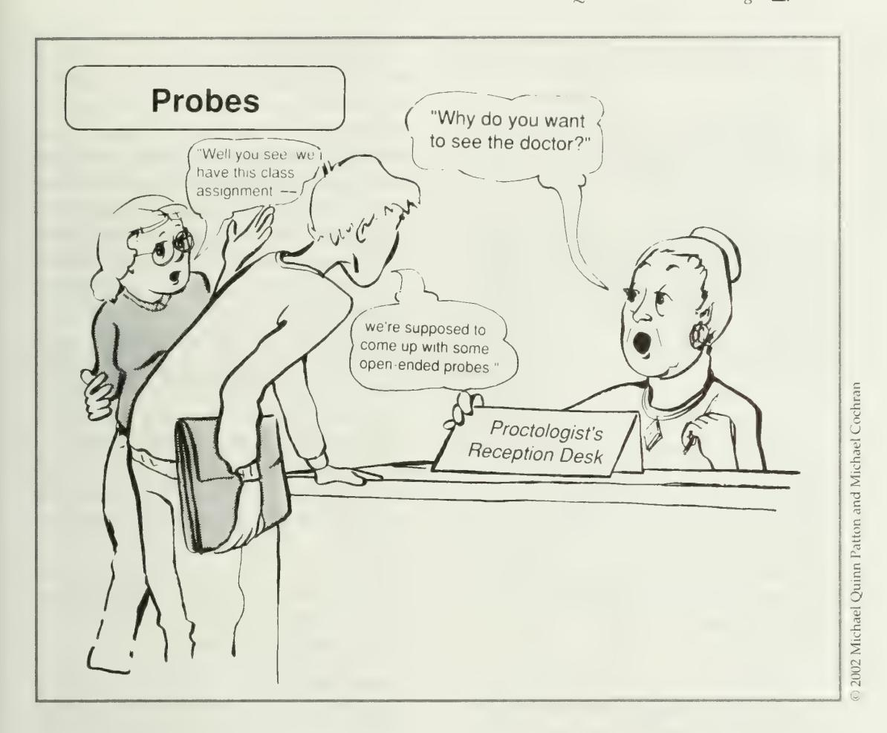
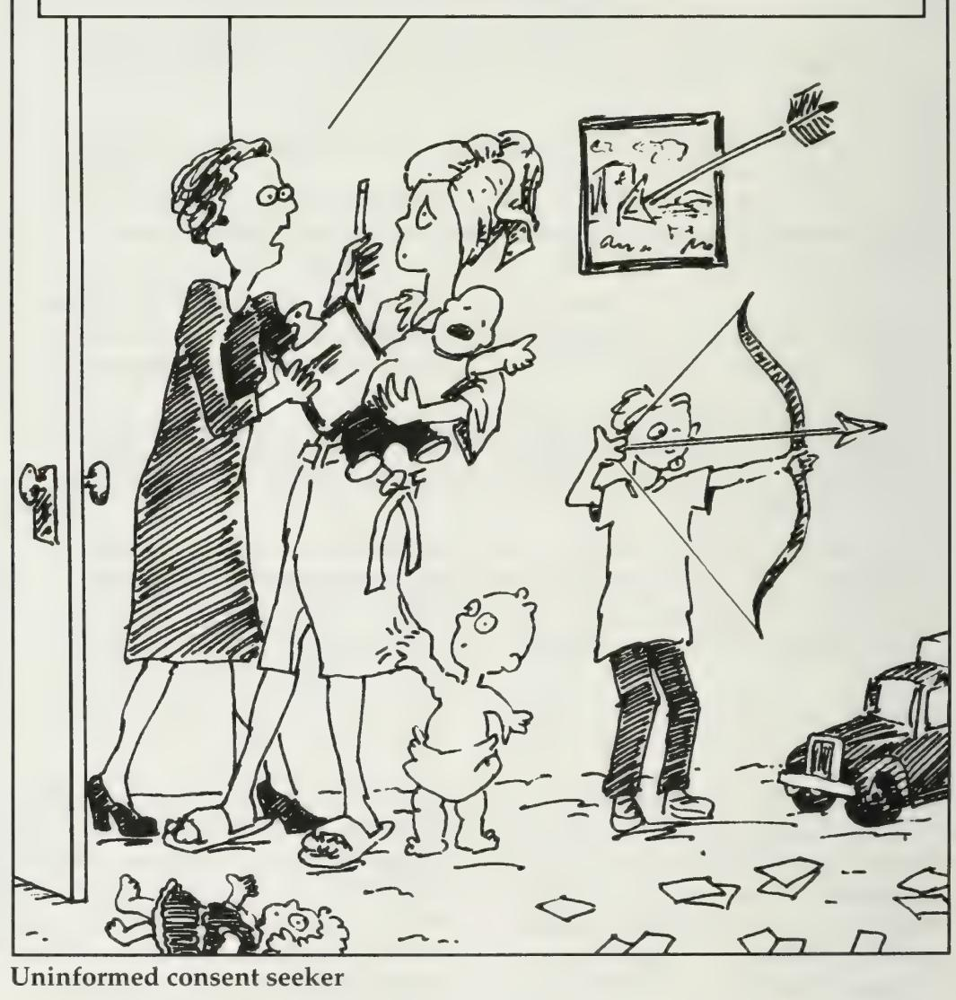

# Qualitative Interviewing

## 3eycmd 5ile^t Obse.rva-HoK\

After much cloistered study, three youths came before Halcolm to ask how they might further increase their knowledge and wisdom. Halcolm sensed that they lacked experience in the real world, but he wanted to have them make the transition from seclusion in stages.

During the first stage he sent them forth under a six-month vow of silence. They wore the identifying garments of the muted truth-seekers so that people would know they were forbidden to speak. Each day, according to their instructions, they sat at the market in whatever village they entered, watching but never speaking. After six months in this fashion they returned to Halcolm.

"So," Halcolm began, "you have returned. Your period of silence is over. Your transition to the world beyond our walls of study has begun. What have you learned so far?"

The first youth answered, "In every village the patterns are the same. People come to the market. They buy the goods they need, talk with friends, and leave. I have learned that all markets are alike and the people in markets always the

same." Then the second youth reported, "I too watched the people come and go in the markets. I have learned that all life is coming and going, people forever moving to and fro in search of food and basic material things. I understand now the simplicity of human life."

Halcolm looked at the third youth: "And what have you learned?" "I saw the same markets and the same people as my fellow travelers, yet I know not what they know. My mind is filled with questions. Where did the people come from? What were they thinking and feeling as they came and went? How did they happen to be at this market on this day? Who did they leave behind? How was today the same or different for them? I have failed, Master, for I am filled with questions rather than answers, questions for the people I saw. I do not know what I

have learned." Halcolm smiled. "You have learned most of all. You have learned the impor- tance of finding out what people have to say about their experiences. You are ready now to return to the world, this time without the vow of silence.

"Go forth now and question. Ask and listen. The world is just beginning to open up to you. Each person you question can take you into a new part of the world. The skilled questioner and attentive listener know how to enter into another's experience. If you ask and listen, the world will always be new."

— From Halcolm's Epistemological Parables

#### Rigorous and Skillful Interviewing

The very popularity of interviewing may be its undoing as an inquiry method. In the contemporary "interview society" (Fontana and Frey 2000:646), so much interviewing is being done so badly that its credibility may be undermined. Television, radio, magazines, newsletters, and Web sites feature interviews. In their ubiquity, interviews done by social scientists become indistinguishable in the popular mind from interviews done by talk show hosts. The motivations of

social scientists have become suspect, as have our methods. The popular business magazine Forbes (self-proclaimed "The Capitalist Tool") has opined, "People become so- ciologists because they hate society, and they become psychologists because they hate themselves" (quoted in Geertz 2001:19). Such glib sarcasm, anti-intellectual at the core, can serve to remind us that we bear the burden of demonstrating that our methods involve rigor and skill. Interviewing, seemingly straightforward, easy, and universal, can be done well or poorly. This chapter is about doing it well.

#### Inner Perspectives

I nterviewing is rather like a marriage: everybody knows what it is, an C— / awful lot of people do it, and yet behind each closed door there is a world of secrets.

—A. Oakley (1981:41)

We interview people to find out from them those things we cannot directly observe. The issue is not whether observational data are more desirable, valid, or meaningful than self-report data. The fact is that we cannot observe everything. We cannot observe feelings, thoughts, and inten- tions. We cannot observe behaviors that took place at some previous point in time. We cannot observe situations that preclude the presence of an observer. We cannot observe how people have organized the world and the meanings they attach to what goes on in the world. We have to ask people questions about those things.

The purpose of interviewing, then, is to allow us to enter into the other person's per- spective. Qualitative interviewing begins with the assumption that the perspective of others is meaningful, knowable, and able to be made explicit. We interview to find out what is in and on someone else's mind, to gather their stories.

Program evaluation interviews, for example, aim to capture the perspectives of program participants, staff, and others associated with the program. What does the program look and feel like to the people involved? What are their experiences in the program? What thoughts do people knowledgeable about the program have concerning program operations, processes, and outcomes? What are their expectations? What changes do participants perceive in them- selves as a result of their involvement in the program? It is the responsibility of the evaluator to provide a framework within which people can respond comfortably, accurately, and honestly to these kinds of questions.

Evaluators can enhance the use of qualitative data by generating relevant and highquality findings. As Hermann Sudermann said in Es Lebe das Leben I, "I know how to lis- ten when clever men are talking. That is the secret of what you call my influence." Evalu- ators must learn how to listen when knowledgeable people are talking. That may be the secret of their influence.

An evaluator, or any interviewer, faces the challenge of making it possible for the person being interviewed to bring the inter- viewer into his or her world. The quality of the information obtained during an interview is largely dependent on the interviewer. This chapter discusses ways of obtaining high-quality information by talking with people who have that information. We'll be delving into "the art of hearing" (Rubin and Rubin 1995).

This chapter begins by discussing three different types of interviews. Later sections consider the content of interviews: what questions to ask and how to phrase questions. The chapter ends with a discussion of how to record the responses obtained during interviews. This chapter emphasizes skill and technique as ways of enhancing the quality of interview data, but no less important is a genuine interest in and caring about the perspectives of other people. If what people have to say about their world is generally boring to you, then you will never be a great interviewer. Unless you are fascinated by the rich variation in human experience, qualitative interviewing will become drudgery. On the other hand, a deep and genuine interest in learning about people is insufficient without disciplined and rigorous inquiry based on skill and technique.

#### !3. Variations in Qualitative Interviewing

On her deathbed Gertrude Stein asked her beloved companion, Alice B. Toklas, "What is the answer?" When Alice, unable to speak, remained silent, Gertrude asked: "In that case, what is the question?"

The question in this section is how to format questions. There are three basic approaches to collecting qualitative data through open-ended interviews. They involve different types of preparation, conceptualization, and instrumentation. Each approach has strengths and weaknesses, and each serves a somewhat different purpose. The three alternatives are

- the informal conversational interview,
- the general interview guide approach, and
- the standardized open-ended interview.

These three approaches to the design of the interview differ in the extent to which interview questions are determined and standardized before the interview occurs.

The informal conversational interview relies entirely on the spontaneous generation of questions in the natural flow of an interaction, often as part of ongoing participant observation fieldwork. The persons being talked with may not even realize they are being interviewed. The general interview guide approach involves outlining a set of issues that are to be explored with each respondent before interviewing begins. The guide serves as a basic checklist during the interview to make sure that all relevant topics are covered. In contrast, the standardized open-ended interview consists of a set of questions carefully worded and arranged with the intention of taking each respondent through the same sequence and asking each respondent the same questions with essentially the same words. Flexibility in probing is more or less limited, depending on the nature of the interview and the skills of interviewers. The standardized open-ended interview is used when it is important to minimize variation in the questions posed to interviewees. Let's look at each approach in greater depth for each serves a different purpose and poses quite varying interviewer challenges.

#### The Informal Conversational Interview

The informal conversational interview is the most open-ended approach to interviewing. It is also called "unstructured interviewing" (Fontana and Frey 2000:652). The conversational interview offers maximum flexibility to pursue information in whatever direction appears to be appropriate, depending on what emerges from observing a particular setting or from talking with one or more individuals in that setting. Most of the questions will flow from the immediate context. Thus, the conversational interview constitutes a major tool of fieldwork and is sometimes referred to as "ethnographic interviewing." No predetermined set of ques- tions would be appropriate under many emergent field circumstances where the fieldworker doesn't know beforehand what is going to happen, who will be present, or what will be important to ask during an event, incident, or experience.

Data gathered from informal conversa- tional interviews will be different for each person interviewed. The same person may be interviewed on different occasions with questions specific to the interaction or event at hand. Previous responses can be revisited and deepened. This approach works particularly well where the researcher can stay in the setting for some period of time so as not to be dependent on a single interview opportunity. Interview questions will change over time, and each new interview builds on those already done, expanding information that was picked up previously, moving in new directions, and seeking elucidations and elaborations from various participants.

Being unstructured doesn't mean that conversational interviews are unfocused. Sensitizing concepts and the overall purpose of the inquiry inform the interviewing. But within that overall guiding purpose, the interviewer is free to go where the data and respondents lead.

The conversational interviewer must "go with the flow." Depending on how the interviewer's role has been defined, the people being interviewed may not know during any particular conversation that data are being collected. In many cases, participant observers do not take notes during such conversational interviews, instead writing down what they learned later. In other cases, it can be both appropriate and comfortable to take notes or even use a tape recorder.

The strength of the informal conversational method resides in the opportunities it offers for flexibility, spontaneity, and responsiveness to individual differences and situational changes. Questions can be personalized to deepen communication with the person being interviewed and to make use of the immediate surroundings and situation to increase the concreteness and immediacy of the interview questions.

A weakness of the informal conversational interview is that it may require a greater amount of time to collect systematic information because it may take several conversations with different people before a similar set of questions has been posed to each participant in the setting. Because this approach depends on the conversational skills of the interviewer to a greater extent than do more formal, standardized formats, this go-with-the-flow style of interviewing may be susceptible to interviewer effects, leading questions, and biases, especially with novices. The conversational interviewer must be able to interact easily with people in a variety of settings, generate

rapid insights, formulate questions quickly and smoothly, and guard against asking questions that impose interpretations on the situation by the structure of the questions.

Data obtained from informal conversational interviews can be difficult to pull together and analyze. Because different questions will generate different responses, the researcher has to spend a great deal of time sifting through responses to find patterns that have emerged at different points in different interviews with different people. By contrast, interviews that are more systematized and standardized facilitate analysis but provide less flexibility and are less sensitive to individual and situational differences.

#### The Interview Guide

An interview guide lists the questions or issues that are to be explored in the course of an interview. An interview guide is prepared to ensure that the same basic lines of inquiry are pursued with each person interviewed. The interview guide provides topics or subject areas within which the interviewer is free to explore, probe, and ask questions that will elucidate and illuminate that particular subject. Thus, the interviewer remains free to build a conversation within a particular subject area, to word questions spontaneously, and to establish a conversational style but with the focus on a particular subject that has been predetermined.

The advantage of an interview guide is that it makes sure that the interviewer/ evaluator has carefully decided how best to use the limited time available in an interview situation. The guide helps make interviewing a number of different people more systematic and comprehensive by delimiting in advance the issues to be explored. A guide is essential in conducting focus group interviews for it keeps the interactions focused while allowing individual perspectives and experiences to emerge.

Interview guides can be developed in more or less detail, depending on the extent to which the interviewer is able to specify important issues in advance and the extent to which it is important to ask questions in the same order to all respondents. Exhibit 7.1 provides an example of an interview guide used with participants in an employment training program. This guide provides a framework within which the interviewer would develop questions, sequence those questions, and make decisions about which information to pursue in greater depth. Usually, the interviewer would not be expected to go into totally new subjects that are not covered within the framework of the guide. The interviewer does not ask questions, for example, about previous employment or education, how the person got into the program, how this program compares with other programs the trainee has experienced, or the trainee's health. Other topics might still emerge during the interview, topics of importance to the respondent that are not listed explicitly on the guide and therefore would not normally be explored with each person interviewed. For example, trainees might comment on family support (or lack thereof) or personal crises. Comments on such concerns might emerge when, in accordance with the interview guide, the trainee is asked for reactions to program strengths, weaknesses, and so on, but if family is not mentioned by the respondent, the interviewer would not raise the is- sue.

An additional, more detailed example of an interview guide is included as Appendix 7.1 at the end of this chapter. The example in the chapter appendix, a "descriptive interview" developed by the Educational Testing Service Collaborative Research Pro-

ject on Reading, illustrates how it is possible to use a detailed outline to conduct a series of interviews with the same respondents over the course of a year. The flexibility permitted by the interview guide approach will become clearer after reviewing the third strategy of qualitative interviewing: the standardized open-ended interview.

#### The Standardized Open-Ended Interview

This approach requires carefully and fully wording each question before the interview. For example, the interview guide for the employment training program in Exhibit 7.1 simply lists "work experiences" as a topic for inquiry. In a fully structured inter- view instrument, the question would be completely specified:

You've told me about the courses you've taken in the program. Now I'd like to ask you about any work experiences you've had. Let's go back to when you first entered the program and go through each work experience up to the present. Okay? So, what was your first work experience?

Probes: Who did you work for? What did you do? What do you feel you learned doing that?

> What did you especially like about the experience, if anything?

> What did you dislike, if anything?

Transition: Okay tell me about your next work experience.

Why so much detail? To be sure that each interviewee gets asked the same questions — the same stimuli — in the same way and the same order, including standard probes. A doctoral committee may want to see the

# Evaluation Interview Guide for Participants in EXHIBIT 7.1 an Employment Training Program

What has the trainee done in the program?

- i0\* activities
- u0 courses
- u0 groups
- u0 work experiences

#### Achievements?

- v01 skills attained
- u0 products produced
- u0 outcomes achieved
- i\* knowledge gained
- v" things completed
- u0 what can the trainee do that is marketable?

How has the trainee been affected in areas other than job skills?

- u0 feelings about self
- u0 attitudes toward work
- u0 aspirations
- i0\* interpersonal skills

What aspects of the program have had the greatest impacts?

- u0 formal courses
- u0 relationships with staff
- u0 peer relationships
- u0 the way treated in the program u0 contacts
- u0 work experiences

What problems has the trainee experienced?

- v0 work related
- i0\* program related
- u0 personal
- u0 family, friends, world outside program

What are the trainee's plans for the future? u0 work plans

- i\*0 income expectations
- \s\* lifestyle expectations/plans

What does the trainee think of the program?

- i> strengths, weaknesses
- \*> things liked, things disliked
- u0 best components, poorest components
- J> things that should be changed

full interview protocol before approving a dissertation proposal. The institutional review board for protection of human subjects may insist on approving a structured interview, especially if the topic is controversial or intrusive. In evaluations, key stakeholders may want to be sure that they know what program participants will be asked. In team research, standardized interviews ensure consistency across interviewers. In multisite studies, structured interviews provide comparability across sites.

In participatory or collaborative studies, inexperienced and nonresearcher interviewers may be involved in the process, so standardized questions can compensate for variability in skills. Some evaluations rely on volunteers to do interviewing; at other times program staff may be involved in doing some interviewing; and in still other instances interviewers may be novices, stu- dents, or others who are not social scientists or professional evaluators. When a number of different interviewers are used, variations in data created by differences among interviewers will become particularly apparent if an informal conversational approach to data gathering is used or even if each interviewer uses a basic guide. The best way to guard against variations among interviewers is to carefully word questions in advance and train the interviewers not to deviate from the prescribed forms. The data collected are still open-ended, in the sense that the respondent supplies his or her own words, thoughts, and insights in answering the questions, but the precise wording of the questions is determined ahead of time.

When doing action research or conducting a program evaluation, it may only be possible to interview participants once for a short, fixed time, such as a half hour, so highly focused questions serve to establish priorities for the interview. At other times, it is possible and desirable to interview partic-

ipants before they enter the program, when they leave the program, and again some period of time (e.g., six months) after they have left the program. For example, a chemical dependency program would ask partici- pants about sobriety issues before, during, at the end of, and after the program. To compare answers across these time periods, the same questions need to be asked in the same way each time. Such interview questions are written out in advance exactly the way they are to be asked during the interview. Careful consideration is given to the wording of each question before the interview. Any clarifica- tions or elaborations that are to be used are written into the interview itself. Probes are placed in the interview at appropriate places to minimize interviewer effects by asking the same question of each respondent, thereby reducing the need for interviewer judgment during the interview. The standardized open-ended interview also makes data analysis easier because it is possible to locate each respondent's answer to the same question rather quickly and to organize questions and answers that are similar.

In summary, there are four major reasons for using standardized open-ended inter- views:

- 1 . The exact instrument used in the evaluation is available for inspection by those who will use the findings of the study.
- 2. Variation among interviewers can be minimized where a number of different interviewers must be used.
- 3. The interview is highly focused so that interviewee time is used efficiently.
- 4. Analysis is facilitated by making responses easy to find and compare.

In program evaluations, potential problems of legitimacy and credibility for qualitative data can make it politically wise to produce an exact interview form that the evaluator can show to primary decision makers and evaluation users. Moreover, when generating a standardized form, evaluation users can participate more completely in writing the interview instrument. They not only will know precisely what is going to be asked but, no less important, will understand what is not going to be asked. This reduces the likelihood of the data being attacked later because certain questions were missed or asked in the wrong way By making it clear, in advance of data collection, exactly what questions will be asked, the limitations of the data can be known and discussed before evaluation data are gathered.

While the conversational and interview guide approaches permit greater flexibility and individualization, these approaches also open up the possibility, indeed, the likelihood, that more information will be collected from some program participants than from others. Those using the findings may worry about how conclusions have been influenced by qualitative differences in the depth and breadth of information received from different people.

In contrast, in fieldwork done for basic and applied research, the researcher will be attempting to understand the holistic worldview of a group of people. Collecting the same information from each person poses no credibility problem when each person is understood as a unique informant with a unique perspective. The political credibility of consistent interview findings across respondents is less of an issue under basic research conditions.

The weakness of the standardized approach is that it does not permit the interviewer to pursue topics or issues that were not anticipated when the interview was written. Moreover, a structured interview reduces the extent to which individual differences and circumstances can be queried.

To illustrate the standardized open- ended interview, three interviews have been reproduced in Appendix 7.2 at the end of this chapter. These interviews were used to gather information from participants in an Outward Bound wilderness program for disabled persons. The first interview was conducted at the beginning of the program, the second interview was used at the end of the 10-day experience, and the third interview took place six months after the pro-

#### Combining Approaches

These contrasting interview strategies are by no means mutually exclusive.

A conversational strategy can be used within an interview guide approach, or you can combine a guide approach with a standardized format by specifying certain key questions exactly as they must be asked while leaving other items as topics to be explored at the interviewer's discretion. This combined strategy offers the interviewer flexibility in probing and in determining when it is appropriate to explore certain subjects in greater depth, or even to pose questions about new areas of inquiry that were not originally anticipated in the interview instrument's development. A common combination strategy involves using a standard- ized interview format in the early part of an interview and then leaving the interviewer free to pursue any subjects of interest during the latter parts of the interview. An- other combination would include using the informal conversational interview early in an evaluation project, followed midway through by an interview guide, and then closing the program evaluation with a standardized open-ended interview to get systematic information from a sample of participants at the end of the program or when

conducting follow-up studies of partici-

pants. A sensitizing concept can provide the bridge across types of interviews. In doing follow-up interviews with recipients of Mac-Arthur Foundation Fellowships, the sensitizing concept "enabling," a concept central to the fellowship's purpose, allowed us to focus interviews on any ways in which receiving the fellowship had enabled recipients. "Enabling," or "being enabled," broadly defined and open-ended, gave interviewees room to share a variety of experiences and outcomes while also letting me identify some carefully worded, standardized questions for all interviewees, some interview guide topics that might or might not be pursued, and a theme for staying centered during completely open-ended con- versations at the end of the interviews.

#### Summary of Interviewing Strategies

All three qualitative approaches to interviewing share the commitment to ask genuinely open-ended questions that offer the persons being interviewed the opportunity to respond in their own words and to express their own personal perspectives.

While the three strategies vary in the extent to which the wording and sequencing of questions are predetermined, no variation exists in the principle that the response format should be open-ended. The interviewer never supplies and predetermines the phrases or categories that must be used by respondents to express themselves as is the case in fixed-response questionnaires. The purpose of qualitative interviewing is to capture how those being interviewed view their world, to learn their terminology and judgments, and to capture the complexities of their individual perceptions and experiences. This openness distinguishes qualitative interviewing from the closed questionnaire or test used in quantitative studies. Such closed instruments force respondents to fit their knowledge, experiences, and feelings into the researcher's categories. The fundamental principle of qualitative interviewing is to provide a framework within which respondents can express their own understandings in their own terms.

Exhibit 7.2 summarizes variations in interview instrumentation. In reviewing this summary table, keep in mind that these are presented as pure types. In practice, any particular study may employ all or several of these strategies together.

#### ^S. Question Options

D f you ask me, I'm gonna tell you.

— Roseanne (2001:164)

Six kinds of questions can be asked of people. On any given topic, it is possible to ask any of these questions. Distinguishing types of questions forces the interviewer to be clear about what is being asked and helps the interviewee respond appropriately.

#### Experience and Behavior Questions

Questions about what a person does or has done aim to elicit behaviors, experi- ences, actions, and activities that would

|                                         | Weaknesses        | Different information collected from different people with different questions. Less systematic and comprehensive if certain questions do not arise naturally. Data organization and analysis can be quite difficult. | Important and salient topics may be inadvertently omitted. Interviewer flexibility in sequencing and wording questions can result in substantially different responses from different perspectives, thus reducing the comparability of responses. | Little flexibility in relating the interview to particular individuals and circumstances; standardized wording of questions may constrain and limit naturalness and relevance of questions and answers.                                                                                                                                                                           | Respondents must fit their experiences and feelings into the researcher's categories; may be perceived as impersonal, irrelevant, and mechanistic. Can distort what respondents really mean or experienced by so completely limiting their response choices. |
|-----------------------------------------|-------------------|-----------------------------------------------------------------------------------------------------------------------------------------------------------------------------------------------------------------------|---------------------------------------------------------------------------------------------------------------------------------------------------------------------------------------------------------------------------------------------------|-----------------------------------------------------------------------------------------------------------------------------------------------------------------------------------------------------------------------------------------------------------------------------------------------------------------------------------------------------------------------------------|--------------------------------------------------------------------------------------------------------------------------------------------------------------------------------------------------------------------------------------------------------------|
| Variations in Interview Instrumentation | Strengths         | Increases the salience and relevance of questions; interviews are built on and emerge from observations; the interview can be matched to individuals and circumstances.                                               | The outline increases the comprehensiveness of the data and makes data collection somewhat systematic for each respondent. Logical gaps in data can be anticipated and closed. Interviews remain fairly conversational and situational.           | Respondents answer the same questions, thus increasing comparability of responses; data are complete for each person on the topics addressed in the interview. Reduces interviewer effects and bias when several interviewers are used. Permits evaluation users to see and review the instrumentation used in the evaluation. Facilitates organization and analysis of the data. | Data analysis is simple; responses can be directly compared and easily aggregated; many questions can be asked in a short time.                                                                                                                              |
|                                         | Characteristics   | Questions emerge from the immediate context and are asked in the natural course of things; there is no predetermination of question topics or wording.                                                                | Topics and issues to be covered are specified in advance, in outline form; interviewer decides sequence and wording of questions in the course of the interview.                                                                                  | The exact wording and sequence of questions are determined in advance. All interviewees are asked the same basic questions in the same order. Questions are worded in a completely open-ended format.                                                                                                                                                                             | Questions and response categories are determined in advance. Responses are fixed; respondent chooses from among these fixed responses.                                                                                                                       |
| EXHIBIT 7.2 Varia                       | Type of Interview | Informal conversational interview                                                                                                                                                                                     | Interview guide approach                                                                                                                                                                                                                          | Standardized open-ended interview                                                                                                                                                                                                                                                                                                                                                 | Closed, fixed-response interview                                                                                                                                                                                                                             |

have been observable had the observer been present. "If I followed you through a typical day, what would I see you doing? What experiences would I observe you having?" "If I had been in the program with you, what would I have seen you doing?"

# Opinion and Values Ouestions

Questions aimed at understanding the cognitive and interpretive processes of people ask about opinions, judgments, and values—"head stuff" as opposed to actions and behaviors. Answers to these questions tell us what people *think* about some experience or issue. They tell us about people's goals, intentions, desires, and expectations. "What do you believe?" "What do you think about \_\_\_\_\_?" "What would you like to see happen?" "What is your opinion of \_\_\_\_\_?"

#### **Feeling Questions**

Emotional centers in the brain can be distinguished from cognitive areas. Feeling questions aim at eliciting emotions—feeling responses of people to their experiences and thoughts. Feelings tap the affective dimension of human life. In asking feeling questions—"How do you feel about that?"—the interviewer is looking for adjective responses: anxious, happy, afraid, intimidated, confident, and so on.

Opinions and feelings are often confused. It is critical that interviewers understand the distinction between the two in order to know when they have the kind of answer they want to the question they are asking. Suppose an interviewer asks, "How do you feel about that?" The response is, "I think it's probably the best that we can do under the circumstances." The question about feelings

has not really been answered. Analytical, interpretive, and opinion statements are not answers to questions about feelings.

This confusion sometimes occurs because interviewers give the wrong cues when asking questions—for example, by asking opinion questions using the format "How do you feel about that?" instead of "What is your opinion about that?" or "What do you think about it?" When you want to understand the respondents' emotional reactions, you have to ask about and listen for feeling-level responses. When you want to understand what someone thinks about something, the question should explicitly tell the interviewee that you're searching for opinions, beliefs, and considered judgments—not feelings.

#### **Knowledge Questions**

Knowledge questions inquire about the respondent's factual information—what the respondent knows. Certain things are facts, such as whether it is against the law to drive while drunk and how the law defines drunkenness. These things are not opinions or feelings. Knowledge about a program may include knowing what services are available, who is eligible, what the rules and regulations of the program are, how one enrolls in the program, and so on. Cooke (1994), for example, reviews and assesses a variety of knowledge elicitation methods and techniques.

#### **Sensory Questions**

Sensory questions ask about what is seen, heard, touched, tasted, and smelled. Responses to these questions allow the interviewer to enter into the sensory apparatus of the respondent. "When you walk through the doors of the program, what do you see? Tell me what I would see if I walked through

Qualitative Interviewing (g. 351

the doors with you." Or again: "What does the counselor ask you when you meet with him? What does he actually say?" Sensory questions attempt to have interviewees describe the stimuli that they experience. Technically, sensory data are a type of behavioral or experiential data — they capture the experience of the senses. However, the types of questions asked to gather sensory data are sufficiently distinct to merit a separate category.

#### Background/ Demographic Questions

Age, education, occupation, and the like are standard background questions that identify characteristics of the person being interviewed. Answers to these questions help the interviewer locate the respondent in relation to other people. Asking these questions in an open-ended rather than closed manner elicits the respondent's own categorical worldview. Asked about age, a person aged 55 might respond, "I'm 55" or "I'm middle-aged" or "I'm at the cusp of old age" or "I'm still young at heart" or "I'm in my mid-50s" or "I'm 10 years from retirement" or "I'm between 40 and 60" (smiling broadly) and so forth. Responses to open-ended, qualitative background inquiries tell us about how people categorize themselves in today's endlessly categorizing world. Perhaps nowhere is such openness more important and illuminative than in asking about race and ethnicity. For example, professional golfer Tiger Woods has Af- rican, Thai, Chinese, American Indian, and European ancestry — and resists being "assigned" to any single ethnic category. He came up with the name "Cablinasian" to de- scribe his mixed heritage. In an increasingly diverse world with people of mixed ethnicity and ever-evolving labels (e.g., Negro,

Colored, Black, African American, Person of African descent), qualitative inquiry is a particularly appropriate way of finding out how people perceive and talk about their backgrounds.

#### Distinguishing Question Types

Behaviors, opinions, feelings, knowledge, sensory data, and demographics are common background questions possible to ask in an interview. Any kind of question one might want to ask can be subsumed in one of these categories. Keeping these distinctions in mind can be particularly helpful in planning an interview, designing the inquiry strategy, focusing on priorities for inquiry, and ordering the questions in some se- quence. Before considering the sequence of questions, however, let's look at how the di- mension of time intersects with the different kinds of questions.

#### The Time Frame of Questions

Questions can be asked in the present, past, or future tense. For example, you can ask someone what they're doing now, what they have done in the past, and what they plan to do in the future. Likewise, you can inquire about present attitudes, past attitudes, or future attitudes. By combining the time frame of questions with the different types of questions, we can construct a matrix that generates 18 different types of ques- tions. Exhibit 7.3 shows that matrix.

Asking all 18 questions about any particular situation, event, or programmatic activity may become somewhat tedious, especially if the sequence is repeated over and over throughout the interview for different program elements. The matrix constitutes a set of options to help you think about what

| Question Focus        | Past | Present | Future |
|-----------------------|------|---------|--------|
| Behaviors/experiences |      |         |        |
| Opinions/values       |      |         |        |
| Feelings/emotions     |      |         |        |
| Knowledge             |      |         |        |
| Sensory               |      |         |        |
| Background            |      |         |        |

information is most important to obtain. To understand how these options are applied in an actual study, it may be helpful to review a real interview. The Outward Bound standardized interview in Appendix 7.2 at the end of this chapter can be used for this purpose. Try identifying which cell in the matrix (Exhibit 7.3) is represented by each question in the Outward Bound interviews.

#### Sequencing Questions

No recipe for sequencing questions can or should exist, but the matrix of questions suggests some possibilities. The challenges of sequencing vary, of course, for different strategies of interviewing. Informal conversational interviewing is flexible and responsive so that a predetermined sequence is seldom possible or desirable. In contrast, standardized open-ended interviews must establish a fixed sequence of questions to fit their structured format. I offer, then, some suggestions about sequencing.

I prefer to begin an interview with questions about noncontroversial present behaviors, activities, and experiences like "What are you currently working on in school?" Such questions ask for relatively straightforward descriptions; they require minimal recall and interpretation. Such questions are, it is hoped, fairly easy to answer. They encourage the respondent to talk descriptively. Probes should focus on eliciting greater detail— filling out the descriptive picture.

Once some experience or activity has been described, then opinions and feelings can be solicited, building on and probing for interpretations of the experience. Opinions and feelings are likely to be more grounded and meaningful once the respondent has verbally "relived" the experience. Knowl- edge and skill questions also need a context. Such questions can be quite threatening if asked too abruptly. The interviewer doesn't want to come across as a TV game show host quizzing a contestant. So, for example, in evaluation interviewing, it can be helpful to ask knowledge questions ("What are the eligibility requirements for this program?") as follow-up questions about program activities and experiences that have a bearing on knowledge and skills ("How did you become part of the program?"). Finding out

once some rapport and trust have been es- tablished in the interview. Questions about the present tend to be easier for respondents than questions about the past. Future-oriented questions involve considerable speculation, and responses to questions about future actions or attitudes are typically less reliable than questions

about the present or past. I generally prefer to begin by asking questions about the present, then, using the present as a baseline, ask questions about the same activity or attitude in the past. Only then will I broach questions about the future.

Background and demographic questions are basically boring; they epitomize what people hate about interviews. They can also be somewhat uncomfortable for the respondent, depending on how personal they are. I keep such questions to a minimum and prefer to space them strategically and unobtrusively throughout the interview. I advise never beginning an interview with a long list of routine demographic questions. In qualitative interviewing, the interviewee needs to become actively involved in providing descriptive information as soon as possible instead of becoming conditioned to providing short-answer, routine responses to uninteresting categorical questions. Some background information may be necessary at the beginning to make sense out of the rest of the interview, but such questions should be tied to descriptive information about present life experience as much as possible. Otherwise, save the sociodemographic inquiries (age, socioeconomic status, birth order, and the like) for the end.

#### S Wording Questions

An interview question is a stimulus aimed at eliciting a response from the person being interviewed. How a question is worded and asked affects how the interviewee responds. As Payne (1951) observed in his classic book on questioning, asking questions is an art. In qualitative inquiry, "good" questions should, at a minimum, be open-ended, neutral, singular, and clear. Let's look at each of these criteria.

#### Asking Truly Open-Ended Questions

Qualitative inquiry — strategically, philosophically, and therefore, methodologically — aims to minimize the imposition of predetermined responses when gathering data. It follows that questions should be asked in a truly open-ended fashion so people can respond in their own words.

The standard fixed-response item in a questionnaire provides a limited and predetermined list of possibilities: "How satisfied are you with the program? (a) very satisfied, (b) somewhat satisfied, (c) not too satisfied, (d) not at all satisfied." The closed and limit- ing nature of such a question is obvious to both questioner and respondent. Many researchers seem to think that the way to make a question open-ended is simply to leave out the structured response categories. But doing so does not make a question truly open-ended. It merely disguises what still amounts to a predetermined and implicit constraint on likely responses.

Consider the question "How satisfied are you with this program?" Asked without fixed response choices, this can appear to be an open-ended question. On closer inspec- tion, however, we see that the dimension along which the respondent can answer has already been identified — degree of satisfaction. The interviewee can use a variety of modifiers for the word satisfaction — "pretty satisfied," "kind of satisfied," "mostly satisfied," and so on. But, in effect, the possible response set has been narrowly limited by the wording of the question. The typical range of answers will vary only slightly more than what would have been obtained had the categories been made explicit from the start while making the analysis more complicated.

A truly open-ended question does not presuppose which dimension of feeling or thought will be salient for the interviewee. The truly open-ended question allows the person being interviewed to select from among that person's full repertoire of possible responses those that are most salient. Indeed, in qualitative inquiry one of the things the inquiry is trying to determine is what dimensions, themes, and images/ words people use among themselves to describe their feelings, thoughts, and experiences. Examples, then, of truly open-ended questions would take the following format:

How do you feel about ? What is your opinion of What do you think of

The truly open-ended question permits those being interviewed to take whatever direction and use whatever words they want to express what they have to say. Moreover, to be truly open-ended a question cannot be phrased as a dichotomy.

#### The Horns of a Dichotomy

Dichotomous response questions provide the interviewee with a grammatical structure suggesting a "yes" or "no" answer. Are you satisfied with the program? Have you changed as a result of your participation in this program? Was this an important experience for you? Do you know the proce-

dures for enrolling in the program? Have you interacted much with the staff in the program? By their grammatical form, all of these questions invite a yes /no reply.

In contrast, in-depth interviewing strives to get the person being interviewed to talk — to talk about experiences, feelings, opinions, and knowledge. Far from encouraging the respondent to talk, dichotomous response questions limit expression. They can even create a dilemma for respondents who may not be sure whether they are being asked a simple yes /no question or if, indeed, the interviewer expects a more elaborate response. Often, in teaching interviewers and reviewing their fieldwork, I've found that those who report having difficulty getting respondents to talk are posing a string of dichotomous questions that program the respondent to be largely reactive and binary.

Consider this classic exchange between a parent and teenager. Teenager returns home from a date:

Do you know that you're late? Yeah.

Did you have a good time?

Yeah.

Did you go to a movie?

Yeah.

Was it a good movie?

Yeah, it was okay.

So, it was worth seeing?

Yeah, it was worth seeing.

I've heard a lot about it. Do you think I would like it?

I don't know. Maybe.

Anything else happen?

No. That's about it.

Teenager then goes off to bed. One parent turns to the other and says, "Sure is hard to

ents anything." Dichotomous questions can turn an interview into an interrogation or quiz rather than an in-depth conversation. In everyday conversation, our interactions with each other are filled with dichotomous questions that we unconsciously ignore and treat as if they were open-ended questions. If a friend asks, "Did you have a good time?" you're likely to offer more than a yes/no answer. In a more formal interview setting, however, the interviewee will be more conscious of the grammatical structure of questions and is less likely to elaborate beyond "yes" or "no" when hit with dichotomous queries. Indeed, the more intense the interview situation, the more likely the respondent reacts to the "deep structure" stimulus of questions — which includes their grammatical framing— and to take questions literally (Bandler and Grinder 1975a, 1975b).

In training interviewers, I like to play a game where I will only respond literally to the questions asked without volunteering any information that is not clearly demanded in the question. I do this before explaining the difficulties involved in asking dichotomous questions. I have played this game hundreds of times and the interaction seldom varies. When getting dichotomous responses to general questions, the interviewer will begin to rely on more and more specific dichotomous response questions, thereby digging a deeper and deeper hole, which makes it difficult to pull the interview out of the dichotomous response pattern. Transcribed on page 356 is an actual interview from a training workshop. In the left column, I have recorded the interview that took place; the right column records truly open-ended alternatives to the dichotomous questions that were asked.

#### INTERVIEW DEMONSTRATION

Instruction: Okay, now we're going to play an interviewing game. I want you to ask me questions about an evaluation I just completed. The program being evaluated was a staff development demonstration project that involved taking professionals into a wilderness setting for a week. That's all I'm going to tell you at this point. I'll answer your questions as precisely as I can, but I'll only answer what you ask. I won't volunteer any information that isn't directly asked for

by your questions. The questions on the left (next page) illustrate a fairly extreme example of posing dichotomous questions in an interview. Notice that the open-ended questions on the right side generate richer answers and quite dif- ferent information than was elicited from the dichotomous questions. In addition, dichotomous questions can easily become leading questions. Once the interviewer begins to cope with what appears to be a reluc- tant or timid interviewee by asking ever more detailed dichotomous questions, guessing at possible responses, the inter- viewer may actually impose those responses on the interviewee. One sure sign that this is happening is when the interviewer is doing more talking than the person being inter- viewed. Consider the excerpt on page 357 from an actual interview. The interviewee was a teenager who was participating in a chemical dependency program. The interview took place during the time the teenager was resident in the program.

The person conducting this interview said she wanted to find out two things in this portion of the interview: What experiences were most salient for John and how personally involved John was becoming in the experience. She has learned that the hot seat

| Actual Questions Asked                                                                   | Genuinely Open-Ended Alternatives With Richer Responses                                                                                                                                                                                                                                                                  |  |  |
|------------------------------------------------------------------------------------------|--------------------------------------------------------------------------------------------------------------------------------------------------------------------------------------------------------------------------------------------------------------------------------------------------------------------------|--|--|
| Question: Were you doing a formative evaluation?                                      | Q: What were the purposes of the evaluation?                                                                                                                                                                                                                                                                             |  |  |
| Answer: Mostly.                                                                          | A: First, to document what happened; then to provide feedback to staff and help them identify their "model"; and finally to report to funders.                                                                                                                                                                        |  |  |
| Q: Were you trying to find out if the people changed from being in the wilderness? | Q: What were you trying to find out through the evaluation?                                                                                                                                                                                                                                                              |  |  |
| A: That was part of it.                                                                  | A: Several things. How participants experienced the wilderness, how they talked about the experience, what meanings they attached to what they experienced, what they did with the experience when they returned home, and any ways in which it affected them.                                                  |  |  |
| Q: Did they change?                                                                      | Q: What did you find out? How did participation in the program affect participants?                                                                                                                                                                                                                                      |  |  |
| A: Some of them did.                                                                     | A: Many participants reported "transformative" experiences-their term-by which they meant something life-changing. Others became more engaged in experiential education themselves. A few reported just having a good time. You'd need to read the full case studies to see the depth of variation and impacts. |  |  |
| Q: Did you interview people both before and after the program?                        | Q: What kinds of information did you collect for the evaluation?                                                                                                                                                                                                                                                         |  |  |
| A: Yes.                                                                                  | A: We interviewed participants before, during, and after the program; we did focus groups; we engaged in participant observation with conversational interviews; and we read their journals when they were willing. They also completed open-ended evaluation forms that asked about aspects of the program.    |  |  |
| Q: Did you find that being in the program affected what happened?                  | Q: How do you think your participation in the program affected what happened?                                                                                                                                                                                                                                            |  |  |
| A: Yes.                                                                                  | A: We've reflected a lot on that and we talked with staff and participants about it. Most agreed that the evaluation process made everyone more intentional and reflective-and that increased the impact in many cases.                                                                                            |  |  |
| Q: Did you have a good time?                                                             | Q: What was the wilderness experience like for you?                                                                                                                                                                                                                                                                      |  |  |
| A: Yes.                                                                                  | A: First, I learned a great deal about participant observation and evaluation. Second, came to love the wilderness and have become an avid hiker. Third, I began what I expect will be a deep and lifelong friendship with one staff member.                                                                       |  |  |

was highly salient for John, but she really knows very little about the reasons for that salience. With regard to the question of his personal involvement, the only data she has come from his acquiescence to leading ques- tions. In fact, if one lists the actual data from the interview — his verbatim responses there is very little there:

Okay.

Yeah, . . . the hot seat.

Right.

One person does it every day.

Yeah, it depends.

Okay, let's see, hmmm . . . there was this guy yesterday who really got nailed. I mean he really caught a lot of crap from the group. It was really heavy.

No, it was them others.

Yeah, right, and it really got to him.

He started crying and got mad and one guy really came down on him and afterwards

they were talking, and it seemed to be okay for him.

the program. Anything else you want to say about the hot seat? (John doesn't answer verbally. Sits and waits for the next questions.)

Yeah, it really was.

It was pretty heavy.

The lack of a coherent story line in these responses reveals how little we've actually learned about John's perspective and experiences. Study the transcript and you'll find that the interviewer was talking more than

No response really expected.

the interviewee. The questions put the interviewee in a passive stance, able to confirm or deny the substance provided by the interviewer but not really given the opportunity to provide in-depth, descriptive detail in his own words.

#### Asking Singular Questions

One of the basic rules of questionnaire writing is that each item must be singular; that is, no more than one idea should be contained in any given question. Consider this example:

How well do you know and like the staff in this program?

- (a) a lot
- (b) pretty much
- (c) not too much
- (d) not at all

This item is impossible to interpret in analysis because it asks two questions:

- (1) How well do you know the staff?
- (2) How much do you like the staff?

When one turns to open-ended interviewing, however, many people seem to think that singular questions are no longer called for. Precision gives way to vagueness and confused multiplicity, as in the illustration in this section. I've seen transcripts of in- terviews conducted by experienced and well-known field researchers in which several questions have been thrown together, which they might think are related, but which are likely to confuse the person being interviewed about what is really being asked.

To help the staff improve the program, we'd like to ask you to talk about your opinion of

the program — what you think are the strengths and weaknesses of the program. What you like. What you don't like. What you think could be improved or should stay the same. Those kinds of things — and any other comments you have.

The evaluator who used this question regularly in interviewing argued that by asking a series of questions, he could find out which was most salient to the person being inter- viewed because the interviewee was forced to choose what he or she most cared about in order to respond to the question. The evalu- ator would then probe more specifically in those areas that were not answered in the initial question.

It's necessary to distinguish, then, between giving an overview of a series of ques- tions at the beginning of a sequence, then asking each one singularly, and laying out a whole series of questions at once and seeing which one strikes a respondent's fancy. In my experience, multiple questions create tension and confusion because the person being interviewed doesn't really know what is being asked. An analysis of the strengths and weaknesses of a program is not the same as reporting what one likes and dislikes about a program. Likewise, recommenda- tions for change may be unrelated to strengths, weaknesses, likes, and dislikes. The following is an excerpt from an inter- view with a parent participating in a family education program aimed at helping parents become more effective as parents.

Question: Based on your experience, what would you say are the strengths of this

program? Answer: The other parents. Different parents can get together and talk about what being a parent is like for them. The program is really parents with parents. Par-

ents really need to talk to other parents about what they do, and what works and doesn't work. It's the parents, it really is.

- Q: What about weaknesses?
- A: I don't know ... I guess I'm not always sure that the program is really getting to the parents who need it the most. I don't know how you do that, but I just think there are probably a lot of parents out there who need the program and ... especially maybe single-parent families. And fathers. It's really hard to get fa- thers into something like this. It should just get to everybody and that's real hard.
- Q: Let me turn now to your personal likes and dislikes about the program. What are some of the things that you have really liked about the program?
- A: I'd put the staff right at the top of that. I really like the program director. She's re- ally well educated and knows a lot, but she never makes us feel dumb. We can say anything or ask anything. She treats us like people, like equals even. I like the other parents. And I like being able to bring my daughter along. They take her into the child's part of the program, but we also have some activities together. But it's also good for her to have her ac- tivities with other kids and I get some time with other parents.
- Q: What about dislikes? What are some things you don't like so much about the
- program? A: I don't like the schedule much. We meet in the afternoons after lunch and it kind of breaks into the day at a bad time for me, but there isn't any really good time

for all the parents and I know they've tried different times. Time is always going to be a hassle for people. Maybe they could just offer different things at different times. The room we meet in isn't too great, but that's no big deal.

- Q: Okay, you've given us a lot of information about your experiences in the program, strengths and weaknesses you've observed, and some of the things you've liked and haven't liked so much. Now I'd like to ask you about your recommendations for the program. If you had the power to change things about the program, what would you make different?
- A: Well, I guess the first thing is money. It's always money. I just think they should put, you know, the legislature should put more money into programs like this. I don't know how much the director gets paid, but I hear that she's not even get- ting paid as much as schoolteachers. She should get paid like a professional. I think there should be more of these programs and more money in them.

Oh, I know what I'd recommend. We talked about it one time in our group. It would be neat to have some parents who have already been through the program come back and talk with new groups about what they've done with their kids since they've been in the pro- gram, you know, like problems that they didn't expect or things that didn't work out, or just getting the benefit of the experiences of parents who've already been through the program to help new parents. We talked about that one day and thought that would be a neat thing to do. I don't know if it would work, but it would be a neat thing. I wouldn't mind doing it, I guess.

Notice that each of these questions solicited a different response. Strengths, weak- nesses, likes, dislikes, and recommendations — each question meant something different and deserved to be asked separately. Qualitative interviewing can be deepened through thoughtful, focused, and distinct

questions. A consistent theme runs through this discussion of question formulation: The wording used in asking questions can make a significant difference in the quality of responses elicited. The interviewer who throws out a bunch of questions all at once to see which one takes hold puts an unnecessary burden on the interviewee to decipher what is being asked. Moreover, multiple questions asked at the same time suggest that the interviewer hasn't figured out what question should be asked at that juncture in the interview. Taking the easy way out by asking several questions at once transfers the burden of clarity from the interviewer to the interviewee.

Asking several questions at once can also waste precious interview time. Given multiple stimuli and not being sure of the focus of the question, the interviewee is free to go off in any direction at all, including tangents that are irrelevant to the issues under study. In evaluation interviews, for example, both interviewers and respondents typically have only so much time to give to an inter- view. To make the best use of that time, it is helpful to think through priority questions that will elicit relevant responses. This means that the interviewer must know what issues are important enough to ask questions about, and to ask those questions in a way that the person being interviewed can clearly identify what he or she is being asked — that is, to ask clear questions.

#### Clarity of Questions

I f names are not correct, language will not be in accordance with the {^s truth of things.

-Confucius

The interviewer bears the responsibility to pose questions that make it clear to the interviewee what is being asked. Asking understandable questions facilitates establishing rapport. Unclear questions can make the person being interviewed feel uncomfortable, ignorant, confused, or hostile. Asking singular questions helps a great deal to make things clear. Other factors also contribute to clarity.

First, in preparing for an interview, find out what special terms are commonly used by people in the setting. For example, state and national programs often have different titles and language at the local level. CETA (Comprehensive Employment and Training Act) was designed as a national program in which local contractors were funded to establish and implement services in their area. We found that participants only knew these programs by the name of the local contractor, such as "Youth Employment Services," "Work for Youth," and "Working Opportunities for Women." Many participants in these programs did not even know they were in CETA programs. Conducting an interview with these participants where they were asked about their "CETA experience" would have been confusing and disruptive to the interview.

When I was doing fieldwork in Burkina Faso, the national government was run by the military after a coup d'etat. Local officials carried the title "commandant" (com- mander). However, no one referred to the government as a military government. To do so was not only politically incorrect but risky. The appropriate official phrase mandated by the rulers in Ouagadougou was

"the people's government." Second, clarity can be sharpened by understanding what language participants use among themselves in talking about a setting, activities, or other aspects of life. When we interviewed juveniles who had been placed in foster group homes by juvenile courts, we had to spend a good deal of preparatory time trying to find out how the juveniles typically referred to the group home parents, to their natural par- ents, to probation officers, and to each other in order to ask questions clearly about each of those sets of people. For example, when asking about relationships with peers, should we use the word juveniles, adolescents, youth, teenagers, or what? In preparation for the interviews, we checked with a number of juveniles, group home parents, and court authorities about the proper language to use. We were advised to refer to "the other kids in the group home." However, we found no con- sensus about how the kids in the group home referred to group home parents. Thus, one of the questions we had to ask in each interview was, "What do you usually call Mr. and Mrs. ?" We then used the language given to us by that youth throughout the rest of the interview to refer to group home parents.

Third, providing clarity in interview questions may mean avoiding using labels altogether. This means that when asking about a particular phenomenon or program component, it may be better to first find out what the interviewee believes that

phenomenon to be and then ask questions about the descriptions provided by the person being interviewed. In studying officially designated "open classrooms" in North Dakota, I interviewed parents who had children in those classrooms. However, many of the teachers and local school officials did not use the term "open" to refer to these classrooms because they wanted to avoid political conflicts and stereotypes that were sometimes associated with the notion of "open education." Thus, when interviewing par- ents we could not ask their opinions about open education. Rather, we had to pursue a sequence of questions like the following:

What kinds of differences, if any, have you noticed between your child's classroom last year and the classroom this year? (Parent responds.)

OK, you've mentioned several differences. Let me ask you your opinion about each of the things you've mentioned. What do you think about ?

This strategy avoids the problem of collecting data that later turn out to be uninterpretable because you can't be sure what re- spondents meant by their responses. Their opinions and judgments are grounded in descriptions, in their own words, of what they've experienced and what they're as- sessing.

A related problem emerged in interviewing children about their classrooms. We wanted to find out how basic skills were taught in open classrooms. In preparing for the interviews, we learned that many teachers avoided such terms as "math time" or "reading time" because they wanted to inte- grate math and reading into other activities. In some cases, we learned during parent interviews, children reported to parents that they didn't do any math in school. These

same children would be working on projects, such as the construction of a model of their town using milk cartons that required geometry, fractions, and reductions to scale, but they did not perceive of these activities as math because they associated math with worksheets and workbooks. Thus, to find out that kind of math activities children were doing, it was necessary to talk with them in detail about specific projects and work they were engaged in without asking them the simple question "What kind of

math do you do in the classroom?" Another example of problems in clarity comes from follow-up interviews with mothers whose children were victims of sexual abuse. A major part of the interview focused on experiences with and reactions to the child protection agency, the police, the welfare workers, the court system, the school counselor, probation officers, and other parts of the enormously complex sys- tem constructed to deal with child sexual abuse. We learned quickly that mothers could seldom differentiate the parts of the system. They didn't know when they were dealing with the courts, the child protection people, the welfare system, or some treatment program. It was all "the system." They had strong feelings and opinions about the system, so our questions had to remain general, about the system, rather than specifically asking about the separate parts of the system (Patton 1991).

The theme running through these suggestions for increasing the clarity of questions centers on the importance of using language that is understandable and part of the frame of reference of the person being interviewed. It means taking special care to find out what language the interviewee uses. Questions that use the respondent's own language are most likely to be clear. This means being sensitive to "languaculture" by attending to

"meanings that lead the researcher beyond the words into the nature of the speaker's world" (Agar 2000:93-94). This sensitivity to local language, the emic perspective in anthropology, is usually discussed in relation to data analysis in which a major focus is illuminating a setting or culture through its language. Here, however, we're discussing languaculture, not as an analytical framework but as a way of enhancing data collection during interviewing by increasing clarity, communicating respect, and facilitating

rapport. Using words that make sense to the interviewee, words that reflect the respondent's worldview, will improve the quality of data obtained during the interview. Without sensitivity to the impact of particular words on the person being interviewed, an answer may make no sense at all — or there may be no answer. A Sufi story makes this point quite nicely.

A man had fallen between the rails in a subway station. People were all crowding around trying to get him out before the train ran him over. They were all shouting. "Give me your hand!" but the man would not reach up.

Mulla Nasrudin elbowed his way through the crowd and leaned over the man. "Friend," he asked, "what is your profession?"

"I am an income tax inspector," gasped the man.

"In that case," said Nasrudin, "take my

hand!" The man immediately grasped the Mulla's hand and was hauled to safety. Nasrudin turned to the amazed by-standers. "Never ask a tax man to give you anything, you fools," he said. (Shah 1973:68)

Before leaving the issue of clarity, let me offer one other suggestion: Be especially careful asking "why" questions.

## Why to Take Care Asking "Why?"

Three Zen Masters were discussing a flapping flag on a pole. The first observed dryly: "The

flag "No," moves." said the second, "wind is moving."

"No," said the third. "It is not flag. It is not wind. It is mind moving."

"Why" questions presuppose that things happen for a reason and that those reasons are knowable. "Why" questions presume cause-effect relationships, an ordered world, and rationality. "Why" questions move beyond what has happened, what one has ex- perienced, how one feels, what one opines, and what one knows to the making of analytical and deductive inferences.

The problems in deducing causal infer- ences have been thoroughly explored by philosophers of science (Bunge 1959; Nagel 1961). On a more practical level and more illuminative of interviewing challenges, reports from parents about "why" conversa- tions with their children document the difficulty of providing causal explanations about the world. The infinite regression quality of "why" questions is part of the difficulty engendered by using them as part of an interview. Consider this parent-child exchange:

Dad, why does it get dark at night?

Because our side of the earth turns away from the sun.

Dad, why does our side of the earth turn away from the sun?

Because that's the way the world was made.

Dad, why was the world made that way?

So that there would be light and dark.

Dad, why should there be dark? Why can't it just be light all the time?

Because then we would get too hot.

Why would we get too hot?

Because the sun would be shining on us all the time.

Why can't the sun be cooler sometimes?

It is, that's why we have night.

But why can't we just have a cooler sun?

Because that's the way the world is.

Why is the world like that?

It just is. Because.

Because why?

Just because.

Oh.

Daddy?

Yes.

Why don't you know why it gets dark?

In a program evaluation interview, it might seem that the context for asking a "why" question would be clearer. However, if a precise reason for a particular activity is what is wanted, it is usually possible to ask that question in a way that does not involve using the word why. Let's look first at the dif- ficulty posed for the respondent by the "why" question, and then look at some alter- native phrases.

"Why did you join this program?" The actual reasons for joining the program probably consist of some constellation of factors, including the influences of other people, the nature of the program, the nature of the person being interviewed, the interviewee's ex- pectations, and practical considerations. It is unlikely that an interviewee can sort through all of these levels of possibility at once, so the person to whom the question is posed must pick out some level at which to respond.

- "Because it takes place at a convenient time." (programmatic reason)
- "Because I'm a joiner." (personality reason)
- "Because a friend told me about the program." (information reason)
- "Because my priest told me about the program and said he thought it would be good for me." (social influence reason)
- "Because reason) it was inexpensive." (economic
- "Because I wanted to learn about the things they're teaching in the program." (outcomes reason)
- "Because God directed me to join the program." (personal motivation reason)
- "Because it was there." (philosophical rea-

Anyone being interviewed could respond at any or all of these levels. The inter- viewer must decide before conducting the interview which of these levels carries sufficient importance to make it worth asking a question. If the primary evaluation question concerns characteristics of the program that attracted participants, then instead of asking, "Why did you join?" the interviewer should ask something like the following: "What was it about the program that attracted you to it?" If the evaluator is inter- ested in learning about social influences that led to participation in a program, either voluntary or involuntary participation, a question like the following could be used:

Other people sometimes influence what we do. What other people, if any, played a role in your joining this program?

In some cases, the evaluator may be particularly interested in the characteristics of phrased in the following fashion:

I'm interested in learning more about you as a person and your personal involvement in this program. What is it about you — your situation, your personality, your desires, whatever— what is it about you that you think led you to become part of this program?

When used as a probe, "why" questions can imply that a person's response was somehow inappropriate. "Why did you do that?" may sound like doubt that an action (or feeling) was justified. A simple "Tell me more, if you will, about your thinking on

that" may be more inviting. The point is that by thinking carefully about what you want to know, there is a greater likelihood that respondents will supply answers that make sense — and are relevant, usable, and interpretable. My cautions about the difficulties raised with "why" questions come from trying to analyze such questions when responses covered such a multitude of dimensions that it was clear different people were responding to different things. This makes analysis unwieldy.

Perhaps my reservations about the use of "why" questions come from having ap- peared the fool when asking such questions during interviews with children. In our open classroom interviews, several teachers had mentioned that children often became so involved in what they were doing that they chose not to go outside for recess. We decided to check this out with the children.

"What's your favorite time in school?" I asked a first grader.

"Recess," she answered quickly.

"Why do you like recess?"

"Because we go outside and play on the

swings." "Why do you go outside?" I asked.

"Because that's where the swings are!"

She replied with a look of incredulity that adults could ask such stupid questions, then explained helpfully: "If you want to swing on the swings, you have to go outside where

the swings are." Children take interview questions quite literally and so it becomes clear quickly when a question is not well thought out. It was during those days of interviewing chil- dren in North Dakota that I learned about the problems with "why" questions.

### & Rapport and Neutrality

#### Neutral Questions

As an interviewer, I want to establish rapport with the person I am questioning, but that rapport must be established in such a way that it does not undermine my neutrality concerning what the person tells me. Neutrality means that the person being interviewed can tell me anything without engendering either my favor or disfavor with regard to the content of her or his response. I cannot be shocked; I cannot be angered; I cannot be embarrassed; I cannot be saddened. Nothing the person tells me will make me think more or less of the person.

At the same time that I am neutral with regard to the content of what is being said to me, I care very much that that person is willing to share with me what she or he is saying. Rapport is a stance vis-a-vis the person being interviewed. Neutrality is a stance vis-a-vis the content of what that person says. Rapport means that I respect the people being interviewed, so what they say is important because of who is saying it. I want

to convey to them that their knowledge, experiences, attitudes, and feelings are important. Yet, I will not judge them for the content of what they say to me.

Rapport is built on the ability to convey empathy and understanding without judgment. Throughout this chapter, we have been considering ways of phrasing questions that facilitate the establishment of rapport through mutual understanding. In this section, I want to focus on ways of wording questions that are particularly aimed at conveying that important sense of neutrality.

#### Using Illustrative Examples in Questions

One kind of question wording that can help establish neutrality is the illustrative ex-

amples format. When phrasing questions in this way I want to let the person I'm interviewing know that I've pretty much heard it all — the bad things and the good — and so I'm not interested in something that is par- ticularly sensational, particularly negative, or especially positive. I'm really only interested in what that person's genuine experi- ence has been like. I want to elicit open and honest judgments from people without making them worry about my judging what they say.

An example of the illustrative examples format is provided by a question taken from interviews we conducted with juvenile delinquents who had been placed in foster group homes. One section of the interview was aimed at finding out how the juveniles were treated by group home parents.

Okay, now I'd like to ask you to tell me how you were treated in the group home by the parents. Some kids have told us they were treated like one of the family; some kids have told us that they got knocked around and beat up by the group home parents; some kids have told us about sexual things that were done to them; some of the kids have told us about fun things and trips they did with the parents; some kids have felt they were treated really well and some have said they were treated pretty bad. What about you — how have you been treated in the group home?

A closely related approach is the illustrative extremes format — giving examples only of extreme responses. This question is from a follow-up study of award recipients who received a substantial fellowship with no strings attached.

How much of the award, if any, did you spend on entirely personal things to treat yourself well? Some fellows have told us they spent a sizable portion of the award on things like a new car, a hot tub, fixing up their house, personal trips, and family. Others spent almost nothing on themselves and put it all into their work. How about you?

In both the illustrative examples format and the illustrative extremes format, it is critical to avoid asking leading questions. Leading questions are the opposite of neutral questions; they give the interviewee hints about what would be a desirable or appropriate kind of answer. Leading questions "lead" the respondent in a certain direction. Below are questions I found on transcripts during review of an evaluation project carried out by a reputable university center.

We've been hearing a lot of really positive comments about this program. So what's your assessment?

and

We've already heard that this place has lots of troubles, so feel free to tell us about the troubles you've seen.

and

I imagine it must be horrible to have a child abused and have to deal with the system, so you can be honest with me. How bad was it?

Each of these questions builds in a response bias that communicates the interviewer's belief about the situation prior to hearing the respondent's assessment. The questions are leading in the sense that the in- terviewee can be led into acquiescence with

the interviewer's point of view. In contrast, the questions offered above to demonstrate the illustrative examples format included several dimensions to provide balance between what might be construed as positive and negative kinds of responses. I prefer to use the illustrative examples format primarily as a clarifying strategy after having begun with a simple, straightforward, and truly open-ended question: "What do you think about this program?" or "What has been your experience with the system?" Only if this initial question fails to elicit a thoughtful response, or if the interviewee seems to be struggling, will I offer illustrative examples to facilitate a deeper re-

#### Role-Playing and Simulation Questions

Providing context for a series of questions can help the interviewee hone in on relevant responses. A helpful context provides cues about the level at which a response is expected. One way of providing such a context is to role-play with persons being interviewed, asking them to respond to the inter- viewer as if he or she were someone else.

Suppose I was a new person who just came into this program, and I asked you what I should do to succeed here. What would you tell me?

or

Suppose I was a new kid in this group home, and I didn't know anything about what goes on around here. What would you tell me about the rules that I have to be sure to follow?

These questions provide a context for what would otherwise be quite difficult questions, for example, "How does one get the most out of this program?" or "What are the rules of this group home?" The role-playing format emphasizes the interviewees' expertise; that is, it puts them in the role of expert because they know something of value to someone else. The interviewee is the insider with inside information. The inter- viewer, in contrast, as an outsider, takes on the role of novice or apprentice. The "expert" is being asked to share his or her expertise with the novice. I've often observed in- terviewees become more animated and engaged when asked role-playing questions. They get into the role.

A variation on the role-playing format involves the interviewer dissociating somewhat from the question to make it feel less personal and probing. Consider these two difficult questions for a study of a tough subject: teenage suicide.

What advice would you give someone your age who was contemplating suicide?

#### versus

Think of someone you know and like who is moody. Suppose that person told you they

were contemplating suicide. What would you tell them?

The first question comes across as abrupt and demanding, almost like an examination to see if they know the right answer. The second question, with the interviewee allowed to create a personal context, is softened and, it is hoped, more inviting. While this tech- nique can be overused and can sound phony if asked insensitively, with the right intonation communicating genuine interest and used sparingly, with subtlety, the role-playing format can ease the asking of difficult questions to deepen answers and enhance the quality of responses.

Simulation questions provide context in a different way, by asking the person being interviewed to imagine himself or herself in the situation about which the interviewer is interested.

Suppose I was present with you during a staff meeting; what would I see going on? Take me there.

Suppose I was in your classroom at the beginning of the day when the students first come in. What would I see happening as the students came in? Take me to your classroom and let me see what happens during the first 10 to 15 minutes as the students arrive, what you'd be doing, what they'd be doing, what those first 15 minutes are like.

In effect, these questions ask the inter- viewee to become an observer. In most cases, a response to this question will require the interviewee to visualize the situation to be described. I frequently find that the richest and most detailed descriptions come from a series of questions that ask a respondent to

reexperience and /or simulate some aspect of an experience.

#### Presupposition Questions

Presupposition questions involve a twist on the theme of empathic neutrality. Presuppositions have been identified by linguists as a grammatical structure that creates rapport by assuming shared knowledge and assumptions (Kartunnen 1973; Bandler and Grinder 1975a). Natural language is filled with presuppositions. In the course of our day-to-day communications, we often employ presuppositions without knowing we're doing so. By becoming aware of the ef- fects of presupposition questions, we can use them strategically in interviewing. The skillful interviewer uses presuppositions to increase the richness and depth of responses.

What then, are presuppositions? Linguists Grinder and Bandler define presuppositions as follows:

When each of us uses a natural language system to communicate, we assume that the listener can decode complex sound structures into meanings, i.e., the listener has the ability to derive the Deep-Structure meaning from the Surface-Structure we present to him auditorily. . . . [W]e also assume the complex skill of listeners to derive extra meaning from some Surface-Structures by the nature of their form. Even though neither the speaker nor the listener may be aware of this process, it goes on all the time. For example, if someone says: I want to watch Kung Fu tonight on TV we must understand that Kung Fu is on TV tonight in order to process the sentence "I want to watch . . ." to make any sense. These processes are called presuppositions of natural language. (Bandler and Grinder 1975a:241)

Used in interviewing, presuppositions communicate that the respondent has something to say, thereby increasing the likelihood that the person being interviewed will, indeed, have something to say. Consider the following question: "What is the most important experience you have had in the program?" This question presupposes that the respondent has had an important experience. The person of whom the question is asked, of course, has the option of responding, "I haven't had any important experiences." However, it is more likely that the in- terviewee will go directly to the issue of which experience to report as important, rather than dealing first with the question of whether or not an important experience has occurred.

Contrast the presupposition format — "What is the most important experience you have had in the program?" — to the following dichotomous question: "Have you had any experiences in the program that you would call really important?" This dichoto- mous framing of the question requires the person to make a decision about what an important experience is and whether one has occurred. The presupposition format bypasses this initial step by asking directly for description rather than asking for an affirmation of the existence of the phenomenon in question. Listed on page 70, on the left, are typical dichotomous response questions that are used to introduce a longer series of questions. On the right are presupposition questions that bypass the dichotomous leadin query and, in some cases, show how adding "if any" creates a more neutral framing.

A naturalness of inquiry flows from presuppositions making more comfortable what might otherwise be embarrassing or intrusive questions. The presupposition includes the implication that what is presupposed is the natural way things occur. It is

#### !3. Alternative Question Formats

| Dichotomous Lead-in Question                                                        | Presupposition Lead-in Question                                                                          |
|-------------------------------------------------------------------------------------|----------------------------------------------------------------------------------------------------------|
| Do you feel you know enough about the program to assess its effectiveness?       | How effective do you think the program is? (presupposes that a judgment can be made)                  |
| Have you learned anything from this program?                                     | What, if anything, have you learned from is this likely) program? (presupposes that some learning     |
| Do you do anything now in your work that you didn't do before the program began? | What, if anything, do you do now that you didn't do before the program began? (presupposes change) |
| Are there any conflicts among the staff?                                            | What kinds of staff conflicts have occurred here? (presupposes conflicts)                             |

natural for there to be conflict in programs. The presupposition provides a stimulus that asks the respondent to mentally access the answer to the question directly without making a decision about whether or not something has actually occurred.

I first learned about interview presuppo- sitions from a friend who worked with the agency in New York City that had responsibility for interviewing carriers of venereal disease. His job was to find out about the carrier 's previous sexual contracts so that those persons could be informed that they might have venereal disease. He had learned to avoid asking men, "Have you had any sexual relationships with other men?" Instead, he asked, "How many sexual contacts with other men have you had?" The dichotomous question carried the burden for the respondent of making a decision about some admission of homosexuality and/or promiscuity. The presupposition form of the open-ended question implied that some sexual contacts with other men might be quite natural and focused on the frequency of oc- currence rather than whether or not such sexual contacts have occurred at all. The venereal disease interviewers found that they were much more likely to generate open responses with the presupposition format than with the dichotomous response format.

The purpose of in-depth interviews is to find out what someone has to say. By presupposing that the person being inter- viewed does, indeed, have something to say, the quality of the descriptions received may be enhanced. However, a note of warning: Presuppositions, like any single form of questioning, can be overused. Presupposi- tions are one option. There are many times when it is more comfortable and appropriate to check out the relevance of a question with a dichotomous inquiry ("Did you go to the lecture?") before asking further questions ("What did you think of the lecture?").

#### Prefatory Statements and Announcements

Another technique for facilitating responses involves alerting the interviewee to what is about to be asked before it is actually asked. Think of it as warming up the respondent, or ringing the interviewee's mental doorbell. This is done with prefatory statemerits that introduce a question. These can serve two functions. First, a preface alerts interviewees to the nature of the question that is coming, directs their awareness, and focuses their attention. Second, an introduction to a question gives respondents a few seconds to organize their thoughts before responding. Prefaces, transition announcements, and introductory statements help smooth the flow of the interview. Any of sev- eral formats can be used.

The transition format announces that one section or topic of the interview has been completed and a new section or topic is about to begin.

We've been talking about the goals and objectives of the program. Now I'd like to ask you some questions about actual program activities. What are the major activities offered to clients in this program?

or

We've been talking about your personal experiences with this program. Now I'd like to ask your opinions about the program more generally, specifically about the program's strengths and weaknesses. Let's begin with strengths. What would you say are the basic strengths of this program, from your point of view?

The transition format essentially says to the interviewee: "This is where we've been . . . and this is where we're going. ..." Ques- tions prefaced by transition statements help maintain the smooth flow of an interview.

An alternative format is the summarizing transition. This involves bringing closure to a section of the interview by summarizing what has been said and asking if they have anything to add or clarify before moving on to a new subject.

Before we move on to the next set of questions, let me make sure I've got everything you said about the program goals and objectives. You said the program had five goals. First, . . . Sec- ond, . . .

Before I ask you some questions about program activities related to these goals, are there any additional goals or objectives that you want to add?

The summarizing transition lets the person being interviewed know that the inter- viewer is actively listening and recording what is being said. The summary invites the interviewee to make clarifications, corrections, or additions before moving on to a new topic.

The direct announcement format simply states what will be asked next. A preface to a question that announces its content can soften the harshness or abruptness of the question itself. Direct prefatory statements help make an interview more conversational and easy-flowing. The transcriptions below show two interview sequences, one without prefatory statements and the other with prefatory statements.

| Question Without Preface                            | Interview With Direct Preface                                                                                                                                                                                |
|-----------------------------------------------------|--------------------------------------------------------------------------------------------------------------------------------------------------------------------------------------------------------------|
| How have you changed as a result of the program? | Now, let me ask you to think about any changes you see in yourself as a result of participating in this program, (pause) How, if at all, have you been changed by your experiences in this program? |

The attention-getting preface goes beyond just announcing the next question to make a comment about the question. The comment may concern the importance of the question, the difficulty of the question, the openness of the question, or any other characteristic of the question that would help set the stage. Consider these examples:

This next question is particularly important to the program staff. How do you think the program could be improved?

or

This next question is purposefully vague so that you can respond in any way that makes sense to you. What difference has this program made to the larger community?

or

This next question may be particularly difficult to answer with certainty, but I'd like to get your thoughts on it. In thinking about how you've changed during the last year, how much has this program caused those changes compared to other influences on your life at this time?

or

This next question is aimed directly at getting your perspective. What's it like to be a client in this program?

or

As you may know, this next issue has been both controversial and worrisome. What kind of staff is needed to run a program like this?

The common element in each of these examples is that some prefatory comment is made about the question to alert the interviewee to the nature of the question. The attention-getting format communicates that the question about to be asked has some

unique quality that makes it particularly worthy of being answered.

Making statements about the questions being asked is a way for the interviewer to engage in some conversation during the interview without commenting judgmentally on the answers being provided by the interviewee. What is said concerns the questions and not the respondent's answers. In this fashion, the interview can be made more interesting and interactive. However, all of these formats must be used selectively and strategically. Constant repetition of the same format or mechanical use of a particular approach will make the interview more, rather than less, awkward.

#### Probes and Follow-Up Questions

Probes are used to deepen the response to a question, increase the richness and depth of responses, and give cues to the interviewee about the level of response that is desired. The word probe is usually best avoided in interviews — a little too proctological. The expression "Let me probe that further" can sound as if you're conducting an investigation of something illicit or illegal. Quite simply, a probe is a follow-up question used to go deeper into the interviewee's responses. As such, probes should be conversational, offered in a natural style and voice, and used to follow up initial responses.

One natural set of conversational probes consists of detail-oriented questions. These are the basic questions that fill in the blank spaces of a response.

When did that happen? Who else was involved? Where were you during that time? What was your involvement in that situation?

How did that come about? Where did that happen?

These detail-oriented probes are the basic "who," "where," "what," "when," and "how" questions that are used to obtain a complete and detailed picture of some activity or experience.

At other times, an interviewer may want to keep a respondent talking about a subject by using elaboration probes. The best cue to encourage continued talking is nonverbal— gently nodding your head as positive reinforcement. However, overenthusiastic head nodding may be perceived as endorsement of the content of a response or as wanting the person to stop talking because the interviewer has already understood what the

respondent has to say. Gentle and strategic head nodding is aimed at communicating tening. that you are listening and want to go on lis-

The verbal corollary of head nodding is the quiet "uh-huh." A combination may be necessary; when the respondent seems about to stop talking and the interviewer would like to encourage more comment, an "uh-huh" combined with a gentle rocking of the whole upper body can communicate interest in having the interviewee elaborate.

Elaboration probes also have direct ver- bal forms:

#### Would you elaborate on that?

Could you say some more about that?

That's helpful. I'd appreciate a bit more detail.

I'm beginning to get the picture. (The implication is that I don't have the full picture yet, so please keep talking.)

If something has been said that is ambiguous or an apparent non sequitur, a clarification probe may be useful. Clarification probes tell the interviewee that you need more in- formation, a restatement of the answer, or more context.

You said the program is a "success." What do you mean by success?

I'm not sure I understand what you meant by that. Would you elaborate, please?

I want to make sure I understand what you're saying. I think it would help me if you could say some more about that.

A clarification probe should be used naturally and gently. It is best for the interviewer to convey the notion that the failure to un- derstand is the fault of the interviewer and not a failure by the person being inter- viewed. The interviewer does not want to make the respondent feel inarticulate, stupid, or muddled. After one or two attempts at achieving clarification, it is usually best to leave the topic that is causing confusion and move on to other questions, perhaps returning to that topic at a later point.

Another kind of clarifying follow-up question is the contrast probe (McCracken 1988:35). The purpose of a contrast probe is to "give respondents something to push off against" by asking, "How does x compare to y?" This is used to help define the boundaries of a response. How does this experience/feeling/action/term compare to some other experience / feeling /action / term?

A major characteristic that separates probes from general interview questions is that probes are seldom written out in an interview. Probing is a skill that comes from knowing what to look for in the interview, listening carefully to what is said and what is not said, and being sensitive to the feedback needs of the person being interviewed. Probes are always a combination of verbal and nonverbal cues. Silence at the end of a response can indicate as effectively as anything else that the interviewer would like the person to continue. Probes are used to communicate what the interviewer wants. More detail? Elaboration? Clarity?

Probes, then, provide guidance to the person interviewed. They also provide the interviewer with a way to maintain control of the flow of the interview, a subject we now turn to.

#### !i. Process Feedback During the Interview

Previous sections have emphasized the importance of careful wording so that interview questions are clear. Clear wording concerns the content of the interview. This section emphasizes feedback about how the process is going.

A good interview feels like a connection has been established in which communication is flowing two ways. Qualitative research interviews differ from interrogations or detective-style investigations. The interviewer has a responsibility to communicate clearly what information is desired and why that information is important and to let the interviewee know how the interview is pro-

gressing. An interview is an interaction. Kvale (1996) has emphasized this point by calling qualitative research interviews "Inter-Views" to highlight that an interchange oc- curs and a temporary interdependence is created. The interviewer provides stimuli to generate a reaction. That reaction from the interviewee, however, is also a stimulus to which the interviewer responds. You, as the interviewer, must maintain awareness of how the interview is flowing, how the interviewee is reacting to questions, and what kinds of feedback are appropriate and helpful to maintain the flow of com- munication.

#### Support and Recognition Responses

A common mistake among novices is failing to provide reinforcement and feedback. This means letting the interviewee know from time to time that the purpose of the interview is being fulfilled. Words of thanks, support, and even praise will help make the interviewee feel that the interview process is worthwhile and support ongoing rapport.

Your comments about program weaknesses are particularly helpful, I think, because identification of the kind of weaknesses you describe can really help in making changes in the program.

or

It's really helpful to get such a clear statement of what the program is like. That's just the kind of thing we're trying to get at.

or

We're about halfway through the interview now and from my point of view, it's going very well. You've been telling me some really important things. How's it going for you?

or

I really appreciate your willingness to express your feelings about that. You're helping me

understand — and that's exactly why I wanted to interview you.

You can get clues about what kind of reinforcement is appropriate by watching the interviewee. When verbal and nonverbal behaviors indicate someone is really struggling with a question, going mentally deep within, working hard trying to form an answer, after the response it can be helpful for the interviewer to say, "I know that was a difficult question and I really appreciate your working with it because what you said was very meaningful and came out very

clearly." At other times, you may perceive that only a surface or shallow answer has been provided. It may then be appropriate to say something like the following: "I don't want to let that question go by without asking you to think about it just a little bit more, because I feel you've really given some important de- tail and insights on the other questions and I'd like to get more of your reflections about

this question." In essence, the interviewer, through feedback, is "training" the interviewee to provide high-quality and relevant responses.

#### Maintaining Control and Enhancing the Quality of Responses

Time is precious in an interview. Longwinded responses, irrelevant remarks, and digressions reduce the amount of time available to focus on critical questions. These problems exacerbate when the interviewer fails to maintain a reasonable degree of control over the process. Control is facilitated by (1) knowing what you want to find out, (2) asking focused questions to get relevant answers, (3) listening attentively to assess the quality and relevance of responses, and

(4) giving appropriate verbal and nonverbal feedback to the person being interviewed.

Knowing what you want to find out means being able to recognize and distinguish appropriate from inappropriate responses. It is not enough just to ask the right questions. The interviewer must listen carefully to make sure that the responses received provide answers to the questions that are asked. Consider the following exchange:

Question: What happens in a typical interviewer training session that you lead?

Answer: I try to be sensitive to where each person is at with interviewing. I try to make sure that I am able to touch base with each person so that I can find out how they're responding to their training, to get some notion of how each person is doing.

Question: How do you begin a session, a training session?

Answer: I believe it's important to begin with enthusiasm, to generate some excitement about interviewing.

In this interaction, the interviewer is asking descriptive, behavioral questions. The responses, however, are about beliefs and hopes. The answers do not actually describe what happened. Rather, they describe what the interviewee thinks ought to happen. Since the interviewer wants behavioral data, it is necessary to first recognize that the responses are not providing the kind of data desired, and then to ask appropriate questions that will lead to behavioral responses, something like this:

Interviewer: Okay, you try to establish contact with each person and generate enthusiasm at the beginning. What would help me now is to have you actually take me into a training ses-

sion. Describe for me what the room looks like, where the trainees are, where you are, and tell me what I would see and hear if I were right there in that session. What would I see you doing? What would I hear you saying? What would I see the trainees doing? What would I hear the trainees saying? Take me into a session so that I can actually experience it.

It is the interviewer's responsibility to work with the person being interviewed to facilitate the desired kind of responses. At times, it may be necessary to give very direct feedback about the kind of information that has been received and the kind that is desired.

Interviewer: I understand what you try to do during a training session — what you hope to accomplish and stimulate. Now I'd like you to describe to me what you actually do, not what you expect, but what I would actually see happening if I was present at the session.

It's not enough to simply ask a wellformed and carefully focused initial question. Neither is it enough to have a wellplanned interview with appropriate basic questions. The interviewer must listen actively and carefully to responses to make sure that the interview is working. I've seen many well-written interviews that have resulted in largely useless data because the interviewer did not listen carefully and thus did not recognize that the responses were not providing the information needed. The first responsibility, then, in maintaining control of the interview is knowing what kind of data you are looking for and managing the interview so as to get quality responses.

Giving appropriate feedback to the inter- viewee is essential in pacing an interview and maintaining control of the interview process. Head nodding, taking notes, "uh-huhs," and silent probes (remaining

quiet when a person stops talking to let them know you're waiting for more) are all signals to the person being interviewed that responses are on the right track. These techniques encourage greater depth in responses, but you also need skill and techniques to stop a highly verbal respondent who gets off the track. The first step in stopping the long-winded respondent is to cease giving the usual cues that encourage talking: stop nodding the head, interject a new question as soon as the respondent pauses for breath, stop taking notes, or call attention to the fact that you've stopped tak- ing notes by flipping the page of the writing pad and sitting back, waiting. When these nonverbal cues don't work, you simply have to interrupt the long-winded respondent.

Let me stop you here for a moment. I want to make sure I fully understand something you said earlier. (Then ask a question aimed at getting the response more targeted.)

or

Let me ask you to stop for a moment because some of what you're talking about now I want to get later in the interview. First I need to find out from you. . . .

Interviewers are sometimes concerned that it is impolite to interrupt an interviewee. It certainly can be awkward, but when done with respect and sensitivity, the interruption can actually help the interview. It is both patronizing and disrespectful to let the respondent run on when no attention is being paid to what is said. It is respectful of both the person being interviewed and the interviewer to make good use of the short time available to talk. It is the responsibility of the interviewer to help the interviewee understand what kind of information is be-

ing requested and to establish a framework and context that makes it possible to collect the right kind of information.

Information that helps the interviewee understand the purpose of the overall interview and the relationship of particular questions to that overall purpose is important information that goes beyond simply asking questions. While the reason for asking a particular question may be absolutely clear to the interviewer, don't assume it's clear to the respondent. You communicate respect for persons being interviewed by giving them the courtesy of explaining why questions are being asked. Understanding the purpose of a question will increase the motivation of the interviewee to respond openly and in detail.

The overall purpose of the interview is conveyed in an opening statement. Specific questions within the interview should have a connection to that overall purpose. (We'll deal later with issues of informed consent and protection of human subjects in relation to opening statements of purpose. The focus here is on communicating purpose to improve responses. Later we'll review the ethi- cal issues related to informing interviewees about the study's purpose.) While the opening statement at the beginning of an interview provides an overview about the purpose of the interview, it will still be appropriate and important to explain the purpose of particular questions at strategic points throughout the interview. Here are some examples from evaluation interviews.

This next set of questions is about the program staff. The staff has told us that they don't really get a chance to find out how people in the program feel about what they do, so this part of the interview is aimed at giving them some direct feedback. But as we agreed at the beginning, the staff won't know who said what. Your responses will remain confidential.

or

This next set of questions asks your background and experiences. The purpose of these questions is to help us find out how people with varying backgrounds have reacted to the program.

#### The One-Shot Question

Informal, conversational interviewing typically takes place as a natural part of fieldwork. It is opportunistic and often unscheduled. An opportunity arises to talk with someone and the interview is under way. More structured and scheduled interviewing takes place by way of formal appointments and evaluation site visits. Yet, the best-laid plans for scheduled interviews can go awry. You arrive at the appointed time and place only to find that the person to be interviewed is unwilling to cooperate or needs to run off to take care of some unexpected problem. When faced with such a situation, it is helpful to have a single, one-shot question in mind to salvage at least something. This one-shot question is the one you ask if you are only going to get a few minutes with the interviewee.

For an agricultural extension needs assessment, I was interviewing farmers in ru- ral Minnesota. The farmers in the area were economically distressed and many felt alienated from politicians and professionals. I ar- rived at a farm for a scheduled interview, but the farmer refused to cooperate. At first, he refused to even come out of the barn to call off the dogs surrounding my truck. Finally, he appeared and said,

I don't want to talk to you tonight. I know I said I would, but the wife and I had a tiff and I'm tired. I've always helped with your gov- ernment surveys. I fill out all the forms the government sends. But I'm tired of it. No more. I don't want to talk.

I had driven a long way to get this interview. The fieldwork was tightly scheduled and I knew that I would not get another shot at this farmer, even if he later had a change of heart. And I didn't figure it would help much to explain that I wasn't from the gov- ernment. Instead, to try to salvage the situation, I took my one-shot question, a question stimulated by his demeanor and overt hos- tility.

I'm sorry I caught you at a bad time. But as long as I'm here, let me ask you just one quick question, then I'll be on my way. Is there anything you want to tell the bastards in St. Paul?

He hesitated for just a moment, grinned, and then launched into a tirade that turned into a full, two-hour interview. I never got out of the truck, but I was able to cover the entire interview (though without ever referring to or taking out the written interview schedule). At the end of this conversational interview, which had fully satisfied my data collection needs, he said, "Well, I've enjoyed talkin' with you, and I'm sorry about refusin' to fill out your form. I just don't

want to do a survey tonight." I told him I understood and asked him if I could use what he had told me as long as he wasn't identified. He readily agreed, having already signed the consent form when we set up the appointment. I thanked him for the conversation. My scheduled, structured interview had become an informal, conversational interview developed from a last-ditch, one-shot question.

Here's a different example. The story is told of a young ethnographer studying a village that had previously been categorized in anthropological studies as aggressive and war oriented. He sat outside the school at the end of the day and asked each boy who came out a one-shot question that must have seemed either very stupid or very European, or both. His question: "What do men do?" The responses he obtained overwhelmingly referred to farming and fishing, and al- most none to warfare. In one hour, he had a totally different view of the society than that portrayed by previous researchers.

#### The Final or Closing Question

In the spirit of emergent interviewing, open-ended interviewing, it's important in formal interviews to provide an opportunity for the interviewee to have the final say: "That covers the things I wanted to ask. Anything you care to add?" I've gotten some my richest data from this question with interviewees taking me in directions it had never occurred to me to pursue. Or try this: "What should I have asked you that I didn't think to ask?"

#### Beyond Technique

We've been looking with some care at different kinds of questions in an effort to polish interviewing technique and increase question precision. Below I'll offer sugges- tions about the mechanics of managing data collection, things like recording the data and taking notes. Before moving on, though, it may be helpful to stand back and remember the larger purpose of qualitative inquiry so that we don't become overly technique oriented. You're trying to understand a person's world and worldview. That's why you ask focused questions in a sensitive manner. You're hoping to elicit relevant answers that are useful in understanding the interviewee's perspective. That's basically what interviewing is all about.

This chapter offers ideas about how to do quality interviews, but, ultimately, no recipe can prescribe the single right way of interviewing. No single correct format exists that

#### HOW MUCH TECHNIQUE?

e told Sociologist Peter Berger is said to have \ his students, "In science as in love, a preoccupation with technique may lead to impo-

tence. " To which Halcolm adds, "In love as in science, ignoring technique reduces the likelihood of attaining the desired results. The path of wisdom joins that of effectiveness somewhere between the outer boundaries of ignoring technique and being preoccu-

is appropriate for all situations, and no particular way of wording questions will always work. The specific interview situation, the needs of the interviewee, and the personal style of the interviewer all come together to create a unique situation for each interview. Therein lies the challenge of qual- itative interviewing.

Maintaining focus on gathering informa- tion that is useful, relevant, and appropriate requires concentration, practice, and the ability to separate that which is foolish from that which is important. In his great novel Don Quixote, Cervantes describes a scene in which Sancho is rebuked by Don Quixote for trying to impress his cousin by repeating deeply philosophical questions and answers that he has heard from other people, all the while trying to make the cousin think that these philosophical discourses were Sancho's own insights.

"That question and answer," said Don Quixote, "are not yours, Sancho. You have heard them from someone else."

"Whist, sir," answered Sancho, "if I start questioning and answering, I shan't be done till tomorrow morning. Yes, for if it's just a matter of asking idiotic questions and giving

silly replies, I needn't go begging help from

the neighbors." "You have said more than you know, Sancho," said Don Quixote, "for there are some people who tire themselves out learning and proving things that, once learned and proved, don't matter a straw as far as the mind or memory is concerned." (Cervantes 1964: 682)

Regardless of which interview strategy is used — the informal conversational interview, the interview guide approach, or a standardized open-ended interview — the wording of questions will affect the nature and quality of responses received. So will careful management of the interview pro- cess. Constant attention to both content and process, with both informed by the purpose of the interview, will reduce the extent to which, in Cervantes's words, researchers and evaluators "tire themselves out learning and proving things that, once learned and proved, don't matter a straw as far as the mind or memory is concerned."

# !S Mechanics of Gathering Interview Data

#### Recording the Data

No matter what style of interviewing you use and no matter how carefully you word questions, it all comes to naught if you fail to capture the actual words of the person being interviewed. The raw data of interviews are the actual quotations spoken by interviewees. Nothing can substitute for these data: the actual things said by real people. That's the prize sought by the qualitative inquirer.

Data interpretation and analysis involve making sense out of what people have said, looking for patterns, putting together what

Award-winning documentary filmmaker Errol Morris (The Thin Blue Linej invented the "Interrotron" to increase rapport and deepen eye contact when videotaping in- terviews. Morris believes that Americans are so comfortable with television sets that doing his interviews through a television enhances rapport. Morris asks his questions through a specially designed video camera in the same room with the interview subject The interviewee sees and hears him on a television and responds by talking into the television. Morris, in turn, watches the interview live on TV. The whole interaction takes place face-to-face through televisions placed at right angles to each other in the same room.

is said in one place with what is said in another place, and integrating what different people have said. These processes occur primarily during the analysis phase after the data are collected. During the interviewing process itself — that is, during the data collection phase — the purpose of each inter- view is to record as fully and fairly as possible that particular interviewee's per- spective. Some method for recording the verbatim responses of people being inter- viewed is therefore essential.

As a good hammer is essential to fine carpentry, a good tape recorder is indispensable to fine fieldwork. Tape recorders do not "tune out" conversations, change what has been said because of interpretation (either conscious or unconscious), or record words more slowly than they are spoken. (Tape recorders, do, however, break down and malfunction.) Obviously, a researcher doing conversational interviews as part of covert fieldwork does not walk around with a tape

recorder. However, most interviews are arranged in such a way that tape recorders are appropriate if properly explained to the in- terviewee:

I'd like to tape record what you say so I don't miss any of it. I don't want to take the chance of relying on my notes and maybe missing something that you say or inadvertently changing your words somehow. So, if you don't mind, I'd very much like to use the re- corder. If at any time during the interview you would like to turn the tape recorder off, all you have to do is press this button on the microphone, and the recorder will stop.

Exhibit 7.4 lists a set of tips for getting high-quality recordings and transcriptions. These tips were prepared by transcribers who had worked on hundreds of hours of interviews and estimated that 20% of the tapes given to them, usually by graduate students, were so badly recorded as to be impossible to transcribe accurately — or at all. These tips will also help if, as is often recommended, you do either all or some of your own transcriptions as a way of more deeply immersing yourself in the data as a first step during analysis.

When it is not possible to use a tape recorder because of some sensitive situation, interviewee request, or tape recorder mal- function, notes must become much more thorough and comprehensive. It becomes critical to gather actual quotations. When the interviewee has said something that seems particularly important or insightful, it may be necessary to say, "I'm afraid I need to stop you at this point so that I can get down exactly what you said because I don't want to lose that particular quote. Let me read back to you what I have and make sure it is exactly what you said." This point empha- sizes again the importance of capturing what people say in their own words.

But such verbatim note taking has become the exception now that most people are familiar and comfortable with tape recorders. More than just increasing the accuracy of data collection, using a tape recorder permits the interviewer to be more attentive to the interviewee. If you tried to write down every word said, you'd have a difficult time responding appropriately to interviewee needs and cues. Ironically, verbatim note taking can interfere with listening attentively. The interviewer can get so focused on note taking that the person speaking gets only secondary attention. Every interview is also an observation, and having one's eyes fixed on a notepad is hardly conducive to careful observation. In short, the interactive nature of in-depth interviewing can be seriously affected by an attempt to take verbatim notes. Lofland fully: (1971) has made this point force-

One's full attention must be focused upon the interviewee. One must be thinking about probing for further explication or clarification of what he is now saying; formulating probes linking up current talk with what he has already said; thinking ahead to putting in a new question that has now arisen and was not taken account of in the standing guide (plus making a note at that moment so one will not forget the question); and attending to the in- terviewee in a manner that communicates to him that you are indeed listening. All of this is hard enough simply in itself. Add to that the problem of writing it down — even if one takes shorthand in an expert fashion — and one can see that the process of note-taking in the interview decreases one's interviewing capacity. Therefore, if conceivably possible, tape record; then one can interview, (p. 89)

So if verbatim note taking is neither desirable nor really possible, what kind of notes are taken during a tape-recorded interview?

# EXHIBIT 7.4 Tips for Tape-Recording Interviews: How to Keep Transcribers Sane

#### 1. Equipment

- a. Use an electrical outlet and external microphone whenever possible; they're more reliable.
- b. If you use batteries check them regularly and carry spares.
- c. The recorder should be clean and in good condition-check it before going to an interview.
- d. Use good-quality tapes of 60 minutes or less; longer tapes are more likely to stretch or break when transcribed.
- e. Take along extra cassette tapes.

#### 2. Before the interview

- a. Choose a place for the interview that's quiet and free from interruptions. b. Place the microphone close to the respondent, then speak loud enough so that questions can be heard; most important, though, is hearing the responses.
- c. Set the recorder on a stable surface.
- d. Test the recording system.

#### 3. During the interview

- a. Speak clearly and not too fast-the respondent will then be more likely to do the same.
- b. Ask the respondent to speak up if his or her voice starts to soften.
- c. Run a test with the respondent: Then rewind and listen so the respondent can hear whether he or she is speaking distinctly. Whether a problem is mechanical or personal, correct it before continuing.
- d. Don't rustle papers, cups, bottles, etc., near the microphone. e. Turn off the recorder during extended side conversations, breaks, or interruptions.
- f. Watch for tape breakage and tangling.
- g. Repeat the test if a tape change is necessary.
- i. At end of interview, say, "This is the end of interview with ."

#### 4. After the interview

- a. Listen to the start, middle, and end of the tape; list proper names and unfamiliar or unusual terminology to help the transcriber.
- b. Label tapes and return them to appropriate containers.
- c. Keep tapes and recorder in good condition; do not touch tapes or expose them to extreme temperatures.
- d. Give transcribers reasonable time to do a good job.

SOURCE: Prepared by transcribers at the Minnesota Center for Social Research, University of Minnesota.

#### Taking Notes During Interviews

The use of the tape recorder does not eliminate the need for taking notes, but does allow you to concentrate on taking strategic and focused notes, rather than attempting verbatim notes. Notes can serve at least four purposes:

- 1. Notes taken during the interview can help the interviewer formulate new questions as the interview moves along, particularly where it may be appropriate to check out something said earlier.
- 2. Looking over field notes before transcripts are done helps make sure the inquiry is unfolding in the hoped-for direction and can stimulate early insights that may be relevant to pursue in subsequent interviews while still in the field — the emergent nature of qualitative inquiry.
- 3. Taking notes about what is said will facilitate later analysis, including locating important quotations from the tape it- self.
- 4. Notes are a backup in the event the recorder has malfunctioned or, as I've had happen, a tape is erased inadvertently during transcription.

When a tape recorder is being used during the interview, notes will consist primarily of key phrases, lists of major points made by the respondent, and key terms or words shown in quotation marks that capture the interviewee's own language. It is enor- mously useful to develop some system of abbreviations and informal shorthand to facilitate taking notes, for example, in an interview on leadership, write "L" instead of the full word. Some important conventions

along this line include (1) using quotation marks only to indicate full and actual quotations; (2) developing some mechanism for indicating interpretations, thoughts, or ideas that may come to mind during the interview, for example, the use of brackets to set off one's own ideas from those of the interviewee; and (3) keeping track of ques- tions asked as well as answers received. Questions provide the context for interpret-

ing answers. Note taking serves functions beyond the obvious one of taking notes. Note taking helps pace the interview by providing nonverbal cues about what's important, provid- ing feedback to the interviewee about what kinds of things are especially "noteworthy"— literally. Conversely, the failure to take notes may indicate to the respondent that nothing of particular importance is being said. And don't start making out your shopping list while someone is droning on endlessly. They'll think you're taking notes, enchanted, and will keep on talking. The point is that taking notes affects the interview process.

#### After the Interview

The period after an interview or observa- tion is critical to the rigor and validity of qualitative inquiry. This is a time for guaranteeing the quality of the data.

Immediately after a recorded interview, check the tape to make sure it was functioning properly. If, for some reason, a malfunc- tion occurred, you should immediately make extensive notes of everything that can be remembered. Even if the tape functioned properly, the interviewer should go over the interview notes to make certain that they make sense, to uncover areas of ambiguity or uncertainty. If you find things that don't quite make sense, as soon possible, you

should check back with the interviewee for clarification. This can often be done over the telephone. In my experience, people who are interviewed appreciate such a follow-up be- cause it indicates the seriousness with which the interviewer is taking their responses. Guessing the meaning of a response is unacceptable; if there is no way of following up the comments with the respondent, then those areas of vagueness and uncertainty simply become missing data.

The immediate postinterview review is a time to record details about the setting and your observations about the interview. Where did the interview occur? Under what conditions? How did the interviewee react to questions? How well do you think you did asking questions? How was the rapport?

Answers to these questions establish a context for interpreting and making sense of the interview later. Reflect on the quality of information received. Did you find out what you really wanted to find out in the interview? If not, what was the problem? Poorly worded questions? Wrong topics? Poor rapport? Reflect on these issues and make notes on the interview process while the experience is still fresh in your minds. These process notes will inform the methodological section of your research report, evaluation, or dissertation.

This period after an interview or obser- vation is a critical time of reflection and elaboration. It is a time of quality control to guarantee that the data obtained will be use- ful, reliable, and authentic. This kind of postinterview ritual requires discipline. Interviewing and observing can be exhausting, so much so that it is easy to forgo this time of reflection and elaboration, put it off, or neglect it altogether. To do so is to seriously undermine the rigor of qualitative inquiry. Interviews and observations should be scheduled so that sufficient time is available afterward for data clarification, elabo-

ration, and evaluation. Where a team is working together, the whole team needs to meet regularly to share observations and debrief together. This is the beginning of analysis, because, while the situation and data are fresh, insights can emerge that might otherwise have been lost. Ideas and interpretations that emerge following an interview or observation should be written down and clearly marked as emergent, field-based insights to be further reviewed later.

I sometimes think about the time after an interview as a period for postpartum reflection, a time to consider what has been re- vealed or what has been birthed. In 18th-century Europe, the quaint phrase "in an interesting condition" became the gentile way of referring to an expectant mother in "polite company." The coming together of an interviewer and an interviewee makes for "an interesting condition." The interviewer is certainly expectant, as may be the interviewee. What emerged? What was created? Did it go OK? Is some form of triage necessary? As soon as a child is born, a few basic observations are made and tests are performed to make sure that everything is all right. That's what you're doing right after an interview — making sure everything came out OK.

Such an analogy may be a stretch for thinking about a postinterview debrief, but interviews are precious to those who hope to turn them into dissertations, contributions to knowledge, and evaluation findings. It's worth managing the interview process to al- low time to make observations about, reflect on, and learn from each interview.

Up to this point we've been focusing on techniques to enhance the quality of the standard one-on-one interview. We turn now to some important variations in interviewing, such as think-aloud protocols, focus group interviews, and cross-cultural in- terviewing.

# S. Special Applications and Issues

#### Think-Aloud Protocol Interviewing

Protocol analysis or, more literally, the think-aloud protocol approach, aims to elicit the inner thoughts or cognitive processes that illuminate what's going on in a person's head during the performance of a task, for example, painting or solving a problem. The point is to undertake interviewing as close to the action as possible. While someone engages in an activity, the interviewer asks questions and probes to get the person to talk about what the person is thinking as he or she does the task. In teaching rounds at hospitals, senior physicians do a version of this when they talk aloud about how they're engaging in a diagnosis while medical students listen, presumably learning the experts' thinking processes by hearing them in action. For details of the think-aloud protocol method, see Pressley and Afflerbach (1995) and Ericsson and Simon (1993).

Wilson (2000) used a protocol research design in a doctoral dissertation that investigated student understanding and problem solving in college physics. Twenty students in individual 45-minute sessions were videotaped and asked to talk aloud as they tried to solve three introductory physics problems of moderate difficulty involving Newton's second law. This involved a concurrent rather than retrospective approach, because students were engaged in thinking aloud and problem solving concurrently, as opposed to explaining their thinking and reasoning retrospectively after solving the problems. Wilson notes that concurrent designs are generally considered more reliable because the verbal data and protocols that are generated do not depend on subjects' short-term memory recall of the cognitive

processes and strategies they think were engaged while solving problems. Wilson was able to pinpoint the cognitive challenges that confronted students as they tried to derive the acceleration of a particle moving in various directions and angles with respect to a particular reference frame.

The basic strategy of think-aloud protocols involves getting people who are doing something to verbalize their thoughts and feelings as they do whatever they're doing. This can take some "training" of partici- pants to get them used to verbalizing what are usually only internal dialogues with themselves.

#### Focus Group Interviews

A focus group interview is an interview with a small group of people on a specific topic. Groups are typically 6 to 10 people with similar backgrounds who participate in the interview for one to two hours. In a given study, a series of different focus groups will be conducted to get a variety of perspectives and increase confidence in whatever patterns emerge. Focus group interviewing was developed in recognition that many con- sumer decisions are made in a social context, often growing out of discussions with other people. Thus, market researchers began using focus groups in the 1950s as a way of stimulating the consumer group process of decision making to gather more accurate information about consumer product preferences (Higginbotham and Cox 1979). On the academic side, sociologist Robert K. Merton and associates wrote the seminal work on research-oriented focus group interviews in 1956: The Focused Interview (Merton, Riske, and Kendall 1956).

The focus group interview is, first and foremost, an interview. It is not a problemsolving session. It is not a decision-making group. It is not primarily a discussion,

though direct interactions among participants often occur. It is an interview. The twist is that, unlike a series of one-on-one interviews, in a focus group participants get to hear each other's responses and to make additional comments beyond their own original responses as they hear what other people have to say. However, participants need not agree with each other or reach any kind of consensus. Nor is it necessary for people to disagree. The object is to get high-quality data in a social context where people can consider their own views in the context of the views of others.

Focus group expert Richard Krueger (1994) explains that a focus group should be "carefully planned" to obtain perceptions "on a defined area of interest in a permissive, nonthreatening environment. It is conducted ... by a skilled interviewer. The discussion is comfortable and often enjoyable for participants as they share their ideas and perceptions. Group members influence each other by responding to ideas and comments in the discussion" (p. 6). Krueger prefers the term moderator to interviewer because

this term [moderator] highlights a specific function of the interviewer — that of moderating or guiding the discussion. The term interviewer tends to convey a more limited impression of two-way communication between an interviewer and an interviewee. By contrast, the focus group affords the opportunity for multiple interactions not only between the interviewer and respondent but among all participants in the group. The focus group is not a collection of simultaneous individual interviews, but rather a group discussion where the conversation flows because of the nurturing of the moderator, (p. 100)

The combination of moderating and interviewing is sufficiently complex that Krueger recommends that teams of two conduct the groups so that one person can focus on facilitating the group while the other takes detailed notes and deals with mechanics like as tape recorders, cameras, and any special needs that arise, for example, someone needing to leave early or becoming overwrought. Even when the interview is recorded, good notes help in sorting out who said what when the tape recording is transcribed.

Focus group interviews have several ad- vantages for qualitative inquiry.

- Data collection is cost-effective. In one hour, you can gather information from eight people instead of only one, significantly increasing sample size. "Focus group interviews are widely accepted within marketing research because they produce believable results at a reasonable cost" (Krueger 1994:8).
- Interactions among participants enhance data quality. Participants tend to provide checks and balances on each other, which weeds out false or extreme views (Krueger and Casey 2000).
- The extent to which there is a relatively consistent, shared view or great diversity of views can be quickly assessed.
- Focus groups tend to be enjoyable to participants, drawing on human tendencies as social animals.

Focus groups, like all forms of data collec- tion, also have limitations.

- The number of questions that can be asked is greatly restricted in the group setting.
- The available response time for any par- ticular individual is restrained in order to hear from everyone. A rule of thumb:

With eight people and an hour for the group, plan to ask no more than 10 major questions.

- Facilitating and conducting a focus group interview require considerable group process skill beyond simply asking questions. The moderator must manage the interview so that it's not dominated by one or two people and so that those participants who tend not to be highly verbal are able to share their views.
- Those who realize that their viewpoint is a minority perspective may not be inclined to speak up and risk negative reac- tions.
- Focus groups appear to work best when people in the group, though sharing similar backgrounds, are strangers to each other. The dynamics are quite different

- and more complex when participants have prior established relationships.
- Controversial and highly personal issues are poor topics for focus groups (Kaplowitz 2000).
- Confidentiality cannot be assured in focus groups. Indeed, in market research, focus groups are often videotaped so that marketers can view them and see for themselves the emotional intensity of people's responses.
- "The focus group is beneficial for identi- fication of major themes but not so much for the micro-analysis of subtle differences" (Krueger 1994:x).
- Compared with most qualitative field- work approaches, focus groups typically have the disadvantage of taking place

outside of the natural settings where social interactions normally occur (Madriz 2000:836).

As these strengths and limitations suggest, the power of focus groups resides in their being focused. The topics are narrowly focused, usually seeking reactions to something (a product, program, or shared experience) rather than exploring complex life issues with depth and detail. The groups are focused by being formed homogeneously. The facilitation is focused, keeping responses on target. Interactions among participants are focused, staying on topic. Use of time must be focused, because the time passes quickly. Despite some of the limitations introduced by the necessity of sharp focus, applications of focus groups are widespread and growing (Krueger and Casey 2000; Madriz 2000; Fontana and Frey 2000; Academy for Educational Development 1989; Morgan 1988). Focus groups remain a staple of market research where reactions to new or existing products can be explored. Focus groups have come to play an important role in quality management efforts where consumer feedback about services and programs is desired. The feedback from focus groups is typically more specific, meaningful, and animated than what can be obtained from individually filled out consumer questionnaires and surveys. Focus groups are conducted as part of a needs assessment process with both potential client groups and professionals who know the needs of client groups. Focus groups are being used with client and staff groups in program evaluation to identify a program's strengths, weaknesses, and needed improvements. Focus groups can be used at the end of a program, or even months after program completion, to gather perceptions about outcomes and impacts. Key community people can be interviewed in groups

when their views of a policy may be of interest to planners, organizers, and developers. Focus groups are used with special targeted populations in action research, for example, with program dropouts or community leaders. Organizational development consultants make widespread use of focus groups to identify major motifs of an organization's culture.

Private sector market research firms have developed substantial technology to support focus groups. Krueger (1994), who works mainly with public sector, education, and nonprofit groups, thinks that

fancy facilities and technological devices are generally overrated. The private sector mar- ket research environment often cites these electronic and physical features as benchmarks of quality. The true benchmark is the quality of the discussion, which can easily erode when participants are overly fascinated, annoyed, or distracted by such devices as one-way mirrors, television cameras, and knobs and buttons, (p. x)

At the other end of the societal continuum from focus groups used for corporate marketing are community groups using focus groups as a form of community-wide documentation and, sometimes, organizing. Focus groups have entered into the repertoire of techniques for qualitative researchers and evaluators involved in participatory studies with coresearchers. For community re- search, collaborative action research, and participatory evaluations, local people who are not professional researchers are being successfully trained and supported to do focus groups (Krueger and King 1997).

Because the focus group "is a collectiv- istic rather than an individualistic research method," focus groups have also emerged as a collaborative and empowering approach in feminist research (Madriz 2000:

836). Sociologist and feminist researcher Esther Madriz (2000) explains:

Focus groups allow access to research participants who may find one-on-one, face-to-face interaction "scary" or "intimidating." By creating multiple lines of communication, the group interview offers participants ... a safe environment where they can share ideas, beliefs, and attitudes in the company of people from the same socioeconomic, ethnic, and gender backgrounds. . . .

For years, the voices of women of color have been silenced in most research projects. Focus groups may facilitate women of color "writing culture together" by exposing not only the layers of oppression that have suppressed these women's expressions, but the forms of resistance that they use every day to deal with such oppressions. In this regard, I argue that focus groups can be an important element in the advancement of an agenda of social justice for women, because they can serve to expose and validate women's everyday experiences of subjugation and their indi- vidual and collective survival and resistance strategies, (pp. 835-36)

I experienced firsthand the potential of focus groups to provide safety in numbers for people in vulnerable situations. I conducted focus groups among low-income recipients of legal aid as one technique in an evaluation of services provided to people in a large public housing project. As the interview opened, participants, who came from different sections of the project and did not know each other, were reserved and cautious about commenting on problems they were experiencing. As one woman shared in vague terms a history of problems she had had in getting needed repairs, another woman jumped in and supported her, saying, "I know exactly what you're talking about and who you're talking about. It's re-

ally bad. Bad. Bad. Bad." She then shared her story. Soon others were telling similar stories, often commenting that they had no idea so many other people were having the same kind of problems. Several also commented at the end of the interview that they would have been unlikely to share their stories with me in a one-on-one interview because they would have felt individually vulnerable, but they drew confidence and a sense of safety and camaraderie from being part of the in- terview group.

On the other hand, Kaplowitz (2000) studied whether sensitive topics were more or less likely to be discussed in focus groups versus individual interviews. Ninety-seven year-round residents from the Chelem Lagoon region in Yucatan, Mexico, participated in one of 12 focus groups or 19 individual in-depth interviews. A professional moderator used the same interview guide to get reactions to a shared mangrove ecosystem. The 31 sessions generated more than 500 pages of transcripts, which were coded for the incidence of discussions of sensitive topics. The findings showed that the indi- vidual interviews were 18 times more likely to address socially sensitive discussion topics than the focus groups. In addition, the study found the two qualitative methods, focus groups and individual interviews, to be complementary to each other, each yielding somewhat different information.

Computer-based Internet interactions have created new forms of focus groups. Walston and Lissitz (2000) evaluated the feasibility and effectiveness of computer-mediated focus groups. They compared the reactions of computer-mediated and face-to-face participants in focus groups discussing academic dishonesty and found that the computer-mediated environment appeared to reduce members' anxiety about what the moderator thought of them, making it easier for them to share embarrassing information.

As focus groups have become more widely used in needs assessments, organizational development, and evaluation research, new approaches have emerged that adapt techniques to those purposes. Rossman and Rallis (1998:135), for example, have done focus groups with young children. The Focus Group Kit (Morgan 1997a, 1997b; Krueger 1997a, 1997b, 1997c; Krueger and King 1997) and The Handbook for Focus Group Research (Greenbaum 1997) are helpful resources for variations on focus groups.

The next section looks at group interviews more broadly.

#### Group Interviews

Not all group interviews are of the focus group variety. During fieldwork, unstructured conversational interviews may occur in groups that are not at all focused. In evaluating a community leadership program, much of the most important information came from talking informally with groups of people during breaks from the formal training. During the fieldwork for the wilderness education program described extensively in the last chapter, informal group interviews became a mainstay of data collection, sometimes with just 2 or 3 people, and sometimes in dinner groups as large as 10.

Parameswaran (2001) found important differences in the data she could gather in group versus individual interviews during her fieldwork in India. Moreover, she found that she had to do group interviews with the young women before she could interview them one-on-one. She was studying the reading of Western romance novels among female college students in India. She reports:

To my surprise, several young women did not seem happy or willing to spend time with me alone right away. When I requested the first group of women to meet me on an individual basis and asked if they could meet me during their breaks from classes, I was surprised and uncomfortable with the loud silence that en-

When I faced similar questions from another group of women who also appeared to resist my appeals to meet with them alone, I realized that I had arrogantly encroached into their intimate, everyday rituals of friendship Knowing well that without collecting data from these possibly recalcitrant subjects, I had no project, I reluctantly changed my plans and agreed to accept their demands. I began talking to them in groups first, and gradually, more than 30 women agreed to meet me in individual sessions. Later, I discovered that they preferred to respond to me as a group first because they were wary about the kinds of questions I planned to ask about their sexuality and romance reading. The more public nature of group discussions meant that it was a safe space where I might hesitate to ask intrusive and personal questions. . . .

Group interviews in which women spoke about love, courtship, and heterosexual relations in Western romance fiction became opportunities to debate, contradict, and affirm their opinions about a range of gendered so- cial issues in India such as sexual harassment of women in public places, stigmas associated with single women, expectations of women to be domestic, pressures on married women to obey elders in husbands' families, and the merits of arranged versus choice/love marriages. ... In contrast to these collective sessions where young women's discussions primarily revolved around gender discrimination toward women as a group, in individual interviews, many women were much more talkative about restrictions on their sexuality, and several women shared their frustrations with immediate, everyday problems pertaining to family members' control over their movements. (Parameswaran 2001: 84-86)1

Parameswaran's work illustrates well the different kinds of data that can be collected from groups versus individuals, with both kinds of data being important in long-term or intensive fieldwork. I had similar experi- ences in Burkina Faso and Tanzania where villagers much preferred group interviews for formal and structured interactions, and the only way to get individual interviews was informally when walking somewhere or doing something with an individual. On several occasions, I tried scheduling and conducting individual interviews only to have many other people present when I ar- rived. Such cross-cultural differences in valuing individual versus group interactions provide a nice segue to the next section on cross-cultural interviewing.

#### i!. Cross-Cultural Interviewing

Culture and place demand our attention not because our concepts of them are definitive or authoritative, but because they are fragile and fraught with dispute.

— Jody Berland (1997:9)

Cross-cultural inquiries add layers of complexity to the already-complex interactions of an interview. The possibility for misunderstandings are increased significantly as documented in materials and training schemes aimed at cross-cultural sensitization (e.g., Brislin et al. 1986; Stewart 1985; Casse and Deol 1985; Harris and Moran 1979). Ironically, economic and cultural globalization, far from reducing the likelihood of misunderstandings, may simply make miscommunications more nuanced and harder to detect because of false assumptions about shared meanings. Whiting (1990) tellingly explores cross-cultural dif- ferences in his book You Gotta Have Wa, on how Americans and Japanese play seemingly the same game, baseball, quite differently— and then uses those differences as entrees into the two cultures. Frow and Morris (2000) have captured the challenges of "cross-cultural" engagement in the new millennium, when the very notion of "culture" is in flux:

The smooth professional consensus about the limits and potentials of culture does not easily emerge when new struggles, conversations, and alliances are forming across once-formidable geopolitical and even linguistic boundaries while old colonial hierarchies, spacings, and "structures of feeling" continue to shape the social meanings of events in landscapes newly produced or remade by economic globalization. For many scholars now, questions of identity and community are framed not only by issues of race, class, and gender but by a deeply political concern with place, cultural memory, and the variable terms of the scholars' access to an "international" space of debate dominated not only by Western preoccupations but by the English language,

Ethnographic interviewing has always been inherently cross-cultural but has the advantage of being grounded in long-term relationships and in-depth participant ob- servation (Tedlock 2000). In this section, we

focus on the problematic short-term studies for theses or student exchange projects and brief evaluation site visits sponsored by international development agencies and philanthropic foundations. In the latter case, teams of a few Westerners are flown into a developing country for a week to a month to assess a project, often with counterparts from the local culture. These rapid appraisals revolve around cross-cultural interviewing and are more vulnerable to misinterpretations and miscommunications than traditional, long-term anthropological fieldwork. Examples of the potential problems, presented in the sections that follow, will, I hope, help sensitize students, shortterm site visitors, and evaluators to the precariousness of cross-cultural interviewing. As Rubin and Rubin (1995) have noted:

You don't have to be a woman to interview women, or a sumo wrestler to interview sumo wrestlers. But if you are going to cross social gaps and go where you are ignorant, you have to recognize and deal with cultural barriers to communication. And you have to accept that how you are seen by the person being interviewed will affect what is said. (p. 39)

#### Language Differences

The data from interviews are words. It is tricky enough to be sure what a person means when using a common language, but words can take on a very different meaning in other cultures. In Sweden, I participated in an international conference discussing policy evaluations. The conference was conducted in English, but I was there two days, much of the time confused, before I came to understand that their use of the term policy corresponded to my American use of the term program. I interpreted policies from an American context, to be fairly general direc-

tives, often very difficult to evaluate because of their vagueness. In Sweden, however, policies were articulated and even legislated at such a level of specificity that they resembled programmatic prescriptions more than the vague policies that typically emanate from the legislative process in the United States.

The situation becomes more precarious when a translator or interpreter must be used. Special and very precise training of translators is critical. Translators need to understand what, precisely, you want them to ask and that you will need full and complete translation of responses as verbatim as possible. Interpreters often want to be helpful by summarizing and explaining responses. This contaminates the interviewee's actual response with the interpreter's explanation to such an extent that you can no longer be sure whose perceptions you have — the in-

terpreter's or the interviewee's. Some words and ideas simply can't be translated directly. People who regularly use the language come to know the unique cultural meaning of special terms. One of my favorites from the Caribbean is liming, meaning something like hanging out, just being, doing nothing — guilt free. In inter- views for a Caribbean program evaluation, a number of participants said they were just "liming" in the program. That was not, how- ever, meant as criticism, for liming is a highly desirable state of being, at least to participants. Funders viewed the situation somewhat differently.

Rheingold (2000) has published a whole book on "untranslatable words and phrases" with special meanings in other cultures. Below are four examples that are especially rel- evant to evaluators.

Schlimmbesserung (German) — a so-called improvement that makes things worse biga peula (Kiriwina, New Guinea) — potentially disruptive, unredeemable true statements

animater (French) — a word of respect for a person who can communicate difficult concepts to general audiences

ta (Chinese) — to understand things and thus take them lightly

In addition to the possibility of misunderstandings, there may be the danger of contracting culturally specific disease, including for some what the Chinese call koro — "the hysterical belief that one's penis is shrinking" (Rheingold 1988:59).

Attention to language differences crossnationally can, it is hoped, make us more sensitive to barriers to understanding that can arise even among those who speak the same language. Joyce Walker undertook a collaborative study with 18 women who had written to each other annually for 25 years, 1968 to 1993. She involved them actively in the study, including having them confirm the authenticity of her findings. In reacting to the study, one participant reacted to the research language used: "Why call us a cohort? There must be something better — a group, maybe?" (Walker 1996:10).

#### Differing Norms and Values

The high esteem in which science is held has made it culturally acceptable in Western countries to conduct interviews on virtually any subject in the name of scholarly inquiry and the common good. Such is not the case worldwide. Researchers cannot simply presume that they have the right to ask intrusive questions. Many topics discussed freely in Western societies are taboo in other parts of the world. I have experienced cultures where it was simply inappropriate to ask questions of a subordinate about a superordinate. Any number of topics may be in- sensitive to ask or indelicate if brought up by strangers, for example, family matters, political views, who owns what, how people came to be in certain positions, and sources of income.

Interviewing farmers for an agricultural extension project in Central America became nearly impossible to do because, for many, their primary source of income came from growing illegal crops. In an African dictatorship our needs assessment team found that we could not ask about "local" leadership because the country could have only one leader. Anyone taking on or being given the designation "local leader" would have been endangered. Interviewees can be endangered by insensitive and inappropriate questions, so can naive interviewers. I know of a case where an American female student was raped following an evening interview in a foreign country because the young man interpreted her questions about local sexual customs and his own dating experiences as an invitation to have sex.

As noted in the previous section on group interviews, different norms govern crosscultural interactions. I remember going to an African village to interview the chief and finding the whole village assembled. Following a brief welcoming ceremony, I asked if we could begin the interview. I expected a private, one-on-one interview. He expected to perform in front of and involve the whole village. It took me a while to understand this, during which time I kept asking to go somewhere else so we could begin the interview. He did not share my concern about and preference for privacy. What I expected to be an individual interview soon became a whole-village group dialogue.

In many cultures, it is a breach of etiquette for an unknown man to ask to meet alone with a woman. Even a female interviewer

may need the permission of a husband, brother, or parent to interview a village woman. A female colleague created a great commotion, and placed a woman in jeopardy, by pursuing a personal interview without permission from the male headman.

As difficult as cross-cultural interviewing may be, it is still far superior to standardized questionnaires for collecting data from nonliterate villagers. Salmen (1987) described a major water project undertaken by the World Bank based on a needs assessment survey. The project was a failure because the local people ended up opposing the approach used. His reflection on the project's failure included a comparison of survey and qualitative methods.

Although it is difficult to reconstruct the events and motivation that led to the rejection there is little question that a failure of adequate communication between project officials and potential beneficiaries was at least partly responsible. The municipality's project preparation team had conducted a house-tohouse survey in Guasmo Norte before the outset of the project, primarily to gather basic socioeconomic data such as family size, employment and income. The project itself, however, was not mentioned at this early stage. On the basis of this survey, World Bank and local officials had decided that standpipes would be more affordable to the people than household connections. It now appears, from hindsight, that the questionnaire survey method failed to elicit the people's negative at- titude toward standpipes, their own criterion of affordability, or the opposition of their leaders who may have played on the negative feelings of the people to undermine acceptance of the project. Qualitative interviews and open discussions would very likely have revealed people's preferences and the political climate far better than did the preconstructed questionnaire. (Salmen 1987:37)

Appropriately, Salmen's book, published by the World Bank, is called Listen to the People and advocates qualitative methods for international project evaluation of development efforts.

Interviewers are not in the field to judge or change values and norms. Researchers are there to understand the perspectives of others. Getting valid, reliable, meaningful, and usable information in cross-cultural environments requires special sensitivity to and respect for differences. For additional discussion of cross-cultural research and evaluation, see Patton (1985) and Lonner and Berry (1986). For examples of doctoral dissertations based entirely on cross-cultural qualitative interviewing, see McClure (1989) and Sandmann (1989).

One final observation on international and cross-cultural evaluations may help emphasize the value of such experiences. Connor (1985) found that doing interna- tional evaluations made him more sensitive and effective in his domestic evaluation work. The heightened sensitivity we expect to need in exotic, cross-cultural settings can serve us well in our own cultures. Sensitivity to and respect for other people's values, norms, and worldviews is as needed at home as abroad.

#### S3, Beyond Standard Interviewing: Creative Qualitative Modes of Inquiry

Thus far, this discussion of interviewing has focused on asking. However, insights into the lives and worlds of others can be elicited in many other ways.

Projection techniques are widely used in psychological assessment to gather information from people. The best- known projective test is probably the Rorschach. The general principle involved is to have people react to

something other than a question — an inkblot, picture, drawing, photo, abstract painting, film, story, cartoon, or whatever is relevant. This approach is especially effective in interviewing children, but it can be helpful with people of any age. I found, for example, when doing follow-up interviews two years after completion of a program that some photographs of the program site and a few group activities greatly enhanced recall.

Students can be interviewed about work they have produced. In the wilderness program evaluation, we interviewed participants about entries they shared from their journals. Walker (1996) used letters exchanged between friends as the basis for her study of a generation of American women. Holbrook (1996) contrasted official welfare case records with a welfare recipient's journals to display two completely different constructions of reality. Hamon (1996) used proverbs, stories, and tales as a starting point for her inquiry into Bahamian family life. Rettig, Tarn, and Magistad (1996) extracted quotes from transcripts of public hearings on child support guidelines as a basis for their fieldwork. Laura Palmer (1988) used objects left in memory of loved ones and friends at the Vietnam Veterans Memorial in Washington, D.C., as the basis for her inquiry and later interviews. An ethnomusicologist will interview people as they listen and react to recorded music. The possibilities for creative interviewing stretch out before us like an ocean teeming with myriad possibilities, some already known, many more waiting to be discovered or created.

Robert Kegan and colleagues have had success basing interviews on reactions to 10 words in what they call the "subject-object interview ... In order to understand how the interviewee organizes interpersonal and intrapersonal experiencing, real-life situa- tions are elicited from a series of ten uniform probes" (Lahey et al. n.d.). The interviewee

responds to 10 index cards, each listing an idea, concept, or emotion:

ANGRY SUCCESS MOVED, TOUCHED CHANGE ANXIOUS, NERVOUS STRONG STAND, CONVICTION

#### LOST SOMETHING

#### IMPORTANT TO ME

Reactions to these words provide data for the interviewer to explore the interviewee's underlying epistemology or "principle of meaning-coherence" based on Kegan's work The Evolving Self (1982). The subject-object interview is a complex and sophisticated methodology that requires extensive training for proper application and theoretical interpretation. For my purposes, the point is that a lengthy and comprehen- sive interview interaction can be based on reaction to 10 deceptively simple ideas presented on index cards rather than fully framed questions.

The subject-object interview methodology illustrates another basis for interviewing: including writing as part of the interview. Prior to interviewing the research participants about the 10 ideas, they are given 15 to 20 minutes to jot down things on the index cards. They subsequently choose which cards to talk about and can use their jottings to facilitate their verbal responses. Such an approach gives interviewees a chance to think through some things before responding verbally.

Another substitute for straight questions in interviewing is to ask for explanations of or reactions to critical incidents. These can be selected by the interviewer based on previous fieldwork or previous interviews. The interviewer describes the critical incident to get the interviewee's perspective on what it means and how it relates to other experi-

ences (McClure 1989). Interviewees can be invited to identify incidents they consider "critical" after which a dialogue ensues to determine what made the incident critical.

As these many examples illustrate, qualitative inquiry need not be confined to interview protocols and taking field notes. Re- searchers and evaluators have considerable freedom to creatively adapt qualitative methods to specific situations and purposes using anything that comes to mind — and works — as a way to enter into the world and worldview of others. Not only are there many variations in what stimuli to use and how to elicit responses, creative variations also exist for who conducts interviews.

#### Participant Interview Chain

As a participant observer in the wilderness training program for adult educators, I was involved in (1) documenting the kinds of experiences program participants were having and (2) collecting information about the effects of those experiences on the participants and their work situations. In short, the purpose of the evaluation was to provide formative insights that could be used to help understand the personal, professional, and institutional outcomes of intense wilderness experiences for these adult educators. But the two of us doing the evaluation didn't have sufficient time and resources to track everyone, 40 people, in depth. Therefore, we began discussing with the program staff ways in which the participants might be- come involved in the data collection effort to meet both program and evaluation needs. The staff liked the idea of involving participants thereby introducing them to observa- tion and interviewing as ways of expanding their own horizons and deepening their per-

ceptions. The participants' backpacking field expe- rience was organized in two groups. We

used this fact to design a data collection approach that would fit with the programmatic needs for sharing information between the two groups. Participants were paired to interview each other. At the very beginning of the first trip, before people knew each other, all of the participants were given a short, open-ended interview of 10 questions. They were told that each of them, as part of their project participation, was to have responsibility for documenting the experiences of their pair-mate throughout the year. They were given a little bit of interview training, given a lot of encouragement about probing, and told to record responses fully, thereby taking responsibility for helping to build this community record of individual experiences. They were then sent off in pairs and given two hours to complete the interviews with each other, recording the responses by hand.

At the end of the 10-day experience, when the separate groups came back together, the same pairs of participants, consisting of one person from each group, were again given an interview outline and sent off to interview each other about their respective experiences. This served the program need for sharing of information and an evaluation need for the collection of information. The trade-off, of course, was that with the minimal interview training given the participants and the impossibility of carefully supervising, controlling, and standardizing the data collection, the results were of variable quality. This mode of data collection also meant that confidentiality was minimal and certain kinds of information might not be shared. But we gathered a great deal more data than we could have obtained if we had had to do all the interviews ourselves.

Limitations certainly exist as to how far one can push client involvement in data collection and analysis without interfering in

the program or burdening participants. But before those limits are reached, a consider- able amount of useful information can be collected by involving program participants in the actual data collection process. I have since used similar participant interview pairs in a number of program evaluations with good results. The trick is to integrate the data collection into the program.

#### Data Collection by Program Staff

Program staff constitutes another re- source for data collection that is often overlooked. Involving program staff in data col- lection raises objections about staff subjectivity, data contamination, loss of confidentiality, the vested interests of staff in particular kinds of outcomes, and the threat that staff members can pose to clients or students from whom they are collecting the data. Balancing these objections are the things that can be gained from staff involvement in data collection: greater staff commitment to the evaluation, increased staff reflectivity, enhanced understanding of the data collection process that comes from training staff in data collection procedures, increased understanding by staff of program participants' perceptions, increased data validity because of staff rapport with participants, and cost savings in data collection.

One of my first evaluation experiences involved studying a program to train teachers in open education at the University of North Dakota. Faculty were interested in evaluating that program, but there were almost no resources available for a formal evaluation. Certainly not enough funds existed to bring in an external evaluation team to design the study, collect data, and analyze the results. The main means of data collection consisted of in-depth interviews with student teachers in 24 different schools and classrooms

throughout North Dakota and structured interviews with 300 parents who had children in those classrooms. The only evaluation monies available would barely pay for the transportation and the actual mechanical costs of data collection. Staff and students at the university agreed to do the interviews as an educational experience. I developed structured interview forms for both the teacher and parent interviews and trained all of the interviewers in a full-day session. Interviewers were assigned to geographical areas making sure that no one collected data from their own student teachers. The interviews were tape recorded and transcribed. I did follow-up interviews with a 5% sample as a check on the validity and reliability of the student and staff data.

After data collection, seminars were orga- nized for staff and students to share their personal perceptions based on their interview experiences. Their stories related considerable impact on both staff and students. One outcome was the increased respect both staff and students had for the parents. They found the parents to be perceptive, knowledgeable, caring, and deeply interested in the education of their children. Prior to the interviewing, many of the interviewers had held fairly negative and derogatory images of North Dakota parents. The systematic interviewing had put them in a situation where they were forced to listen to what parents had to say, rather than telling parents what they (as educators) thought about things, and in learning to listen they had learned a great deal. The formal analysis of the data yielded some interesting findings that were used to make some changes in the program and the data provided a source of case materials that were adapted for us in training future program participants, but it is likely that the major and most lasting impact of the evaluation came from the

learnings of students and staff who participated in the data collection. That experiential impact was more powerful than the formal findings of the study, an example of "evaluation process use" (Patton 1997a) — using an evaluation process for participant and organizational learning.

By the way, had the interviewers been paid at the going commercial rate, the data collection could have cost at least \$30,000 in personnel expenses. As it was, there were no personnel costs and a considerable human contribution was made to the university program by both students and staff.

Such participatory action research remains controversial. As Kemmis and McTaggart (2000) noted in their extensive review of participatory approaches:

In most action research, including participatory action research, the researchers make sacrifices in methodological and technical rigor in exchange for more immediate gains in face validity: whether the evidence they collect makes sense to them in their context. For this reason, we sometimes characterize participatory action research as "low-tech" research: It sacrifices in methodological sophistication in order to generate timely evidence that can be used and further developed in a real-time process of transformation (of practices, practitioners, and practice settings), (p. 591)

Whether some loss of methodological sophistication is merited depends on the primary purpose of the inquiry and the pri- mary intended users of the results. For an example of this trade-off, see Exhibit 7.5, which describes a project where former prostitutes were trained to facilitate focus groups with women leaving prostitution. Participatory research will have lower credi- bility among external audiences, especially among scholars who make rigor their pri-

#### EXHIBIT 7.5 Training Nonresearchers as Focus Group Interviewers: Women Leaving Prostitution

Rainbow Research studied the feasibility of developing a transitional housing program for prostituted women. To assist us we recruited 5 women who had been prostituted, trained them in focus group facilitation and had them do our interviews with women leaving prostitution. For them the experience was empowering and transformational. They were excited about learning a new skill, pleased to be paid for this work and thought it rewarding that it might benefit prostituted women. Especially thrilling for them during the interviews was the validation and encouragement they received from their peers for the work they were doing. Our work together also had its light moments. During a group simulation, our interviewers loudly and provocatively bantered with one another as they might have on the street.

Our interviewers were proud of their contribution. At project's end they requested cer- tificates acknowledging the training they had received and the interviews successfully performed. And, because they had performed well, we were pleased to oblige. In the simulations they critiqued our interview guide, leading us to edit the language, content, orderand length, introduce new questions and drop others. Clearly they had rapport with their peers based on shared discourse and experience, allowing them to gather information others without the experience of prostitution would have been hard-pressed to secure. This was apparent in the reliability of our data. Comparing across the interviews responses to the same items were highly consistent. For all concerned it was a positive experience, with findings that most definitely shaped our final recommendations.

SOURCE: By Barry B. Cohen, executive director of Rainbow Research, Inc., Minneapolis, Minnesota. Personal communication, 2000. Used by permission.

mary criterion for judging quality. Participants involved in improving their work or lives, however, lean toward pragmatism where what is useful determines what is true. As Kemmis and McTaggart (2000) conclude,

The inevitability — for participants — of having to live with the consequences of transformation provides a very concrete "reality check" on the quality of their transformative work, in terms of whether their practices are more efficaciousness, their understandings are clearer, and the settings in which they practice are more rational, just, and productive of the kinds of consequences they are intended to achieve. For participants, the point of collecting compelling evidence is to achieve these goals, or, more precisely, to avoid subverting them intentionally or unintentionally by their action. Evidence sufficient for this kind of "reality checking" can often be low-tech (in terms of research methods and techniques) or impressionistic (from the perspective of an outsider who lacks the contextual knowledge that the insider draws on in interpreting this evidence). But it may still be "high-fidelity" evi- dence from the perspective of understanding the nature and consequences of particular interventions in transformations made by participants, in their context — where they are privileged observers, (p. 592)

#### Interactive Group Interviewing and Dialogues

The involvement of program staff or clients as colleagues or coresearchers in action research and program evaluation changes the relationship between evaluators and staff, making it interactive and cooperative rather than one-sided and antagonistic. William Tikunoff (1980) used an "interactive research" approach in educational research and development projects. He found that putting teachers, researchers, and trainer/ developers together as a team increased both the meaningfulness and the validity of the findings because teacher cooperation with and understanding of the research made the research less intrusive, thus reducing rather than increasing reactivity. Their discussions were a form of group interviews in which they all asked each other questions.

The problem of how research subjects or program clients will react to staff involvement in an evaluation, particularly involvement in data collection, needs careful scrutiny and consideration in each situation in which it is attempted. Reactivity is a potential problem in both conventional and nonconventional designs. Breaches of confidence and /or reactivity -biased data cannot be justified in the name of creativity. On the other hand, as Tikunoff's experiences indi- cate, interactive designs may increase the validity of data and reduce reactivity by making evaluation more visible and open, thereby making participants or clients less resistant or suspicious.

These approaches can reframe inquiry from a duality (interviewer-interviewee) to a dialogue in which all are co-inquirers. Miller and Crabtree (2000) advocate such a collaborative approach even in the usually closed and hierarchical world of medical and clinical research:

We propose that clinical researchers investigate questions emerging from the clinical experience with the clinical participants, pay attention to and reveal any underlying values and assumptions, and direct results toward clinical participants and policy makers. This refocuses the gaze of clinical research onto the clinical experience and redefines its boundaries so as to answer three questions: Whose question is it? Are hidden assumptions of the clinical world revealed? For whom are the research results intended? . . . Patients and clinicians are invited to explore their own and /or each other's questions and concerns with whatever methods are necessary. Clinical researchers share ownership of the research with clinical participants, thus undermining the patriarchal bias of the dominant paradigm and opening its assumptions to investigation. This is the situated knowledge . . . where space is created to find a larger, more inclusive vision of clinical research, (p. 616)

#### Creativity and Data Quality: Qualitative Bricolage

No definitive list of creative interviewing or inquiry approaches can or should be con- structed. Such a list would be a contradiction in terms. Creative approaches are those that are situationally responsive and appropriate, credible to primary intended users, and effective in opening up new understandings. The approaches just reviewed are devi- ations from traditional research practice. Each idea is subject to misuse and abuse if applied without regard for ways in which the quality of data collected can be affected. I have not discussed such threats and possible errors in depth because I believe it is impossible to identify in the abstract and in advance all the trade-offs involved in balancing concerns for accuracy, utility, feasibility, and propriety. For example, having program

staff do client interviews in an outcomes evaluation could (a) seriously reduce the validity and reliability of the data, (b) substantially increase the validity and reliability of the data, or (c) have no measurable effect on data quality. The nature and degree of effect would depend on staff relationships with clients, how staff were assigned to clients for interviewing, the kinds of questions asked, the training of the interviewers, attitudes of clients toward the program, the purposes to be served by the evaluation, the environmental turbulence of the program, and so on. Program staff might make better or worse interviewers than external evaluation researchers depending on these and other factors. An evaluator must grapple with these kinds of data quality questions for all designs, particularly nontraditional approaches.

Practical, but creative, data collection consists of using whatever resources are available to do the best job possible. Constraints always exist and do what constraints do — constrain. Our ability to think of alternatives is limited. Resources are always limited. This means data collection will be imperfect, so dissenters from research and evaluation findings who want to attack a study's methods can always find some grounds for doing so. A major reason for actively involving intended evaluation users in methods decisions is to deal with weaknesses and consider trade-off threats to data quality before data are collected. By strategically calculating threats to utility, as well as threats to validity and authenticity, it is possible to make practical decisions about the strengths of creative and nonconventional data collection procedures (Patton 1987a, 1997a).

The creative, adaptive inquirer using diverse techniques may be thought of as a "bricoleur." The term comes from Levi-Strauss (1966), who defined a bricoleur as a "jack of all trades or a kind of professional do-inyourself person" (p. 17).

The qualitative researcher as bricoleur or maker of quilts uses the aesthetic and material tools of his or her craft, deploying whatever strategies, methods, or empirical materials are at hand. If new tools or techniques have to be invented, or pieced together, then the re- searcher will do this. (Denzin and Lincoln 2000b:4)

Interdisciplinary scholar and artist Jose Cedillos has adopted the identity of Bricoleur and explained in personal terms how he came to the "bricolage arts" as his creative method of inquiry.

I learned naive Bricolage in the garbage dumps, our backs hemmed in by la playa, the nutrient edge of the Pacific Ocean. How could it be otherwise to a bunch of field-working native Mestizos at the disposable edge of industrial culture? I learned economic Bricolage from my landsleit on La Frontera, the border between Mexico in the U.S. The bilingual, bi-economic estuaries of Tijuana, Mexicali and the other border towns produced the entrepreneurial dynamism of the immigrant who works off the land and joins odd forms together to make a workable whole, usually by dent of sheer effort. . . .

Bricolage means to combine odds and ends, fragments, in making something. The word comes from the French bricoleur, who traveled the countryside using odds and ends, materials at hand, to perform fix-it work. The power to employ the Bricolage creatively rested in perception, being able to spot materi- als nested in the environment and available. The Bricolage begins by disentangling perception from information and cognition. The trick is to see what is there, not just our brains speckled onto the environment. Seeing what is there releases information, rather like how, after a moment of stillness, an ecology begins to chirp and quiver again. (Cedillos forthcoming)

Bricolage, by taking broken things as its primary resource, is a trash methodology for deploying unbridled optimism in a perceptual world; a search technology for the aesthetic potential, the creativity edge everywhere. Bricolage operates in the pixeling surface of the dumps glistening like diamond fields streaked through with veins of gold and silver, and this brings one to see for oneself that the world is indeed layered like this. (Cedillos 1998:18-19)2

Creativity begins with being open to new possibilities, the bricolage of combining old things in new ways, including alternative and emergent forms of data collection, transformed observer-observed relations, and reframed interviewer-interviewee interconnections. Naturalistic inquiry calls for ongoing openness to whatever emerges in the field and during interviews. This openness means avoiding forcing new possibilities into old molds. The admonition to remain open and creative applies throughout naturalistic inquiry, from design through data collection and into analysis. Failure to remain open and creative can lead to the error made by a traveler who came across a peacock for the first time, a story told by Halcolm.

A traveler to a new land came across a peacock. Having never seen this kind of bird before, he took it for a genetic freak. Taking pity on the poor bird, which he was sure could not survive for long in such deviant form, he set about to correct nature's error. He trimmed the long, colorful feathers, cut back the beak, and dyed the bird black. "There now," he said, with pride in a job well-done, "you now look more like a standard guinea hen."

#### S. Specialized and Targeted Interview Approaches

This chapter has reviewed general principles of and approaches to in-depth qualitative interviewing. However, most researchers, evaluators, and practitioners specialize in working with and studying specific target populations using finely honed interviewing techniques. Interviewing "elites" or "experts" often requires an interactive

Elites respond well to inquiries about broad topics and to intelligent, provocative, open-ended questions that allow them the freedom to use their knowledge and imagination. In working with elites, great demands are placed on the ability of the interviewer, who must establish competence by displaying a thorough knowledge of the topic or, lacking such knowledge, by projecting an accurate conceptualization of the problem through shrewd questioning. (Rossman and Rallis 1998:134)

Robert Coles (1990) became adept at interviewing children, as have Guerrero- Manalo (1999), Graue and Walsh (1998), Holmes (1998), and Greig and Taylor (1998). Rita Arditti (1999) developed special culturally and politically sensitive approaches for gaining access to and interviewing grandmothers whose children were among "the disappeared" during Argentina's military regime. Guerrero (1999a, 1999b) and colleagues have developed special participatory approaches for interviewing women in developing countries. Judith Arcana (1981, 1983) drew on her own experiences as a mother to become expert at interviewing 180 mothers for two books about the experiences of mothering (one about mothers and daughters, one about mothers and sons). At

the other end of the continuum from Cole's delightful stories of childhood innocence are Jane Gilgun's haunting interviews with male sexual offenders and Angela Browne's intensive interviews with women incarcerated in a maximum security prison. Gilgun (1991, 1994, 1995, 1996, 1999) has conducted hundreds of hours of interviews with men who have perpetrated violent sex offenses against women and children, most of them having multiple victims. She learned to establish relationships with these men through repeated life history interviews, but did so without pretending to condone their actions and sometimes challenging their portrayals. Two examples offer a sense of the challenges for someone undertaking such work through long hours and horrific details. One man, engaged to be married at the time of his arrest, confessed to seven rapes; Gilgun interviewed him for a total of 14 hours over 12 different interviews, including detailed descriptions of his sexual vio- lence. Another man molested more than 20 boys; at the time of his arrest he was married, sexually active with his wife, and a stepfather of two boys; she obtained 20 hours of tape over 11 interviews. These cases were particularly intriguing as purposeful samples because both men were White, college graduates in their early 30s who were employed as managers with major supervisory responsibilities and who came from uppermiddle-class, two-parent, never-divorced families whose fathers held executive positions and whose mothers were professionals. Gilgun worked with an associate in transcribing and interpreting the interviews.

The data were so emotionally evocative that we spent a great deal of time working through our personal responses. Almost two years went by before we found we had any facility in

articulating the meanings of the discourses we identified in the informants' accounts. Their way of thinking was for the most part outside our frames of reference. As we struggled through these interpretive processes, we made notes of our responses Most compelling to us [was the men believing they were] entitled to take what they wanted and of defining persons and situations as they wished . . . , to suit themselves. Overall, the discourses they invoked served oppressive hegemonic ends. We also found that the men experienced chills, thrills, and intense emotional gratification as they imposed their wills on smaller, physically weaker persons. (Gilgun and McLeod 1999:175)

The life work of Angela Browne illustrates a similar commitment to in-depth, life history interviewing with people who are isolated from the mainstream and whose experiences are little understood by the general culture. After her groundbreaking 1987 study of women who kill violent partners in self-defense (When Battered Women Kill), Browne began gathering life history narra- tives from women incarcerated in a maximum security prison. These interviews, con- ducted in a small room off a tunnel in the middle of the facility and six hours in length, included women with lifetime histories of trauma, much of it at the hands of family members in early childhood. Some had witnessed brutal homicides; others were serving time for crimes of violence they had committed. Their stories were painful to tell and to hear. Interviews often were so emotionally draining that Browne came away exhausted, sometimes needing to debrief on both the impact of what she had heard and dynamics of the interviewing process. On several occasions, we had lengthy phone conversations immediately following interviews while she was still within the prison walls. This kind of extreme interviewing takes unusual skill, dedication, and self-knowledge, coupled with a keen interest in the dynamics of human interaction. Although Browne returned home drained after each full week of conducting these daylong interviews, her enthusiasm for the task and her appreciation of respondents' strength and lucidity never dimmed. As this is being written, Browne is writing a book about early exposure to violence as a part of women's pathway to prison, based on the life stories of the women she interviewed.

The works of Gilgun and Browne illustrate the intensity, commitment, long hours, and hard work involved with certain in-depth and life history approaches to interviewing. Robert Atkinson (1998) established the Center for the Study of Lives at the University of Southern Maine in 1988 to capture life stories and further develop methods for the "life story interview." Other methodological contributions along these lines include Cole and Knowles's (2000) Doing Reflexive Life History Research, Denzin's (1989a) Interpretive Biography, and The Art and Science of Portraiture by Sara Lawrence-Lightfoot and Jessica Hoffman Davis (1997):

Portraiture is a method of qualitative research that blurs the boundaries of aesthetics and empiricism in an effort to capture the complexity, dynamics, and subtlety of human experience and organizational life. Portraitists seek to record and interpret the perspectives and experience of the people they are studying, documenting their voices and their visions — their authority, knowledge, and wisdom. The drawing of the portrait is placed in social and cultural context and shaped through dialogue between the portraitist and the subject, each one negotiating the discourse and shaping the evolving image. The relationship between the two is rich with meaning and resonance and

becomes the arena for navigating the empirical, aesthetic, and ethical dimensions of authentic and compelling narrative. (Lawrence-Lightfoot and Davis 1997:xv)

By explicitly combining "art and science," and making portraiture a negotiated co- creation between the social scientist and the person being depicted, portraiture as a method of qualitative inquiry has been subject to attack for being too much art and too little science (English 2000).

Holstein and Gubrium (1995) have conceptualized what they call "the active interview." Taking a constructionist perspective, they emphasize that an interview is a social interaction with interviewers and interviewees sharing in constructing a story and its meanings; that is, both are participants in the meaning-making process. Their work reminds us that one's theoretical orientation (Chapter 3) can have concrete methodological implications in how one thinks about and engages in data collection.

A different kind of challenge concerns how to manage the tremendous amount of data that can be, and usually are, collected during in-depth interviewing. Grant Mc-Cracken (1988) has contributed ways of bringing focus to "the long interview":

[The long interview] is a sharply focused, rapid, highly intensive interview process that seeks to diminish the indeterminacy and redundancy that attends more unstructured research processes. The long interview calls for special kinds of preparation and structure, including the use of an open-ended questionnaire, so that the investigator can maximize the value of the time spent with the respondent. ... In other words, the long interview is designed to give the investigator a highly efficient, productive, "stream-line" instrument of inquiry, (p. 7)

Qualitative inquiry includes methods adapted for particular disciplines such as psychology (Kopala and Suzuki 1999), as well as subspecializations such as health psychology (Murray and Chamberlain 1999), humanistic psychology (Moustakas 1990b, 1994, 1995, 1997), and methods of "transpersonal inquiry" that emphasize using intuition, empathy, and self-awareness (Braud and Anderson 1998). Specialized approaches to qualitative inquiry have been developed in organizational research (Van Maanen 1998; Lee 1998; Symon and Cassell 1998), social work (Padgett 1998), family studies (Sussman and Gilgun 1996), health research (Grbich 1998; Morse and Field 1995), nursing (Morse 1991), aging research (Gubrium and Sankar 1993), and cultural studies (McGuigan 1998; Alasuutari 1995), just to cite the range of examples.

Applications and methods of qualitative inquiry, especially interviewing techniques for specially targeted populations and specialized disciplinary approaches, continue to evolve as interest in qualitative methods grows exponentially (a metaphoric rather than statistical estimation). As applications and techniques have proliferated, so have concerns about the ethical challenges of qualitative inquiry, our next topic.

# •5. Ethical Challenges in Qualitative Interviewing

Interviews are interventions. They affect people. A good interview lays open thoughts, feelings, knowledge, and experience, not only to the interviewer but also to the interviewee. The process of being taken through a directed, reflective process affects the persons being interviewed and leaves them knowing things about themselves that they didn't know — or least were not fully aware of — before the interview. Two hours

or more of thoughtfully reflecting on an experience, a program, or one's life can be change inducing; 10, 15, or 20 hours of life history interviewing can be transformative — or not. Therein lies the rub. Neither you nor the interviewee can know, in advance, and sometimes even after the fact, what impact an interviewing experience will have or has had.

The purpose of a research interview is first and foremost to gather data, not change people. Earlier, in the section on neutrality, I asserted that an interviewer is not a judge. Neither is a research interviewer a therapist. Staying focused on the purpose of the interview is critical to gathering high-quality data. Still, there will be many temptations to stray from that purpose. It is common for interviewees to ask for advice, approval, or confirmation. Yielding to these temptations, the interviewer may become the interviewee — answering more questions than are asked.

On the other hand, the interviewer, in establishing rapport, is not a cold slab of granite— unresponsive to the human issues, including great suffering and pain, that may unfold during an interview. In a major farming systems needs assessment project to develop agricultural extension programs for distressed farm families during the farm crisis of the mid-1980s, I was part of a team of 10 interviewers (working in pairs) who interviewed 50 farm families. Many of these families were in great pain. They were losing their farms. Their children had left for the city. Their marriages were under stress. The two-hour interviews traced their family history, their farm situation, their community relationships, and their hopes for the future. Sometimes questions would lead to hus- band-wife conflict. The interviews would open old wounds, lead to second-guessing decisions made long ago, or bring forth painful memories of dreams never fulfilled.

People often asked for advice — what to do about their finances, their children, government subsidy programs, even their marriages. But we were not there to give advice. Our task was to get information about needs that might, or might not, lead to new programs of assistance. Could we do more than just ask our questions and leave? Yet, as researchers, could we justify in any way intervening? Yet again, our interviews were already an intervention. Such are the ethical dilemmas that derive from the power of in- terviews.

What we decided to do in the farm family interviews was leave each family a packet of information about resources and programs of assistance, everything from agricultural referrals to financial and family counseling. To avoid having to decide which families really needed such assistance, we left the information with all families — separate and identical packages for both husband and wife. When interviewees asked for advice during the interview, we could tell them that we would leave them referral information at the end of the interview.

While interviews may be intrusive in reopening old wounds, they can also be healing. In doing follow-up interviews with families who had experienced child sexual abuse, our team found that most mothers appreciated the opportunity to tell their stories, vent their rage against the system, and share their feelings with a neutral but interested listener. Our interviews with elderly residents participating in a program to help them stay in their homes and avoid nursing home institutionalization typically lasted much longer than planned because the elderly interviewees longed to have company and talk. When interviewees are open and willing to talk, the power of interviewing poses new risks. People will tell you things they never intended to tell you. This can be true even with reluctant or hostile inter-

viewees, a fact depended on by journalists. Indeed, it seems at times that the very thing someone is determined not to say is the first thing they tell, just to release the psychological pressure of secrecy or deceit.

I repeat, people in interviews will tell you things they never intended to tell. Inter- views can become confessions, particularly under the promise of confidentiality. But beware that promise. Social scientists can be summoned to testify in court. We do not have the legal protection that clergy and lawyers have. In addition, some information must be reported to the police, for example, evidence of child abuse. Thus, the power of interviewing can put the interviewees at risk. The interviewer needs to have an ethical framework for dealing with such issues.

There are also direct impacts on interviewers. The previous section described the wrenching interviews conducted by Jane Gilgun, with male sex offenders, and Angela Browne, with incarcerated women, and the physical and emotional toll of those inter- views on them as interviewers exposed for hours on end to horrendous details of violence and abuse. In a family sexual abuse project (Patton 1991), the fieldwork director found that interviewers needed to be extensively debriefed, sometimes in support groups together, to help them process and deal with the things they heard. They could take in only so much without having some release, some safety valve for their own building anger and grief. Middle-class inter- viewers going into poor areas may be shocked and depressed by what they hear and see. It is not enough to do preparatory training before such interviewing. Interviewers may need debriefing — and their observations and feelings can become part of the data on team projects.

These examples are meant to illustrate the power of interviewing and why it is important to anticipate and deal with the ethical

dimensions of qualitative inquiry. Because qualitative methods are highly personal and interpersonal, because naturalistic inquiry takes the researcher into the real world where people live and work, and because in-depth interviewing opens up what is inside people — qualitative inquiry may be more intrusive and involve greater reactivity than surveys, tests, and other quantitative approaches.

Exhibit 7.6 presents a checklist of ethical issues as a starting point in thinking through ethical issues in design, data collection, and analysis. The next section elaborates some issues of special concern. (For more comprehensive discussions of ethics in qualitative inquiry, see Christians 2000; Kvale 1996: 109-23; Rubin and Rubin 1995:93-105; Punch 1986, 1997; for ethics in evaluation and applied research, see Newman and Brown 1996; Joint Committee on Standards for Educational Evaluation 1994; Kimmel 1988.)

#### Informed Consent and Confidentiality

Informed consent protocols and opening statements in interviews typically cover the following issues:

What is the purpose of collecting the in- formation?

Who is the information for? How will it be used?

What will be asked in the interview?

How will responses be handled, including confidentiality?

What risks and/or benefits are involved for person being interviewed?

The interviewer often provides this infor- mation in advance of the interview and then again at the beginning of the interview. Providing such information does not, however,

require making long and elaborate speeches. Statements of purpose should be simple, straightforward, and understandable. Long statements about what the interview is going to be like and how it will be used, when such statements are made at the beginning of the interview, are usually either boring or produce anxiety. The interviewee will find out soon enough what kinds of questions are going to be asked and, from the nature of the questions, will make judgments about the likely use of such information. The basic messages to be communicated in the opening statement are (1) the information is important, (2) the reasons for that importance, and (3) the willingness of the interviewer to explain the purpose of the interview out of respect for the interviewee. Here's an exam- ple of an opening interview statement from an evaluation study:

I'm a program evaluator brought in to help improve this program. As someone who has been in the program you are in a unique position to describe what the program does and how it affects people. And that's what the in- terview is about: your experiences with the program and your thoughts about your expe- riences.

The answers from all the people we interview, and we're interviewing about 25 people, will be combined for our report. Nothing you say will ever be identified with you personally. As we go through the interview, if you have any questions about why I'm asking something, please feel free to ask. Or if there's anything you don't want to answer, just say so. The purpose of the interview is to get your insights into how the program operates and how it affects people.

Any questions before we begin?

This may seem straightforward enough, but dealing with real people in the real world, all kinds of complications can arise. Moreover,

#### EXHIBIT 7.6 Ethical Issues Checklist

- 1. Explaining purpose. How will you explain the purpose of the inquiry and methods to be used in ways that are accurate and understandable?
  - What language will make sense to participants in the study?
  - What details are critical to share? What can be left out?
  - What's the expected value of your work to society and to the greater good?
- 2. Promises and reciprocity. What's in it for the interviewee? • Why should the interviewee participate in the interview?
  - Don't make promises lightly, for example, promising a copy of the tape recording or the report. If you make promises, keep them.
- 3. Risk assessment. In what ways, if any, will conducting the interview put people at risk? Psychological stress? Legal liabilities?

In evaluation studies, continued program participation (if certain things become known)? Ostracism by peers, program staff, or others for talking? Political repercussions?

- How will you describe these potential risks to interviewees?
- How will you handle them if they arise?
- 4. Confidentiality. What are reasonable promises of confidentiality that can be fully honored? Know the difference between confidentiality and anonymity. (Confidentiality means you know but won't tell. Anonymity means you don't know, as in a survey returned anonymously.)
  - What things can you not promise confidentiality about, for example, illegal activities, evidence of child abuse or neglect?
  - Will names, locations, and other details be changed? Or do participants have the option of being identified? (See discussion of this in the text.)
  - Where will data be stored?
  - How long will data be maintained?

some genuine ethical quandaries have arisen in recent years around the ethics of research in general and qualitative inquiry in particular.

#### HOW MUCH OF AN INTERVIEW MUST BE APPROVED IN ADVANCE?

In the chapter on observation and fieldwork, I discussed the problems posed by ap-

proval protocols aimed at protecting human subjects given the emergent and flexible designs of naturalistic inquiry. Institutional review boards (IRBs) for the protection of human subjects often prefer to approve actual interview questions, which can be done when using the standardized interview format discussed in this chapter, but works less well when using an interview guide, and doesn't work at all for conversational interviewing where the questions emerge at the

- protection? • What are your local institutional review board (IRB) guidelines and/or requirements, or those of an equivalent committee for protection of human subjects in research?
- What has to be submitted, under what timelines, for IRB approval, if applicable?
- 6. Data access and ownership. Who will have access to the data? For what purposes?
  - Who owns the data in an evaluation? (Be clear about this in the contract.)
  - Who has right of review before publication? For example, of case studies, by the person or organization depicted in the case; of the whole report, by a funding or sponsoring organization?
- 7. Interviewer mental health. How will you and other interviewers likely be affected by conducting the interviews?
  - What might be heard, seen, or learned that may merit debriefing and processing?
  - Who can you talk to about what you experience without breaching confidentiality?
  - How will you take care of yourself?
- 8. Advice. Who will be the researcher's confidant and counselor on matters of ethics during a study? (Not all issues can be anticipated in advance. Knowing who you will go to in the event of difficulties can save precious time in a crisis and bring much-needed comfort.)
- 9. Data collection boundaries. How hard will you push for data?
  - What lengths will you go to in trying to gain access to data you want? What won't you do?
  - How hard will you push interviewees to respond to questions about which they show some discomfort?
- 10. Ethical versus legal. What ethical framework and philosophy informs your work and ensures respect and sensitivity for those you study, beyond whatever may be required by law?
  - What disciplinary or professional code of ethical conduct will guide you?

moment in context. A compromise is to specify those questions one can anticipate and list other possible topics while treating the conversational component as probes, which are not typically specified in advance. But in a full naturalistic inquiry design, interview questions can and should change as the interviewer understands the situation more fully and discovers new pathways for questioning. The tension between specifying questions in advance for approval and

allowing questions to emerge in context in the field led Elliot Eisner (1991) to ask, "Can qualitative studies be informed . . . [since] we have such a hard time predicting what we need to get consent about?" (p. 215). An al- ternative to specifying precise questions for approval in advance is to specify areas of inquiry that will be avoided, that is, to anticipate ways in which respondents might be put at risk and affirm that the interviewer will avoid such areas.

I'm so glad I caught you in. Let me reassure you that I'm not trying to sell you anything. I'm doing my dissertation on the lived experience of living and I just need 4 or 5 hours of your time to answer a few hundred questions. If you'll just sign this informed consent form, we can begin.

Uninformed consent seeker

Conversational interviewing poses special informed consent problems:

Whipping out an informed consent statement and asking for a signature can be awkward at best. To the extent that interviews are an extension of a conversation and part of a relationship, the legality and formality of a consent form may be puzzling to your conversational partner or disruptive to the research. On the one hand, you may be offering conversational partners anonymity and confidentiality, and on the other asking them to sign a legal form saying they are participating in the study. How can they later deny they spoke to you which they may need to do to protect themselves— if you possess a signed form saying they were willing to participate in the study? (Rubin and Rubin 1995:95)

Rubin and Rubin go on to warn that "in- stitutional review boards are not geared for qualitative research. Often the qualitative researcher cannot come up with the detailed proposal the board demands" (p. 96). They then distinguish importantly between legal compliance with human subjects protection requirements and conscientious ethical be- havior:

You cannot achieve ethical research by following a set of preestablished procedures that will always be correct. Yet, the requirement to behave ethically is just as strong in qualitative interviewing as in other types of research on humans — maybe even stronger. You must build ethical routines into your work. You should carefully study codes of ethics and cases of unethical behavior to sensitize yourself to situations in which ethical commitments become particularly salient. Throughout your research, keep thinking and judging what are your ethical obligations. (Rubin and Rubin 1995:96)

#### New Directions in Informed Consent: Confidentiality Versus People Owning Their Own Stories

Confidentiality norms are also being challenged by new directions in qualitative inquiry. Traditionally, researchers have been advised to disguise the locations of their fieldwork and change the names of respondents, usually giving them pseudonyms, as a way of protecting their identities. The presumption has been that the privacy of research subjects should always be protected. This remains the dominant presumption, as well it should. It is being challenged, however, by participants in research who insist on "owning their own stories." Some politically active groups take pride in their identi- ties and refuse to be involved in research that disguises who they are. Some programs that aim at empowering participants emphasize that participants own their stories and should insist on using their real names. I encountered women in a program helping them overcome a history of violence and abuse who were combating the stigma of their past by telling their stories and attaching their real names to their stories as part of healing, empowerment, and pride. Does the researcher, in such cases, have the right to impose confidentiality against the wishes of those involved? Is it patronizing and disempowering for a university-based human subjects committee to insist that these women are incapable of understanding the risks involved if they choose to turn down an offer of confidentiality? On the other hand, by identifying themselves they give up not only their own privacy but perhaps that of their children, other family members, and current or former partners.

A doctoral student studying a local church worked out an elaborate consent form in which the entire congregation de-

#### PROTECTIVE OR PATRONIZING?

Rita Arditti (1999) interviewed Grandmothers of Plaza de Mayo who were part of the resistance against the Argentine dictatorship, women who organized together to find their disappeared grandchildren. The children that the grandmothers sought "were born in captivity in the more than 340 concentration camps where their pregnant mothers were detained and killed after delivering them, as well as children who were kidnapped and disappeared with their par-

ents" (p. 1). "I sent a detailed description of the [interviewing] project to twenty women: three declined the interview, but later another three joined in. Each of the twenty grandmothers I interviewed expressed their desire to go on record with their comments

rather than be anonymous" (p. 3). Arditti's moving book includes biographical sketches of the grandmothers interviewed, their photographs, and rich attributed quotations. This was part of their commitment to break "the conspiracy of silence" that is so "deeply entrenched in Argentina" (p. 5). "The grandmothers want the past to be remembered and speak often about the importance of collective memory" (p. 6).

Many American institutional review boards would deny the grandmothers the option of being identified with their own stories. Are such policies protective or patronizing?

cided whether to let itself be identified in his dissertation. Individual church members also had the option of using their real names or choosing pseudonyms. Another student studying alternative health practitioners offered them the option of confidentiality and

pseudonyms or using their real identities in their case studies. Some chose to be identified; some didn't. A study of organizational leaders offered the same option. In all of these cases, the research participants also had the right to review and approve the final versions of their case studies and transcripts before they were made public. In cases of collaborative inquiry where the researcher works with "coresearchers" and data collection involves more of a dialogue than an interview, the coresearchers may also become coauthors as they choose to identify themselves and share in publication. These are examples of how the norms about confidentiality are changing and being challenged as tension has emerged between the important ethic of protecting people's privacy and, in some cases, their desire to own their story. Informed consent, in this regard, does not automatically mean confidentiality. Informed consent can mean that participants understand the risks and benefits of having their real names reported and choose to do so. Protection of human subjects properly insists on informed consent. That does not now automatically mean confidentiality, as these examples illustrate.

#### Reciprocity: Should Interviewees Be Compensated? If So, How?

The issues of whether and how to compensate interviewees involve questions of both ethics and data quality. Will payment, even of small amounts, affect people's responses, increasing acquiescence or, alterna- tively, enhancing the incentive to respond thoughtfully and honestly? Is it somehow better to appeal to people on the basis of the contribution they can make to knowledge or, in the case of evaluation, improving the program, instead of appealing to their pecuni-

■ I believe in paying people, particularly in areas of human services. I am thinking of parenting and teen programs where it can be very difficult to get participation in interviews. If their input is valuable, I believe you should put your money where your mouth is. However, I would always make it very clear to the respondent that, although they are being paid for their time, they are NOT being paid for their responses and should be as candid and forthright as possible.

disadvantaged communities are reacting to being overstudied and undervalued and because private sector marketing firms routinely compensate focus group participants, so this practice has spread to the public and nonprofit sectors. At the time of this writing, a lively discussion of these issues took place on EvalTalk, the American Evaluation Asso-

ciation Internet listserv. Here are a few post-

ings.

- One inner city project offered parent participants in a focus group vouchers to buy books for their kids, which for some low-income parents proved to be their first experience owning books rather than always borrowing them.
- Cash payment for participation in interviews is considered income and is therefore taxable. This can create problems if

the payment comes from a public agency, as our County Attorney has pointed out in the past. Consequently, when we "pay" for participation, we use incen- tives other than cash, e.g., vouchers or gift certificates donated by local com- mercial vendors such as a discount store. These seem to be as effective.

■ If you are detaining a person with a face-to-face interview, and it isn't a friendly conversation, rather it is a business exercise, it is only appropriate to offer to pay the prospective respondent for their time and effort. This should not preclude, and it would certainly help, to explain the importance of their contribution.

John Reed, owner of TecMRKT Works in Arlington, Virginia, has had extensive experience on this issue and offered the following observations on EvalTalk.

We have paid and not paid incentives for focus groups for low-income folks as well as professionals and corporate CEOs. The bottom line is that in most cases the incentive doesn't make a lot of difference in terms of participation rates, especially if you have well-trained interviewers and well-designed data collection procedures.

One of my concerns is that we are moving in a direction in which it is assumed (with very little substantive foundation) that people will only respond if given incentives. Our studies tell us that one of the most frequently cited reasons why people participate is for the "community good." Sometimes, I think the incentives are really more for the peace of mind of the project and evaluation managers than for increasing participation in programs or research. I am concerned that the research community may go in the direction of substituting incentives for good methods and obtain

poorer results for having done so.

We have stopped using incentives for professional and corporate focus groups and interviews except in very special circumstances. This hasn't affected participation rates. We have found that in many instances the incentive creates a dilemma for professionals. Some professionals feel that they are participating in activities as a representative of their companies and that they are getting paid for engaging in such activities as part of their salary. We have had people refuse the incentive because they really don't have any mechanism for turning it over to the company so they don't know what to do with it and are bothered by the ethics of taking the incentive. Some take it and put it in the office party fund and still others just pocket it. Some of the professionals with whom we work charge several hundred dollars an hour. In these cases, any meaningful incentive for travel and participation in a focus group is likely to be in excess of \$1,000. It is not clear what a \$100 incentive means in this case. We have come to the position that if we are doing something that professionals feel is important and we are doing it in a professional manner, then they will participate. If not, then we may not be doing something that is perceived as very useful and we may want to examine our own methods and participation in the project. I think this position is easily extended to other communities. If you are doing something that is perceived to be of value and you do it in a professional and respectful way, people will respond.

When we have paid people (low-income or professionals), we haven't seen any evidence that people feel that they are being paid to say what we want to hear. Again, we think this is an issue of balancing the issues, good question design, being credible with the respondents, and giving credible assurances that respondents' responses are confidential.

With respect to low-income populations, incentives make really good sense if you are asking low-income people to come to you and they will have out-of-pocket expenses for transportation, child care, etc. In these circumstances, the incentive is clearly justified to help people cope with a situation in which other resources may not be available. In one recent case, we felt we had to use incentives in a low-income neighborhood because the neighborhood had been surveyed extensively by various firms many of whom had offered in- centives. We were told residents had come to expect to be paid for providing information. In the end, given the methods we used, it wasn't clear that we really needed to supply the incentives other than for the reason the client thought we needed to.

A host of issues emerge with respect to paying for interviews in low-income commu- nities. We have run across those who want to count every last dime given to low-income residents, including incentives, as part of low-income residents' incomes. There are also potentially security issues with respect to interviewers carrying cash or checks, or the problem of negotiating checks.

I am not against incentives. In some instances, for example, small well-chosen incentives can make a significant difference. My plea here is that colleagues not fall into the trap of using incentives as a crutch but that they constantly examine and reexamine the whole issue of incentives and not simply assume that they are either needed and/or effective. (Reed 2000)3

Alternatives to cash can instill a deeper sense of reciprocity. In doing family history interviews, I found that giving families a copy of the interview was much appreciated and increased the depth of responses because they were speaking not just to me, the interviewer, but to their grandchildren and great-grandchildren in telling the family's story. In one project in rural areas, we carried a tape duplicator in the truck and made cop-

ies for them instantly at the end of the interview. Providing complete transcripts of interviews can also be attractive to participants. In an early childhood parenting program where data collection included videotaping parents playing with their children, copies of the videotapes were prized by parents. The basic principle informing these exchanges is reciprocity. Participants in research provide us with something of great value, their stories and their perspectives on their world. We show that we value what they give us by offering something in exchange.

#### How Hard Should Interviewers Push for Sensitive Information?

Skillful interviewers can get people to talk about things they may later regret having revealed. Or sharing revelations in an interview may unburden people, letting them get something off their chest. Since one can't know for sure, interviewers are often faced with an ethical challenge concerning how hard to push for sensitive information, a matter in which the interviewer has a conflict of interest since the interviewer's predi- lection is likely to be to push for as much as

possible. Herb and Irene Rubin (1995) tell of interviewing an administrator in Thailand and learning that two months after their fieldwork, he committed suicide, "leaving us wondering if our encouraging him to talk about his problems may have made them

more salient to him" (p. 98). In deciding how hard to push for infor- mation, the interviewer must balance the value of a potential response against the potential distress for the respondent. This requires sensitivity, but it is not a burden the interviewer need take on alone. When I see that someone is struggling for an answer, seems hesitant or unsure, or I simply know that an area of inquiry may be painful or uncomfortable, I prefer to make the interviewee a partner in the decision about how deeply to pursue the matter. I would say something like: "I realize this is a difficult thing to talk about. Sometimes people feel better talking about something like this and, of course, sometimes they don't. You decide how much is comfortable for you to share. If you do tell me what happened and how you feel, and later you wish you hadn't, I prom- ise to delete it from the interview. Okay? Obviously I'm very interested in what happened, so please tell me what you're

comfortable telling me."

## Be Careful. It's Dangerous Out There.

I n our teaching and publications we tend to sell students a smooth, ^^s almost idealized, model of the research process as neat, tidy, and unproblematic. . . . Perhaps we should be more open and honest about the actual pains and perils of conducting research in order to prepare and forewarn aspiring researchers.

—Maurice Punch (1986:13-14)

In the television show Hill Street Blues, the sergeant ended each daily briefing of police officers by saying, "Let's be careful out

there." The same warning applies to qualita- tive researchers doing fieldwork and interviewing: "Be careful. It's dangerous out

there." It's important to protect those who honor us with their stories by participating in our studies. It's also important to protect yourself.

I was once interviewing a young man at a coffee shop for a recidivism study when another man showed up, an exchange took place, and I realized I had been used as a cover for a drug purchase. In doing straight- forward outcomes evaluation studies, I have discovered illegal and unethical activities that I would have preferred not to have stumbled across. When our team did the needs assessment of distressed farm families in rural Minnesota, we took the precaution of alerting the sheriffs' offices in the counties where we would be interviewing in case any problems arose. One sheriff called back and said that a scam had been detected in the county that involved a couple in a pickup truck soliciting home improvement work and then absconding with the down payment. Since we were interviewing in couple teams and driving pickup trucks, the sheriff, after assuring himself of the legitimacy of our work, offered to provide us with a letter of introduction, an offer we gratefully accepted.

I supervised a dissertation that involved interviews with young male prostitutes. We made sure to clear that study with the local police and public prosecutors and to get the men's agreement that promises of confidentiality would be respected given the potential contribution of the findings to reducing both prostitution and the spread of AIDS. This, by the way, was a clear case where it would have been inappropriate to pay the interviewees. Instead of cash, the reciprocity incentive the student offered was the results of a personality instrument he administered.

One of the more famous cases of what seemed like straightforward fieldwork that became dangerous involved dissertation re- search on the culture of a bistro in New York

City. Through in-depth interviews, graduate student Mario Brajuha gathered detailed information from people who worked and ate at the restaurant, information about their lives and their views about others involved with the restaurant. He made the usual promise of confidentiality. In the midst of his fieldwork, the restaurant was burned and the police suspected arson. Learning of his fieldwork, they subpoenaed his interview notes. He decided to honor his promises of confidentiality and ended up going to jail rather than turning over his notes. This case, which dragged on for years disrupting his graduate studies and his life, reaffirmed that researchers lack the protection that clergy and lawyers have when subpoenas are involved, promises of confidentiality notwithstanding. (For details, see Hallo well 1985; Brajuha and Hallowell 1986.)

It helps to think about potential risks and dangers prior to gathering data, but Brajuha could not have anticipated the arson. Anticipation, planning, and ethical reflection in advance only take you so far. As Maurice Punch (1986) has observed, sounding very much like he is talking from experience: "How to cope with a loaded revolver dropped in your lap is something you have to resolve on the spot, however much you may have anticipated it in prior training"

(p. Be 13). careful. It's dangerous out there.

#### H. Personal Reflections on Interviewing

Though there are dangers, there are also re- wards.

I find interviewing people invigorating and stimulating — the opportunity for a short period of time to enter another person's world. If participant observation means "walk a mile in my shoes," in-depth interviewing means "walk a mile in my

I'm personally convinced that to be a good interviewer you must like doing it. This means being interested in what people have to say. You must yourself believe that the thoughts and experiences of the people being interviewed are worth knowing. In short, you must have the utmost respect for these persons who are willing to share with you some of their time to help you understand their world. There is a Sufi story that describes what happens when the interviewer loses this basic sensitivity to and respect for the person being interviewed.

#### An Interview With the King of the Monkeys

A man once spent years learning the language of monkeys so that he could personally interview the King of the Monkeys. Having completed his studies, he set out on his interviewing adventure. In the course of searching for the king, he talked with a number of monkey underlings. He found that the monkeys he spoke with were generally, to his mind, neither very interesting nor very clever. He began to doubt whether he could learn very much from the King of the Monkeys after all.

Finally, he located the king and arranged for an interview. Because of his doubts, however, he decided to begin with a few basic questions before moving on to the deeper, meaning-of-life questions that had become his obsession.

"What is a tree?" he asked.

"It is what it is," replied the King of the Monkeys. "We swing through trees to move through the jungle."

"And what is the purpose of the banana?"

"Purpose? Why, to eat."

"How do animals find pleasure?"

"By doing things they enjoy."

At this point the man decided that the king's responses were rather shallow and un- interesting, and he went on his way, crushed and cynical. Soon afterward, an owl flew into the tree next to the King of the Monkeys. "What was that man doing here?" the owl asked.

"Oh, he was only another silly human," said the King of the Monkeys. "He asked a bunch of simple and meaningless questions, so I gave him simple and meaningless an-

Not swers." all interviews are interesting and not all interviews go well. Certainly, there are uncooperative respondents, people who are paranoid, respondents who seem overly sensitive and easily embarrassed, aggressive and hostile interviewees, timid people, and the endlessly verbose who go on at great length about very little. When an interview is going badly, it is easy to call forth one of these stereotypes to explain how the interviewee is ruining the interview. Such blaming of the victim (the interviewee), however, does little to improve the quality of the data. Nor does it improve interviewing skills.

I prefer to believe that there is a way to unlock the internal perspective of every interviewee. My challenge and responsibility as an interviewer involve finding the appropriate and effective interviewing style and question format for a particular respondent. It is my responsibility as the interviewer to establish an interview climate that facilitates open responses. When an interview goes badly, as it sometimes does even after all these years, I look first at my own shortcomings and miscalculations, not the shortcomings of the interviewee. That's how, over the years, I've gotten better and come to value reflexivity, not just as an intellectual concept but as a personal and professional commit- ment to learning and engaging people with respect.

# ■Halcolm on >ZJkAte^viewiK\g

Ask.

Listen and record.

Ask.

Listen and record.

Asking involves a grave responsibility.

Listening is a privilege.

Researchers, listen and observe. Remember that your questions will be studied by those you study. Evaluators, listen and observe. Remember that you shall be evaluated by your questions.

To ask is to seek entry into another's world. Therefore, ask respectfully and with sincerity. Do not waste questions on trivia and tricks, for the value of the answering gift you receive will be a reflection of the value of your question.

Blessed are the skilled questioners, for they shall be given mountains of words to ascend.

Blessed are the wise questioners, for they shall unlock hidden corridors of knowledge.

Blessed are the listening questioners, for they shall gain perspective.

— From Halcolm's Beautitides

- 1. Radhika Parameswaran, Qualitative Inquiry 3. Reprinted with permission of John H.
- S Notes 2. Copyright © 1998 Jose Hilario Cedillos. Used with permission.
- (7, 1 February), pp. 69-1.03, copyright © 2001 by Reed, Owner, TecMRKT Works, Arlington, Vir- Sage Publications. Reprinted with permission. ginia.

#### APPENDIX 7.1

#### rn.rn.rn.

#### Sample of a Detailed Interview Guide

#### Guidelines for the Descriptive Interview

Spirit of the guidelines. This set of guidelines is not a checklist. If it were, it would defeat the basic strategy of the study — which is to make full use of the observations and thoughts of the teacher and other team members. The guidelines are intended as an index of topics that should be discussed over the course of the year.

Organization and use of the guidelines. The guidelines are divided into three broad categories of topics for discussion:

- I. Salient Observations
- II. General Behavior Topics
- III. Language and Reading Topics

This corresponds roughly to the organization of each interview, though not necessarily in the sequence given above. That is, each interview will begin with the teacher's salient impressions derived from observation — what the teacher thinks is important to report about the child. Depending on what those impressions are, the interviewer will pick up on related topics within the guidelines. For example, if the teacher begins the interview with a description of some interesting work the child has done, the interviewer might pick up his/her end of the conversation by asking questions about the child's method of work. After exploring other related topics that seem pertinent to the sense of the discussion, the interviewer would then move on to talk about some topics in another category. If, on the other hand, the teacher 's salient im- pressions were mainly concerned with reading, the interviewer would move directly to related topics or reading and eventually wind backwards into earlier topics on the outline.

Teachers should strive to be as descriptive as possible throughout the interview, and interviewers should strive to facilitate description by asking for concrete instances and examples.

Coverage of topics in the guidelines. No one interview could possibly aspire to cover all topics in the guidelines. Throughout the course of five interviews over the year, however, we will be able to obtain information relevant to each topic.

Some topics (e.g., Physical/Gestural Characteristics) may only be discussed once, assuming the child does not change. Other topics (e.g., Activities and Reading Competence) will undoubtedly be touched on at every interview to update the child's documentary record. Again, it is the judgment of teacher and interviewer alike that will determine the most relevant topics of discussion for any given interview.

## I. Teacher's Salient Observations About Child's Functioning

Basically cover impressions gained through teacher's own observations of the children during the normal course of instruction.

Where appropriate include

- comments about continuities /changes/ fluctuations
- comments about child's work samples

Organization of the Day (first interview only)

— any changes in organization (subsequent interviews)

#### II. General Behavior Topics

- A. Physical/Gestural Characteristics
  - typical posture, bearing
  - pace of movement
  - forcefulness/ impact of physical presence
  - gestural characteristics
  - eye contact
  - voice qualities (e.g., loud, soft, fluent, halting)
  - voice tone /inflection

#### B. Affective Expression

- characteristic disposition and how expressed
- how is anger expressed, controlled?
- how is affection expressed?
- general level of energy

#### C. Relationships

- how does child relate to (fit in with) the whole class?
- what social situations does child seek in work/play?
- do other children seek out child?
- relationship to adults
- does approach /interaction vary in different settings? at different times?

#### D. Activities

- what does child do in classrooms when there is an opportunity to choose?
- breadth and depth of activities
- what are unusual activities for the child to engage in?
- what are things child has never engaged /attempted in the classroom?

#### E. Method of Working

- how does child organize self for work?
- how does child carry through on work?
- does child seek feedback about work? when? from whom?
- does child ask for help with work? when? from whom?
- does child use help that is offered? how?
- evidence that child "knows what he or she knows"
- evidence that child can gauge own capabilities
- how does child demonstrate capabilities?

#### F. Summary of Progress in School-Related Work (other than reading)

- differential /even progress
- unusual accomplishments, activities
- unusual difficulties, blockings

(The remaining parts of the guide are omitted because of length.)

SOURCE: My thanks to Ann Bussis and Ted Chittenden of the Educational Testing Service (ETS) for permission to include this guide. See Bussis, Chittenden, and Amarel (1973).

NOTE: This example of the guide approach to interviewing makes it clear that a great deal of preparation, effort, and concentration are required of the interviewer in using the guide. The interviewer must be thoroughly familiar with the details of the outline so that the interview flows smoothly. After any one interview session, the interviewer would compare the data actually obtained in the interview to the data desired as specified in the guide in order to begin planning for the next interview.

#### APPENDIX 7.2

# ill

#### Examples of Standardized Open-Ended Interviews

Note. The edited interviews below were used in evaluation of an Outward Bound program for the disabled. Outward Bound is an organization that uses the wilderness as an experiential education medium. This particular program consisted of a 10-day experience in the Boundary Waters Canoe Area of Minnesota. The group consisted of half able-bodied participants and half disabled participants including paraplegics; persons with cerebral palsy, epilepsy or other developmental disabilities; blind or deaf participants; and, on one occasion, a quadriplegic. The first interview was conducted at the beginning of the program, the second interview was used at the end of the ten-day experience, and the third interview took place six months later. To save space, many of the probes and elaboration questions have been deleted and space for writing notes has been eliminated. The overall thrust and format of the interviews have, however, been retained.

#### Precourse Interview: Minnesota Outward Bound School Course for the Disabled

This interview is being conducted before the course as part of an evaluation process to help us plan future courses. You have received a consent form to sign, which indicates your consent to this interview. The interview will be recorded.

- 1 . First, we'd be interested in knowing how you became involved in the course. How did you find out about it?
  - a. What about the course appealed to you?
  - b. What previous experiences have you had in the outdoors?
- 2. Some people have difficulty deciding to participate in an Outward Bound course, and others decide fairly easily. What kind of decision process did you go through in thinking about whether or not to
  - participate? a. What particular things were you concerned about?
  - b. What is happening in your life right now that stimulated your decision to take the course?
- 3. Now that you've made the decision to go on the course, how do you feel about it?
  - a. How would you describe your feelings right now?

- b. What lingering doubts or concerns do you have?
- 4. What are your expectations about how the course will affect you personally?
  - a. What changes in yourself do you hope will result from the experience?
  - b. What do you hope to get out of the experience?
- 5. During the course you'll be with the same group of people for an extended period of time. What feelings do you have about being part of a group like that for nine full days?
  - a. Based on your past experience with groups, how do you see yourself fitting into your group at Outward Bound?

#### For Disabled

- 6. One of the things we're interested in understanding better as a result of these courses is the everyday experience of disabled people. Some of the things we are interested in are
  - a. How does your disability affect the types of activities you engage in?

  - b. What are the things that you don't do that you wish you could do? c. How does your disability affect the kinds of people you associate with? (Clarification:) Some people find that their disability means that they associate mainly with other disabled persons. Others find that their disability does not affect their contacts with people. What has your experience been along these lines?
  - d. Sometimes people with disabilities find that their participation in groups is limited. What has been your experience in this regard?

#### For Able-Bodied

- 6. One of the things we're interested in understanding better as a result of these courses is feelings able-bodied people have about being with disabled folks. What kinds of experiences with disabled people have you had in the past?
  - a. What do you personally feel you get out of working with disabled
  - people? b. In what ways do you find yourself being different from your usual
  - self when you're with disabled people? c. What role do you expect to play with disabled people on the Outward Bound course? (Clarification:) Are there any particular things you expect to have to do?
  - d. As you think about your participation in this course, what particular feelings do you have about being part of an outdoor course with disabled people?

- 7. About half of the participants on the course are disabled people and about half are people without disabilities. How would you expect your relationship with the disabled people to be different from your relationship with course participants who are not disabled?
- 8. We'd like to know something about how you typically face new situations. Some people kind of like to jump into new situations, whether or not some risk may be involved. Other people are more cautious about entering situations until they know more about them. Between these two, how would you describe yourself?
- 9. Okay, you've been very helpful. Are there other thoughts or feelings you'd like to share with us to help us understand how you're seeing the course right now. Anything at all you'd like to add?

#### Postcourse Interview

We're conducting this interview right at the end of your course with Minnesota Outward Bound. We hope this will help us better understand what you've experienced so that we can improve future courses. You have signed a form giving your consent for material from this interview to be used in a written evaluation of the course. This interview is being tape-recorded.

- 1. To what extent was the course what you expected it to be?
  - a. How was it different from what you expected?
  - b. To what extent did the things you were concerned about before the course come true?
    - b-1. Which things came true?
    - b-2. Which didn't come true?
- 2. How did the course affect you personally?
  - a. What changes in yourself do you see or feel as a result of the course?
  - b. What would you say you got out of the experience?
- 3. During the last nine days you've been with the same group of people constantly. What kind of feelings do you have about having been a part of the same group for that time?
  - a. What feelings do you have about the group?
  - What role do you feel you played in the group? b.
  - How was your experience with this group different from your experiences with other groups?
  - How did the group affect you? d.
  - How did you affect the group?
  - In what ways did you relate differently to the able-bodied and disabled people in your group? e.

- 4. What is it about the course that makes it have the effects it has? What happens on the course that makes a difference?
  - a. What do you see as the important parts of the course, that make an Outward Bound course what it is?
  - b. What was the high point of the course for you?
  - c. What was the low point?
- 5. How do you think this course will affect you when you return to your home?
  - a. Which of the things you experienced this week will carry over to your normal life?
  - b. What plans do you have to change anything or do anything differently as a result of this course?

#### For Disabled

- 6. We asked you before the course about your experience of being disabled. What are your feelings about what it's like to be disabled now?
  - a. How did your disability affect the type of activities you engaged in on the course? (Clarification:) What things didn't you do because of your disability?
  - b. How was your participation in the group affected by your disability?

#### For Abie-Bodied

- 6. We asked you before the course your feelings about being with disabled people. As a result of the experiences of the last nine days, how have your feelings about disabled people changed?
  - a. How have your feelings about yourself in relation to disabled persons changed?
  - b. What did you personally get out of being/working with disabled people on this course?
  - c. What role did you play with the disabled people?
  - d. How was this role different from the role you usually play with disabled people?
- 7. Before the course we asked you how you typically faced a variety of new situations. During the last nine days you have faced a variety of new situations. How would you describe yourself in terms of how you approached these new experiences?
  - a. How was this different from the way you usually approach things?
  - b. How do you think this experience will affect how you approach new situations in the future?

- 8. Suppose you were being asked by a government agency whether or not they should sponsor a course like this. What would you say?
  - a. What arguments would you give to support your opinion?
- 9. Okay, you've been very helpful. We'd be very interested in any other feelings and thoughts you'd like to share with us to help us understand your experience of the course and how it affected you.

## Six-Month Follow-Up Interview

This interview is being conducted about six months after your Outward Bound course to help us better understand what participants experience so that we can improve future courses.

- 1. Looking back on your Outward Bound experience, we'd like to ask you to begin by describing for me what you see as the main compo- nents of the course. What makes an Outward Bound course what it is?
  - a. What do you remember as the highlight of the course for you?
  - b. What was the low point?
- 2. How did the course affect you personally?
  - a. What kinds of changes in yourself do you see or feel as a result of your participation in the course?
  - b. What would you say you got out of the experience?
- 3. For nine days you were with the same group of people; how has your experience with the Outward Bound group affected your involvement with groups since then?

#### For Disabled

(Check previous responses before interview. If person's attitude appears to have changed, ask if they perceive a change in attitude.)

- 4. We asked you before the course to tell us what it's like to be disabled.
  - What are your feelings now about what it's like to be disabled? a. How does your disability affect the types of activities you engage in? (Clarification:) What are some of the things you don't do
  - because you're disabled? b. How does your disability affect the kinds of people you associate with? (Clarification:) Some people find that their disability means they associate mainly with other disabled persons. Other people with disabilities find that their disability in no way limits their contacts with people. What has been your experience?
  - c. As a result of your participation in Outward Bound, how do you believe you've changed the way you handle your disability?

#### For Abie-Bodied

- 4. We asked you before the course to tell us what it's like to work with the disabled. What are your feelings now about what it's like to work with the disabled?
  - a. What do you personally feel you get out of working with disabled
  - persons? b. In what ways do you find yourself being different from your usual self when you are with disabled people?
  - c. As you think about your participation in the course, what particular feelings do you have about having been part of a course with disabled people?
- 5. About half of the people on the course were disabled people and about half were people without disabilities. To what extend did you find your- self acting differently with disabled people compared to the way you acted with able-bodied participants?
- 6. Before this course we asked you how you typically face new situations. For example, some people kind of like to jump into new situations even if some risks are involved. Other people are more cautious, etc. How would you describe yourself along these lines right now?
  - a. To what extent, if at all, has the way you have approached new situations since the course been a result of your Outward Bound expe- rience?
- 7. Have there been any ways in which the Outward Bound course affected you that we haven't discussed? (If yes:) How? Would you elab- orate on that?
  - a. What things that you experienced during that week carried over to your life since the course?
  - b. What plans have you made, if any, to change anything or do anything differently as a result of the course?
- 8. Suppose you were being asked by a government agency whether or not they should support a course like this. What would you say?
  - a. Who shouldn't take a course like this?
- 9. Okay, you've been very helpful. Any other thoughts or feelings you might share with us to help us understand your reactions to the course and how it affected you?
  - a. Anything at all you'd like to add?

# PART 3

# Analysis, Interpretation, and Reporting

#### Halcolm will tell you this:

"Because you can name something does not mean you understand it.

Because you understand it does not mean it can be named."

#### And this:

"What you do not see you cannot describe. What you cannot describe you cannot interpret.

But because you can describe something does not mean you can interpret it."

#### And yet this:

"The riddle about the sound of one hand clapping arose from watching the first decision maker reading the first evaluation report. "

#### And finally this:

"Where the sun shines, there too is shadow.

Be illumined by the light of knowledge no less than by its shadow."