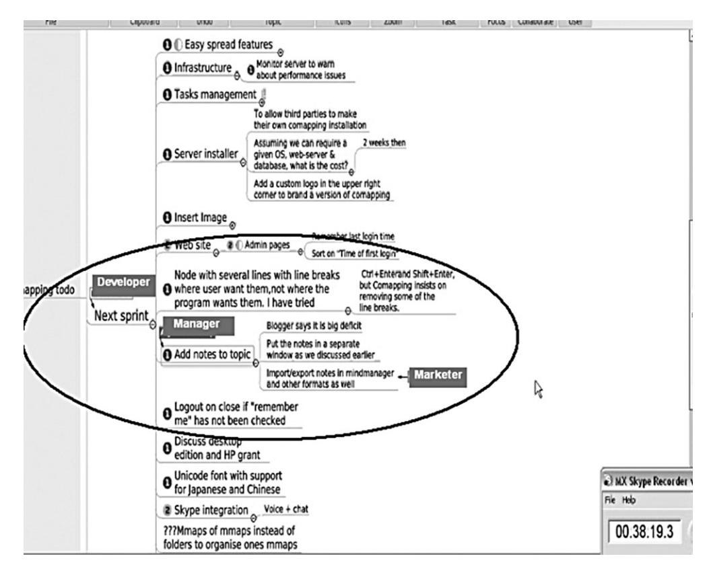
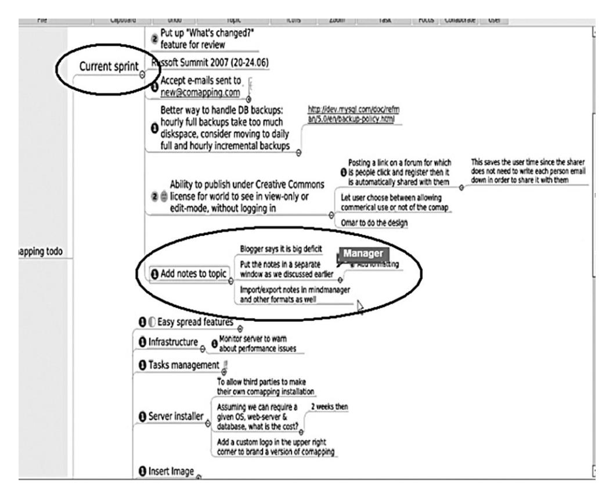

# **Aalborg Universitet**

## **Agile distributed software development**

enacting control through media and context Persson, John Stouby; Mathiassen, Lars; Aaen, Ivan

Published in: Information Systems Journal

DOI (link to publication from Publisher): [10.1111/j.1365-2575.2011.00390.x](https://doi.org/10.1111/j.1365-2575.2011.00390.x)

Publication date: 2012

Document Version Early version, also known as pre-print

[Link to publication from Aalborg University](https://vbn.aau.dk/en/publications/d40803b1-be92-420a-99cb-292db0325661)

Citation for published version (APA):

Persson, J. S., Mathiassen, L., & Aaen, I. (2012). Agile distributed software development: enacting control through media and context. Information Systems Journal, 22(6), 411-433. [https://doi.org/10.1111/j.1365-](https://doi.org/10.1111/j.1365-2575.2011.00390.x) [2575.2011.00390.x](https://doi.org/10.1111/j.1365-2575.2011.00390.x)

#### **General rights**

Copyright and moral rights for the publications made accessible in the public portal are retained by the authors and/or other copyright owners and it is a condition of accessing publications that users recognise and abide by the legal requirements associated with these rights.

- Users may download and print one copy of any publication from the public portal for the purpose of private study or research.
- You may not further distribute the material or use it for any profit-making activity or commercial gain

- You may freely distribute the URL identifying the publication in the public portal -

### **Take down policy**

If you believe that this document breaches copyright please contact us at vbn@aub.aau.dk providing details, and we will remove access to the work immediately and investigate your claim.

Downloaded from vbn.aau.dk on: June 14, 2026

# *Agile distributed software development: enacting control through media and contextisj\_*

John Stouby Persson,\* Lars Mathiassen† & Ivan Aaen‡

\*Aalborg University, Department of Computer Science, Selma Lagerlöfs Vej 300, 9220 Aalborg East, Denmark, email: john@cs.aau.dk, † Center for Process Innovation, J. Mack Robinson College of Business, Georgia State University, 35 Broad Street, NW, Atlanta GA 30303, email: lmathiassen@ceprin.org, and ‡ Aalborg University, Department of Computer Science, Selma Lagerlöfs Vej 300, 9220 Aalborg East, Denmark, email: aaen@acm.org

**Abstract.** *While face-to-face interaction is fundamental in agile software development, distributed environments must rely extensively on mediated interactions. Practicing agile principles in distributed environments therefore poses particular control challenges related to balancing fixed vs. evolving quality requirements and people vs. process-based collaboration. To investigate these challenges, we conducted an in-depth case study of a successful agile distributed software project with participants from a Russian firm and a Danish firm. Applying Kirsch's elements of control framework, we offer an analysis of how control was enacted through the project context and in the participants' mediated communication. The analysis reveals that formal measurement and evaluation control were persistently enacted through mediated communication. These formal control practices were, however, predominantly carried out in conjunction with informal roles and relationships such as clan-like control inherent in agile development. Overall, the study demonstrates that, if appropriately applied, communication technologies can significantly support distributed, agile practices by allowing concurrent enactment of both formal and informal controls. The paper discusses these findings as they relate to previous research and concludes with their implications for future research.*

*Keywords:* distributed development, agile project management, control theory

#### **INTRODUCTION**

Two significant trends have emerged in software development practice over the past years: agile methods and geographical distribution. These have recently been combined, so that agile methods are used in geographically distributed contexts (Pries-Heje *et al*., 2005; Agerfalk & Fitzgerald, 2006; Holmström *et al*., 2006; Armour, 2007; Sutherland *et al*., 2007; Paasivaara *et al*., 2008). Agility can offer significant benefits in risk reduction and quality improvement (Simons, 2006) and is perceived by managers and technical staff members as contributing to on-time completion and effective collaboration in distributed development (Sarker *et al*., 2009). However, agile methods require a carefully managed approach when applied to distributed contexts (Sarker & Sarker, 2009). While agile principles, with lightweight processes and reliance on skilled people, offer advantages in terms of flexibility, speed and learning, there is a risk that agile practices in distributed environments further reinforce the well-known difficulties related to collaboration and software quality.

In fact, agile principles present control challenges related to balancing fixed vs. evolving quality requirements and people vs. process-based collaboration (Ramesh *et al*., 2006). Harris *et al*. (2009b) propose that 'effective flexible software development processes must provide clear control mechanisms to manage the progress and quality of the resulting software products'. Maruping *et al*. (2009) further argue in their study of agile methods that control is an important contingency in a software team ability to respond to changing user requirements. Selecting an appropriate control portfolio 'is particularly important in today's complex development environment where the exercise of control cannot easily be done through direct, face-to-face observation or interaction with team members who may be distributed in different countries or companies, or both' (Harris *et al*., 2009a).

Studies of control in geographically distributed contexts have been conducted in relation to issues such as culture (Narayanaswamy & Henry, 2005), effectiveness (Piccoli & Ives, 2000) and trust (Gallivan, 2001; Gallivan & Depledge, 2003; Piccoli & Ives, 2003). Kirsch (2004), however, calls for research to more closely examine the role of the global context on control choices and impacts. The global context is described in terms of priority differences among locales, multiple time zones, cultural variations and geographical distance. A further call for research on control in geographically distributed contexts has also been made by Powell *et al*. (2004). In their literature review, they question whether informal control mechanisms can be used when teams are short-lived and rarely meet face to face. This concern increases as agile principles are adopted because these principles mainly rely on face-to-face communication (Fowler & Highsmith, 2001). The agile principles related to communication practices have also been viewed as unsupportive for distributed development environments (Turk & France, 2005). As a result, Maruping *et al*. (2009) call for research to investigate 'the role of communication technologies in supporting the execution of individual agile practices, as an increasing proportion of software development is being conducted by distributed teams'.

Against this backdrop, the following in-depth single case study investigates control enacted through media usage and context to manage an agile distributed development project. The project spans geographical, cultural and organisational boundaries between a Russian and a Danish firm. The project successfully introduced a new product to the market and attracted investment from a Fortune500 Company. Hence, our goal is to contribute to calls for empirical research of agile software development (Dybå & Dingsøyr, 2008) in distributed settings (Agerfalk & Fitzgerald, 2006; Lee *et al*., 2006) with a focus on control (Kirsch, 2004; Powell *et al*., 2004) by addressing the following research question:

How do successful agile distributed software projects enact different elements of control through mediated communication and project context?

#### **DISTRIBUTED AND AGILE SOFTWARE PROJECTS**

Organising project teams in a geographically distributed setting – frequently conceptualised as virtual teams – has received significant research attention (Martins *et al*., 2004; Powell *et al*., 2004; Hertel *et al*., 2005; Connaughton & Shuffler, 2007; Schiller & Mandviwalla, 2007). An important underlying theme is that virtual teamwork is characterised by challenges and paradoxes often hindering innovation (Gibson & Gibbs, 2006; Dubé & Robey, 2009). In particular, distributed software projects experience numerous management challenges (Sakthivel, 2007; Iacovou & Nakatsu, 2008), including unclear task coupling (Sarker & Sahay, 2004; Sakthivel, 2005), poor process alignment (Herbsleb & Moitra, 2001), differing work cultures (Dubé & Paré, 2001; Krishna *et al*., 2004) and inhibited communication capabilities (Herbsleb & Mockus, 2003; Bjørn & Ngwenyama, 2009). A wide range of alleviating initiatives have been suggested, such as information and communication technologies (Jang *et al*., 2002; Bradner *et al*., 2005), risk management approaches (Sakthivel, 2007; Persson *et al*., 2009; Persson & Mathiassen, 2010), communication training (Warkentin & Beranek, 1999), best practice lists (Battin *et al*., 2001, Ebert and De Neve, 2001) and social integration strategies (van der Smagt, 2000; Kotlarsky & Oshri, 2005; Oshri *et al*., 2008). Among these initiatives, no silver bullet has been identified and new initiatives are continuously being studied.

Agile distributed development is a relatively new approach to address some of the challenges in distributed software projects (Pries-Heje *et al*., 2005; Holmström *et al*., 2006). However, in line with the software engineering silver bullet conundrum, new solutions induce new challenges (Berry, 2008). In fact, agile methods require a carefully managed adoption to distributed contexts (Sarker & Sarker, 2009) and when adopted, managers need to pay particular attention to controlling the process and quality across sites (Ramesh *et al*., 2006).

Agility can be defined as the continual readiness of a method 'to rapidly or inherently create change, proactively or reactively embrace change and learn from change while contributing to perceived customer value (economy, quality and simplicity) through its collective components and relationships with its environment' (Conboy, 2009). The concept of agility has been advanced in software development practice with the agile manifesto (Fowler & Highsmith, 2001) and development methods such as Scrum (Schwaber & Beedle, 2001) and Extreme Programming (Beck, 1999). Scrum (Sutherland *et al*., 2007; Paasivaara *et al*., 2008; Hossain *et al*., 2009) and Extreme Programming (Kircher *et al*., 2001; Braithwaite & Joyce, 2005; Layman *et al*., 2006) have furthermore both been introduced in distributed software development. In these settings, agility is defined as 'the capability of a distributed team to speedily accomplish information system (IS) development tasks and to adapt and reconfigure itself to changing conditions in a rapid manner' (Sarker & Sarker, 2009). Agile methods have been found to reduce the challenges associated with temporal, geographical and sociocultural distances (Holmström *et al*., 2006). However, Sarker & Sarker (2009) report that in some cases the use of agile methods in distributed settings induces challenges related to balancing frequent communication needs with different time zones, aligning agile practices across sites and avoiding dilution of the agile methods. Paasivaara *et al*. (2008) have furthermore documented challenges in agile distributed software development related to conveying requirements through communication in distributed meetings across cultural and geographical distance.

Hence, the agile characteristics of lightweight process, ongoing negotiation and reliance on skilled people introduce new challenges related to balancing people vs. process-oriented control and fixed vs. evolving quality requirements (Ramesh *et al*., 2006). As a result, there is a need for increased research attention to understand control enactment in the context of agile distributed software teams. There is a particular need to understand the conditions under which informal control is used in these settings (Yadav *et al*., 2009) because informal control is based on social and people strategies (Kirsch, 2004) corresponding to the agile principles emphasising face-toface interaction and building projects around motivated individuals (Fowler & Highsmith, 2001). However, as both formal and informal controls can be significant in agile software development methods (Harris *et al*., 2009b), we investigate the enactment of both forms of control.

#### **CONTROL OF SOFTWARE PROJECTS**

In her research of software development management, Kirsch (1996; 1997; 2000; 2004) has advocated the control perspective based on work by Ouchi (1978; 1979; 1980) and Eisenhardt (1985). Control is used broadly to denote any attempt to motivate individuals to behave in a manner consistent with organisational objectives (Ouchi, 1979; Kirsch, 2004). Control is viewed as either formal or informal (Jaworski, 1988; Kirsch, 1996; Cardinal *et al*., 2004). Formal control uses a performance evaluation strategy, where either behaviours or outcomes are measured, evaluated and rewarded (Eisenhardt, 1985; Kirsch, 1996). Informal control differs from formal control in that it is based on social and people strategies (Eisenhardt, 1985; Kirsch, 1996). The various modes of control are not applied separately (Ouchi, 1979). Instead, they are each part of a portfolio of control mechanisms that support management practice in different organisational contexts (Kirsch, 1997). This portfolio view of control is supported by Harris *et al*. (2009b) in their analysis of control in software development processes, in which they found that the analysed processes used more than one category of control.

Kirsch (2004) focuses on formal and informal controls in relation to four elements of control. These four elements are measurement, evaluation, rewards and sanctions, and roles and relationships, as shown in Table 1. The first three elements are based on a literature review by Eisenhardt (1985). The last element, roles and relationships, is an elaboration of the other elements added by Kirsch (2004).

Formal measurement implies that behaviours or outcomes are explicitly specified and measurable, whereas informal measurement implies that norms, values or behaviours are implicitly specified and measured. Evaluation refers to performance and information exchange. Formal evaluation is based on specified information regarding behaviour and outcome, and assesses whether current status leads to forward progress. Informal evaluation refers to norms

**Table 1.** The elements of control (Kirsch, 2004)

| Element                    | Formal                                                                                                                                                                                                                                                                                        | Informal                                                                                                                                                                                                                                                                                                           |
|----------------------------|-----------------------------------------------------------------------------------------------------------------------------------------------------------------------------------------------------------------------------------------------------------------------------------------------|--------------------------------------------------------------------------------------------------------------------------------------------------------------------------------------------------------------------------------------------------------------------------------------------------------------------|
| Measurement                | • pre-specified and formally documented goals and/or behaviours are available • control modes align the goals of controller and controllee • goals and/or behaviours are measurable                                                                                      | • few specified behaviours or procedures available • implicit specification and measurement of group values and norms • goals evolve over time • desired end states result when individual behaviour is consistent with the shared norms and values                               |
| Evaluation                 | • information about rules, procedures, behaviours and goals are exchanged • information is exchanged in formal, written documents such as standard operating procedures or status reports • evaluation assesses whether behaviour is resulting in forward progress | • information about norms, values and expectations exchanged • socialisation, training, discussions, dialogues and meetings serve as mechanisms of information exchange • goal of evaluation is to build and foster collegial relationships characterised by common values and norms |
| Rewards and sanctions   | • based on following specified rules or achieving specified targets • formal organisational mechanisms include pay, bonuses, promotion or demotion                                                                                                                             | • based on acting in a manner that is consistent with group norms and values • mechanisms include group recognition and peer pressure                                                                                                                                                               |
| Roles and relationships | • focus is usually on dyads • controller and controllee are often in a formal superior-subordinate relationship or in a relationship that is consistent with the organisational hierarchy                                                                                   | • often a work group or professional society • may be a clan, which is a group of individuals who are dependent on each other to accomplish their work and who are committed to achieving group goals                                                                                            |

and values that characterise a functional relationship assumed to lead to performance. The functional relationship is achieved by socialisation through dialogue or discussions. Rewards and sanctions in a formal setting are based on achieving specific goals or adhering to pre-specified behaviour. Formal rewards could be bonuses, and formal sanctions could be demotions. Informal rewards and sanctions are based on whether a behaviour is consistent with group values and norms. Informal rewards could be peer recognition, while informal sanctions could be social exclusion. Roles and relationships were added by Kirsch (2004) as an elaboration of the other three elements of control. Formal roles and relationships imply particular roles and usually focus on dyadic relationships. Informal roles and relationships appear in groups of individuals dependent on each other and committed to group goals (Kirsch, 2004).

#### **RESEARCH APPROACH**

The question was investigated through a single case study following the guidelines proposed by Yin (2003). The case study approach is suitable when the boundaries between a phenomenon and its context are unclear (Benbasat *et al*., 1987; Yin, 2003), as is the case in this study between control enactment and agile distributed contexts. A case study's capacity for investigating operational links (Yin, 2003) is also needed when pursuing explanatory knowledge, which is reflected in the use of a 'how' research question. The single case study approach is also well suited for testing the boundaries of well-formed theory (Benbasat *et al*., 1987; Yin, 2003), such as applying control theory, to better understand the relatively new practice of agile distributed development. Finally, a single case study is appropriate when the case is rare (Yin, 2003) as in this study, where we had rare access to video as well as audio recordings of mediated interactions in a successful distributed, agile development project crossing organisational and cultural boundaries.

The project was conceived by a small Danish software firm, *Area9*, as a joint venture with a Russian R&D outsourcing provider to finalise the development of a collaborative mindmapping tool called *Comapping*. *Area9* was established in 2006 by two medical doctors and two computer scientists. All four individuals came from management positions in another software firm that utilises offshore developers. *Area9* uses offshore developers located in Russia and India. *Area9* bases their development process on agile principles, managing distributed projects as if the developers were located in Denmark. This requires developers who are able to work in an agile environment and who possess excellent communication and collaboration skills. *Area9*'s agile practices are based on a combination of Extreme Programming (Beck, 1999) and Scrum (Schwaber & Beedle, 2001), including continuous integration, backlogs, parallel development and testing, incremental design, code reviews and sparse documentation. These practices are common to agile methods and are supportive of agility as defined by Conboy (2009) and Sarker & Sarker (2009). The *Comapping* tool was essentially developed both for internal use and for the general market, and this ensured the customer focus vital to agile development.

Data were collected over a half-year period. The primary data consisted of observations of how control was enacted through media usage to support e-conferences between project participants. These observations were supplemented by a series of interviews with individual project participants, investigating how control was enacted through the project context in which the e-conferences took place. The project used e-conferences based on Skype (http:// www.skype.com) and a working prototype of the *Comapping* tool under development (http:// www.comapping.com). The tool uses mindmapping diagrams to represent and share words, ideas, tasks or other items linked to a central keyword or idea in a project. Participants can collaborate on mindmaps in real time, similar to real-time collaboration with Google docs (http://docs.google.com). Even though the mindmapping tool had not been released for open beta when the case study was initiated, it had all its basic functionality. From the very start of the project, beta versions of the tool were used for project coordination and hence played a vital role in managing its own development. In Scrum terms, this tool was used for managing the project and sprint backlogs, which are the lists of tasks used for project planning and oversight. During the e-conferences, the first author was present offsite as a passive observer while audio recording conversations and video recording activities in *Comapping*. The conference language was English, and all e-conferences took place within normal working hours due to a time-zone difference of only 2 h between sites.

**Table 2.** Interviews and observations

| Date (2007) | Duration | Data type   | Actor(s)                     |  |
|-------------|----------|-------------|------------------------------|--|
| January 19  | 71 min   | Interview   | Manager                      |  |
| February 26 | 42 min   | Observation | Manager, Developer           |  |
| March 6     | 77 min   | Interview   | Manager                      |  |
|             | 26 min   | Observation | Manager, Developer           |  |
| March 22    | 32 min   | Interview   | Developer                    |  |
| March 27    | 21 min   | Observation | Manager, Developer           |  |
| April 5     | 32 min   | Interview   | Second Developer             |  |
|             | 32 min   | Observation | Marketer, Manager, Developer |  |
| April 24    | 12 min   | Interview   | Manager                      |  |
| May 3       | 37 min   | Observation | Marketer, Manager, Developer |  |
| May 8       | 56 min   | Interview   | Marketer                     |  |
| May 16      | 17 min   | Observation | Marketer, Manager, Developer |  |
| May 21      | 64 min   | Observation | Marketer, Manager, Developer |  |
| June 4      | 32 min   | Observation | Marketer, Manager, Developer |  |
| June 26     | 50 min   | Observation | Marketer, Manager, Developer |  |
| June 27     | 93 min   | Interview   | Manager                      |  |
| June 28     | 40 min   | Interview   | Marketer                     |  |
| July 2      | 15 min   | Observation | Marketer, Manager, Developer |  |
| July 13     | 26 min   | Interview   | Developer                    |  |
| July 17     | 43 min   | Interview   | Second Developer             |  |
| August 8    | 31 min   | Interview   | Chairman                     |  |

A total of 10 observations and 11 semi-structured interviews were conducted (see Table 2). The people interviewed were as follows: the manager (Denmark), who is a board member of the *Comapping* project and director of Technology & Innovation at *Area9*; the developer (Russia), who is the director of R&D for the *Comapping* project; the second developer (Russia), who is a software developer in the *Comapping* project; the marketer (Denmark), who is the chief executive officer (CEO) for the *Comapping* joint venture; and the chairman (Denmark) of the joint venture and CEO of *Area9*. The interviews were initiated with a face-to-face meeting with the manager. After this first meeting, observations were initiated and a series of interviews with key full-time project participants was conducted through Skype. The interview objective was to investigate the emphasis on measurement, evaluation, rewards and sanctions, and roles and relations in the project context and the underlying reasoning behind the choices made. Towards the end of the case study, a new series of interviews was conducted with the project participants and the chairman (see Table 2). The objective of these interviews was to uncover participants' assessments of how control was enacted and possibly changed over the considered time period through retrospective reasoning. During these interviews the *Comapping* tool was used by both the interviewer and interviewee to model a timeline of the project.

Data analysis was conducted with the qualitative data analysis software Atlas.ti V5.2 (ATLAS.ti Scientific Software Development GmbH, Berlin, Germany) (Muhr, 2008). All 14 h of recordings were loaded into the software and carefully listened through. Statements in the

**Table 3.** Project context control identified in interviews

| Elements of control             | Formal                                                                       | Informal                                                 |
|---------------------------------|------------------------------------------------------------------------------|----------------------------------------------------------|
| Measurement (48)                | Documented (9) Specified goals (12) Specified behaviour (7)            | Norms and values (13) Evolving goals (14)             |
| Evaluation (36)                 | Goal alignment (5) Rules                                                  | Norms and values (12)                                    |
|                                 | Procedures (3) Specified goals (3) Specified behaviour (2)             | Expectations (5) Socialisation (5) Training (2)    |
| Rewards and                     | Documented (13) Rules                                                     | Dialogues (9)- Norms and values (5)                   |
| sanctions (10)                  | Specified targets (1) Pay (4) Bonuses Promotion (1) Demotion (1) | Group recognition (5) Peer pressure (1)               |
| Roles and relationships (94) | Dyad (12) Hierarchal (5)                                                  | Work group (43) Professional society (1) Clan (34) |

interviews and exchanges in the form of one or more coherent decisions, claims, directives or mindmap activities during the e-conferences pertaining to control were identified and coded as one of the four elements of control. The coding scheme was developed and piloted by two authors based on the central concepts from Table 1, describing Kirsch's (2004) elements of control. In addition to the codes, descriptions were added of how each element of control under consideration was applied. The coding was subsequently conducted by the first author over two coding iterations. The first iteration results and experiences were discussed with the second author to resolve ambiguities and uncertainties. This approach helped consolidate the coding scheme and ensure that codes were applied consistently across the interview and e-conference data. The single-person approach to both data collection and analysis allowed him to develop an in-depth understanding of the data and ensured consistent coding across the various data sources. However, as only one coder was used, we were not able to calculate an inter-rater reliability statistic that would have allowed us to more objectively assess the adequacy and consistency of the coding. The analysis of the interviews identified 94 statements related to how control was enacted through the project context (see Table 3), and the analysis of the e-conferences identified 54 exchanges related to how control was enacted through mediated communication (see Table 4).

#### **ANALYSIS**

The *Comapping* project started at *Area9* in February 2006 with the idea of creating a Webbased mindmapping system. The idea was presented to the Russian outsourcing provider and

**Table 4.** Mediated communication control identified in e-conferences

| Elements of control          | Formal                                                                                    | Informal                                                                               |
|------------------------------|-------------------------------------------------------------------------------------------|----------------------------------------------------------------------------------------|
| Measurement (24)             | Documented (15) Specified goals (13) Specified behaviour Goal alignment          | Norms and values (1) Evolving goals (12)                                            |
| Evaluation (24)              | Rules Procedures (3) Specified goals (13) Specified behaviour Documented (14) | Norms and values (1) Expectations (6) Socialisation Training Dialogues (8) |
| Rewards and sanctions (5)    | Rules Specified targets Pay Bonuses Promotion Demotion                     | Norms and values (1) Group recognition (3) Peer pressure (2)                     |
| Roles and relationships (53) | Dyad (5) Hierarchal                                                                    | Work group (38) Professional society Clan (10)                                   |

the joint-venture project between the two firms was established in April 2006. The two firms had equal ownership but made different contributions to the project. The Russian partner assigned two developers to the project while *Area9* provided management, architectural and design expertise. Both information technology professionals in *Area9* worked as full-time developers on the project along with the two Russian developers, and together they had a proof of concept ready the following month. However, as the project evolved, the *Area9* participants decreased their contribution as developers, leaving more responsibility to the Russian developers. One of the *Area9* participants stopped as developer, while the other, who previously had the primary responsibility for product development, handed over that role to one of the Russian developers. Another change was the hiring of three part-time managers for the project in April 2006. The three managers were supposed to develop a commercial strategy for the product. However, as they spent their time debating options and challenges without being able to agree on a strategy, they were released from the project in December 2006. The chairman (Denmark) resumed management responsibilities along with the previous manager (Denmark) and the managing developer (Russia).

We initiated the case study at this point in late February 2007. However, the new technically oriented management approach was short-lived. There was agreement that the project needed a business strategy for the product, and one of the three managers therefore rejoined the project as full-time CEO in April. A few months later a golden opportunity appeared as a Fortune500 Company partner was found. The new partner's customisation became the primary project objective and staff was increased to eight full-time developers. Our case study ended in July 2007 when the golden opportunity reorientation started.

Control was exercised in the project by multiple actors and in various forms. Table 3 summarises the distribution of 94 statements regarding how control was enacted through the project context. Similarly, Table 4 summarises the distribution of how control was enacted through mediated communication during the *Comapping* project e-conferences in 53 exchanges. The two tables summarise the occurrences of the codes derived from Kirsch's (2004) elements of control framework depicted in Table 1. The elements of control column show the number of identifications for each control element. In addition, the formal and informal columns show the number of control characteristics describing the identified instances of the control elements. A particular identification may have more than one control characteristic, e.g. instances of measurement can include both formal goal specification and documentation.

Our findings in relation to (1) measurement; (2) evaluation; and (3) rewards and sanctions are elaborated in the following sections. Roles and relationships are elaborated along with the three other elements as they were only identified in conjunction with these other elements. The three elements of control are elaborated by first presenting findings related to the project context from the interviews (summarised in Table 3), followed by findings related to mediated communication from the e-conferences (summarised in Table 4).

## **Measurement**

The *Comapping* project context included both formal and informal measurement. In fact, measurement accounted for more than half of the statements relating to control (see Table 3). A majority of these were formal, however both formal and informal measurement were frequently based on informal roles and relationships. The chairman emphasised this reliance on informal roles and relationships in their measurement as fundamental from the very beginning of the *Comapping* project. According to him, the initial intent with the *Comapping* project was to 'first get the right people on the bus and then decide where to drive'. Based on past collaborations, there was a high level of trust between the managers of *Area9* and the Russian outsourcing firm, which is in line with what we know about the importance of control and trust dialectics in inter-organisational electronic partnerships (Gallivan & Depledge, 2003). In fact, only a two-page contract was needed before the joint-venture project was established. The idea was to develop a Web-based collaborative mindmapping system that *Area9* could use in other projects. The chairman's focus on getting the right people is fundamental in agile development (Boehm & Turner, 2003; Augustine *et al*., 2005) and illustrates a high reliance on informal measurement where 'desired end states result when individual behaviour is consistent with the shared norms and values' (Kirsch, 2004). However, the use of a contract shows that formal measurement was also present – although limited – because of the strong reliance on informal roles and relationships. The extensive reliance on the 'right people', on high mutual dependency and on trust indicates clan-like roles and relationships, which is defined as 'a group of individuals who are dependent on each other to accomplish their work and who are committed to achieving group goals' (Kirsch, 2004).

Control enactment through real-time mediation during e-conferences also included both formal and informal measurement. These e-conferences included three project members: the

**Figure 1.** Screenshot of 'Next sprint' in the *Comapping* tool as participants discuss 'Add notes to topic'.

manager (board member of the *Comapping* joint venture and responsible for general management and product development), the marketer (CEO for the *Comapping* joint venture and responsible for its commercial strategy) and the developer (director of R&D for the *Comapping* joint venture and responsible for day-to-day product development). During the e-conferences they shared and manipulated a mindmap (a tree structure) where each node represents an assignment to team members or groups to be done in a present ('Current sprint') or future ('Next sprint') time box, which is a common technique for task management in agile development methodologies (Boehm & Turner, 2003; Jalote *et al*., 2004). As each participant could navigate the mindmap, all cursors were visible to the participants as a small box with the name of its owner (see Figure 1). Manipulations of the mindmap, e.g. deleting, adding or changing a node, were instantly visible to all participants. Formal control during these e-conferences appeared frequently when participants specified goals in the mindmap. One example occurred as a result of the participants discussing a system feature represented as the node 'Add notes to topic', under 'Next sprint' (see Figure 1).

**Figure 2.** Screenshot of 'Current sprint' in the *Comapping* tool as the manager has created 'Add formatting' under 'Put the notes in a separate window as we discussed earlier'.

In this case, the participants agreed that 'Add notes to topic' needs to be done, resulting in the manager moving the node and its sub-nodes from 'Next sprint' (Figure 1) to 'Current sprint' (Figure 2). In addition, the manager stated:

**Manager** (Denmark): I think it would be good to have the formatting also like we have on topics.

**Developer** (Russia): Formatting . . . okay ...Maybe formatting can be second turn.

**Manager** (Denmark): Yeah it could, but we should definitely think about it.

[The Manager creates a sub-node to 'Add notes to topic', named 'Add formatting', and marks it as second priority, see Figure 2]

**Developer** (Russia): Okay, let me just.

**Manager** (Denmark): I added that as a second priority.

This quote, along with the screenshots, is evidence of formal measurement through goal specification and documentation in the mindmap. However, informal roles and relationships are also illustrated in the third statement in the manager's use of 'we'.

The specific goals of the project were, however, very dynamic and continuously negotiated. Goal changes often occurred at the end of e-conferences during discussions regarding the content and deadlines for the current sprint. A deadline was not always set for a sprint and, in other instances, deadlines were moved. The marketer tried several times to introduce more specific and stable goals. At one point he suggested a contingency plan regarding when to perform a server upgrade, but this proposal met resistance from the manager. He argued instead for an in-flight sense-and-respond (Haeckel, 1995) approach to deal with project dynamics. Differences of opinions between these two participants also appeared in relation to product features. The marketer had told people that a desktop version of the system would be available within 2 months, but he still wanted new features added to the current Web-based version. The manager heatedly opposed this and argued that they needed to prioritise:

[All the participants' cursors are placed on the sub-node of 'Next sprint' called 'Discuss desktop edition and Hewlett Packard (HP) grant' that however shortly after is changed to 'Contact Xxx to hear about HP grant'. At the time of the following quote only the marketer's cursor is placed on the node while the two others' cursors are placed on 'Next sprint'. This constellation of cursors was persistent for almost the entire discussion related to this particular node.]

**Marketer** (Denmark): I was asking if we can devote one resource so something is happening to the desktop version.

**Manager** (Denmark): But that doesn't make sense, you need to answer the question, what is it you want from a business point of view, so if you say I want all of it you didn't answer the question.

**Developer** (Russia): You have to say what you want first.

**Manager** (Denmark): Yes, so it doesn't make sense to say we just need to keep the kettle burning on the desktop version, and therefore we should assign someone. That is not a good way to approach it I think. It is better to say what are the priorities, what is it I want to have first. Do you want the server installer before you want the desktop version or do you want the desktop version before you want the server installer or what is it you want?

**Marketer** (Denmark) interrupts: Okay, then I'll suggest we will just wait with this for a while until we are more certain.

[The long discussion on this topic did not lead to further changes to this mindmap node.]

The different placement of cursors in the mindmap in this exchange represents non-verbal communication between the participants. The manager and developer's placement of cursors away from the node being discussed communicates an alliance between them that suggests it is time to move away from the topic or end the discussion. During this exchange, the developer and manager relied on the clan structure to convince the marketer that a high level of uncertainty required the project to focus on a few prioritised features at a time. In fact, the manager stated in an interview that sprints and time boxing were introduced precisely because the project earlier had experienced difficulties in prioritising features and consequential low productivity.

## **Evaluation**

Evaluation was both formal and informal in the *Comapping* project. The participants, however, differed significantly in their attention to evaluation through the project context. The marketer had a limited focus on evaluation in contrast to the manager and the two developers. The marketer illustrated this by his limited requests for information about activities in Russia. He said, 'freedom with responsibility', and did not expect his time was well spent on the technical aspects of the project. Instead, he focused on marketing challenges. In addition, the marketer stated that it would not make sense for him to provide feedback to the developers because the joint venture was small and he trusted that they worked as hard as they could. In contrast, the manager emphasised the importance of frequent contact with the remote site, arguing that if there were no exchanges for a week it was an indicator that little work had been done. In addition, he stated that demands for communication should come from both sites, although this could prove difficult. Hence, the manager emphasised frequent communication between him and the developers as the most crucial element in their agile practices, and he saw this capability as based on long-term relationships and trust. According to the key developer, the manager and he chatted daily with very few exceptions and used Skype on a weekly basis. Face-to-face communication was done on a monthly basis for the first 4–5 months of the *Comapping* project, but the developer considered the involvement of many new actors as the primary reason for these visits. While the developer preferred face-to-face communication, he did not consider it necessary between him and the manager. For the other developer, it varied significantly how frequently she communicated with the manager, from daily to weeks or months, depending on the specific task she was working on. Generally, the manager found it difficult to understand how distributed software projects could be effective without being agile. He argued that plan driven development with extensive reliance on documents and limited verbal communication would go against their experience that misunderstandings frequently occur when reliance on written communication is high and verbal communication is low.

Evaluation through mediated communication during e-conferences was also both formal and informal. Formal controls were procedures, specified goals and documentation. Informal controls were norms and values, expectations and dialogues. An example of a frequent formal procedure was the review, which was agreed upon in the following quote:

[The developer and manager's cursors are placed on the first sub-node of current sprint called 'Easy sign up' marked as a first priority]

**Manager** (Denmark): So do I need to do anything on that one [Easy sign up feature].

**Developer** (Russia): Probably not.

**Manager** (Denmark): So when you have something I can review it.

**Developer** (Russia): Yeah.

**Manager** (Denmark): Ok great, so it is fair to say it is 50% done.

[The manager places the 50% symbol next to the node 'Easy sign up feature']

**Developer** (Russia): Yes because it took time to understand how Joomla can be done.

Review agreements were continuously made throughout e-conferences. It was not only the project participants doing reviews for each other; sometimes they planned reviews to be conducted by other people in their respective firms. Sometimes, the participants also conducted reviews of new features during e-conferences by switching away from the *Comapping* tool to consider the current version of the system. There was also a documentation aspect of these reviews as the participants either wrote down who should do the review or, as in the earlier example, noted the task status in the mindmap.

The informal part of the evaluations took place as continuous negotiations of expectation:

[The manager is relocating the sub-nodes of 'Current sprint' so they are ordered by their priority]

**Marketer** (Denmark): Are you okay with this, or is it too much?

**Developer** (Russia): Let me just do a quick review – This should be fine, I think. The number ones are definitely doable shall we say two weeks as usual?

**Manager** (Denmark): If you prefer so that would be fine.

**Developer** (Russia): Okay let's go for two weeks – if we do well we can move faster – but I'm sure, some other things will be popping up.

[The manager creates a new sub-node of 'Current sprint' called 'Deadline: 4th of June']

In this exchange, the tree participants made an effort to balance expectations supported by the mindmap. The readily available representation of expectations in the mindmap provided the participants with a dynamically updated overview leading to final agreement. The marketer checked the other participants that were comfortable with the accumulated expectations by the end of the e-conference (start of the earlier quote) and the developer subsequently reminded the others of the usual uncertainties that might cause delays.

## **Rewards and sanctions**

The *Comapping* project participants had limited focus on rewards and sanctions in their accounts of how control was enacted through the context. Formal rewards relied on the key participants' ownership of the joint venture. The developer had a small ownership and was also paid by the Russian outsourcing firm, while the marketer had a large ownership and was not getting any salary. Because of the team's small size they did not exercise promotions or degradations, performance pay or bonus systems. Considering informal rewards, the manager argued that the project was prestigious with high involvement by the Russian outsourcing firm's top management and cutting edge technology. According to him, *Area9* also emphasised the importance of the product's actual qualities for the Russian developers. One developer accordingly stated that the delivery of a useful product was her most important goal and the other developer compared with a previous project: 'I didn't care about that product at all . . . what I care (in this project) is to make the customer happy in whatever way he wants and make my team happy'. Regarding sanctions, the manager pointed out that they tried to avoid a 'name and blame culture', although it could be difficult on critical issues. Possible sanctions included taking low-performing participants off the team. This sanction had been used on some parttime programmers. In addition, he emphasised that inadequate performing members might affect team cohesion and morale by adding to the workload or problems for other team members. The two developers rarely experienced articulation of positive feedback; they mainly relied on the absence of negative feedback as an indicator of acceptance.

Reward and sanction controls were rarely enacted during e-conferences. No formal controls were observed and only a few of an informal nature. One example of group recognition occurred as the manager commented on the work by the developer:

[This quote is from the beginning of the e-conference where neither of them is logged on to Comapping]

**Manager** (Denmark): So you made the map work with Joomla.

**Developer** (Russia): Yes.

**Manager** (Denmark): It looks good.

**Developer** (Russia) after two seconds of silence: And I actually found out I had to patch Joomla a bit to accept emails as user names – that is already done.

**Manager** (Denmark): Great.

In addition, the participants applied sanctions in the form of peer pressure. The following quote concerns the amount of features in the first update of the *Comapping* tool as its public release:

[All the participants' cursors are placed on the sub-node of 'Current sprint' called 'Add notes to topic' marked as a first priority and as 75% done, next to the nodes 'Publish map' and 'Share to all' marked with same priority and completion]

**Marketer** (Denmark): So we just have [the features] publish maps and add notes?

**Developer** (Russia): Yes, and the new share dialog . . .

**Marketer** (Denmark):... It's been six weeks right – and we are going into the seventh week – so in two months we come out with two features.

**Developer** (Russia): Which is not good, I agree – which is not impressive.

**Marketer** (Denmark): No . . .

In this exchange, the marketer indirectly pressures the developer to implement more features for the upcoming system update. (The e-conference was held 26 June and the update was released 11 July including six new features.) This peer pressure relied on an implicit norm of what is an acceptable level of productivity. Further, it was supported by the clan mentality focusing on 'we', underlining mutual dependence and shared productivity norms.

#### **DISCUSSION**

In the following, we review the detailed analysis of the *Comapping* project relative to our research question: How do successful agile distributed software projects enact different elements of control through mediated communication and project context?

Previous research questions whether informal control mechanisms generally can be used when teams are short-lived and rarely meet face to face (Powell *et al*., 2004). The *Comapping* project shows how a team distributed across geography, culture and firms can succeed with the product they developed while being highly reliant on informal controls. We found evidence of all Kirsch's (2004) elements of control in the participant statements about the project context and our own observations of technology mediated real-time exchanges during the project's e-conferences. Moreover, considerable elements of informal as well as formal control were enacted both through the context and media usage although emphasis was uneven across the elements. Comparing the distribution of the 94 statements on the context (see Table 3) with the 53 exchanges in the e-conferences (Table 4), notable differences and similarities are present. While the informal elements of control are distributed similarly when comparing statements about the project context and mediated exchanges during e-conferences, there are significant differences regarding the formal elements of control. Formal rewards and sanctions were not enacted at all during e-conferences and formal measurement, and evaluation was observed more frequently during e-conferences compared with the project context. While this suggests that contextual controls were more informal than those enacted through real-time mediated communication, roles and relationships were more frequently informal during e-conference exchanges.

Informal control enactment during e-conferences can occur because meetings in general are mostly an informal exchange mechanism (Kirsch, 2004). However, it is for this reason surprising to observe the extensive formal measurement and evaluation controls during e-conferences. Usage of the collaborative mindmapping tool facilitated formalised measurement and evaluation through documentation and goal specification, thereby making it a mediated alternative to face-to-face meetings with paper note and white board documentation used in agile practices such as Extreme Programming's planning game (Beck, 1999) or Scrum's sprint planning and review meetings (Schwaber & Beedle, 2001). Compared with face-to-face communication, lean communication media such as teleconferencing may therefore call for more structure with procedures and documents because of the absence of traditional non-verbal visual cues and visualisation aids. The application of the *Comapping* tool in the project appeared to address this need by providing alternative visual cues closely related to the project's unfolding task profile. The *Comapping* tool might in this way prove useful in other agile distributed software projects experiencing difficulties during mediated meetings. The emphasis on present tasks in the e-conferences can also be seen as emergent outcome control, which is suggested by Harris *et al*. (2009a) to describe flexible software development under uncertainty. Emergent outcome control is described as continuing corrective actions evaluated by multiple stakeholders with evolving standards (Harris *et al*., 2009a) and is thereby utilising several elements of control suggested by Kirsch (2004), as shown in Table 1.

Previous research suggests that informal roles and relationships such as the clan-like control inherent in agile development will likely be more difficult to practice in a distributed setting (Harris *et al*., 2006, 2009b). Harris *et al*. (2009b) argue that clan control can be increasingly difficult when interaction is not face to face but mediated by technology and when participants come from different organisations (e.g. when consultants are used or when development is partly outsourced). Contrary to this claim, the results from the *Comapping* project suggest that agile practices and clan-like controls were pervasively observable both in real-time mediated exchanges between project participants and in their accounts of the project context. While the participants did have hierarchical controls available (as indicated by their formal titles) in the project context, we found no instances in which formal, hierarchical relationships were expressed during e-conferences. The reliance on informal roles and relationships instead of formal titles during e-conferences supports the standard agile principles of getting the right people and establishing mutual trust (Boehm & Turner, 2003; Augustine *et al*., 2005). In another study, Ramesh *et al*. (2006) found that trust in agile distributed software development 'helped in limiting the formality with which agreements were specified and thus enabled the development teams to rapidly adapt to the changing needs of the project'.

A high number of informal work group statements and exchanges suggest consistent high attention to the task at hand, while the second most frequent clan-like pattern indicates a high level of mutual dependence among team members. The clan pattern is not surprising considering the agile principles adopted in the *Comapping* project. It is, however, surprising when considering the argued difficulties for clan control in distributed settings (Harris *et al*., 2009b). The appearance and effectiveness of clan controls in the *Comapping* project can be explained in two ways: first, because of the high level of trust and long-term relationships between not only the participants but also the two firms, which lead to fewer formal and more informal controls (Kirsch, 2004); second, because of the *Comapping* project's high goal congruence and high performance ambiguity (Ouchi, 1980). Clan controls thereby appear as essential in agility when defined as 'the capability of a distributed team to speedily accomplish IS development tasks and to adapt and reconfigure itself to changing conditions in a rapid manner' (Sarker & Sarker, 2009). The informal roles and relationships allowed all participants to act as both controller and controllee in their continuous attempts to influence decision-making during e-conferences (Choudhury & Sabherwal, 2003), which is a situation different from the traditional distinction in software development between controllers exercising control and controllees delivering on the agreed tasks to meet desired objectives (Kirsch & Cummings, 1996; Kirsch *et al*., 2002). In the study of control in agile projects by Maruping *et al*. (2009), they also found that 'autonomy is most supportive when it is granted to the team as whole, as opposed to individuals within the team'. While the *Comapping* project had high goal congruence based on contextual factors such as shared history and ownership, incidents of misalignment were observed in their mediated communication. These misaligned goals were predominantly with the marketer who was new and therefore did not share the team's norms and values initially. In these cases, the team mainly enacted informal control where 'socialisation, training, discussions, dialogues and meetings serve as mechanisms of information exchange' opposite to formal evaluation where 'information about rules, procedures, behaviours and goals are exchanged' (Kirsch, 2004).

In our study of the *Comapping* project, agile practices were primarily identified by effect and to a lesser extent by participants naming them. Reflecting the adoption of a hybrid method of Scrum and Extreme Programming customised to the project contexts and tasks. A practice identified by effect was collective code ownership as prescribed by Extreme Programming (Beck, 1999) involving informal roles and relationships as underlying basis and informal evaluation through exchanges about norms, values and expectations. These informal controls were also present in the project adaption of the onsite costumer practice prescribed in Extreme Programming carried out by the chairman and combined with continuous user interaction. This practice corresponds to the agile project manager principle '1. Deliver something useful to the client; check what they value' (Larman, 2004), which is the first of nine principles all identifiable by effect in the *Comapping* project. A prominent agile practice mentioned by the participants in the *Comapping* project was the use of sprints originating from Scrum (Schwaber & Beedle, 2001) and with similarities to the planning game in Extreme Programming (Beck, 1999). This practice represents both formal and informal measurement by incorporating the pre-specification and documentation of goals on one hand and evolving goals on the other.

Our study shows that formal and informal elements can successfully be combined to control agile distributed software development. The study suggests that informal clan-like control elements typical for agile teams can be combined with formal control elements more typical for other distributed development teams without losing the mutual trust and shared commitments in the team. One explanation for this may be that the *Comapping* tool was used for backlog management. Product and sprint backlogs are used in Scrum projects to visualise tasks and task status to the team (Schwaber & Beedle, 2001). The backlogs represent a set of shared commitments to the team, and translating the backlogs to a Web-based mindmapping tool seems to agree with basic agile values in the team. Thus, the formal control elements introduced to compensate for the distribution were not perceived as impediments to agile practices. Managers may therefore emphasise informal as well as formal control in distributed software development. Agile methods and real-time communication and coordination systems such as the *Comapping* tool may facilitate such informal control practices. Roles and relationships can furthermore be extensively informal in conjunction with other both formal and informal control practices in successful distributed software development.

#### **CONCLUSION**

The success of agile practices in collocated software development calls for careful consideration of its potential in distributed settings. We reported how elements of control can be enacted through mediated communication and project context to support success in distributed, agile software development. The considered project was controlled through formal as well as informal measurement, evaluation, and rewards and sanctions, and with very high dependency on informal roles and relationships. The case study revealed that formal measurement and evaluation control were enacted persistently through mediated communication. These formal control practices were, however, predominantly carried out in conjunction with informal roles and relationships such as clan-like control inherent in agile development. This underlines previous research stressing multiple categories of control in software project management (Kirsch, 1997; Harris *et al*., 2009a,b) and elaborates on previous research questioning the feasibility of high reliance on informal controls in distributed settings (Powell *et al*., 2004; Harris *et al*., 2009b). More specifically, as suggested by Maruping *et al*. (2009), the study demonstrates that communication technologies can play a significant role in supporting the execution of agile practices by allowing concurrent enactment of both formal and informal controls in backlog management.

These findings contribute to recent calls for empirical research of agile software development (Dybå & Dingsøyr, 2008) in distributed settings (Agerfalk & Fitzgerald, 2006; Lee *et al*., 2006) focused on control (Kirsch, 2004; Powell *et al*., 2004). More specifically, the study addresses the call for research to understand the conditions under which informal control is enacted in agile distributed software projects (Yadav *et al*., 2009) and the role of communication technologies in supporting agile practices (Maruping *et al*., 2009). The findings point in direction of further investigations of how different forms of control can be enacted to support software development in distributed, agile environments. Specifically, multiple case studies are needed to compare and contrast control patterns across different contexts. Important contextual variations to consider include choice of communication media, project size and participant diversity across both successful and unsuccessful projects.

## **REFERENCES**

Agerfalk, P.J. & Fitzgerald, B. (2006) Flexible and distributed software processes: old petunias in new bowls? *Communications of the ACM*, **49**, 26–34.

Armour, P.G. (2007) Agile . . . and offshore – an interview with a new paradigm. *Communications of the ACM*, **50**, 13–16.

Augustine, S., Payne, B., Sencindiver, F. & Woodcock, S. (2005) Agile project management: steering from the edges. *Communications of the ACM*, **48**, 85–89.

Battin, R.D., Crocker, R., Kreidler, J. & Subramanian, K. (2001) Leveraging resources in global software development. *IEEE Software*, **18**, 70–77.

Beck, K. (1999) *Extreme Programming Explained: Embrace Change*. Addison-Wesley, Boston, MA, USA.

Benbasat, I., Goldstein, D.K. & Mead, M. (1987) The case research strategy in studies of information systems. *MIS Quarterly*, **11**, 369–386.

- Berry, D.M. (2008) The software engineering silver bullet conundrum. *IEEE Software*, **25**, 18–19.
- Bjørn, P. & Ngwenyama, O. (2009) Virtual team collaboration: building shared meaning, resolving breakdowns and creating translucence. *Information Systems Journal*, **19**, 227–253.
- Boehm, B.W. & Turner, R. (2003) *Balancing Agility and Discipline: A Guide for the Perplexed*. Addison-Wesley Professional, Boston, MA, USA.
- Bradner, E., Mark, G. & Hertel, T.D. (2005) Team size and technology fit: participation, awareness, and rapport in distributed teams. *IEEE Transactions on Professional Communication*, **48**, 68–77.
- Braithwaite, K. & Joyce, T. (2005) XP expanded: distributed extreme programming. In: *6th International Conference on eXtreme Programming*, 180–188.
- Cardinal, L., Sitkin, S. & Long, C. (2004) Balancing and rebalancing in the creation and evolution of organizational control. *Organization Science*, **15**, 411–431.
- Choudhury, V. & Sabherwal, R. (2003) Portfolios of control in outsourced software development projects. *Information Systems Research*, **14**, 291–314.
- Conboy, K. (2009) Agility from first principles: reconstructing the concept of agility in information systems development. *Information Systems Research*, **20**, 329– 354.
- Connaughton, S. & Shuffler, M. (2007) Multinational and multicultural distributed teams: a review and future agenda. *Small Group Research*, **38**, 387–412.
- Dubé, L. & Paré, G. (2001) Global virtual teams. *Communications of the ACM*, **44**, 71–73.
- Dubé, L. & Robey, D. (2009) Surviving the paradoxes of virtual teamwork. *Information Systems Journal*, **19**, 3–30.
- Dybå, T. & Dingsøyr, T. (2008) Empirical studies of agile software development: a systematic review. *Information and Software Technology*, **50**, 833–859.
- Ebert, C. & De Neve, P. (2001) Surviving global software development. *IEEE Software*, **18**, 62–69.
- Eisenhardt, K.M. (1985) Control organizational and economic approaches. *Management Science*, **31**, 134–149.
- Fowler, M. & Highsmith, J. (2001) The agile manifesto. [WWW document]. URL http://www.agilemanifesto.org/
- Gallivan, M.J. (2001) Striking a balance between trust and control in a virtual organization: a content analysis of open source software case studies. *Information Systems Journal*, **11**, 277–304.
- Gallivan, M.J. & Depledge, G. (2003) Trust, control and the role of interorganizational systems in electronic partnerships. *Information Systems Journal*, **13**, 159–190.

- Gibson, C.B. & Gibbs, J.L. (2006) Unpacking the concept of virtuality: the effects of geographic dispersion, electronic dependence, dynamic structure, and national diversity on team innovation. *Administrative Science Quarterly*, **51**, 451–495.
- Haeckel, S. (1995) Adaptive enterprise design: the senseand-respond model. *Planning Review*, **23**, 6–13, 42.
- Harris, M., Hevner, A.R. & Collins, R.W. (2006) Controls in flexible software development. In: *Proceedings of the 39th Annual Hawaii International Conference on System Sciences*, Vol. 9. IEEE, Hawaii.
- Harris, M., Collins, R. & Hevner, A. (2009a) Control of flexible software development under uncertainty. *Information Systems Research*, **20**, 400–419.
- Harris, M.L., Hevner, A.R. & Collins, R.W. (2009b) Controls in flexible software development. *Communications of the Association for Information Systems*, **24**, 757– 776.
- Herbsleb, J.D. & Mockus, A. (2003) An empirical study of speed and communication in globally distributed software development. *IEEE Transactions on Software Engineering*, **29**, 481–494.
- Herbsleb, J.D. & Moitra, D. (2001) Global software development. *IEEE Software*, **18**, 16–20.
- Hertel, G., Geister, S. & Konradt, U. (2005) Managing virtual teams: a review of current empirical research. *Human Resource Management Review*, **15**, 69–95.
- Holmström, H., Fitzgerald, B., Ågerfalk, P.J. & Conchúir, E.Ó. (2006) Agile practices reduce distance in global software development. *Information Systems Management*, **23**, 7–18.
- Hossain, E., Babar, M. & Paik, H. (2009) Using scrum in global software development: a systematic literature review. In: *Fourth IEEE International Conference on Global Software* Engineering, 175–184. Limerick, Ireland.
- Iacovou, C.L. & Nakatsu, R. (2008) A risk profile of offshore-outsourced development projects. *Communications of the ACM*, **51**, 89–94.
- Jalote, P., Palit, A., Kurien, P. & Peethamber, V.T. (2004) Timeboxing: a process model for iterative software development. *Journal of Systems and Software*, **70**, 117–127.
- Jang, C.-Y., Steinfield, C. & Pfaff, B. (2002) Virtual team awareness and groupware support: an evaluation of the TeamSCOPE system. *International Journal of Human-Computer Studies*, **56**, 109–126.
- Jaworski, B. (1988) Toward a theory of marketing control: environmental context, control types, and consequences. *The Journal of Marketing*, **52**, 23–39.

- Kircher, M., Jain, P., Corsaro, A. & Levine, D. (2001) Distributed extreme programming. In: *Proceedings of the International Conference on eXtreme Programming and Flexible Processes in Software Engineering*. Sardinia, Italy.
- Kirsch, L.J. (1996) The management of complex tasks in organizations: controlling the systems development process. *Organization Science*, **7**, 1–21.
- Kirsch, L.J. (1997) Portfolios of control modes and IS project management. *Information Systems Research*, **8**, 215–239.
- Kirsch, L.J. (2000) Software project management: an integrated perspective for an emerging paradigm. In: *Framing the Domain of IT Management: Projecting the Future Through the Past*, Zmud, R.W. (ed.), pp. 285–304. PinnFlex Education Resources, Cincinnati, OH, USA.
- Kirsch, L.J. (2004) Deploying common systems globally: the dynamics of control. *Information Systems Research*, **15**, 374–395.
- Kirsch, L.J. & Cummings, L.L. (1996) Contextual influences on self-control of is professionals engaged in systems development. *Accounting, Management and Information Technologies*, **6**, 191–219.
- Kirsch, L.J., Sambamurthy, V., Ko, D.G. & Purvis, R.L. (2002) Controlling information systems development projects: the view from the client. *Management Science*, **48**, 484–498.
- Kotlarsky, J. & Oshri, I. (2005) Social ties, knowledge sharing and successful collaboration in globally distributed system development projects. *European Journal of Information Systems*, **14**, 37–48.
- Krishna, S., Sahay, S. & Walsham, G. (2004) Managing cross-cultural issues in global software outsourcing. *Communications of the ACM*, **47**, 62–66.
- Larman, C. (2004) *Agile and Iterative Development: A Manager's Guide*. Addison-Wesley, Boston, MA, USA.
- Layman, L., Williams, L., Damian, D. & Bures, H. (2006) Essential communication practices for Extreme Programming in a global software development team. *Information and Software Technology*, **48**, 781–794.
- Lee, O.K., Banerjee, P., Lim, K.H., Kumar, K., Van Hillegersberg, J. & Wei, K.K. (2006) Aligning it components to achieve agility in globally distributed system development. *Communications of the ACM*, **49**, 48–54.
- Martins, L.L., Gilson, L.L. & Maynard, M.T. (2004) Virtual teams: what do we know and where do we go from here? *Journal of Management*, **30**, 805–835.
- Maruping, L., Venkatesh, V. & Agarwal, R. (2009) A control theory perspective on agile methodology use and

- changing user requirements. *Information Systems Research*, **20**, 377–399.
- Muhr, T. (2008) *ATLAS.ti The Knowledge Workbench*. Scientific Software Development, Berlin, Germany.
- Narayanaswamy, R. & Henry, R.M. (2005) Effects of culture on control mechanisms in offshore outsourced IT projects. In: *Proceedings of the 2005 ACM SIGMIS on Computer Personnel Research*, 139–145. Atlanta, Georgia, USA.
- Oshri, I., Kotlarsky, J. & Willcocks, L. (2008) Missing links: building critical social ties for global collaborative teamwork. *Communications of the ACM*, **51**, 76–81.
- Ouchi, W.G. (1978) Transmission of control through organizational hierarchy. *Academy of Management Journal*, **21**, 173–192.
- Ouchi, W.G. (1979) Conceptual-framework for the design of organizational control mechanisms. *Management Science*, **25**, 833–848.
- Ouchi, W.G. (1980) Markets, bureaucracies, and clans. *Administrative Science Quarterly*, **25**, 129–141.
- Paasivaara, M., Durasiewicz, S. & Lassenius, C. (2008) Using scrum in a globally distributed project: a case study. *Software Process: Improvement and Practice*, **13**, 527–544.
- Persson, J.S. & Mathiassen, L. (2010) A process for managing risks in distributed teams. *IEEE Software*, **27**, 20–29.
- Persson, J.S., Mathiassen, L., Boeg, J., Madsen, T.S. & Steinson, F. (2009) Managing risks in distributed software projects: an integrative framework. *IEEE Transactions on Engineering Management*, **56**, 508–532.
- Piccoli, G. & Ives, B. (2000) Virtual teams: managerial behavior control's impact on team effectiveness. In: *Proceedings of the Twenty First International Conference on Information Systems*, 575–580. Association for Information Systems, Brisbane, Queensland, Australia.
- Piccoli, G. & Ives, B. (2003) Trust and the unintended effects of behavior control in virtual teams. *MIS Quarterly*, **27**, 365–395.
- Powell, A., Piccoli, G. & Ives, B. (2004) Virtual teams: a review of current literature and directions for future research. *Data Base for Advances in Information Systems*, **35**, 6–36.
- Pries-Heje, J., Baskerville, R. & Hansen, G.I. (2005) Strategy models for enabling offshore outsourcing: Russian short-cycle-time software development. *Information Technology for Development*, **11**, 5–30.
- Ramesh, B., Cao, L., Mohan, K. & Xu, P. (2006) Can distributed software development be agile? *Communications of the ACM*, **49**, 41–46.

- Sakthivel, S. (2005) Virtual workgroups in offshore systems development. *Information and Software Technology*, **47**, 305–318.
- Sakthivel, S. (2007) Managing risks in offshore systems development. *Communications of the ACM*, **50**, 69–75.
- Sarker, S. & Sahay, S. (2004) Implications of space and time for distributed work: an interpretive study of US-Norwegian systems development teams. *European Journal of Information Systems*, **13**, 3–20.
- Sarker, S. & Sarker, S. (2009) Exploring agility in distributed information systems development teams: an interpretive study in an offshoring context. *Information Systems Research*, **20**, 440–461.
- Sarker, S., Munson, C. & Chakraborty, S. (2009) Assessing the relative contribution of the facets of agility to distributed systems development success: an Analytic Hierarchy Process approach. *European Journal of Information Systems*, **18**, 285–299.
- Schiller, S.Z. & Mandviwalla, M. (2007) Virtual team research: an analysis of theory use and a framework for theory appropriation. *Small Group Research*, **38**, 12–59.
- Schwaber, K. & Beedle, M. (2001) *Agile Software Development with Scrum*. Prentice Hall, Upper Saddle River, NJ, USA.
- Simons, M. (2006) Global software development: a hard problem requiring a host of solutions. *Communications of the ACM*, **49**, 32–33.
- van der Smagt, T. (2000) Enhancing virtual teams: social relations v. communication technology. *Industrial Management & Data Systems*, **100**, 148–156.
- Sutherland, J., Viktorov, A., Blount, J. & Puntikov, N. (2007) Distributed scrum: agile project management with outsourced development teams. In: *Proceedings of the 40th Annual Hawaii International Conference on System Sciences*, Vol. 40.
- Turk, D. & France, R.R. (2005) Assumptions underlying agile software-development processes. *Journal of Database Management*, **16**, 62–87.
- Warkentin, M. & Beranek, P.M. (1999) Training to improve virtual team communication. *Information Systems Journal*, **9**, 271–289.
- Yadav, V., Adya, M., Sridhar, V. & Nath, D. (2009) Flexible global software development: antecedents of success in requirements analysis. *Journal of Global Information Management*, **17**, 1–31.
- Yin, R.K. (2003) *Case Study Research: Design and Methods*. Sage Publications Inc, Thousand Oaks, CA, USA.

## **Biographies**

**John Stouby Persson** is an Assistant Professor in the Department of Computer Science at the Aalborg University, Denmark. His research focuses on the management of software development in distributed settings and IT management in public organisations. His work has been published in *IEEE Transaction on Engineering Management*, *IEEE Software* and various IS conference proceedings. He holds a M.Sc. in Informatics and a Ph.D. in Information Systems from the Aalborg University. He can be reached at john@cs.aau.dk.

**Lars Mathiassen** is Georgia Research Alliance Eminent Scholar, Professor at the Computer Information Systems Department and Co-Founder of The Center for Process Innovation at the Georgia State University. His research focuses on development of software and information services, on IT-enabled innovation of business processes and on management and facilitation of organisational change processes. He approaches innovation and improvement initiatives with a strong focus on people skills and collaborative processes while at the same time emphasising adoption of state-of-the-art technologies and methods. He has published extensively in major ISs and software engineering journals and has co-authored several books on the subject including *Professional Systems Development*, *Computers in Context: The Philosophy and Practice of Systems Design*, *Object Oriented Analysis & Design* and *Improving Software Organizations: From Principles to Practice*. He has served as Senior Editor for *MIS Quarterly* and is currently serving in that capacity for *Journal of Information Technology and Information & Organization*. He can be reached at lmathiassen@ceprin.org.

**Ivan Aaen** is an Associate Professor of Computer Science at the Aalborg University, Denmark. His interests include software innovation, agile software engineering and ISs and is currently working on method development for innovative software teams. He leads Cassiopeia Innovation, a third mission organisation for university collaboration with the ICT industry. He holds a Ph.D. in computer science from the Aalborg University and is a member of the ACM and IEEE Computer Society. He can be reached at aaen@acm.org.