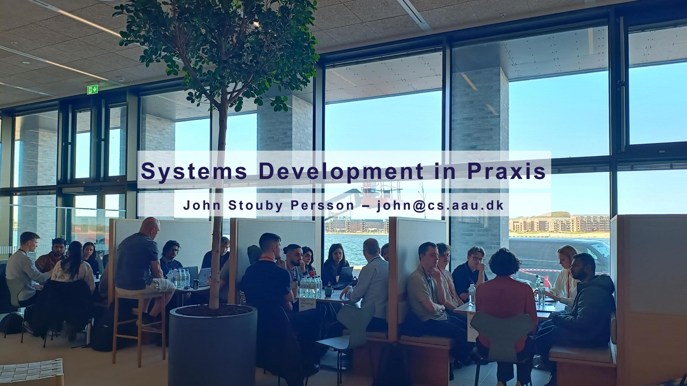
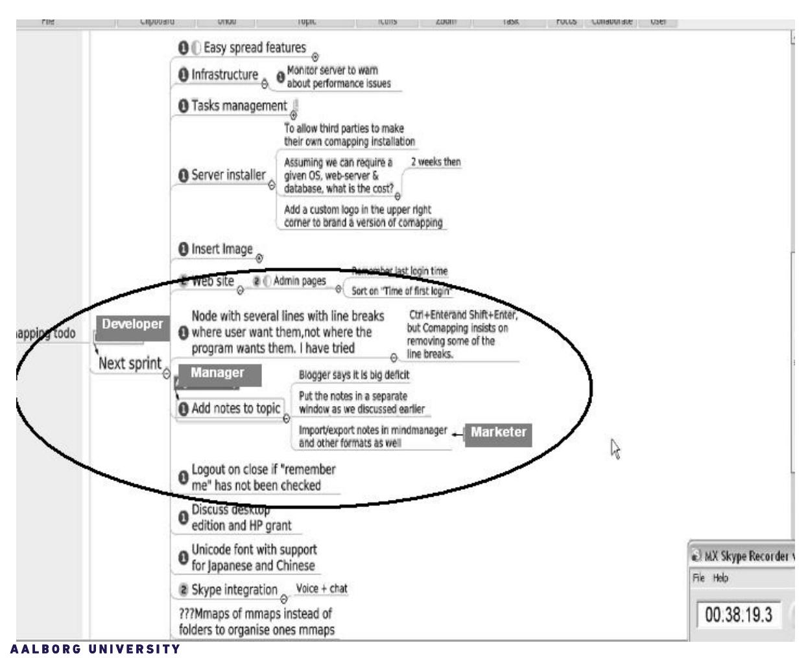
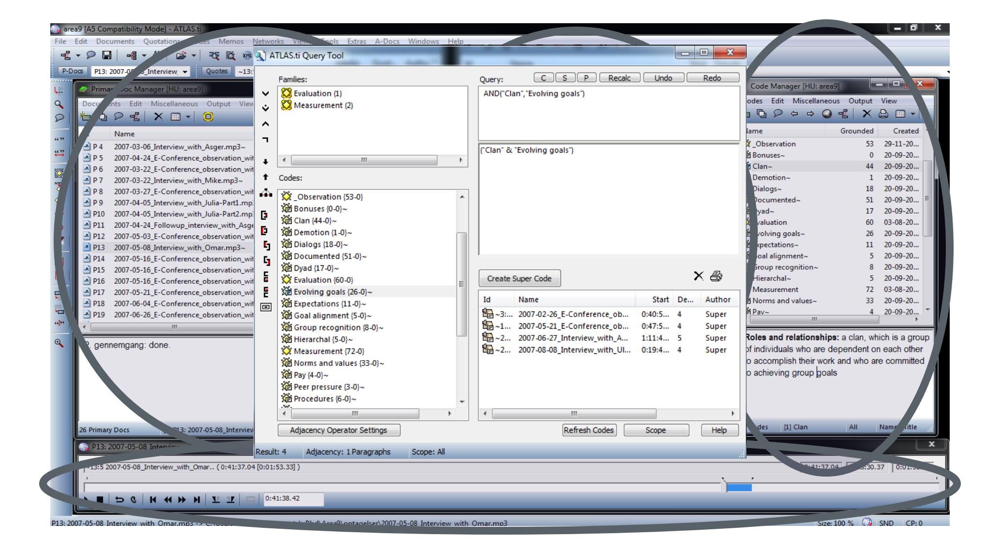
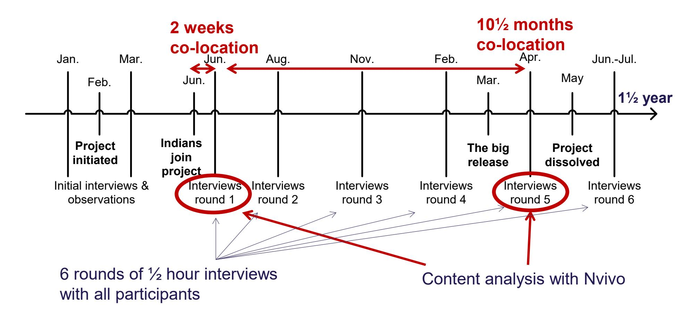
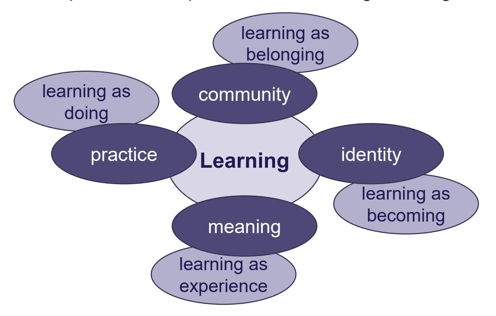
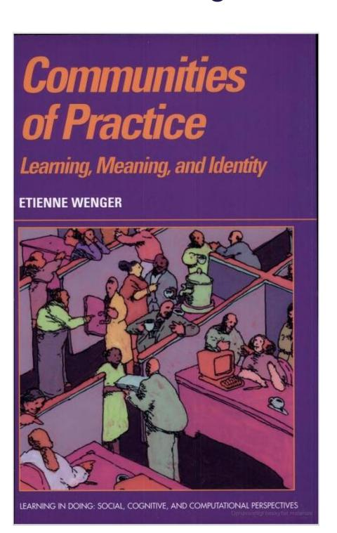
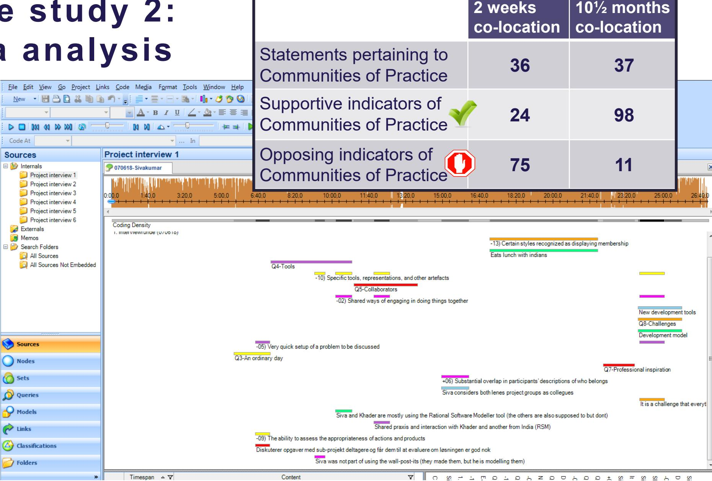
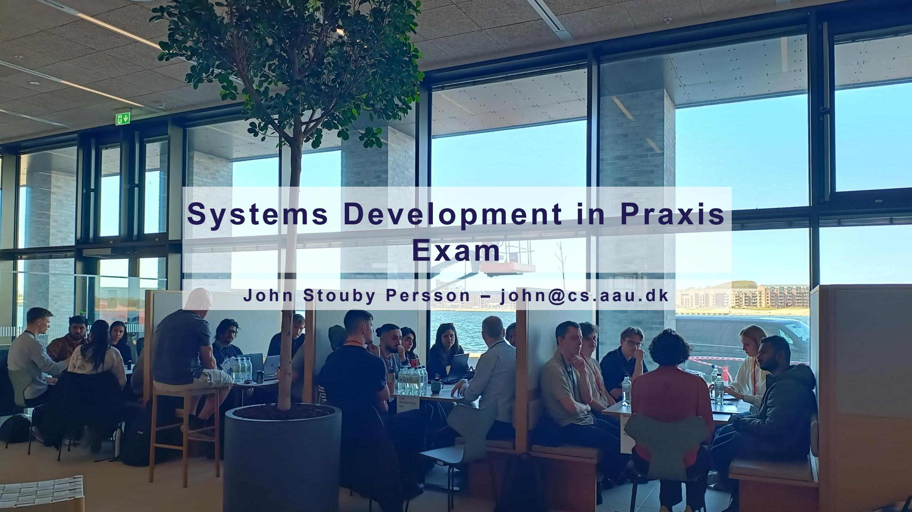
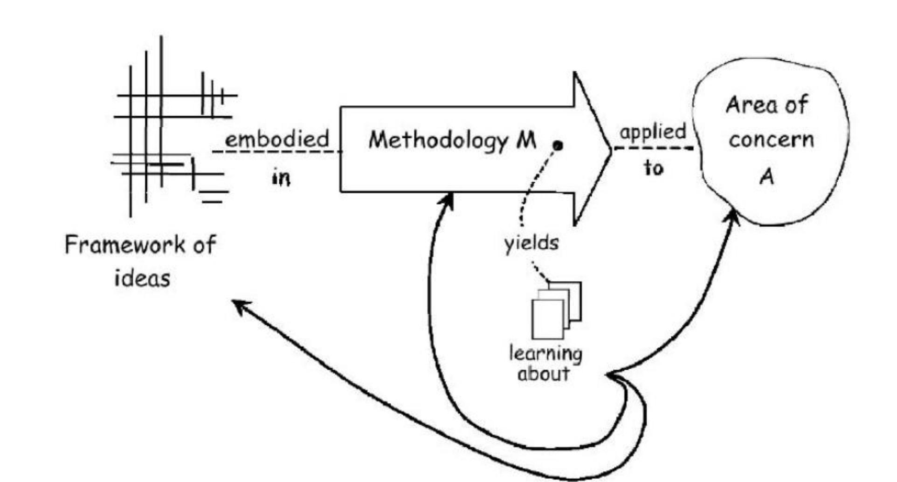

# **Agenda for Lecture 11&12 (12:30-16:15)**

- Discussion of the Norlys visit
- Paper discussion (Persson et al. 2012)
- Content analysis
- Exam
- Evaluation of the course

### **Lessons learned from the interviews**

- **Enterprise Architect:** Rasmus Witt
- **Scrum Master:** Eva-Maria Bücking-Rasmussen
- **Lead Developer/Tech Lead:** Kasper Harry Munck
- **Agile Coach:** Niels Platz
- **Product Owner:** Birgitte Frendrup Jakobsen
- **Business Information Security Officer:** Simon Deleuran Laursen

- A. What are the potential benefits and challenges of developing software in a geographically distributed project team?
- B. What is meant by "control" in the paper, and why is it important?
- C. How do the authors analyze the empirical data **(elaborated with the following slides on content analysis)**?
- D. What are the key differences between Table 3 and Table 4?
- E. What is the paper's key contribution to the research of agile and distributed software projects?
- F. What is the relevance of attending to control in Norlys?

### **Case studies**

Case study 1: Distributed software development team

Data collected: Video-recorded observations + Audio-recorded interviews

Analysis tool: Atlas.ti v.5.2 (2008)

Case study 2: Co-located software development team

Data collected: Audio-recorded interviews + observations

Analysis tool: Nvivo v.8 (2012)

**Nvivo is available for students at AAU: <https://www.en.ekstranet.its.aau.dk/software/NVIVO/>**

### **Case Study 1: The case**

Persson, John Stouby, Lars Mathiassen, and Ivan Aaen. "Agile distributed software development: enacting control through media and context."*Information Systems Journal* 22.6 (2012): 411-433.

**Approach:** A single case study with access to a rare case, suitable for testing boundaries of well-formed theory (Yin 2003)

### **Case study 1: Data collection**

- Data collection over 6 month in 2007
- 10 observations including complete audio and video recordings
- 11 semi-structured interviews

### **Case study 1: Theoretical framework**

**Control** meaning any attempt to motivate individuals to behave in manner consistent with organizational objectives (Kirsch 2004)

|          | Measurement                         | Evaluation               | Rewards and sanctions            | Roles and relationships |
|----------|-------------------------------------|--------------------------|-------------------------------------|----------------------------|
| Formal   | Documented goals and behavior | Documented procedures | Following rules and targets      | Superior subordinate    |
| Informal | Shared norms and values          | Socialization            | Recognition and peer pressure | Clan                       |

#### **Why investigate Control**

In distributed settings informal control appears very difficult, yet agile methods heavily reliant on such controls are successfully used in distributed projects

(Harris et al. 2006/2009)

### **Case study 1: Analysis**

# **Case study 1: Analysis**

### 1) Informal control were used even though the team was short lived and rarely met face-to-face

#### 2) Informal roles and relationships such as clanlike control inherent in agile development were pervasively observed in this distributed setting

#### **94 statements pertaining to control in the interviews**

| Elements of Control | Formal                 | Informal                 |
|------------------------|------------------------|--------------------------|
| Measurement            | Documented (9)         | Norms and values (13)    |
| (48)                   | Specified goals (12)   | Evolving goals (14)      |
|                        | Specified behavior (7) |                          |
|                        | Goal alignment (5)     |                          |
| Evaluation (36)        | Rules                  | Norms and values (12)    |
|                        | Procedures (3)         | Expectations (5)         |
|                        | Specified goals (3)    | Socialization (5)        |
|                        | Specified behavior (2) | Training (2)             |
|                        | Documented (13)        | Dialogs (9)              |
| Rewards and            | Rules                  | Norms and values (5)     |
| sanctions (10)         | Specified targets (1)  | Group recognition (5)    |
|                        | Pay (4)                | Peer pressure (1)        |
|                        | Bonuses                |                          |
|                        | Promotion (1)          |                          |
|                        | Demotion (1)           |                          |
| Roles and              | Dyad (12)              | Work group (43)          |
| relationships          | Hierarchal (5)         | Professional society (1) |
| (94)                   |                        | Clan (34)                |

#### **54 enactments of control in the mediated communication**

| Elements of     | Formal               | Informal              |
|-----------------|----------------------|-----------------------|
| Control         |                      |                       |
| Measurement     | Documented (15)      | Norms and values (1)  |
| (24)            | Specified goals (13) | Evolving goals (12)   |
|                 | Specified behavior   |                       |
|                 | Goal alignment       |                       |
| Evaluation (24) | Rules                | Norms and values (1)  |
|                 | Procedures (3)       | Expectations (6)      |
|                 | Specified goals (13) | Socialization         |
|                 | Specified behavior   | Training              |
|                 | Documented (14)      | Dialogs (8)           |
|                 |                      |                       |
| Rewards and     | Rules                | Norms and values (1)  |
| sanctions (5)   | Specified targets    | Group recognition (3) |
|                 | Pay                  | Peer pressure (2)     |
|                 | Bonuses              |                       |
|                 | Promotion            |                       |
|                 | Demotion             |                       |
| Roles and       | Dyad (5)             | Work group (38)       |
| relationships   | Hierarchal           | Professional society  |
| (53)            |                      | Clan (10)             |

# **Case studies**

Case study 1: Distributed software development team

Data collected: Video-recorded observations + Audio-recorded interviews

Analysis tool: Atlas.ti v.5.2 (2008)

Case study 2: Co-located software development team

Data collected: Audio-recorded interviews + observations

Analysis tool: Nvivo v.8 (2012)

# **Case study 2: The case**

Persson, John Stouby. "The cross-cultural knowledge sharing challenge: An investigation of the co-location strategy in software development offshoring."*IFIP WG 8.6 on Transfer and Diffusion of IT*. Bangalore, India, 2013. pp. 310-325.

#### Research Approach:

Interpretive single case study (Cavaye 1996; Walsham 2006)

#### Case setting:

A large IT integration project in the north European financial sector, moving an acquired organization onto the standard IT platform.

The company engage in extensive use of an Indian outsourcing provider for the first time, initially with the majority co-located in Denmark

Focus on a sub-project of 11 persons with 3 Indian and 5 Danish developers

### Case study 2: Data collection and analysis

### **Case study 2: Theoretical framework**

Communities of Practice:

A comprehensive explanation of knowledge sharing as collective learning

### **Case study 2: Coding scheme**

- *1) Sustained mutual relationships – harmonious or conflictual*
- *2) Shared ways of engaging in doing things together*
- *3) The rapid flow of information and propagation of innovation*
- *4) Absence of introductory preambles, as if conversations and interactions were merely the continuation of an ongoing process*
- *5) Very quick setup of a problem to be discussed*
- *6) Substantial overlap in participants' descriptions of who belongs*
- *7) Knowing what others know, what they can do, and how they can contribute to an enterprise*
- *8) Mutually defining identities*
- *9) The ability to assess the appropriateness of actions and products*
- *10) Specific tools, representations, and other artifacts*
- *11) Local lore, shared stories, inside jokes, knowing laughter*
- *12) Jargon and shortcuts to communication as well as the ease of producing new ones*
- *13) Certain styles recognized as displaying membership*
- *14) A shared discourse reflecting a certain perspective on the world*

### Short form

- *1) Sustained mutual relationships*
- *2) Shared ways of engagement together*
- *3) Rapid flow of information*
- *4) Conversations and interactions are ongoing*
- *5) Quick setup of problems*
- *6) Overlap in who belongs*
- *7) Knowing what others know, do, and contribute*
- *8) Mutually defining identities*
- *9) Ability to assess actions and products*
- *10) Specific tools, representations, and artifacts*
- *11) Lore, stories, jokes, and laughter*
- *12) Jargon and shortcuts to communication*
- *13) Styles displaying membership*
- *14) Shared discourse and perspective*

# **Case study 2: Data analysis**

Danish Software Developer

2 weeks after Indians arrival:

" I share an office with one… I think we try to include him (the Indian developer) and he tries to be included.

There are off course some language issues. Sometimes we want to discuss something with the person next to you in Danish because it is difficult to do in English. Then he is excluded because we talk Danish in some situations. But, when we have had a discussion, we sometimes follow up with a summary to him- saying we have just discussed this and this, what do you think of that?"

#### Indicators of Community of Practice

- *1) Sustained mutual relationships*
- *2) Shared ways of engagement together*
- *3) Rapid flow of information*
- *4) Conversations and interactions are ongoing*
- *5) Quick setup of problems*
- *6) Overlap in who belongs*
- *7) Knowing what others know, do, and contribute*
- *8) Mutually defining identities*
- *9) Ability to assess actions and products*
- *10) Specific tools, representations, and artifact*
- *11) Lore, stories, jokes, and laughter*
- *12) Jargon and shortcuts to communication*
- *13) Styles displaying membership*
- *14) Shared discourse and perspective*

# **Case study 2: Data analysis**

# **Case study 2: 2 weeks co-location**

#### Danish Developers Project Manager Indian Developers

**DDs IDs PM**

Indian software developer :

" … at present in the specification phase I am using RSM [IBM Rational Software Modeler]… it's a customized version for \**the company*\*… \**the other Indian Developer*\* is also making use of it, the others are also supposed to use it, but since it is a new tool they need some training… they do the work they are comfortable with, and I do the work I am comfortable with…"

| 1) Sustained mutual relationships                  |  |  |
|----------------------------------------------------|--|--|
| 2) Shared ways of engagement together              |  |  |
| 3) Rapid flow of information                       |  |  |
| 4) Conversations and interactions are ongoing      |  |  |
| 5) Quick setup of problems                         |  |  |
| 6) Overlap in who belongs                          |  |  |
| 7) Knowing what others know, do, and contribute    |  |  |
| 8) Mutually defining identities                    |  |  |
| 9) Ability to assess actions and products          |  |  |
| 10) Specific tools, representations, and artifacts |  |  |
| 11) Lore, stories, jokes, and laughter             |  |  |
| 12) Jargon and shortcuts to communication          |  |  |
| 13) Styles displaying membership                   |  |  |
| 14) Shared discourse and perspective               |  |  |
|                                                    |  |  |

# **Case study 2: 10 ½ months co-location**

#### Danish Developers Project Manager Indian Developers

**DDs IDs PM**

Indian software developer:

"… They feel we are one among them, not separated by you being from India. Their treatment brought us close. Our thoughts are similar, that is the thing, that made us more close. We used to make fun in our rooms when working and we used to laugh together and that gives a better relation…"

| 1) Sustained mutual relationships                  |  |  |
|----------------------------------------------------|--|--|
| 2) Shared ways of engagement together              |  |  |
| 3) Rapid flow of information                       |  |  |
| 4) Conversations and interactions are ongoing      |  |  |
| 5) Quick setup of problems                         |  |  |
| 6) Overlap in who belongs                          |  |  |
| 7) Knowing what others know, do, and contribute    |  |  |
| 8) Mutually defining identities                    |  |  |
| 9) Ability to assess actions and products          |  |  |
| 10) Specific tools, representations, and artifacts |  |  |
| 11) Lore, stories, jokes, and laughter             |  |  |
| 12) Jargon and shortcuts to communication          |  |  |
| 13) Styles displaying membership                   |  |  |
| 14) Shared discourse and perspective               |  |  |
|                                                    |  |  |

### **Case study 2: Findings**

**RQ:** *When co-locating cross-cultural software developers, 1) what knowledge sharing practices may emerge over time,*

- *1) Sustained mutual relationships*
- *2) Shared ways of engagement together*
- *3) Rapid flow of information*
- *4) Conversations and interactions are ongoing*
- *5) Quick setup of problems*
- *6) Overlap in who belongs*
- *7) Knowing what others know, do, and contribute*
- *8) Mutually defining identities*
- *9) Ability to assess actions and products*
- *10) Specific tools, representations, and artifacts*
- *11) Lore, stories, jokes, and laughter*
- *12) Jargon and shortcuts to communication*
- *13) Styles displaying membership*
- *14) Shared discourse and perspective*

**DDs IDs PM DDs IDs PM** 2 weeks co-location

10½ months co-location

### **Case study 2: Findings**

**RQ:** *When co-locating cross-cultural software developers,* 

- *1) what knowledge sharing practices may emerge over time,*
- *2) and how can such practices be facilitated?*

| Strategy                                        | Quotation                                                                                                                                                               |  |  |
|-------------------------------------------------|-------------------------------------------------------------------------------------------------------------------------------------------------------------------------|--|--|
| Shared office                                   | … everybody says, it would not have been the same, if they have been sitting in an entirely different office… (Project manager)                                |  |  |
| Shared responsibility for tasks and problems | … I am not alone with a task, it is a group assignment we are doing… (Indian developer)                                                                           |  |  |
| Shared prioritization of team spirit         | … we all wanted to create a good working relationship and we all know the importance of team spirit… (Danish developer)                                        |  |  |
| A champion of social integration             | … it is rare to see Indians eating lunch with Danes, but he often did that from day one, and influenced the other Indian project participants… (Danish developer) |  |  |

# **Individual written exam (see pdf on moodle)**

A short paper that reports a theory-directed analysis of a systems development praxis (Norlys). The student is expected to:

- select, explain, and use one of the theories presented in the course
- report an analysis that addresses a problem statement of relevance to both theory and practice of systems development
- discuss the results from the analysis in relation to one or more theories presented in the course.

The short paper must have a title and an abstract of maximum 150 words. The required length is 4 - 5 standard pages excluding abstract, figures, and references. A standard page is 2400 characters, including spacing, approximately 360 words. The paper can be written in Danish or English.

**The deadline for handing in is at 16:00 on June ??, 2026 in the digital exam system: [www.de.aau.dk/studerende/](http://www.de.aau.dk/studerende/)**

*Examples of good short papers are available on Moodle under lecture 2 (Brandborg 2017 - Hyper-learning in Netcompany) and lecture 5 (Jacobsen 2019 - Investigating Agile Management Fashions at Rohde Schwartz ).* 

# **Individual written exam (see pdf on moodle)**

AI-based tools (e.g. ChatGPT) are allowed to assist in idea generation, data analysis, grammar, text condensation, and text critique. However, generic text that is insufficiently grounded in the unique empirical material gathered from Norlys and the theories discussed in the course *will not receive a passing grade according to the assessment criteria*.

#### These assessment criteria are as follows:

- Clarity of the argument for the relevance of the problem statement and for the choice of theory used to address it.
- Correctness and precision in the account of the chosen theory.
- Transparent and systematic application of the chosen theory for the analysis of praxis.
- Traceability from the short paper's overall conclusions to statements in the empirical material.
- Explicit discussion of the results from the analysis with at least one other theory from the course that was not used for the analysis.

# **Individual consultation**

Tuesday, May 19th, 2025, via Microsoft Teams.

Please email **[john@cs.aau.dk](mailto:john@cs.aau.dk)** by no later than May 18th to request a consultation. I will then assign a time slot and send you a meeting invitation.

I will assign 10 minutes per student.

Please bring a detailed outline of your plan for the short paper.

# **Argumentation**

#### **General rules**

- 1. Resolve premises and conclusion
- 2. Unfold your ideas in a natural order
- 3. Start from reliable premises
- 4. Be concrete and concise
- 5. Build on supstance, not overtone
- 6. Use consistent terms

(Weston 2017, p. 1-7)

# **Argumentation**

#### **Common fallacies**

- *ad ignorantiam* (true by the absence of falsification)
- *affirming the consequent*

if **p** then **q.**

**q.**

Therefore, **p**.

- *begging the question* (the conclusion is a premise)
- *equivocation* (switching the meaning of a concept or term)
- *false dilemma* (delimitation to either or)

(Weston 2017, p. 87-94)

P. Checkland & S. Holwell (2007) Action Research: Its nature and validity, in *Information Systems Action Research: An Applied View of Emerging Concepts and Methods* by N. Kock (Ed.), Integrated Series in Information Systems Volume 13, pp 3-17.

# **Evaluation of the course**

Strengths and weaknesses of the

- Content
- Structure
- Relevance

Any suggestions for improvement?

### **What is interesting?**

*"Interesting theories are those which deny certain assumptions of the audience, while non-interesting theories are those which affirm certain assumptions of their audience."*

Example of *Composition*:

Davis (1971) That's Interesting! *Philosophy of the social sciences (Vol. 1, Iss. 4)*

### **What is interesting to you?**

The most important lesson about writing:

**Never attempt to write something you don't care about.**

