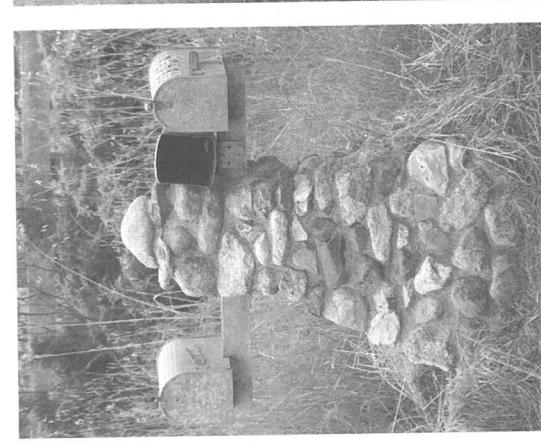
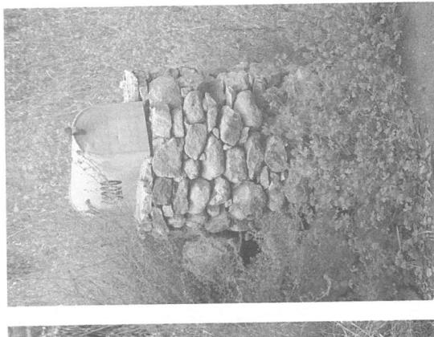
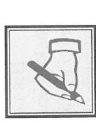

### The Most Important Writing Lesson

Figure 1. You can build anything you wish, in any style you wish, as long as you never attempt to write what you don't care about. Two builders, same materials, same neighborhood, two different mailboxes. (Photos by Earl Everett)

"I have never let my schooling interfere with my education."

-Mark Twain

This book will not repeat what they tried to teach you in English class. That didn't work for me, and it may not work for you. In fact, I wouldn't be a successful writer today if I hadn't cheated my way through college English.

I had always loved writing, but I had to struggle to preserve the romance as I endured English classes in high school. Whenever possible, I cut class. I looked forward to college, where I could choose my own courses, but I soon discovered that all freshmen were required to take English. I passed an exam that qualified me for something called "Advanced English Composition." On further investigation—writers should always pursue further investigation—I learned that this meant six intense weeks to cover "regular" English Composition, while at the same time taking a full English course in "advanced" topics.

That sounded like a lot of extra work to me, and much less opportunity to cut class, so I opted for the regular "dummies" class, thinking it would be easy. On the first day, we assembled on the second floor of Andrews Hall, only to discover that our section was actually two sections, with two different instructors. We stood in the hall while the instructors counted us off—one-two, one-two—to divide the class. I was a one.

The instructors were both men, but that's where the resemblance ended. One was skinny, immaculate, and clean-shaven, with hard eyes and bony cheeks. No smile. The other was rotund, clothed in wrinkles, with a white walrus moustache covering plump, rosy cheeks. He smiled as if he'd just taken a nip before class. I had no doubt as to which one was for me, but unfortunately, Bill Gaffney, the Walrus, was taking the twos. So, of course, I had to cheat.

I just moved with the twos. It was one of that handful of truly life-changing moments—but unrecognized until two weeks later.

The structure of the course produced groans, moans, and endless whining from the students. Each week, each student had to complete a writing assignment, and the high schools had apparently done their job well. Everyone hated writing. Everyone but me. At least until the first week's assignment—write a short description of some process.

It's ironic, looking back, that the next fifty years of my life were occupied writing descriptions of processes, something that I loved, did well, and earned me a fortune. But that warm September day in Lincoln, Nebraska, I thought it was the most boring possible writing assignment. I knew I couldn't do boring assignments, so after some thought, I challenged myself. I chose to write a humorous essay about treating poisonous snake bites.

It was quite a challenge. Even today, some forty books and four hundred articles later, I don't have the skill to make people laugh at poisonous snake bites. Back then, though, I was a teenager. I believed I could write anything.

I turned in the essay. Bill Gaffney turned it back with a C+, probably a rather generous grade. Looking at that red-marked paper, I knew that the whole semester—the whole year—was going to be more of that old English B.S. How depressing.

I don't remember what the next assignment was. All I remember was that I couldn't stand reading it, let alone writing it. It was due first thing Monday morning, and late Sunday night all I had done was make myself angrier and angrier over the stupidity of writing something that held no interest for me. But I had to write something, anything, to turn in.

I put a sheet of paper in my Olivetti portable and started venting my anger on the poor blameless machine. Two hours later, all my bile had been transformed into ink on paper, detailing every reason why I wasn't going to do the assignment. Or any other assignment like it. I handed it in the next morning, convinced I was going to get thrown out of school in my second week.

On Wednesday, the graded papers were handed back, but not mine. Instead, Gaffney handed me a note in red ink summoning me to his office after class. I was right. My brief college career was over.

His corner office was a mess, more rumpled than his tweed jacket, more tangled than his walrus moustache. Books piled everywhere. Reprints and monographs on every horizontal surface except the ceiling. Pipe smoke odor permeating everything. He motioned me to clear a space on one of the two wooden chairs, then shut the door on the passing student throng. He returned to his desk and picked up what I recognized as my paper. It was covered with red marks.

I took a deep breath, probably my last as a matriculated student. Before handing me the paper, Bill Gaffney packed his pipe, lit it with a Zippo, and blew out a huge cloud of pungent smoke. "I didn't want to say this in front of the class"—he puffed out another Vesuvian billow—"but in all the years I've been teaching freshmen English Composition"—another gargantuan puff—"this is the best paper I've ever received."

He handed me the paper. I forgot to close my hand, and the pages fluttered to the floor. He continued speaking to my bent back. "Your argument has totally convinced me, so from now on, you'll just ignore the assignments I give to the rest of the class. You'll still have to turn in a paper every week, but you'll choose whatever topic, whatever style, and whatever length you wish."

### Writing Lesson Number One

I wasn't aware of it at the time, but Bill Gaffney had just taught me the most important lesson about writing:

## Never attempt to write something you don't care about.

Previously, school had tried to teach me a different rule:

Write about what you know.

I've violated that rule countless times in my career. In fact, I start most of my writing projects because I *don't know* about something. For me, writing about a subject is one of the best ways to learn about it. And, of course, if I don't care about it, why would I want to learn about it?

#### First Exercise

What would you really like to write?

For many would-be writers, this is the hardest

exercise of all. They've never in their lives allowed themselves to think about what *they* want. So, put aside everything your teachers told you, your parents told you, your boss told you, your spouse told you, or I told you. Dream your dream.

Would you like to write about how to play pinball? What it feels like to canoe a Class V rapids? Your grandmother's knitting? What's wrong with the design of some computer system? Peace in Ireland? What you'd like your children to know about you? Something to amuse your grandchildren? How you get in touch with God? I can't tell you. This is what you have to find out for yourself.

Can it be more than one thing? Certainly.

Are you allowed to get it "wrong"? Absolutely.

Can you change your mind later? Definitely.

But right now, let your heart tell you what you'd like to write. Then write it down—just the title, or titles. Any more than that is optional.

Don't be disappointed if you can't identify what you really want to write. Quite likely, you'll find many answers, but none will be the *final* answer. I knew when I was eight years old, but I didn't know I knew until about forty years later.

Early in my life, I was identified by school authorities as a "smart" kid. After getting tested when I was six or seven, I was put ahead two full grades. When that didn't work—I was a troublemaker even among older kids—I was put in a room by myself and given special assignments, from writing papers to grading other students' IQ tests. I liked the writing, but not the isolation. The only time I interacted with other kids was before and after school, and at recess. Most of the interactions involved me taking a beating, either verbal or physical.

I was familiar with abusive interactions from my mother. She'd come after me whenever my father was away and I performed some task less than perfectly—which was most of the time. Whenever the vilification overwhelmed me, I would either try to kill myself or hide out in our backyard, under the lilac bushes, with my dog. Up to that point in my life, Pango was the only creature who never persecuted me.

I remember sitting in the bushes when I was eight years old, trying to reason my way out of misery. I believed I was "smart," because that's what everyone told me, but it didn't make sense. If I was truly smart, I should be able to figure out how to be happy, not wretched. Apparently, I didn't know how to use *smart* to create *happy*.

I vowed, then, to learn how to use my smarts to become happy.

One of the things I learned rather quickly was that the people abusing me weren't very happy either. I decided to surround myself with happy people. I started by looking for smart people, but soon I learned that most of them were also tortured by their smarts. So, I focused on reducing the number of potential torturers. I resolved to teach people what I was learning about being smart and happy. That was the mission I carried into freshman English composition, where Bill Gaffney taught me one way to accomplish it.

One way for smart people to be happy is to express themselves, to put out in the world the vast mélange of thoughts and feelings whirling in their heads. For me, that wasn't easy to do verbally—my speaking voice was squeaky and my mind always ran ahead of my mouth. In the school chorus, I was told quite early by the music teacher to move my mouth but never to make a sound. I might have been a painter, but my hand and eye didn't seem equal to the task. I dreamed of becoming a dancer or an athlete, but my klutzy body wouldn't cooperate.

Writing seemed my only road to happiness, but the road was barricaded by every English class I'd ever taken—until Bill Gaffney. Every teacher, every student, every book seemed to say that writing was miserable, hard work. The books were particularly discouraging. I don't know how many times I read this Gene Fowler quote: "Writing is easy. All you do is stare at a blank sheet of paper until drops of blood form on your forehead."

Well, maybe that was true for Gene Fowler, or maybe it's a myth authors repeat to discourage competition. In any case, no blood came out of my forehead that semester, or the next, in Bill Gaffney's class.

After earning a master's degree in physics at Berkeley, I took a job with IBM in San Francisco, went through some relocations ("I've Been Moved," we said the letters stood for), and wound up in the Federal Systems Division, in Our Nation's Capital. I was a specialist in the largest computers. I taught courses and wrote my first book—teaming up with a colleague, Herb Leeds, because we were both scared that we didn't know how to write a book. But we had fun, and neither of us saw blood.

The biggest part of my job was writing proposals for computer systems—again no blood because I truly believed in the good these

systems would do. But then came Project Mercury—to put the first American in space. I went to Norfolk, Virginia, with IBM's bidding team and was given the job of writing the proposal for the computer systems. Imagine my surprise when I mopped my brow and found blood.

I was stymied until I figured out what was wrong. As I wrote about the system NASA had asked the bidders to propose, I realized the architecture was all wrong. Simply put, it wouldn't work. I tried for a day to jiggle the approach, but finally realized that no amount of patchwork would help. It simply couldn't work. Now the blood was streaming out of my forehead.

Not knowing what to do, I turned to my strength—writing. Instead of writing the required proposal, I spun out my most careful argument about why the proposed approach could not work. This job was easy—no blood at all. Not even sweat. When I finished, I handed it to Jim Turnock, my boss, who read it and was convinced.

"Okay," he said, "now write a proposal that will work." I think I said, "Oh."

The alternate proposal was again a no-blood, no-sweat, no-tears job. Of course it required hard thinking and careful attention to detail, but those are not bloody tasks, just another fun part of describing what I believed in, what I wanted to have happen.

Jim made a few editorial corrections and submitted both essays to NASA. Then, just as with my "stupid assignment" paper, the worry began. Sure enough, a week after the deadline, Jim received a call from NASA. We had been singled out from 109 other bidders and told to return to Norfolk for a conference—obviously to be chastised for being unresponsive. We knew it was just IBM they were angry with because they didn't invite any of our bidding partners—AT&T for communications and project management, Bendix for radars, and Burns and Roe for construction. All the way down to Norfolk, I sweated blood while Jim rehearsed how he was going to beg NASA for another chance.

But NASA had only one question: Would IBM be willing to team with a different project manager and any other partners for the construction, communications, and radar parts of the job?

"Why would we do that?" Jim asked.

"Because you're the only computer team who understood the problem. We had it all wrong. Our solution wouldn't work, and

nobody else caught it." (I learned much later that others had caught it, but had been afraid to write down their analysis.) "We feel you're the only computer team that can do this job, and we want to give you a sole-source contract."

In the end, we pulled our whole team along, and I was promoted to architect for the Project Mercury tracking computers and to IBM's seat on the project's Engineering Steering Committee. All because of what Bill Gaffney taught me.

## Never attempt to write something you don't care about.

If you follow this rule, you won't always please your boss or get the promotion, but you'll save yourself gallons of blood.

#### Second Exercise

If you're already free to write exactly what you care us about writing, you need not do this exercise. But

suppose you are not so free. Suppose, for example, you have to write something for your job or for a school assignment. Describe an approach to converting the assignment into one you do care about—or perhaps to a reasoned argument for not doing the assignment at all.

In the next chapter, I return to my college days and introduce a metaphor that has kept me busy for years, with assignments I do care about writing.

### Chapter 2

# The Fieldstone Method in Brief

Figure 2. Using the Fieldstone Method, you can gather diverse material and build your beautiful wall without ever being stuck. (Photo by Earl Everett)