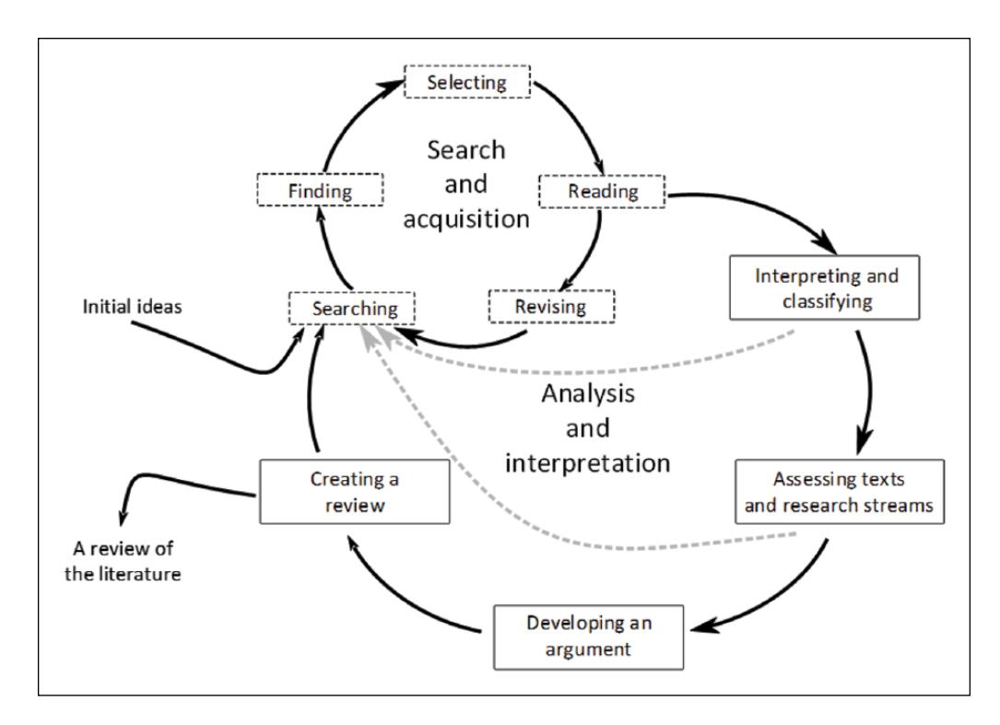

# Review and critique of the information systems development project failure literature: An argument for exploring information systems development project distress

Zeinab Baghizadeh¹, Dubravka Cecez-Kecmanovic¹, Daniel Schlagwein²  
¹ UNSW Sydney, Australia  
² The University of Sydney, Australia  

Journal of Information Technology (2020), 35(2), 123–142  
DOI: 10.1177/0268396219832010  

---

## Abstract

High failure rates of information systems development (ISD) projects continue to trouble organizations and information systems practices. Such a state of affairs has been of great concern for the information systems discipline for decades, motivating information systems researchers to focus on and extensively study ISD project failure. However, the increasing complexity and uncertainty of ISD projects and contemporary system development processes are challenging ISD project failure scholarship.

In this article, we ask the questions: What are the contributions and weaknesses of the extant ISD project failure/success literature? What are potential avenues to move the ISD literature forward?

To answer these questions, first, we present a literature review that assesses research contributions within the major perspectives on ISD failure (i.e. rationalist, process and narrative). While the extant research within all perspectives make significant contributions to knowledge, we find that researchers remain preoccupied with ‘project failure’ as an end state of an ISD project. They pay little attention to problematic situations arising during ISD projects before they become failed projects.

Based on the review and critique of the literature, we then argue that there is a significant benefit in extending research focus from ISD project failure to ‘ISD project distress’, which we define as a harmful project condition involving dynamic and fluid constellation of critical problems that are difficult to identify, understand and resolve.

---

## Introduction

Information systems development (ISD) projects continue to fail at high rates (Doherty and King, 2001; Lee et al., 2014; Vaidya et al., 2013), often suggested to be 70% or higher (Doherty et al., 2012; Drummond, 2005; Hochstrasser and Griffiths, 1991; Keil and Mähring, 2010). 【1-7e0131】  

Such high failure rates of ISD projects have motivated information systems (IS) researchers to focus on and keep exploring ISD project failure/success, contributing to the wealth of knowledge in the IS literature. 【1-7e0131】  

However, the increasing complexity and uncertainty of ISD projects and contemporary system development processes are challenging ISD project failure scholarship and literature. 【1-7e0131】  

There is a need to better understand ISD projects as increasingly complex undertakings and to complement existing research with approaches that attend to and unpack these complex processes. 【1-7e0131】  

The purpose of this article is therefore to review and advance knowledge about ISD project failure/success by answering the following research questions:

- What are the contributions and weaknesses of the extant ISD project failure/success literature?
- What are potential avenues to move the ISD literature forward?

---

## Contributions

1. It provides a critical review of the literature on ISD project failure/success by examining and assessing the major perspectives of research, their focus, assumptions, contributions and weaknesses.  
2. It identifies and defines the important but underexplored phenomenon of ISD project distress as a troublesome state of a project that increases the risk of failure.  
3. It proposes new areas for research by applying a sensemaking framework (drawing on Weick, 1995). 【1-7e0131】  

---

## Figure 1

**Figure 1.** Literature review process involving two hermeneutic circles.

---

## Literature Review Method

We conducted a review of the IS and project management literature on ISD project failure by adopting the hermeneutic framework for conducting literature reviews (Boell and Cecez-Kecmanovic, 2014). 【1-7e0131】  

The hermeneutic literature review approach assumes that meaning emerges through a dialogue between a text and a reader, rather than being fixed and simply recovered. 【1-7e0131】  

The literature review process was inherently interpretive and iterative. 【1-7e0131】  

We used two embedded hermeneutic circles:

- Literature search and acquisition  
- Analysis and interpretation  

This process involved repeated cycles of searching, reading, interpreting, and refining understanding. 【1-7e0131】  

Databases used include:

- EBSCO  
- ScienceDirect  
- Scopus  
- Web of Science  
- Google Scholar 【1-7e0131】  

Initial keywords:

- ISD project failure  
- ISD project success  
- project evaluation  

Expanded keywords:

- project turnaround  
- escalation  
- process flaws 【1-7e0131】  

The final corpus consisted of **321 relevant sources**. 【1-7e0131】  

---

## Research Perspectives on ISD Project Failure

There is no consensus definition of ISD project failure. 【1-7e0131】  

Definitions include:

- Going over time and budget  
- Not meeting specifications  
- Project abandonment 【1-7e0131】  

Three major perspectives:

---

### Rationalist Perspective

- ISD project viewed as a “black box”  
- Failure is objective, measurable  
- Caused by factors: managerial, organizational, technical 【1-7e0131】  

Limitations:

- Ignores context  
- Assumes linear causality  
- Oversimplifies reality 【1-7e0131】  

---

### Process Perspective

- ISD projects as dynamic, socio-technical processes  
- Focus on project flaws and organizational processes 【1-7e0131】  

Example issues:

- misinterpretation of problems  
- escalation of commitment  
- mismatch between processes and needs 【1-7e0131】  

---

### Narrative / Social Constructivist Perspective

- Failure is socially constructed  
- Depends on interpretation and power dynamics 【1-7e0131】  

Key idea:

> success and failure are not objective states but narratives constructed by stakeholders 【1-7e0131】  

---

## Table 1

| Perspective | Conceptualization | Purpose | Weakness |
|------------|-----------------|--------|---------|
| Rationalist | Objective outcome | identify causal factors | ignores context |
| Process | emergent process | understand dynamics | still outcome-focused |
| Narrative | constructed reality | interpret meaning | lacks generalizability |

---

## ISD Project Distress (Transition Section)

Across all three perspectives, research remains focused on **failure as an end state**. 【1-7e0131】  

This leads to a critical gap:

> little attention is given to problematic situations occurring before failure. 【1-7e0131】  

---

## Conceptualization of ISD Project Distress

ISD project distress is defined as:

> a harmful project condition involving dynamic and fluid constellation of critical problems that are difficult to identify, understand and resolve. 【1-7e0131】  

---

### Key Properties

- dynamic  
- emergent  
- not easily detectable  
- not necessarily leading to failure 【1-7e0131】  

---

## Example Image Placement

![](_page_0_Picture_2.jpeg